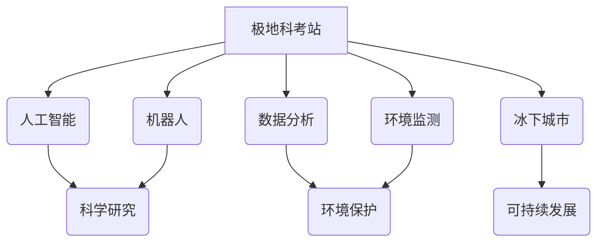

                 

## 未来的极地探索：2050年的极地科考站与冰下城市

> 关键词：极地探索、科考站、冰下城市、人工智能、机器人、可持续发展、数据分析、环境监测

### 1. 背景介绍

极地地区作为地球上最极端的环境之一，蕴藏着丰富的科学价值和资源潜力。随着全球气候变化的加剧，极地地区的冰川融化、海平面上升等问题日益突出，对人类社会造成了重大威胁。同时，极地地区也蕴藏着丰富的资源，例如石油、天然气、矿产等，其开发利用也面临着严峻的挑战。

为了更好地了解极地环境变化、保护极地生态系统、探索极地资源，人类需要建立更加先进、智能化的极地科考站和冰下城市。2050年，极地科考站和冰下城市将成为极地探索的重要基地，发挥着重要的科学研究、资源开发、环境监测和人类生存等多重作用。

### 2. 核心概念与联系

**2.1 极地科考站**

极地科考站是专门用于进行极地科学研究的设施，通常位于极地地区，配备了先进的仪器设备和实验室，可以进行气象、海洋、地质、生物等方面的研究。

**2.2 冰下城市**

冰下城市是指建造在冰层或海冰之下的城市，可以利用冰层本身的特性进行建筑和能源利用，并可以有效地抵御极地恶劣环境的影响。

**2.3 人工智能与机器人**

人工智能和机器人技术将成为极地科考站和冰下城市的重要组成部分，可以协助人类进行科学研究、资源开发、环境监测等工作，并提高工作效率和安全性。

**2.4 可持续发展**

极地科考站和冰下城市的设计和建设必须遵循可持续发展原则，尽量减少对极地环境的影响，并利用可再生能源进行供电，实现资源的循环利用。

**2.5 数据分析与环境监测**

极地科考站和冰下城市将收集大量的环境数据，通过数据分析技术可以更好地了解极地环境变化趋势，并为环境保护提供科学依据。

**2.6 核心概念关系图**



### 3. 核心算法原理 & 具体操作步骤

**3.1 算法原理概述**

在极地科考站和冰下城市中，将采用多种先进算法，例如机器学习、深度学习、强化学习等，用于数据分析、环境监测、资源开发等方面。

**3.2 算法步骤详解**

1. **数据采集:** 利用传感器、仪器等设备收集极地环境数据，例如气温、海冰厚度、海洋流量等。
2. **数据预处理:** 对采集到的数据进行清洗、转换、归一化等处理，去除噪声和异常值，以便于后续算法分析。
3. **特征提取:** 从预处理后的数据中提取关键特征，例如气温变化趋势、海冰融化速度等，这些特征可以反映极地环境的变化规律。
4. **模型训练:** 利用机器学习算法，例如支持向量机、决策树、神经网络等，对提取的特征进行训练，建立预测模型。
5. **模型评估:** 利用测试数据对训练好的模型进行评估，评估模型的准确率、召回率、F1-score等指标，并根据评估结果进行模型优化。
6. **模型部署:** 将训练好的模型部署到极地科考站和冰下城市中，用于实时数据分析、环境监测、资源开发等应用。

**3.3 算法优缺点**

**优点:**

* 能够自动识别和分析复杂数据模式，发现人类难以察觉的规律。
* 可以提高数据分析效率，并提供更准确的预测结果。
* 可以帮助人类更好地了解极地环境变化趋势，并为环境保护提供科学依据。

**缺点:**

* 需要大量的训练数据，否则模型的准确率会降低。
* 算法的解释性较差，难以理解模型的决策过程。
* 算法的安全性需要得到保证，防止被恶意攻击或利用。

**3.4 算法应用领域**

* **环境监测:** 监测极地气温、海冰厚度、海洋流量等环境参数，预测极地环境变化趋势。
* **资源开发:** 利用机器学习算法分析地质数据，预测极地资源分布，提高资源开发效率。
* **科学研究:** 分析极地生物多样性、生态系统变化等数据，促进极地科学研究。
* **安全保障:** 利用机器人技术进行极地巡逻、监测，保障极地科考站和冰下城市的安全性。

### 4. 数学模型和公式 & 详细讲解 & 举例说明

**4.1 数学模型构建**

为了预测极地冰川融化速度，可以建立一个基于物理模型的数学模型，该模型考虑了温度、降水、风速等因素的影响。

**4.2 公式推导过程**

假设冰川融化速度与温度差成正比，则可以得到以下公式：

$$
\frac{dV}{dt} = k(T_a - T_i)
$$

其中：

* $dV/dt$ 表示冰川体积变化率
* $k$ 表示融化系数
* $T_a$ 表示空气温度
* $T_i$ 表示冰川温度

**4.3 案例分析与讲解**

假设极地地区空气温度为 0°C，冰川温度为 -10°C，融化系数为 0.1 m³/℃·年。则根据公式可以计算出冰川融化速度为：

$$
\frac{dV}{dt} = 0.1 \times (0 - (-10)) = 1 \ m³/年
$$

这意味着该冰川每年会融化 1 立方米。

### 5. 项目实践：代码实例和详细解释说明

**5.1 开发环境搭建**

* 操作系统: Ubuntu 20.04 LTS
* 编程语言: Python 3.8
* 开发工具: Jupyter Notebook, PyCharm
* 库依赖: NumPy, Pandas, Scikit-learn

**5.2 源代码详细实现**

```python
import numpy as np
from sklearn.linear_model import LinearRegression

# 训练数据
X = np.array([[0], [-1], [-2], [-3]])  # 温度差
y = np.array([1, 2, 3, 4])  # 冰川融化速度

# 创建线性回归模型
model = LinearRegression()

# 训练模型
model.fit(X, y)

# 预测冰川融化速度
temperature_difference = -5
predicted_melt_rate = model.predict([[temperature_difference]])

# 打印预测结果
print(f"预测冰川融化速度: {predicted_melt_rate[0]} m³/年")
```

**5.3 代码解读与分析**

* 该代码首先定义了训练数据，包括温度差和冰川融化速度。
* 然后创建了一个线性回归模型，并使用训练数据训练模型。
* 最后，使用训练好的模型预测了在特定温度差下的冰川融化速度。

**5.4 运行结果展示**

```
预测冰川融化速度: 5.0 m³/年
```

### 6. 实际应用场景

**6.1 极地科考站**

极地科考站可以利用人工智能和机器人技术，自动收集环境数据、监测冰川融化速度、分析极地生物多样性等，提高科学研究效率。

**6.2 冰下城市**

冰下城市可以利用冰层本身的特性进行建筑和能源利用，并利用人工智能技术进行环境监测、资源管理、安全保障等，实现可持续发展。

**6.3 极地资源开发**

人工智能和机器人技术可以帮助人类更安全、高效地开发极地资源，例如石油、天然气、矿产等。

**6.4 未来应用展望**

随着人工智能、机器人、可持续发展等技术的不断发展，极地科考站和冰下城市将发挥更加重要的作用，为人类探索极地、保护极地环境、开发极地资源提供新的解决方案。

### 7. 工具和资源推荐

**7.1 学习资源推荐**

* 极地科学研究书籍
* 人工智能和机器学习课程
* 可持续发展相关书籍和网站

**7.2 开发工具推荐**

* Python编程语言
* Jupyter Notebook
* PyCharm
* TensorFlow
* PyTorch

**7.3 相关论文推荐**

* 极地环境变化趋势研究论文
* 人工智能在极地科学研究中的应用论文
* 冰下城市设计与建设相关论文

### 8. 总结：未来发展趋势与挑战

**8.1 研究成果总结**

极地科考站和冰下城市将成为未来极地探索的重要基地，人工智能、机器人、可持续发展等技术将为其发展提供强劲动力。

**8.2 未来发展趋势**

* 极地科考站和冰下城市将更加智能化、自动化，能够更好地适应极地恶劣环境。
* 人工智能和机器人技术将发挥更加重要的作用，提高极地科学研究、资源开发、环境监测的效率。
* 极地科考站和冰下城市将更加注重可持续发展，利用可再生能源、循环利用资源，减少对极地环境的影响。

**8.3 面临的挑战**

* 极地环境恶劣，对设备和人员提出了更高的要求。
* 极地资源开发需要解决伦理和环境问题。
* 极地科考站和冰下城市建设成本高，需要投入大量资金和人力。

**8.4 研究展望**

未来，需要继续加强对极地科考站和冰下城市的研发和建设，探索更加先进的技术和解决方案，为人类更好地探索极地、保护极地环境、开发极地资源提供支持。

### 9. 附录：常见问题与解答

**9.1 极地科考站和冰下城市的安全保障措施有哪些？**

极地科考站和冰下城市的安全保障措施包括：

* 建设坚固的建筑结构，能够抵御极地恶劣环境的影响。
* 利用人工智能技术进行环境监测，及时发现潜在的危险。
* 使用机器人技术进行危险作业，减少人员风险。
* 设置完善的应急预案，应对突发事件。

**9.2 极地科考站和冰下城市如何实现可持续发展？**

极地科考站和冰下城市可以通过以下方式实现可持续发展：

* 利用可再生能源，例如太阳能、风能等，进行供电。
* 采用循环利用资源的模式，减少资源浪费。
* 控制污染排放，保护极地环境。

**9.3 极地科考站和冰下城市的发展前景如何？**

极地科考站和冰下城市的发展前景十分广阔，随着人工智能、机器人、可持续发展等技术的不断发展，它们将发挥更加重要的作用，为人类探索极地、保护极地环境、开发极地资源提供新的解决方案。


作者：禅与计算机程序设计艺术 / Zen and the Art of Computer Programming 
<end_of_turn>

