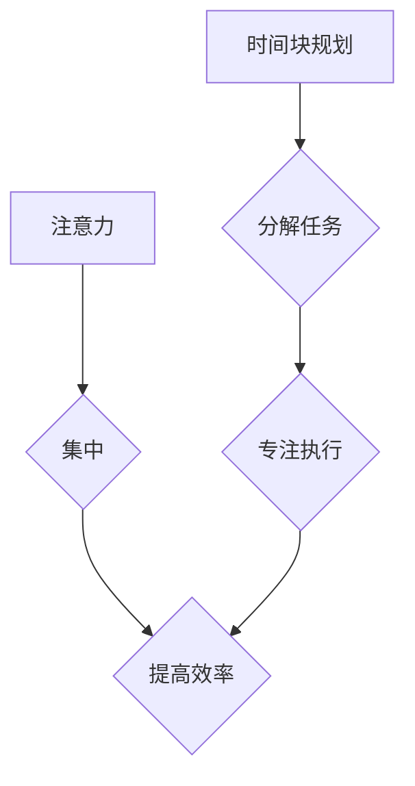

                 

## 1. 背景介绍

在当今快节奏的社会，我们面临着来自各方面的干扰和信息洪流。如何有效地管理注意力，集中精力完成任务，成为了提升个人效率和幸福感的关键。传统的“多任务处理”模式已被证明效率低下，反而会降低工作质量和增加压力。越来越多的研究表明，专注于单个任务，并将其分解成可管理的时间块，是提高效率和创造力的有效方法。

## 2. 核心概念与联系

### 2.1 注意力管理

注意力管理是指通过意识和技巧，控制和引导自己的注意力，使其集中在重要的事情上，并有效地过滤掉无关的信息和干扰。

### 2.2 时间块规划

时间块规划是指将工作或学习时间划分为多个独立的、预先定义的块，每个时间块专注于完成特定的任务或目标。

**核心概念联系：**

注意力管理和时间块规划相互关联，共同构成了高效工作和学习的基石。通过时间块规划，我们可以将注意力集中在特定的任务上，并避免被其他干扰分散。

**Mermaid 流程图：**



## 3. 核心算法原理 & 具体操作步骤

### 3.1 算法原理概述

时间块规划的核心算法原理是基于“番茄工作法”的改进，它将工作时间划分为25分钟的“番茄”和5分钟的“休息”周期，并通过循环进行，以保持专注力和效率。

### 3.2 算法步骤详解

1. **确定目标：** 明确每个时间块要完成的任务或目标。
2. **设定时间：** 为每个时间块设定固定的时长，例如25分钟或50分钟。
3. **专注执行：** 在时间块内，将所有注意力集中在目标任务上，避免任何干扰。
4. **休息放松：** 时间块结束后，进行短暂的休息，放松身心，避免疲劳。
5. **循环进行：** 重复步骤1-4，直到完成所有任务或达到预定的工作时间。

### 3.3 算法优缺点

**优点：**

* 提高专注力：通过设定时间限制，可以迫使自己集中注意力，避免分心。
* 增强效率：将工作分解成可管理的时间块，可以提高工作效率和完成任务的速度。
* 避免疲劳：定期休息可以帮助放松身心，避免过度疲劳。

**缺点：**

* 适应性差：对于一些需要长时间专注的任务，番茄工作法可能不太适用。
* 难以中断：一旦进入时间块，很难中断工作，可能会导致任务无法按计划完成。

### 3.4 算法应用领域

时间块规划适用于各种工作和学习场景，例如：

* 写作：将文章写作分解成多个时间块，分别专注于不同的部分，例如开头、正文、结尾。
* 编程：将代码编写分解成多个时间块，分别专注于不同的功能模块。
* 学习：将学习内容分解成多个时间块，分别专注于不同的知识点。

## 4. 数学模型和公式 & 详细讲解 & 举例说明

### 4.1 数学模型构建

时间块规划可以抽象为一个时间管理模型，其中：

* **T:** 总工作时间
* **n:** 时间块数量
* **t:** 单个时间块时长
* **r:** 休息时间

**模型公式：**

$$T = n * t + (n-1) * r$$

### 4.2 公式推导过程

公式推导过程如下：

* 每个时间块的总时长为 **t**。
* 由于有 **n-1** 次休息，所以休息总时长为 **(n-1) * r**。
* 因此，总工作时间 **T** 等于所有时间块的总时长加上休息总时长。

### 4.3 案例分析与讲解

假设一个程序员需要完成 8 小时的工作，他选择使用番茄工作法，每个时间块时长为 25 分钟，休息时间为 5 分钟。

* **T = 8 小时 = 480 分钟**
* **t = 25 分钟**
* **r = 5 分钟**

根据公式，我们可以计算出时间块数量 **n**:

$$480 = n * 25 + (n-1) * 5$$

$$480 = 25n + 5n - 5$$

$$485 = 30n$$

$$n = 16.17$$

由于时间块数量必须为整数，所以程序员可以选择使用 16 个时间块完成工作。

## 5. 项目实践：代码实例和详细解释说明

### 5.1 开发环境搭建

本项目使用 Python 语言开发，所需的库包括：

* `datetime`: 用于时间操作
* `time`: 用于计时

### 5.2 源代码详细实现

```python
import datetime
import time

class TimeBlockPlanner:
    def __init__(self, total_time, block_duration, rest_duration):
        self.total_time = total_time
        self.block_duration = block_duration
        self.rest_duration = rest_duration

    def plan_time_blocks(self):
        start_time = datetime.datetime.now()
        block_count = int(self.total_time / self.block_duration)
        for i in range(block_count):
            end_time = start_time + datetime.timedelta(minutes=self.block_duration)
            print(f"时间块 {i+1}: 从 {start_time.strftime('%H:%M')} 到 {end_time.strftime('%H:%M')}")
            time.sleep(self.block_duration * 60)
            start_time = end_time
            print(f"休息时间: {self.rest_duration} 分钟")
            time.sleep(self.rest_duration * 60)

if __name__ == "__main__":
    planner = TimeBlockPlanner(total_time=8, block_duration=25, rest_duration=5)
    planner.plan_time_blocks()
```

### 5.3 代码解读与分析

* `TimeBlockPlanner` 类负责规划时间块。
* `__init__` 方法初始化时间块的总时长、单个时间块时长和休息时间。
* `plan_time_blocks` 方法循环执行时间块和休息时间，并打印时间信息。
* `datetime` 库用于时间操作，`time` 库用于计时。

### 5.4 运行结果展示

程序运行后，会打印出每个时间块的开始和结束时间，以及休息时间。

## 6. 实际应用场景

### 6.1 工作场景

* **软件开发：** 将代码编写分解成多个时间块，专注于不同的功能模块，提高代码质量和开发效率。
* **项目管理：** 将项目任务分解成多个时间块，并分配给不同的团队成员，提高项目进度和协作效率。
* **市场营销：** 将营销活动分解成多个时间块，分别专注于不同的目标群体和营销渠道，提高营销效果和转化率。

### 6.2 学习场景

* **语言学习：** 将学习内容分解成多个时间块，分别专注于不同的语法规则、词汇和口语练习，提高语言学习效率。
* **专业技能学习：** 将专业技能学习分解成多个时间块，分别专注于不同的知识点和实践操作，提高技能掌握度和应用能力。
* **考试复习：** 将考试内容分解成多个时间块，分别专注于不同的知识点和考试技巧，提高考试成绩和应试能力。

### 6.4 未来应用展望

随着人工智能技术的不断发展，时间块规划将更加智能化和个性化。未来，我们可以期待：

* **智能时间块分配：** 基于用户的任务、时间安排和工作习惯，自动分配最佳的时间块。
* **个性化休息建议：** 根据用户的疲劳程度和工作状态，智能推荐合适的休息方式和时长。
* **跨平台协作：** 将时间块规划与其他协作工具集成，实现跨平台的协同工作和学习。

## 7. 工具和资源推荐

### 7.1 学习资源推荐

* **番茄工作法书籍：** 《番茄工作法》、《番茄工作法：高效工作与学习的秘密》
* **在线学习平台：** Coursera、edX、Udemy 等平台提供时间管理和效率提升相关的课程。
* **博客和文章：** 许多科技博客和网站发布关于时间块规划和注意力管理的实用技巧和经验分享。

### 7.2 开发工具推荐

* **番茄工作法应用：** Forest、Focus Keeper、Pomodoro Timer 等应用可以帮助用户计时和记录时间块。
* **时间管理软件：** Todoist、Asana、Trello 等软件可以帮助用户规划任务、分配时间块和跟踪进度。
* **编程语言和库：** Python、JavaScript、Node.js 等编程语言和库可以用于开发自定义的时间块规划工具。

### 7.3 相关论文推荐

* **"The Pomodoro Technique" by Francesco Cirillo**
* **"Time Management: A Review of the Literature" by Michael J. Gelb**
* **"Attention and Time Management: A Review" by David Meyer**

## 8. 总结：未来发展趋势与挑战

### 8.1 研究成果总结

时间块规划是一种有效的提高效率和专注力的方法，它已被广泛应用于工作、学习和生活各个领域。通过将工作或学习时间分解成可管理的时间块，我们可以集中注意力，避免干扰，并提高完成任务的速度和质量。

### 8.2 未来发展趋势

未来，时间块规划将更加智能化和个性化。人工智能技术将被用于自动分配时间块、推荐休息方式和个性化定制时间管理方案。

### 8.3 面临的挑战

* **用户习惯和阻力：** 改变工作和学习习惯需要时间和努力，一些用户可能难以适应时间块规划。
* **任务复杂度和中断性：** 一些任务需要长时间专注，而时间块规划的固定时长可能难以满足需求。
* **数据隐私和安全：** 智能时间块规划需要收集用户的个人数据，因此数据隐私和安全问题需要得到重视。

### 8.4 研究展望

未来研究方向包括：

* 开发更智能和个性化的时间块规划算法。
* 研究时间块规划对不同类型任务和用户群体的影响。
* 探索时间块规划与其他技术（如脑机接口、虚拟现实）的结合应用。

## 9. 附录：常见问题与解答

**Q1: 如何确定每个时间块的时长？**

**A1:** 每个时间块的时长可以根据个人工作习惯和任务特点进行调整。一般来说，25 分钟是一个比较常见的时长，但也有一些人更喜欢使用 50 分钟或更长的时长。

**Q2: 如何避免在时间块内被干扰？**

**A2:** 在时间块内，可以关闭手机通知、关闭社交媒体应用、选择安静的工作环境等方式避免干扰。

**Q3: 如果任务无法在时间块内完成怎么办？**

**A3:** 如果任务无法在时间块内完成，可以将任务分解成更小的子任务，并分配到不同的时间块中。


作者：禅与计算机程序设计艺术 / Zen and the Art of Computer Programming 
<end_of_turn>

