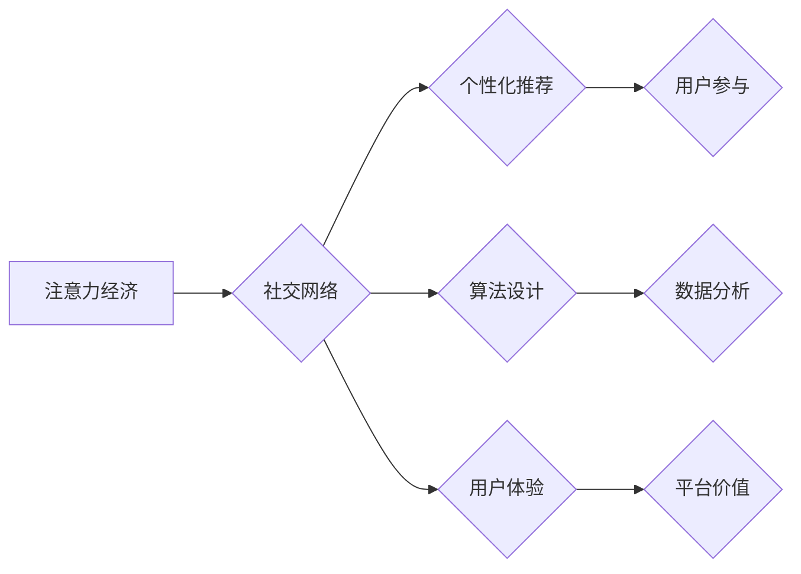

                 

## 注意力经济与个人社交网络的重构

> 关键词：注意力经济、社交网络、个性化推荐、算法设计、用户行为、数据分析、深度学习、可解释性

## 1. 背景介绍

在当今信息爆炸的时代，人们面临着前所未有的信息过载。每天我们接触的海量信息中，只有极少部分能够真正吸引我们的注意力。这使得“注意力”成为了一种稀缺资源，被誉为“21世纪最宝贵的资产”。 

社交网络作为信息传播和用户交互的主要平台，在注意力经济中扮演着至关重要的角色。它们通过算法推荐、个性化内容和社交互动等方式，试图吸引用户的注意力并将其转化为商业价值。然而，传统的社交网络架构往往存在着信息茧房、算法偏差、隐私泄露等问题，难以真正满足用户个性化需求和提升用户体验。

## 2. 核心概念与联系

### 2.1 注意力经济

注意力经济是指在信息过载的时代，人们对注意力资源的竞争和分配。注意力是一种有限的资源，它决定了我们能够吸收和处理信息的量。在注意力经济中，企业和个人都试图通过各种方式获取和利用用户的注意力，从而获得商业利益或个人价值。

### 2.2 社交网络重构

社交网络重构是指在注意力经济背景下，对社交网络架构、算法设计和用户体验进行重新思考和优化，以更好地满足用户个性化需求、提升用户体验和促进健康发展。

**核心概念与联系流程图:**



## 3. 核心算法原理 & 具体操作步骤

### 3.1 算法原理概述

个性化推荐算法是社交网络重构的核心，其目的是根据用户的兴趣、行为和偏好，推荐最相关的和吸引人的内容。常见的个性化推荐算法包括：

* **基于内容的推荐:** 根据用户的历史行为和偏好，推荐与之相似的内容。
* **基于协同过滤的推荐:** 根据其他用户相似行为的推荐，推荐用户可能感兴趣的内容。
* **深度学习推荐:** 利用深度学习模型，从用户的行为数据中学习用户兴趣和偏好，进行更精准的推荐。

### 3.2 算法步骤详解

以基于内容的推荐算法为例，其具体操作步骤如下：

1. **数据收集:** 收集用户的行为数据，例如浏览历史、点赞、评论、分享等。
2. **特征提取:** 从用户的行为数据中提取特征，例如用户喜欢的主题、作者、类型等。
3. **内容表示:** 将内容转化为向量表示，例如使用TF-IDF或Word2Vec等方法。
4. **相似度计算:** 计算用户特征和内容特征之间的相似度，例如使用余弦相似度或皮尔逊相关系数。
5. **推荐排序:** 根据相似度排序，推荐与用户特征最相似的内容。

### 3.3 算法优缺点

**优点:**

* 能够根据用户的兴趣和偏好进行精准推荐。
* 能够发现用户潜在的兴趣。
* 能够提高用户体验和平台粘性。

**缺点:**

* 需要大量的用户数据进行训练。
* 容易陷入信息茧房，推荐内容过于单一。
* 算法偏差可能导致推荐结果不公平。

### 3.4 算法应用领域

个性化推荐算法广泛应用于以下领域:

* **电商平台:** 推荐商品、优惠券和促销活动。
* **视频平台:** 推荐视频、电视剧和电影。
* **音乐平台:** 推荐歌曲、专辑和音乐人。
* **社交平台:** 推荐好友、群组和话题。

## 4. 数学模型和公式 & 详细讲解 & 举例说明

### 4.1 数学模型构建

基于内容的推荐算法可以使用余弦相似度来衡量用户特征和内容特征之间的相似度。

**用户特征向量:**  $u = (u_1, u_2, ..., u_n)$

**内容特征向量:** $c = (c_1, c_2, ..., c_n)$

**余弦相似度:**

$$
\text{Sim}(u, c) = \frac{u \cdot c}{||u|| ||c||}
$$

其中:

* $u \cdot c$ 是用户特征向量和内容特征向量的点积。
* $||u||$ 和 $||c||$ 分别是用户特征向量和内容特征向量的模长。

### 4.2 公式推导过程

余弦相似度的公式推导过程如下:

1. 点积: $u \cdot c = u_1c_1 + u_2c_2 + ... + u_nc_n$

2. 模长: $||u|| = \sqrt{u_1^2 + u_2^2 + ... + u_n^2}$

3.  相似度:

$$
\text{Sim}(u, c) = \frac{u \cdot c}{||u|| ||c||} = \frac{u_1c_1 + u_2c_2 + ... + u_nc_n}{\sqrt{u_1^2 + u_2^2 + ... + u_n^2} \sqrt{c_1^2 + c_2^2 + ... + c_n^2}}
$$

### 4.3 案例分析与讲解

假设用户A的兴趣特征向量为 $u = (0.8, 0.5, 0.2)$, 内容B的兴趣特征向量为 $c = (0.6, 0.7, 0.3)$. 

则他们的余弦相似度为:

$$
\text{Sim}(u, c) = \frac{(0.8 \times 0.6) + (0.5 \times 0.7) + (0.2 \times 0.3)}{\sqrt{0.8^2 + 0.5^2 + 0.2^2} \sqrt{0.6^2 + 0.7^2 + 0.3^2}} \approx 0.78
$$

该结果表明，用户A和内容B之间存在较高的相似度，因此用户A很可能对内容B感兴趣。

## 5. 项目实践：代码实例和详细解释说明

### 5.1 开发环境搭建

* Python 3.x
* scikit-learn
* pandas
* numpy

### 5.2 源代码详细实现

```python
from sklearn.metrics.pairwise import cosine_similarity
import pandas as pd

# 数据加载
data = pd.read_csv('user_item_data.csv')

# 特征提取
user_features = data.groupby('user_id')['item_id'].apply(list).reset_index()
item_features = data.groupby('item_id')['user_id'].apply(list).reset_index()

# 余弦相似度计算
user_similarity = cosine_similarity(user_features['item_id'].apply(lambda x: pd.Series(x)).to_numpy(),
                                   item_features['user_id'].apply(lambda x: pd.Series(x)).to_numpy())

# 推荐排序
top_k_recommendations = user_similarity.argsort()[:, :-1][:, :5]

# 结果展示
print(top_k_recommendations)
```

### 5.3 代码解读与分析

* 数据加载: 从CSV文件加载用户-物品交互数据。
* 特征提取: 将用户和物品的交互数据转换为特征向量。
* 余弦相似度计算: 使用scikit-learn库中的cosine_similarity函数计算用户特征向量和物品特征向量之间的余弦相似度。
* 推荐排序: 根据余弦相似度排序，获取用户可能感兴趣的物品。
* 结果展示: 打印推荐结果。

### 5.4 运行结果展示

运行代码后，将输出一个矩阵，其中每个元素代表用户和物品之间的相似度。矩阵中较高的元素表示用户和物品之间存在较高的相似度，即用户可能对该物品感兴趣。

## 6. 实际应用场景

### 6.1 个性化新闻推荐

根据用户的阅读历史、点赞和评论等行为数据，推荐与用户兴趣相关的新闻文章。

### 6.2 个性化商品推荐

根据用户的购买历史、浏览记录和购物车内容等数据，推荐与用户需求相符的商品。

### 6.3 个性化音乐推荐

根据用户的播放历史、点赞和收藏等数据，推荐与用户口味相符的音乐。

### 6.4 未来应用展望

随着人工智能技术的不断发展，个性化推荐算法将更加精准、智能和个性化。未来，个性化推荐将应用于更多领域，例如教育、医疗、金融等，为用户提供更加定制化的服务和体验。

## 7. 工具和资源推荐

### 7.1 学习资源推荐

* **书籍:**
    * "推荐系统实践" by  李航
    * "深度学习推荐系统" by  王志强
* **在线课程:**
    * Coursera: "Recommender Systems" by University of California, San Diego
    * edX: "Recommender Systems" by University of Washington

### 7.2 开发工具推荐

* **Python:**  一个开源的编程语言，广泛应用于数据科学和机器学习领域。
* **scikit-learn:**  一个用于机器学习的Python库，包含各种推荐算法的实现。
* **TensorFlow:**  一个开源的深度学习框架，可以用于构建更复杂的推荐模型。

### 7.3 相关论文推荐

* "Collaborative Filtering for Implicit Feedback Datasets" by  Linden, G., Smith, B., & York, J.
* "Matrix Factorization Techniques for Recommender Systems" by  Koren, Y.
* "Deep Learning for Recommender Systems" by  Wang, Z., & Blei, D. M.

## 8. 总结：未来发展趋势与挑战

### 8.1 研究成果总结

注意力经济与社交网络重构的研究取得了显著进展，个性化推荐算法已经成为社交网络的核心技术之一。深度学习技术的应用使得推荐算法更加精准和智能。

### 8.2 未来发展趋势

* **更精准的个性化推荐:** 利用更丰富的用户数据和更先进的算法，实现更加精准的个性化推荐。
* **更智能的推荐系统:**  开发能够学习用户动态变化的推荐系统，提供更智能和个性化的服务。
* **可解释性更强的推荐算法:**  研究更易于理解和解释的推荐算法，提高用户对推荐结果的信任度。

### 8.3 面临的挑战

* **数据隐私保护:**  如何平衡个性化推荐的需求和用户隐私保护是一个重要的挑战。
* **算法偏差:**  推荐算法可能存在偏差，导致推荐结果不公平。如何解决算法偏差是一个需要持续关注的问题。
* **用户体验:**  如何设计更人性化的推荐系统，提升用户体验是一个重要的研究方向。

### 8.4 研究展望

未来，注意力经济与社交网络重构的研究将继续深入，探索更精准、更智能、更可解释的推荐算法，为用户提供更加个性化和定制化的服务体验。

## 9. 附录：常见问题与解答

* **Q: 如何评估推荐算法的性能？**

* **A:**  常用的评估指标包括准确率、召回率、F1-score、NDCG等。

* **Q: 如何解决信息茧房问题？**

* **A:**  可以通过引入多样性算法、推荐冷启动内容等方式来缓解信息茧房问题。

* **Q: 如何提高推荐算法的可解释性？**

* **A:**  可以通过使用可解释性模型、提供推荐理由等方式提高推荐算法的可解释性。


作者：禅与计算机程序设计艺术 / Zen and the Art of Computer Programming 
<end_of_turn>

