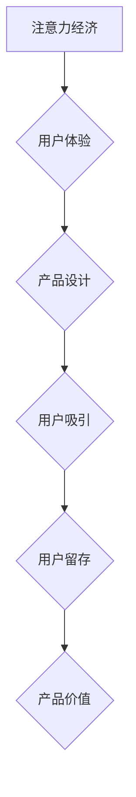

                 

##  注意力经济与用户体验：如何创建让人上瘾的产品和服务

> 关键词：注意力经济、用户体验、产品设计、算法、心理学、可持续发展

### 1. 背景介绍

在当今信息爆炸的时代，人们面临着前所未有的信息过载。我们每天接触的海量信息、各种通知和社交媒体的推送，无时无刻不在争夺着我们的注意力。在这种情况下，**注意力**成为了稀缺的资源，也被称为“**注意力经济**”。

企业和产品开发者意识到，获取和保持用户的注意力至关重要。一款成功的产品，不仅需要提供有价值的功能，更需要能够有效地吸引和留住用户的注意力。因此，**用户体验 (UX)** 成为产品设计和开发的核心要素。

### 2. 核心概念与联系

**注意力经济**是指在信息时代，注意力成为一种稀缺资源，而能够有效获取和利用用户注意力的产品和服务能够获得更大的价值。

**用户体验 (UX)** 则是指用户与产品或服务交互时所感受到的整体感受。良好的用户体验可以提升用户满意度、忠诚度和转化率。

两者之间存在着密切的联系：

* **注意力经济驱动了用户体验的关注：** 为了在竞争激烈的市场中脱颖而出，产品开发者需要不断提升用户体验，以吸引和留住用户的注意力。
* **用户体验是获取注意力经济的关键：**  良好的用户体验可以帮助产品更好地抓住用户的注意力，并将其转化为持续的互动和使用。

**Mermaid 流程图：注意力经济与用户体验的关系**



### 3. 核心算法原理 & 具体操作步骤

为了更好地理解如何创建让人上瘾的产品和服务，我们需要深入了解一些核心算法原理，这些算法原理被广泛应用于用户体验设计和产品开发中。

#### 3.1  算法原理概述

* **推荐算法:**  推荐算法通过分析用户的行为数据，例如浏览历史、购买记录和评分，来预测用户可能感兴趣的内容，并将其推荐给用户。常见的推荐算法包括协同过滤、内容过滤和混合推荐。
* **个性化算法:** 个性化算法根据用户的个人特征和偏好，定制个性化的产品体验。例如，根据用户的年龄、性别、兴趣爱好等信息，推荐个性化的内容、广告和服务。
* **反馈机制算法:** 反馈机制算法通过收集用户的反馈信息，例如点赞、评论、评分等，来不断优化产品体验。这些反馈信息可以帮助产品开发者了解用户的需求和痛点，并及时进行改进。

#### 3.2  算法步骤详解

以推荐算法为例，其具体操作步骤如下：

1. **数据收集:** 收集用户的行为数据，例如浏览历史、购买记录、评分等。
2. **数据预处理:** 对收集到的数据进行清洗、转换和格式化，以便于算法的训练和使用。
3. **模型训练:** 选择合适的推荐算法模型，并使用预处理后的数据进行训练。
4. **模型评估:** 使用测试数据评估模型的性能，例如准确率、召回率和覆盖率。
5. **模型部署:** 将训练好的模型部署到线上环境，并实时进行推荐。

#### 3.3  算法优缺点

* **优点:** 推荐算法能够有效地提高用户体验，帮助用户发现感兴趣的内容，并提高用户留存率。
* **缺点:** 推荐算法可能会导致用户陷入“信息茧房”，只接触到自己感兴趣的内容，而忽略其他重要的信息。

#### 3.4  算法应用领域

推荐算法广泛应用于各种领域，例如：

* **电商平台:** 推荐商品、优惠券和促销活动。
* **社交媒体:** 推荐好友、群组和内容。
* **视频网站:** 推荐视频、电视剧和电影。
* **音乐平台:** 推荐歌曲、专辑和艺术家。

### 4. 数学模型和公式 & 详细讲解 & 举例说明

#### 4.1  数学模型构建

推荐算法通常使用矩阵分解模型，例如协同过滤算法。

**协同过滤算法**的核心思想是：如果用户A喜欢电影X，那么用户B也可能喜欢电影X，因为用户A和用户B可能具有相似的口味。

**用户-物品交互矩阵:**

用户-物品交互矩阵是一个二维矩阵，其中每一行代表一个用户，每一列代表一个物品。矩阵中的元素表示用户对物品的评分或交互行为。

**矩阵分解:**

协同过滤算法将用户-物品交互矩阵分解成两个低维矩阵：

* **用户特征矩阵:** 每个用户对应一个行向量，表示用户的特征或偏好。
* **物品特征矩阵:** 每个物品对应一个列向量，表示物品的特征或属性。

**预测评分:**

通过将用户特征矩阵和物品特征矩阵相乘，可以预测用户对物品的评分。

#### 4.2  公式推导过程

$$
\hat{r}_{u,i} = \mathbf{u}_u^T \mathbf{v}_i
$$

其中：

* $\hat{r}_{u,i}$ 是预测用户u对物品i的评分。
* $\mathbf{u}_u$ 是用户u的特征向量。
* $\mathbf{v}_i$ 是物品i的特征向量。
* $^T$ 表示转置。

#### 4.3  案例分析与讲解

假设我们有一个用户-物品交互矩阵，其中用户1对电影A评分为5，用户2对电影A评分为4，用户1对电影B评分为3，用户2对电影B评分为2。

我们可以使用协同过滤算法将这个矩阵分解成两个低维矩阵，然后预测用户3对电影A和电影B的评分。

### 5. 项目实践：代码实例和详细解释说明

#### 5.1  开发环境搭建

为了实现推荐算法，我们可以使用Python语言和相应的库，例如Scikit-learn和Surprise。

#### 5.2  源代码详细实现

```python
from sklearn.metrics.pairwise import cosine_similarity

# 用户-物品交互矩阵
ratings_matrix = [
    [5, 3],
    [4, 2],
    [0, 0]  # 用户3的评分未知
]

# 计算用户之间的相似度
user_similarity = cosine_similarity(ratings_matrix)

# 预测用户3对电影A的评分
user3_rating_A = user_similarity[2, 0] * ratings_matrix[0, 0] + user_similarity[2, 1] * ratings_matrix[1, 0]

# 预测用户3对电影B的评分
user3_rating_B = user_similarity[2, 0] * ratings_matrix[0, 1] + user_similarity[2, 1] * ratings_matrix[1, 1]

print(f"预测用户3对电影A的评分: {user3_rating_A}")
print(f"预测用户3对电影B的评分: {user3_rating_B}")
```

#### 5.3  代码解读与分析

这段代码首先定义了一个用户-物品交互矩阵，然后使用cosine_similarity函数计算用户之间的相似度。最后，根据用户之间的相似度和已知评分，预测用户3对电影A和电影B的评分。

#### 5.4  运行结果展示

运行这段代码后，可以得到用户3对电影A和电影B的预测评分。

### 6. 实际应用场景

#### 6.1  电商平台

电商平台可以利用推荐算法推荐商品、优惠券和促销活动，提高用户购买意愿和转化率。例如，亚马逊的推荐系统可以根据用户的浏览历史、购买记录和评分，推荐用户可能感兴趣的商品。

#### 6.2  社交媒体

社交媒体平台可以利用推荐算法推荐好友、群组和内容，提高用户活跃度和粘性。例如，Facebook的推荐系统可以根据用户的兴趣爱好和社交关系，推荐用户可能感兴趣的朋友和群组。

#### 6.3  视频网站

视频网站可以利用推荐算法推荐视频、电视剧和电影，提高用户观看时长和用户留存率。例如，Netflix的推荐系统可以根据用户的观看历史和评分，推荐用户可能感兴趣的视频。

#### 6.4  未来应用展望

随着人工智能技术的不断发展，推荐算法将会更加智能化和个性化。未来，推荐算法可能会更加深入地理解用户的需求和偏好，并提供更加精准和有效的推荐。

### 7. 工具和资源推荐

#### 7.1  学习资源推荐

* **书籍:**
    * 《推荐系统实践》
    * 《机器学习》
* **在线课程:**
    * Coursera上的“机器学习”课程
    * edX上的“推荐系统”课程

#### 7.2  开发工具推荐

* **Python:** 
    * Scikit-learn
    * Surprise
    * TensorFlow
    * PyTorch

#### 7.3  相关论文推荐

* **协同过滤算法:**
    * “Collaborative Filtering for Implicit Feedback Datasets”
    * “Matrix Factorization Techniques for Recommender Systems”
* **深度学习推荐算法:**
    * “Deep Learning for Recommender Systems”
    * “Neural Collaborative Filtering”

### 8. 总结：未来发展趋势与挑战

#### 8.1  研究成果总结

注意力经济与用户体验是当今科技发展的重要趋势。推荐算法等技术已经取得了显著的成果，能够有效地提升用户体验和产品价值。

#### 8.2  未来发展趋势

* **更智能化的推荐算法:** 未来，推荐算法将会更加智能化，能够更加深入地理解用户的需求和偏好，并提供更加精准和有效的推荐。
* **个性化体验的增强:** 产品将更加注重个性化体验，根据用户的个人特征和偏好，定制个性化的产品体验。
* **跨平台的推荐系统:** 未来，推荐系统将会跨越平台，提供更加统一和一致的用户体验。

#### 8.3  面临的挑战

* **数据隐私和安全:** 推荐算法需要大量用户数据，如何保护用户数据隐私和安全是一个重要的挑战。
* **算法公平性:** 推荐算法可能会存在偏见，导致某些用户获得不公平的推荐结果。如何确保算法公平性是一个重要的研究方向。
* **用户信任:** 用户需要信任推荐算法，才能接受其推荐的结果。如何建立用户对推荐算法的信任是一个重要的挑战。

#### 8.4  研究展望

未来，我们需要继续研究如何开发更加智能、公平和可信赖的推荐算法，以更好地服务于用户和社会。

### 9. 附录：常见问题与解答

#### 9.1  Q1: 推荐算法会给我推荐我感兴趣的东西吗？

**A1:** 推荐算法会根据你的历史行为和偏好，推荐你可能感兴趣的东西。但是，它并不能保证会推荐你百分百感兴趣的东西，因为每个人对兴趣的定义都不同。

#### 9.2  Q2: 推荐算法会收集我的个人信息吗？

**A2:** 推荐算法需要收集一些你的个人信息，例如你的浏览历史、购买记录和评分，以便更好地理解你的需求和偏好。但是，这些信息通常是匿名化的，不会被用于其他目的。

#### 9.3  Q3: 我可以控制推荐算法的推荐结果吗？

**A3:** 很多产品都提供了一些控制推荐结果的选项，例如你可以选择屏蔽某些类型的推荐，或者调整推荐的优先级。


作者：禅与计算机程序设计艺术 / Zen and the Art of Computer Programming 
<end_of_turn>

