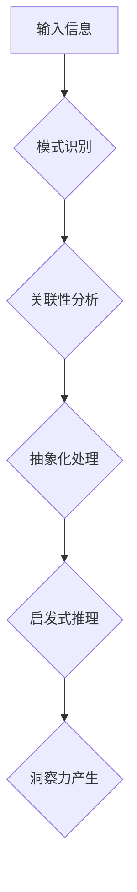

                 

## 理解洞察力的科学：揭开大脑处理信息的奥秘

> 关键词：洞察力、人工智能、神经网络、深度学习、认知科学、信息处理、模式识别

## 1. 背景介绍

洞察力，这是一种令人惊叹的能力，让我们能够从纷繁复杂的现象中发现隐藏的模式，并从中得出深刻的见解。它驱动着人类的创新、创造力和解决问题的能力。然而，洞察力的本质是什么？它是如何产生的？ 

长期以来，人类试图理解洞察力的奥秘。从古希腊哲学家对“智慧”的探讨，到现代认知科学对“思维过程”的研究，人们一直在探索洞察力的形成机制。随着人工智能技术的飞速发展，我们开始能够利用计算机模拟大脑的运作方式，并试图揭开洞察力的科学秘密。

## 2. 核心概念与联系

洞察力本质上是一种信息处理能力，它依赖于大脑对大量信息的快速分析和整合。 

**2.1  核心概念:**

* **模式识别:** 这是洞察力的基础。大脑通过识别数据中的重复性和规律性，来发现隐藏的模式。
* **关联性:** 洞察力需要将看似无关的信息联系起来，发现它们之间的潜在关系。
* **抽象化:**  将具体的事物概括为更抽象的概念，以便更好地理解其本质。
* **启发式推理:**  利用经验和直觉，快速做出判断和决策。

**2.2  架构图:**



## 3. 核心算法原理 & 具体操作步骤

### 3.1  算法原理概述

目前，人工智能领域还没有一个完美的算法能够完全模拟人类的洞察力。然而，一些算法已经取得了令人瞩目的进展，例如深度学习算法。

深度学习算法的核心是多层神经网络，它能够学习数据中的复杂模式。通过大量的训练数据，神经网络可以逐渐提高其对模式识别的能力，最终能够发现人类难以察觉的隐藏关系。

### 3.2  算法步骤详解

1. **数据收集和预处理:**  收集大量相关数据，并进行清洗、转换和特征提取等预处理工作。
2. **网络结构设计:**  根据任务需求设计多层神经网络的结构，包括神经元数量、连接方式和激活函数等。
3. **模型训练:**  利用训练数据训练神经网络，通过调整网络参数，使网络能够准确识别数据中的模式。
4. **模型评估:**  使用测试数据评估模型的性能，并根据评估结果进行模型调优。
5. **洞察力提取:**  将训练好的神经网络应用于新的数据，并通过分析网络的输出结果，提取出潜在的洞察力。

### 3.3  算法优缺点

**优点:**

* 能够学习复杂模式，发现人类难以察觉的隐藏关系。
* 具有强大的泛化能力，能够应用于不同的领域和任务。

**缺点:**

* 需要大量的训练数据，训练成本较高。
* 模型解释性较差，难以理解模型是如何得出结论的。

### 3.4  算法应用领域

* **医疗诊断:**  分析病理图像，辅助医生诊断疾病。
* **金融风险管理:**  识别潜在的金融风险，帮助投资者做出更明智的决策。
* **市场营销:**  分析客户行为，预测市场趋势，制定更有效的营销策略。
* **科学研究:**  分析大规模实验数据，发现新的科学规律。

## 4. 数学模型和公式 & 详细讲解 & 举例说明

### 4.1  数学模型构建

深度学习算法的核心是神经网络，它可以看作是一个复杂的数学模型。神经网络由多个层组成，每一层包含多个神经元。每个神经元接收来自上一层的输入信号，并通过一个激活函数进行处理，输出到下一层。

### 4.2  公式推导过程

神经网络的学习过程本质上是一个参数优化过程。通过反向传播算法，可以计算出每个参数对输出结果的影响，并根据梯度下降法更新参数值，使得网络的输出结果越来越接近真实值。

**反向传播算法公式:**

```latex
\Delta w_{ij} = \eta \frac{\partial E}{\partial w_{ij}}
```

其中：

* $\Delta w_{ij}$ 是连接神经元 $i$ 和 $j$ 的权重的更新量。
* $\eta$ 是学习率，控制着参数更新的步长。
* $\frac{\partial E}{\partial w_{ij}}$ 是误差函数 $E$ 对权重 $w_{ij}$ 的偏导数，表示权重更新的方向。

### 4.3  案例分析与讲解

例如，在图像识别任务中，我们可以使用卷积神经网络（CNN）来识别图像中的物体。CNN 的结构包含多个卷积层和池化层，这些层能够学习图像中的特征，并将其抽象为更高级的表示。

通过大量的训练数据，CNN 可以学习到不同物体的特征，并能够准确地识别图像中的物体。

## 5. 项目实践：代码实例和详细解释说明

### 5.1  开发环境搭建

为了实现洞察力算法的实践，我们需要搭建一个合适的开发环境。

* **操作系统:**  Linux 或 macOS
* **编程语言:**  Python
* **深度学习框架:**  TensorFlow 或 PyTorch
* **硬件:**  GPU 加速器

### 5.2  源代码详细实现

以下是一个简单的深度学习模型的代码示例，使用 TensorFlow 框架实现：

```python
import tensorflow as tf

# 定义模型结构
model = tf.keras.models.Sequential([
  tf.keras.layers.Dense(128, activation='relu', input_shape=(784,)),
  tf.keras.layers.Dense(10, activation='softmax')
])

# 编译模型
model.compile(optimizer='adam',
              loss='sparse_categorical_crossentropy',
              metrics=['accuracy'])

# 训练模型
model.fit(x_train, y_train, epochs=10)

# 评估模型
loss, accuracy = model.evaluate(x_test, y_test)
print('Test loss:', loss)
print('Test accuracy:', accuracy)
```

### 5.3  代码解读与分析

这段代码定义了一个简单的多层感知机模型，用于分类任务。

* `tf.keras.models.Sequential` 创建了一个顺序模型，神经层按顺序连接。
* `tf.keras.layers.Dense` 定义了一个全连接层，每个神经元都连接到上一层的每个神经元。
* `activation='relu'` 指定了激活函数为ReLU函数，它能够引入非线性，提高模型的表达能力。
* `optimizer='adam'` 指定了优化算法为Adam算法，它是一种常用的优化算法。
* `loss='sparse_categorical_crossentropy'` 指定了损失函数为稀疏类别交叉熵损失函数，适用于多分类任务。
* `metrics=['accuracy']` 指定了评估指标为准确率。

### 5.4  运行结果展示

训练完成后，我们可以使用测试数据评估模型的性能。

## 6. 实际应用场景

### 6.1  医疗诊断

深度学习算法可以分析病理图像，辅助医生诊断疾病。例如，可以用于识别癌症细胞、检测眼底疾病等。

### 6.2  金融风险管理

深度学习算法可以识别潜在的金融风险，帮助投资者做出更明智的决策。例如，可以用于预测股票价格波动、识别欺诈交易等。

### 6.3  市场营销

深度学习算法可以分析客户行为，预测市场趋势，制定更有效的营销策略。例如，可以用于个性化推荐、精准广告投放等。

### 6.4  未来应用展望

随着人工智能技术的不断发展，洞察力算法将在更多领域得到应用，例如：

* **科学研究:**  分析大规模实验数据，发现新的科学规律。
* **自动驾驶:**  帮助车辆识别道路环境，做出更安全的决策。
* **个性化教育:**  根据学生的学习情况，提供个性化的学习方案。

## 7. 工具和资源推荐

### 7.1  学习资源推荐

* **书籍:**

    * 《深度学习》 by Ian Goodfellow, Yoshua Bengio, and Aaron Courville
    * 《神经网络与深度学习》 by Michael Nielsen

* **在线课程:**

    * Coursera: 深度学习 Specialization
    * Udacity: Deep Learning Nanodegree

### 7.2  开发工具推荐

* **TensorFlow:**  https://www.tensorflow.org/
* **PyTorch:**  https://pytorch.org/

### 7.3  相关论文推荐

* **AlexNet:**  Krizhevsky, A., Sutskever, I., & Hinton, G. E. (2012). Imagenet classification with deep convolutional neural networks. In Advances in neural information processing systems (pp. 1097-1105).
* **ResNet:**  He, K., Zhang, X., Ren, S., & Sun, J. (2016). Deep residual learning for image recognition. In Proceedings of the IEEE conference on computer vision and pattern recognition (pp. 770-778).

## 8. 总结：未来发展趋势与挑战

### 8.1  研究成果总结

近年来，人工智能领域取得了令人瞩目的进展，特别是深度学习算法在洞察力研究方面取得了突破。

### 8.2  未来发展趋势

* **更强大的模型:**  研究人员将继续开发更强大的深度学习模型，例如Transformer模型，以提高洞察力的准确性和泛化能力。
* **解释性更强的模型:**  研究人员将致力于开发更解释性强的深度学习模型，以便更好地理解模型是如何得出结论的。
* **跨模态洞察力:**  研究人员将探索跨模态洞察力，例如将图像、文本、音频等多种数据类型结合起来，以获得更全面的洞察力。

### 8.3  面临的挑战

* **数据获取和标注:**  深度学习算法需要大量的训练数据，而获取和标注高质量的数据仍然是一个挑战。
* **模型解释性:**  深度学习模型的内部机制复杂，难以解释其决策过程，这限制了其在一些领域应用的推广。
* **伦理问题:**  人工智能技术的快速发展也带来了伦理问题，例如算法偏见、数据隐私等，需要引起重视和解决。

### 8.4  研究展望

未来，洞察力研究将继续朝着更强大、更解释性强、更跨模态的方向发展。随着人工智能技术的不断进步，洞察力将成为人类解决复杂问题、创造未来的重要工具。

## 9. 附录：常见问题与解答

**Q1: 深度学习算法真的能够像人类一样洞察吗？**

A1: 目前，深度学习算法还没有完全模拟人类的洞察力。人类的洞察力不仅依赖于信息处理能力，还包含着经验、直觉、情感等因素。

**Q2: 如何评估洞察力的质量？**

A2: 评估洞察力的质量是一个复杂的问题，需要考虑多个因素，例如洞察力的准确性、新颖性、实用性等。

**Q3: 深度学习算法的应用有哪些伦理问题？**

A3: 深度学习算法的应用可能带来算法偏见、数据隐私等伦理问题，需要引起重视和解决。


作者：禅与计算机程序设计艺术 / Zen and the Art of Computer Programming 
<end_of_turn>

