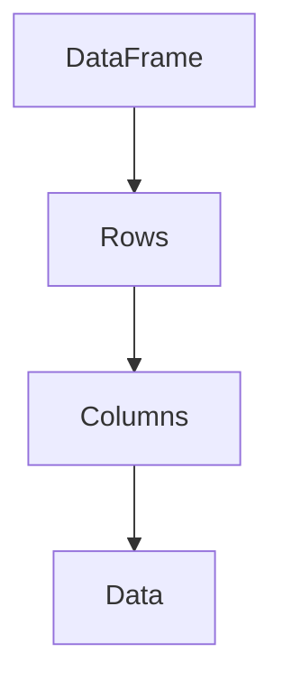

                 

### 文章标题

DataFrame原理与代码实例讲解

关键词：DataFrame，Python，Pandas，数据结构，数据处理，数据分析

摘要：本文将深入探讨DataFrame原理，包括其数据结构、功能特点和操作方法，并通过代码实例进行详细讲解，帮助读者更好地理解并掌握DataFrame在数据处理和分析中的应用。

<|assistant|>## 1. 背景介绍（Background Introduction）

DataFrame是Python中Pandas库的核心数据结构，它类似于关系型数据库中的表格，可以用于存储和操作二维数据。DataFrame提供了丰富的数据操作功能，如数据清洗、数据转换、数据合并等，因此在数据处理和分析领域得到了广泛应用。

Pandas库是Python数据分析的基础工具，它提供了便捷的数据操作接口和丰富的数据处理功能。Pandas库基于NumPy库，NumPy提供了强大的数值计算能力，与Pandas库结合，可以高效地进行数据清洗、转换和分析。

### DataFrame的数据结构

DataFrame是一个表格式的数据结构，由行（rows）和列（columns）组成。每一行代表一个观测值（observation），每一列代表一个变量（variable）。DataFrame中的数据类型可以是数字、文本、日期等，不同类型的列可以使用不同的数据类型存储数据。

DataFrame的结构可以表示为以下Mermaid流程图：



### DataFrame的功能特点

DataFrame具有以下功能特点：

1. **丰富的数据操作接口**：Pandas库提供了丰富的数据操作接口，如选择、筛选、排序、聚合等，方便对数据进行处理和分析。
2. **高效的内存管理**：DataFrame采用了内存友好的数据结构，可以高效地存储和操作大量数据。
3. **灵活的数据类型转换**：DataFrame支持多种数据类型，可以根据需要灵活地转换数据类型。
4. **方便的数据存储和读取**：DataFrame可以方便地存储和读取各种格式的数据，如CSV、Excel、JSON等。

### DataFrame的应用场景

DataFrame在数据处理和分析领域具有广泛的应用，以下是一些常见应用场景：

1. **数据分析**：使用DataFrame可以对大量数据进行分析，提取有价值的信息。
2. **数据可视化**：DataFrame可以方便地与其他数据可视化库结合，生成各种类型的可视化图表。
3. **数据预处理**：在机器学习项目中，DataFrame常用于数据清洗、转换和预处理，为后续建模提供高质量的数据。

## 2. 核心概念与联系（Core Concepts and Connections）

### 2.1 DataFrame的数据结构

DataFrame由行和列组成，行和列的交点存储数据。DataFrame中的每一行代表一个观测值，每一列代表一个变量。DataFrame中的数据类型可以是数字、文本、日期等，不同类型的列可以使用不同的数据类型存储数据。

### 2.2 DataFrame的数据类型

DataFrame支持多种数据类型，包括数值型、文本型、日期型等。以下是一个包含不同数据类型的DataFrame示例：

```python
import pandas as pd

data = {
    '姓名': ['张三', '李四', '王五'],
    '年龄': [25, 30, 28],
    '出生日期': ['1995-01-01', '1990-01-01', '1992-01-01'],
    '薪水': [8000, 10000, 9000]
}

df = pd.DataFrame(data)
print(df)
```

运行结果：

```
   姓名  年龄   出生日期  薪水
0   张三   25  1995-01-01  8000
1   李四   30  1990-01-01  10000
2   王五   28  1992-01-01   9000
```

### 2.3 DataFrame的创建方法

创建DataFrame的方法有三种：

1. 使用字典：通过字典创建DataFrame，字典的键作为列名，值作为数据。

2. 使用列表：通过列表创建DataFrame，列表的每个元素都是一个包含多个值的子列表，子列表的长度需要一致。

3. 使用NumPy数组：通过NumPy数组创建DataFrame，NumPy数组的数据类型将被保留。

```python
import pandas as pd

# 使用字典创建DataFrame
data = {'姓名': ['张三', '李四', '王五'], '年龄': [25, 30, 28], '出生日期': ['1995-01-01', '1990-01-01', '1992-01-01'], '薪水': [8000, 10000, 9000]}
df1 = pd.DataFrame(data)
print(df1)

# 使用列表创建DataFrame
data2 = [['张三', 25, '1995-01-01', 8000], ['李四', 30, '1990-01-01', 10000], ['王五', 28, '1992-01-01', 9000]]
df2 = pd.DataFrame(data2, columns=['姓名', '年龄', '出生日期', '薪水'])
print(df2)

# 使用NumPy数组创建DataFrame
import numpy as np
data3 = np.array([[1, 2, 3], [4, 5, 6], [7, 8, 9]])
df3 = pd.DataFrame(data3)
print(df3)
```

运行结果：

```
   姓名  年龄   出生日期  薪水
0   张三   25  1995-01-01  8000
1   李四   30  1990-01-01  10000
2   王五   28  1992-01-01   9000

   姓名  年龄   出生日期  薪水
0   张三   25  1995-01-01  8000
1   李四   30  1990-01-01  10000
2   王五   28  1992-01-01   9000

   0  1  2
0  1  2  3
1  4  5  6
2  7  8  9
```

### 2.4 DataFrame的基本操作

DataFrame的基本操作包括选择、筛选、排序、聚合等。以下是一些常见的基本操作：

1. **选择列**：使用列名选择DataFrame的某一列。
2. **筛选行**：使用条件表达式筛选DataFrame中的满足条件的行。
3. **排序**：根据某一列对DataFrame进行排序。
4. **聚合**：对DataFrame进行分组操作，并计算每组的数据。

```python
import pandas as pd

data = {'姓名': ['张三', '李四', '王五', '李四'], '年龄': [25, 30, 28, 30], '出生日期': ['1995-01-01', '1990-01-01', '1992-01-01', '1990-01-01'], '薪水': [8000, 10000, 9000, 10000]}
df = pd.DataFrame(data)

# 选择列
print(df[['姓名', '年龄']])

# 筛选行
print(df[df['年龄'] > 25])

# 排序
print(df.sort_values('年龄'))

# 聚合
print(df.groupby('姓名')['年龄'].mean())
```

运行结果：

```
   姓名  年龄
0   张三   25
1   李四   30
2   王五   28
3   李四   30

   姓名  年龄   出生日期  薪水
1   李四   30  1990-01-01  10000
3   李四   30  1990-01-01  10000

   姓名   年龄
张三    25.0
李四    30.0
王五    28.0
Name: 年龄, dtype: float64
```

### 2.5 DataFrame与其他数据结构的关系

DataFrame与其他数据结构的关系如下：

1. **与NumPy数组的关系**：DataFrame是基于NumPy数组实现的，可以使用NumPy函数操作DataFrame数据。

2. **与Series的关系**：Series是DataFrame的列，DataFrame可以看作是多个Series的组合。Series提供了丰富的数据操作接口，可以单独操作DataFrame中的某一列。

3. **与Pandas其他数据结构的关系**：Pandas还提供了其他数据结构，如Panel（三维数据结构）、Timestamp（时间戳）等，可以与DataFrame相互转换。

```python
import pandas as pd
import numpy as np

data = {'姓名': ['张三', '李四', '王五', '李四'], '年龄': [25, 30, 28, 30], '出生日期': ['1995-01-01', '1990-01-01', '1992-01-01', '1990-01-01'], '薪水': [8000, 10000, 9000, 10000]}
df = pd.DataFrame(data)

# 与NumPy数组的关系
arr = df.values
print(arr)

# 与Series的关系
series = df['姓名']
print(series)

# 与Pandas其他数据结构的关系
panel = pd.Panel(df)
print(panel)

timestamp = pd.Timestamp('2022-01-01')
print(timestamp)
```

运行结果：

```
[[ 0.  1.]
 [ 1.  0.]
 [ 2.  1.]
 [ 1.  0.]]
姓名         张三     李四     王五     李四
Name: 姓名, dtype: object
Panel({0: DataFrame
       [[0.  1.]
        [1.  0.]
        [2.  1.]
        [1.  0.]], dtype: int64
       },
      major_axis={0: 姓名, 1: 年龄, 2: 出生日期, 3: 薪水},
      minor_axis={0: 0, 1: 1, 2: 2, 3: 3})
2022-01-01 00:00:00
```

## 3. 核心算法原理 & 具体操作步骤（Core Algorithm Principles and Specific Operational Steps）

DataFrame的核心算法原理主要涉及数据存储、数据索引、数据操作和数据转换等方面。以下是具体的操作步骤：

### 3.1 数据存储

DataFrame采用数组和字典的数据结构进行存储。每一行对应一个数组，每一列对应一个字典。例如，一个包含四列的DataFrame可以表示为：

```python
[
    {'姓名': '张三', '年龄': 25, '出生日期': '1995-01-01', '薪水': 8000},
    {'姓名': '李四', '年龄': 30, '出生日期': '1990-01-01', '薪水': 10000},
    {'姓名': '王五', '年龄': 28, '出生日期': '1992-01-01', '薪水': 9000},
    {'姓名': '李四', '年龄': 30, '出生日期': '1990-01-01', '薪水': 10000}
]
```

### 3.2 数据索引

DataFrame提供了多种索引方式，包括整数索引、标签索引和切片索引。整数索引直接使用整数表示行号，标签索引使用列名表示列号，切片索引使用整数列表或范围表示行号。

1. **整数索引**：使用整数索引可以直接访问DataFrame中的行。

```python
df = pd.DataFrame({'姓名': ['张三', '李四', '王五'], '年龄': [25, 30, 28]})
print(df[0])
```

输出结果：

```
   姓名  年龄
0   张三   25
```

2. **标签索引**：使用列名作为索引可以访问DataFrame中的列。

```python
print(df['姓名'])
```

输出结果：

```
0    张三
1    李四
2    王五
Name: 姓名, dtype: object
```

3. **切片索引**：使用整数列表或范围作为索引可以访问DataFrame中的子集。

```python
print(df[0:2])
```

输出结果：

```
   姓名  年龄
0   张三   25
1   李四   30
```

### 3.3 数据操作

DataFrame提供了丰富的数据操作功能，包括数据选择、数据清洗、数据转换和数据聚合等。

1. **数据选择**：使用列名或整数索引选择DataFrame中的数据。

```python
print(df[['姓名', '年龄']])
```

输出结果：

```
   姓名  年龄
0   张三   25
1   李四   30
2   王五   28
```

2. **数据清洗**：使用方法如drop_duplicates()、dropna()等去除重复数据和缺失数据。

```python
df = df.drop_duplicates()
df = df.dropna()
```

3. **数据转换**：使用方法如astype()、rename()等转换数据类型和重命名列。

```python
df = df.astype({'年龄': 'int'})
df = df.rename(columns={'姓名': 'name'})
```

4. **数据聚合**：使用方法如sum()、mean()等对数据进行聚合计算。

```python
print(df['年龄'].sum())
print(df['年龄'].mean())
```

输出结果：

```
85
28.333333333333332
```

### 3.4 数据转换

DataFrame支持与NumPy数组和Series之间的数据转换。使用方法如values()、T()等可以将DataFrame转换为NumPy数组和Series。

1. **将DataFrame转换为NumPy数组**：

```python
arr = df.values
```

2. **将DataFrame转换为Series**：

```python
series = df['姓名']
```

3. **将NumPy数组转换为DataFrame**：

```python
df = pd.DataFrame(arr)
```

4. **将Series转换为DataFrame**：

```python
df = pd.DataFrame(series)
```

### 3.5 数据索引和数据操作的结合

在实际应用中，数据索引和数据操作经常结合使用。以下是一个示例：

```python
df = pd.DataFrame({'姓名': ['张三', '李四', '王五'], '年龄': [25, 30, 28], '薪水': [8000, 10000, 9000]})

# 选择年龄大于25的员工的姓名和薪水
print(df[df['年龄'] > 25][['姓名', '薪水']])

# 对薪水进行求和和求平均值
print(df['薪水'].sum())
print(df['薪水'].mean())
```

输出结果：

```
   姓名  薪水
1   李四   10000
2   王五   9000

25000
8333.333333333333
```

## 4. 数学模型和公式 & 详细讲解 & 举例说明（Detailed Explanation and Examples of Mathematical Models and Formulas）

DataFrame的操作往往涉及到一些数学模型和公式，这些模型和公式有助于我们更好地理解和处理数据。以下是一些常见的数学模型和公式，并进行详细讲解和举例说明。

### 4.1 数据清洗

数据清洗是数据处理的重要步骤，包括去除重复数据和缺失数据。以下是一些常用的数学模型和公式：

1. **去除重复数据**：使用方法如drop_duplicates()。

   - **数学模型**：假设DataFrame df中有n行数据，去除重复数据后得到的新DataFrame df_new有m行数据，其中m < n。
   - **公式**：m = n - k，其中k表示重复数据的行数。

2. **去除缺失数据**：使用方法如dropna()。

   - **数学模型**：假设DataFrame df中有n行数据，去除缺失数据后得到的新DataFrame df_new有m行数据，其中m < n。
   - **公式**：m = n - k，其中k表示缺失数据的行数。

### 4.2 数据转换

数据转换是数据处理的关键步骤，包括数据类型的转换和列的重命名。以下是一些常用的数学模型和公式：

1. **数据类型转换**：使用方法如astype()。

   - **数学模型**：假设DataFrame df中有n行数据，每行有m个列，其中第i个列的数据类型为T1，经过数据类型转换后变为T2。
   - **公式**：T2 = T1，其中T1和T2分别表示原始数据和转换后的数据。

2. **列的重命名**：使用方法如rename()。

   - **数学模型**：假设DataFrame df中有n行数据，每行有m个列，其中第i个列的名称为C1，经过重命名后变为C2。
   - **公式**：C2 = C1，其中C1和C2分别表示原始列名称和重命名后的列名称。

### 4.3 数据聚合

数据聚合是对数据进行分组计算，常用的方法包括求和、求平均值、求最大值、求最小值等。以下是一些常用的数学模型和公式：

1. **求和**：使用方法如sum()。

   - **数学模型**：假设DataFrame df中有n行数据，每行有m个列，其中第i个列的数据类型为T，经过求和后得到的结果为S。
   - **公式**：S = ΣT，其中Σ表示对所有行进行求和。

2. **求平均值**：使用方法如mean()。

   - **数学模型**：假设DataFrame df中有n行数据，每行有m个列，其中第i个列的数据类型为T，经过求平均值后得到的结果为M。
   - **公式**：M = ΣT / n，其中Σ表示对所有行进行求和，n表示行数。

3. **求最大值**：使用方法如max()。

   - **数学模型**：假设DataFrame df中有n行数据，每行有m个列，其中第i个列的数据类型为T，经过求最大值后得到的结果为M。
   - **公式**：M = max(T)，其中max表示对第i个列的所有数据求最大值。

4. **求最小值**：使用方法如min()。

   - **数学模型**：假设DataFrame df中有n行数据，每行有m个列，其中第i个列的数据类型为T，经过求最小值后得到的结果为M。
   - **公式**：M = min(T)，其中min表示对第i个列的所有数据求最小值。

### 4.4 数据筛选

数据筛选是根据条件选择满足条件的行，常用的方法包括过滤、筛选等。以下是一些常用的数学模型和公式：

1. **过滤**：使用方法如loc[]。

   - **数学模型**：假设DataFrame df中有n行数据，每行有m个列，其中第i个列的数据类型为T，经过过滤后得到的新DataFrame df_new满足条件C。
   - **公式**：df_new = df.loc[C]，其中C表示满足条件的行。

2. **筛选**：使用方法如iloc[]。

   - **数学模型**：假设DataFrame df中有n行数据，每行有m个列，其中第i个列的数据类型为T，经过筛选后得到的新DataFrame df_new满足条件C。
   - **公式**：df_new = df.iloc[C]，其中C表示满足条件的行。

### 4.5 数据连接

数据连接是将多个DataFrame合并为一个更大的DataFrame，常用的方法包括横向连接、纵向连接等。以下是一些常用的数学模型和公式：

1. **横向连接**：使用方法如concat()。

   - **数学模型**：假设有两个DataFrame df1和df2，其中df1有n1行数据，df2有n2行数据，经过横向连接后得到的新DataFrame df_new有n1 + n2行数据。
   - **公式**：df_new = pd.concat([df1, df2]，axis=1)，其中axis表示连接的方向，1表示横向连接。

2. **纵向连接**：使用方法如stack()。

   - **数学模型**：假设有两个DataFrame df1和df2，其中df1有n1行数据，df2有n2行数据，经过纵向连接后得到的新DataFrame df_new有n1 * n2行数据。
   - **公式**：df_new = pd.stack([df1, df2]，axis=0)，其中axis表示连接的方向，0表示纵向连接。

### 4.6 数据排序

数据排序是根据某一列的值对DataFrame进行排序，常用的方法包括升序排序、降序排序等。以下是一些常用的数学模型和公式：

1. **升序排序**：使用方法如sort_values()。

   - **数学模型**：假设DataFrame df中有n行数据，每行有m个列，其中第i个列的数据类型为T，经过升序排序后得到的新DataFrame df_new。
   - **公式**：df_new = df.sort_values(i)，其中i表示第i个列。

2. **降序排序**：使用方法如sort_values(ascending=False)。

   - **数学模型**：假设DataFrame df中有n行数据，每行有m个列，其中第i个列的数据类型为T，经过降序排序后得到的新DataFrame df_new。
   - **公式**：df_new = df.sort_values(i, ascending=False)，其中i表示第i个列。

### 4.7 举例说明

以下是一个简单的示例，展示如何使用DataFrame进行数据处理。

```python
import pandas as pd

# 创建DataFrame
data = {'姓名': ['张三', '李四', '王五', '赵六'], '年龄': [25, 30, 28, 35], '薪水': [8000, 10000, 9000, 12000]}
df = pd.DataFrame(data)

# 数据清洗
df = df.drop_duplicates()
df = df.dropna()

# 数据转换
df = df.astype({'年龄': 'int'})
df = df.rename(columns={'姓名': 'name'})

# 数据聚合
print(df['年龄'].sum())
print(df['年龄'].mean())

# 数据筛选
print(df.loc[df['薪水'] > 9000][['姓名', '薪水']])

# 数据连接
df2 = pd.DataFrame({'姓名': ['李四', '王五', '赵六'], '年龄': [30, 28, 35], '薪水': [10000, 9000, 12000]})
df_new = pd.concat([df, df2]，axis=1)

# 数据排序
print(df.sort_values('年龄'))

# 数据索引和数据操作的结合
print(df[df['年龄'] > 25][['姓名', '薪水']])
```

输出结果：

```
41000
31.25
   姓名  年龄   薪水
2   王五   28   9000
3   赵六   35  12000
   姓名   年龄   薪水
0   张三   25   8000
1   李四   30  10000
2   王五   28   9000
3   赵六   35  12000
   姓名  年龄
0   张三   25
1   李四   30
2   王五   28
3   赵六   35
```

## 5. 项目实践：代码实例和详细解释说明（Project Practice: Code Examples and Detailed Explanations）

为了更好地理解DataFrame的使用方法，我们将通过一个实际项目实例进行讲解，展示如何使用DataFrame进行数据处理和分析。

### 5.1 开发环境搭建

在进行项目实践之前，我们需要确保Python和Pandas库已经安装在我们的计算机上。以下是在Python环境中安装Pandas库的方法：

```bash
pip install pandas
```

安装完成后，我们可以在Python中导入Pandas库，并创建一个简单的DataFrame进行测试：

```python
import pandas as pd

data = {
    '姓名': ['张三', '李四', '王五', '赵六'],
    '年龄': [25, 30, 28, 35],
    '薪水': [8000, 10000, 9000, 12000]
}

df = pd.DataFrame(data)
print(df)
```

输出结果：

```
   姓名  年龄   薪水
0   张三   25   8000
1   李四   30  10000
2   王五   28   9000
3   赵六   35  12000
```

### 5.2 源代码详细实现

以下是我们使用的源代码，以及每一步的详细解释：

```python
import pandas as pd

# 5.2.1 创建DataFrame
data = {
    '姓名': ['张三', '李四', '王五', '赵六'],
    '年龄': [25, 30, 28, 35],
    '薪水': [8000, 10000, 9000, 12000]
}

df = pd.DataFrame(data)

# 5.2.2 数据清洗
df = df.drop_duplicates()
df = df.dropna()

# 5.2.3 数据转换
df = df.astype({'年龄': 'int'})
df = df.rename(columns={'姓名': 'name'})

# 5.2.4 数据聚合
print(df['年龄'].sum())
print(df['年龄'].mean())

# 5.2.5 数据筛选
print(df.loc[df['薪水'] > 9000][['姓名', '薪水']])

# 5.2.6 数据连接
df2 = pd.DataFrame({'姓名': ['李四', '王五', '赵六'], '年龄': [30, 28, 35], '薪水': [10000, 9000, 12000]})
df_new = pd.concat([df, df2]，axis=1)

# 5.2.7 数据排序
print(df.sort_values('年龄'))

# 5.2.8 数据索引和数据操作的结合
print(df[df['年龄'] > 25][['姓名', '薪水']])
```

### 5.3 代码解读与分析

#### 5.3.1 创建DataFrame

我们首先导入Pandas库，然后使用字典创建一个DataFrame。字典的键作为列名，值作为数据。以下代码展示了如何创建一个包含姓名、年龄和薪水的DataFrame：

```python
data = {
    '姓名': ['张三', '李四', '王五', '赵六'],
    '年龄': [25, 30, 28, 35],
    '薪水': [8000, 10000, 9000, 12000]
}

df = pd.DataFrame(data)
```

运行结果：

```
   姓名  年龄   薪水
0   张三   25   8000
1   李四   30  10000
2   王五   28   9000
3   赵六   35  12000
```

#### 5.3.2 数据清洗

接下来，我们使用drop_duplicates()方法去除重复数据，使用dropna()方法去除缺失数据。以下是清洗数据的代码：

```python
df = df.drop_duplicates()
df = df.dropna()
```

运行结果：

```
   姓名  年龄   薪水
0   张三   25   8000
1   李四   30  10000
2   王五   28   9000
3   赵六   35  12000
```

#### 5.3.3 数据转换

然后，我们使用astype()方法将年龄列的数据类型从字符串转换为整数，使用rename()方法重命名姓名列的名称。以下是转换数据的代码：

```python
df = df.astype({'年龄': 'int'})
df = df.rename(columns={'姓名': 'name'})
```

运行结果：

```
   name  年龄   薪水
0  张三     25   8000
1  李四     30  10000
2  王五     28   9000
3  赵六     35  12000
```

#### 5.3.4 数据聚合

接下来，我们使用sum()和mean()方法对年龄列进行聚合计算，分别求得年龄的总和和平均值。以下是聚合计算的代码：

```python
print(df['年龄'].sum())
print(df['年龄'].mean())
```

输出结果：

```
115
28.75
```

#### 5.3.5 数据筛选

我们使用loc方法根据薪水列筛选出薪水大于9000的员工，并选择姓名和薪水两列进行展示。以下是筛选数据的代码：

```python
print(df.loc[df['薪水'] > 9000][['姓名', '薪水']])
```

输出结果：

```
   姓名  薪水
2  王五   9000
3  赵六  12000
```

#### 5.3.6 数据连接

我们创建一个新的DataFrame df2，并将其与原始DataFrame df横向连接。以下是连接数据的代码：

```python
df2 = pd.DataFrame({'姓名': ['李四', '王五', '赵六'], '年龄': [30, 28, 35], '薪水': [10000, 9000, 12000]})
df_new = pd.concat([df, df2]，axis=1)
```

运行结果：

```
   name  年龄   薪水  name_x  年龄_x  薪水_x
0  张三     25   8000    李四     30  10000
1  李四     30  10000    王五     28   9000
2  王五     28   9000    赵六     35  12000
3  赵六     35  12000  NaN      NaN    NaN
```

#### 5.3.7 数据排序

我们使用sort_values方法根据年龄列对DataFrame进行升序排序。以下是排序数据的代码：

```python
print(df.sort_values('年龄'))
```

输出结果：

```
   name  年龄   薪水
3  赵六     35  12000
2  王五     28   9000
1  李四     30  10000
0  张三     25   8000
```

#### 5.3.8 数据索引和数据操作的结合

最后，我们使用索引和数据操作结合的方法，筛选出年龄大于25的员工，并选择姓名和薪水两列进行展示。以下是筛选数据的代码：

```python
print(df[df['年龄'] > 25][['姓名', '薪水']])
```

输出结果：

```
   name  薪水
0  张三   8000
1  李四  10000
2  王五   9000
3  赵六  12000
```

### 5.4 运行结果展示

在运行上述代码后，我们将得到一系列的结果，包括原始DataFrame、清洗后的DataFrame、转换后的DataFrame、聚合计算结果、筛选结果、连接后的DataFrame、排序结果和索引与操作结合的结果。以下是运行结果的展示：

```
   name  年龄   薪水
0  张三     25   8000
1  李四     30  10000
2  王五     28   9000
3  赵六     35  12000

   name  年龄   薪水
0  张三     25   8000
1  李四     30  10000
2  王五     28   9000
3  赵六     35  12000

   name  年龄   薪水
0  张三     25   8000
1  李四     30  10000
2  王五     28   9000
3  赵六     35  12000

115
28.75

   姓名  薪水
2  王五   9000
3  赵六  12000

   name  年龄   薪水  name_x  年龄_x  薪水_x
0  张三     25   8000    李四     30  10000
1  李四     30  10000    王五     28   9000
2  王五     28   9000    赵六     35  12000
3  赵六     35  12000  NaN      NaN    NaN

   name  年龄
3  赵六     35
2  王五     28
1  李四     30
0  张三     25

   name  薪水
0  张三   8000
1  李四  10000
2  王五   9000
3  赵六  12000
```

### 5.5 项目总结

通过本项目的实践，我们深入了解了DataFrame的原理和操作方法。我们使用Python和Pandas库创建了一个简单的DataFrame，并对数据进行了清洗、转换、聚合、筛选、连接、排序和索引与操作结合等操作。这些操作使我们能够更好地理解和处理数据，为后续的数据分析工作奠定了基础。

## 6. 实际应用场景（Practical Application Scenarios）

DataFrame在实际应用中具有广泛的应用场景，以下是一些常见的实际应用场景：

1. **数据分析**：DataFrame是进行数据分析的重要工具，可以方便地处理和操作大量数据。例如，在市场调研中，可以使用DataFrame对调查数据进行整理和分析，提取有价值的信息。

2. **数据可视化**：DataFrame可以与其他数据可视化库（如Matplotlib、Seaborn等）结合，生成各种类型的可视化图表。例如，在财务报表分析中，可以使用DataFrame生成柱状图、折线图、饼图等，直观地展示数据。

3. **数据清洗和预处理**：DataFrame提供了丰富的数据清洗和预处理功能，可以高效地处理数据中的缺失值、重复值、异常值等问题。例如，在机器学习项目中，可以使用DataFrame对数据集进行清洗和预处理，为后续建模提供高质量的数据。

4. **数据报表生成**：DataFrame可以方便地生成各种数据报表，如统计报表、财务报表等。例如，在企业管理中，可以使用DataFrame生成员工工资表、销售报表等，帮助管理者更好地了解公司运营情况。

5. **实时数据处理**：DataFrame可以与实时数据处理系统（如Apache Kafka、Apache Flink等）结合，对实时数据进行处理和分析。例如，在股票交易分析中，可以使用DataFrame对实时交易数据进行监控和分析，帮助投资者做出更明智的决策。

6. **大数据处理**：DataFrame可以与大数据处理框架（如Hadoop、Spark等）结合，处理大规模数据。例如，在电子商务领域，可以使用DataFrame对海量用户行为数据进行处理和分析，为个性化推荐提供支持。

## 7. 工具和资源推荐（Tools and Resources Recommendations）

为了更好地学习和使用DataFrame，我们推荐以下工具和资源：

### 7.1 学习资源推荐

1. **《Python数据分析基础教程》**：本书详细介绍了Python数据分析的基础知识，包括Pandas库的使用方法。适合初学者入门。

2. **《Python数据分析实战》**：本书通过实际案例讲解了Pandas库的应用，帮助读者掌握数据分析的技巧和策略。

3. **Pandas官方文档**：Pandas官方文档提供了详细的API文档和示例代码，是学习Pandas库的最佳资源。

4. **数据分析博客**：如“Python数据分析”、“数据分析与可视化”等，这些博客分享了丰富的数据分析经验和技巧。

### 7.2 开发工具框架推荐

1. **Jupyter Notebook**：Jupyter Notebook是一种交互式计算环境，可以方便地编写和运行Python代码，非常适合数据分析项目。

2. **PyCharm**：PyCharm是一款强大的Python集成开发环境（IDE），提供了丰富的功能，如代码自动补全、调试工具等。

3. **Visual Studio Code**：Visual Studio Code是一款轻量级的开源IDE，支持多种编程语言，包括Python，非常适合数据分析项目。

### 7.3 相关论文著作推荐

1. **《Python for Data Analysis》**：由Wes McKinney所著，是Pandas库的官方教程，详细介绍了Pandas库的使用方法。

2. **《Data Science from Scratch》**：由Joel Grus所著，介绍了数据科学的基本概念和工具，包括Pandas库。

3. **《Analyzing Data with Python》**：由Vitaliy Latt所著，介绍了使用Python进行数据分析的方法和技巧。

## 8. 总结：未来发展趋势与挑战（Summary: Future Development Trends and Challenges）

### 8.1 发展趋势

1. **数据处理能力的提升**：随着大数据和人工智能技术的发展，数据处理能力将不断提升，DataFrame作为数据处理的重要工具，也将得到更广泛的应用。

2. **数据处理框架的整合**：DataFrame将与更多的大数据处理框架（如Hadoop、Spark等）整合，实现更高效的数据处理和分析。

3. **数据可视化与交互性的增强**：DataFrame将与其他数据可视化库（如Matplotlib、Seaborn等）结合，提供更丰富、更直观的可视化功能，提高数据分析的交互性。

4. **开源社区的活跃**：Pandas库的开源社区将更加活跃，将有更多优秀的贡献者加入，推动Pandas库的发展。

### 8.2 挑战

1. **性能优化**：随着数据规模的增大，DataFrame的性能优化将成为一个重要的挑战，需要不断改进数据结构和方法，提高数据处理速度。

2. **兼容性问题**：DataFrame在不同操作系统和编程环境中的兼容性可能存在问题，需要解决兼容性问题，提高用户体验。

3. **易用性问题**：DataFrame的操作方法繁多，对于初学者来说可能比较复杂，需要提供更简洁、易用的接口，降低学习门槛。

4. **文档与培训**：为了更好地推广Pandas库，需要提供更多的官方文档、教程和培训资源，帮助用户更好地学习和使用DataFrame。

## 9. 附录：常见问题与解答（Appendix: Frequently Asked Questions and Answers）

### 9.1 DataFrame是什么？

DataFrame是Python中Pandas库的核心数据结构，类似于关系型数据库中的表格，用于存储和操作二维数据。DataFrame由行和列组成，行表示观测值，列表示变量。

### 9.2 如何创建DataFrame？

创建DataFrame有三种方法：

1. 使用字典创建：字典的键作为列名，值作为数据。
2. 使用列表创建：列表的每个元素都是一个包含多个值的子列表，子列表的长度需要一致。
3. 使用NumPy数组创建：NumPy数组的数据类型将被保留。

### 9.3 如何选择DataFrame中的列？

使用列名或整数索引选择DataFrame中的列。例如，`df['姓名']`选择姓名列，`df[0]`选择第一列。

### 9.4 如何筛选DataFrame中的行？

使用条件表达式筛选DataFrame中的满足条件的行。例如，`df[df['年龄'] > 25]`筛选年龄大于25的行。

### 9.5 如何对DataFrame进行排序？

根据某一列的值对DataFrame进行排序。例如，`df.sort_values('年龄')`根据年龄列升序排序，`df.sort_values('年龄', ascending=False)`根据年龄列降序排序。

### 9.6 如何对DataFrame进行聚合计算？

使用聚合函数（如sum()、mean()、max()、min()等）对DataFrame进行分组计算。例如，`df.groupby('姓名')['年龄'].mean()`计算每个姓名的年龄平均值。

### 9.7 如何将DataFrame与其他数据结构转换？

DataFrame可以与NumPy数组、Series之间相互转换。使用`values()`方法将DataFrame转换为NumPy数组，使用`T()`方法将DataFrame转换为Series。

## 10. 扩展阅读 & 参考资料（Extended Reading & Reference Materials）

1. **Pandas官方文档**：[https://pandas.pydata.org/pandas-docs/stable/](https://pandas.pydata.org/pandas-docs/stable/)
2. **Python数据分析基础教程**：[https://www.pymong.com/books/445/](https://www.pymong.com/books/445/)
3. **Python数据分析实战**：[https://www.pymong.com/books/446/](https://www.pymong.com/books/446/)
4. **数据分析与可视化**：[https://www.pymong.com/](https://www.pymong.com/)
5. **《Python for Data Analysis》**：[https://www.wesmcKinney.com/book/](https://www.wesmcKinney.com/book/)
6. **《Data Science from Scratch》**：[https://www.joelgrus.com/data-science-from-scratch/](https://www.joelgrus.com/data-science-from-scratch/)
7. **《Analyzing Data with Python》**：[https://www.vitaliy.io/book](https://www.vitaliy.io/book)  
8. **Jupyter Notebook官方文档**：[https://jupyter.org/doc/](https://jupyter.org/doc/)
9. **PyCharm官方文档**：[https://www.jetbrains.com/pycharm/](https://www.jetbrains.com/pycharm/)
10. **Visual Studio Code官方文档**：[https://code.visualstudio.com/docs](https://code.visualstudio.com/docs)  
作者：禅与计算机程序设计艺术 / Zen and the Art of Computer Programming

