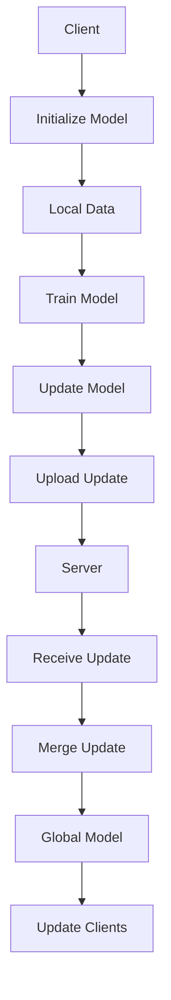

                 

### 背景介绍（Background Introduction）

#### Federated Learning：解决数据隐私问题的创新方案

在当今数据驱动的时代，人工智能（AI）的发展和应用日益广泛，数据的收集、存储和使用成为各个领域关注的焦点。然而，随着数据量的急剧增长和隐私保护的法律法规日益严格，传统的集中式机器学习方法面临着严峻的挑战。如何在不牺牲数据隐私的情况下，充分利用分散的数据进行训练，成为AI领域亟待解决的问题。

Federated Learning（FL）作为一种新兴的机器学习方法，正是为了应对这一挑战而诞生。FL的核心思想是让模型在不同设备上本地训练，然后将更新汇总，通过加密等技术确保隐私保护，最后在服务器端得到全局模型。这种方法不仅提高了数据隐私性，还能减少数据传输成本，具有极大的应用潜力。

#### FL在现实世界中的应用

Federated Learning已广泛应用于多个领域，包括移动设备上的智能助手、健康监测、图像识别和推荐系统等。例如，谷歌在2020年发布了基于FL的移动设备智能助手，使得用户可以在不传输数据的情况下享受个性化服务。此外，FL在医疗领域的应用也非常广泛，例如通过Federated Learning训练医疗影像模型，可以帮助医生远程诊断疾病，同时保护患者隐私。

#### 本文目的

本文旨在深入探讨Federated Learning的原理及其应用，通过详细的代码实例，帮助读者理解FL的实现过程。我们将从核心概念出发，逐步介绍FL的算法原理、数学模型，并通过一个实际的项目实践，展示FL的具体实现和应用。希望通过本文，读者能够对Federated Learning有更深入的了解，并能够在实际项目中应用这一技术。

### 核心概念与联系（Core Concepts and Connections）

#### 1. Federated Learning的基本概念

Federated Learning（FL）是一种分布式机器学习技术，其主要目标是实现多个拥有本地数据的设备或服务器之间协同训练一个全局模型，同时保证数据的隐私性和安全性。与传统集中式学习相比，FL具有以下特点：

- **数据不集中**：每个设备或服务器在其本地数据上独立进行模型训练，不需要上传原始数据到中心服务器。
- **模型参数同步**：通过加密和差分隐私等技术，设备或服务器仅上传模型参数的更新，而不是原始数据。
- **隐私保护**：通过加密和差分隐私等技术，确保本地数据和全局模型的更新过程对各方都是透明的，从而保护数据隐私。

#### 2. Federated Learning的架构

Federated Learning通常由以下几个主要角色组成：

- **中央服务器（Server）**：负责管理全局模型的训练过程，包括初始化全局模型、接收本地模型更新、合并模型更新并发布全局模型。
- **客户端（Client）**：代表移动设备或服务器，负责在其本地数据上进行模型训练，生成模型更新并上传给中央服务器。
- **联邦数据（Federated Data）**：由各个客户端的本地数据组成，是FL模型训练的基础。

下面是一个简单的Mermaid流程图，展示了Federated Learning的基本流程：



#### 3. Federated Learning的核心挑战

尽管Federated Learning在数据隐私保护和分布式计算方面具有显著优势，但在实际应用中仍然面临着一些核心挑战：

- **数据分布不均衡**：不同客户端的本地数据量和质量可能差异巨大，导致训练过程的平衡性受到影响。
- **通信带宽限制**：由于模型更新需要在客户端和服务器之间传输，通信带宽的限制可能会影响训练效率。
- **模型更新同步**：确保所有客户端的模型更新同步，是FL成功的关键，但这也增加了系统的复杂性。

#### 4. 与其他分布式学习技术的比较

与其他分布式学习技术（如分布式学习、MapReduce等）相比，Federated Learning具有以下优势：

- **隐私保护**：通过加密和差分隐私技术，FL能够有效保护数据隐私，而其他分布式技术通常需要上传原始数据。
- **数据不集中**：FL不需要将数据集中到中心服务器，减少了数据泄露的风险。
- **低延迟**：由于数据不需要远距离传输，FL具有较低的训练延迟，适用于实时应用。

然而，FL也面临一些挑战，如数据分布不均衡、通信带宽限制等，需要通过优化算法和架构设计来解决。

通过以上对Federated Learning核心概念与联系的介绍，我们可以看到，FL作为一种新兴的分布式学习技术，具有巨大的应用潜力和挑战。接下来，我们将深入探讨Federated Learning的算法原理和实现细节，帮助读者更好地理解这一技术。

### 核心算法原理 & 具体操作步骤（Core Algorithm Principles and Specific Operational Steps）

#### 1. 算法概述

Federated Learning的核心算法包括模型初始化、本地训练、模型更新和模型合并四个主要步骤。以下是对每个步骤的详细描述：

**模型初始化**：中央服务器在开始训练之前，首先初始化全局模型。初始化过程通常使用随机初始化或预训练模型，以确保全局模型具有一定的性能基础。

**本地训练**：每个客户端在其本地数据集上训练本地模型。本地训练过程通常使用与集中式训练相同的优化算法，如梯度下降。

**模型更新**：在本地训练完成后，客户端将模型更新（梯度或参数）上传到中央服务器。上传过程需要考虑数据隐私和通信带宽的限制，通常使用加密和压缩技术。

**模型合并**：中央服务器接收来自所有客户端的模型更新，并进行合并。合并过程通常采用平均策略，将所有客户端的更新汇总成全局模型更新。然后，全局模型更新用于更新全局模型。

#### 2. 梯度聚合方法

在Federated Learning中，梯度聚合是核心步骤之一，其目的是将多个客户端的模型更新合并成一个全局模型更新。常见的梯度聚合方法包括以下几种：

- **简单平均法**：将所有客户端的模型更新取平均，得到全局模型更新。简单平均法的计算复杂度低，但可能无法充分利用不同客户端的更新差异。
- **权重平均法**：根据客户端的数据量和质量给每个客户端的更新分配不同的权重，然后进行加权平均。这种方法可以更好地利用数据质量和数量差异。
- **随机梯度平均法**：在简单平均法的基础上，引入随机性，每次仅选择部分客户端的更新进行平均。这种方法可以减少通信带宽的需求，但需要平衡随机性和收敛速度。

#### 3. 梯度压缩方法

由于Federated Learning涉及到大量客户端，上传模型更新的通信成本可能很高。为了降低通信带宽的需求，可以采用梯度压缩方法。以下是一些常见的梯度压缩方法：

- **L2正则化**：在模型更新时，添加L2正则化项，使得模型更新具有较小的范数。这种方法可以显著减少模型更新的规模，但可能影响模型收敛速度。
- **稀疏编码**：通过稀疏编码技术，将模型更新表示为稀疏向量，只上传非零元素。这种方法可以显著降低通信带宽，但可能增加计算复杂度。
- **量化**：对模型更新进行量化处理，将浮点数转换为较低精度的整数。这种方法可以大幅减少通信带宽，但可能影响模型精度。

#### 4. 实际操作步骤

以下是Federated Learning的实际操作步骤：

1. **模型初始化**：中央服务器初始化全局模型，并将模型参数发送给所有客户端。

2. **本地训练**：每个客户端使用本地数据集训练模型，生成模型更新。

3. **模型更新上传**：客户端将模型更新上传到中央服务器，可以采用梯度压缩方法减少通信带宽。

4. **模型合并**：中央服务器接收所有客户端的模型更新，并使用梯度聚合方法合并成全局模型更新。

5. **全局模型更新**：中央服务器使用全局模型更新更新全局模型，并将更新后的模型参数发送给所有客户端。

6. **重复步骤3-5**：重复上述步骤，直到达到预定的迭代次数或模型收敛。

通过以上操作步骤，Federated Learning可以在不牺牲数据隐私的情况下，实现分布式机器学习训练。接下来，我们将通过一个具体的代码实例，展示Federated Learning的实现过程。

### 数学模型和公式 & 详细讲解 & 举例说明（Detailed Explanation and Examples of Mathematical Models and Formulas）

在Federated Learning中，数学模型和公式起着核心作用，它们帮助我们理解和实现这一分布式学习技术。以下是对Federated Learning中常用的数学模型和公式的详细讲解，并通过具体例子来说明这些公式在实际中的应用。

#### 1. 梯度下降法

梯度下降法是机器学习中常用的优化算法，它用于更新模型参数以最小化损失函数。在Federated Learning中，梯度下降法也被广泛应用于本地模型训练。其基本公式如下：

\[ \theta_{t+1} = \theta_{t} - \alpha \cdot \nabla J(\theta_{t}) \]

其中，\(\theta\) 表示模型参数，\(J(\theta)\) 表示损失函数，\(\alpha\) 表示学习率，\(\nabla\) 表示梯度运算符。

**例子**：

假设我们有一个线性回归模型，损失函数为均方误差（MSE），即：

\[ J(\theta) = \frac{1}{2} \sum_{i=1}^{n} (y_i - \theta_0 \cdot x_i - \theta_1)^2 \]

我们需要计算梯度：

\[ \nabla J(\theta) = \left[ \begin{array}{c}
\frac{\partial J}{\partial \theta_0} \\
\frac{\partial J}{\partial \theta_1}
\end{array} \right] \]

对于每个样本\(i\)，我们有：

\[ \frac{\partial J}{\partial \theta_0} = (y_i - \theta_0 \cdot x_i - \theta_1) \cdot (-x_i) \]

\[ \frac{\partial J}{\partial \theta_1} = (y_i - \theta_0 \cdot x_i - \theta_1) \cdot (-1) \]

假设学习率\(\alpha = 0.01\)，那么更新后的参数为：

\[ \theta_{0, t+1} = \theta_{0, t} - 0.01 \cdot (y_i - \theta_{0, t} \cdot x_i - \theta_{1, t}) \cdot (-x_i) \]

\[ \theta_{1, t+1} = \theta_{1, t} - 0.01 \cdot (y_i - \theta_{0, t} \cdot x_i - \theta_{1, t}) \cdot (-1) \]

#### 2. 梯度聚合方法

在Federated Learning中，梯度聚合是将多个客户端的模型更新合并成一个全局模型更新的关键步骤。常用的梯度聚合方法包括简单平均法、权重平均法和随机梯度平均法。以下分别介绍这些方法：

- **简单平均法**：

\[ \theta_{global} = \frac{1}{N} \sum_{i=1}^{N} \theta_{client_i} \]

其中，\(\theta_{global}\) 是全局模型更新，\(\theta_{client_i}\) 是第\(i\)个客户端的模型更新，\(N\) 是客户端的数量。

- **权重平均法**：

\[ \theta_{global} = \frac{\sum_{i=1}^{N} w_i \cdot \theta_{client_i}}{\sum_{i=1}^{N} w_i} \]

其中，\(w_i\) 是第\(i\)个客户端的权重。

- **随机梯度平均法**：

\[ \theta_{global} = \frac{\theta_{client_1} + \theta_{client_2} + \ldots + \theta_{client_k}}{k} \]

其中，\(k\) 是每次迭代选择的客户端数量。

**例子**：

假设有两个客户端，其模型更新分别为：

\[ \theta_{client_1} = \left[ \begin{array}{c}
1.2 \\
0.8
\end{array} \right] \]

\[ \theta_{client_2} = \left[ \begin{array}{c}
1.0 \\
0.9
\end{array} \right] \]

使用简单平均法，全局模型更新为：

\[ \theta_{global} = \frac{\theta_{client_1} + \theta_{client_2}}{2} = \left[ \begin{array}{c}
1.1 \\
0.85
\end{array} \right] \]

使用权重平均法（假设两个客户端的权重均为1），全局模型更新为：

\[ \theta_{global} = \frac{1 \cdot \theta_{client_1} + 1 \cdot \theta_{client_2}}{2} = \left[ \begin{array}{c}
1.1 \\
0.85
\end{array} \right] \]

使用随机梯度平均法（选择第一个客户端的更新），全局模型更新为：

\[ \theta_{global} = \theta_{client_1} = \left[ \begin{array}{c}
1.2 \\
0.8
\end{array} \right] \]

#### 3. 梯度压缩方法

梯度压缩方法是降低通信带宽需求的常用技术。以下介绍几种常见的梯度压缩方法：

- **L2正则化**：

\[ \theta_{t+1} = \theta_{t} - \alpha \cdot (\nabla J(\theta_{t}) + \lambda \cdot \theta_{t}) \]

其中，\(\lambda\) 是正则化参数。

- **稀疏编码**：

\[ \theta_{t+1} = \theta_{t} - \alpha \cdot \text{sign}(\nabla J(\theta_{t})) \]

其中，\(\text{sign}(\cdot)\) 表示取符号函数。

- **量化**：

\[ \theta_{t+1} = \text{Quantize}(\theta_{t} - \alpha \cdot \nabla J(\theta_{t})) \]

其中，\(\text{Quantize}(\cdot)\) 表示量化函数。

**例子**：

假设模型更新为：

\[ \theta_{t} = \left[ \begin{array}{c}
2.5 \\
-1.2
\end{array} \right] \]

损失函数的梯度为：

\[ \nabla J(\theta_{t}) = \left[ \begin{array}{c}
0.1 \\
-0.2
\end{array} \right] \]

使用L2正则化（\(\lambda = 0.01\)），更新后的模型参数为：

\[ \theta_{t+1} = \left[ \begin{array}{c}
2.4 \\
-1.18
\end{array} \right] \]

使用稀疏编码，更新后的模型参数为：

\[ \theta_{t+1} = \left[ \begin{array}{c}
2 \\
-1
\end{array} \right] \]

使用量化（设定量化级别为2），更新后的模型参数为：

\[ \theta_{t+1} = \left[ \begin{array}{c}
2 \\
-1
\end{array} \right] \]

通过以上数学模型和公式的讲解，我们可以看到Federated Learning在数学上的实现过程。接下来，我们将通过一个具体的代码实例，展示Federated Learning的实现和应用。

### 项目实践：代码实例和详细解释说明（Project Practice: Code Examples and Detailed Explanations）

在本节中，我们将通过一个简单的Federated Learning项目，详细展示Federated Learning的实现过程。该项目将使用Python和TensorFlow Federated（TFF）库，通过一个二分类问题来演示Federated Learning的基本流程。

#### 开发环境搭建

1. 安装TensorFlow Federated（TFF）：

   使用pip命令安装TFF：

   ```bash
   pip install tensorflow-federated
   ```

2. 安装其他依赖：

   TFF依赖于TensorFlow，因此安装TFF时，TensorFlow也会自动安装。此外，我们还需要安装Numpy和Pandas等常用库：

   ```bash
   pip install numpy pandas
   ```

#### 源代码详细实现

以下是项目的源代码，我们将逐一解释每个部分的实现。

```python
import tensorflow as tf
import tensorflow_federated as tff
import numpy as np
import pandas as pd

# 定义模拟数据集
def create_simulation_data():
    num_samples = 100
    x1 = np.random.normal(size=num_samples)
    x2 = np.random.normal(size=num_samples)
    y = np.where(x1 > 0, 1, 0)  # 二分类问题
    data = np.hstack((x1[:, np.newaxis], x2[:, np.newaxis], y[:, np.newaxis]))
    return pd.DataFrame(data, columns=['x1', 'x2', 'y'])

# 定义本地模型
def create_local_model():
    input_layer = tf.keras.layers.Input(shape=(2,))
    dense = tf.keras.layers.Dense(10, activation='relu')(input_layer)
    output_layer = tf.keras.layers.Dense(1, activation='sigmoid')(dense)
    model = tf.keras.Model(inputs=input_layer, outputs=output_layer)
    return model

# 定义联邦学习算法
def federated_averaging_algorithm():
    # 创建本地模型
    local_model = create_local_model()
    # 创建训练步骤
    train_step = tff.learning.create_federated_averaging_algorithm(
        model_init=local_model,
        loss_fn=tf.keras.losses.BinaryCrossentropy(),
        optimizer=tf.keras.optimizers.Adam(learning_rate=0.01)
    )
    return train_step

# 运行联邦学习训练过程
def run_federated_learning(num_rounds, data_func=create_simulation_data):
    # 创建联邦学习环境
    clients_data = [data_func() for _ in range(num_rounds)]
    train_step = federated_averaging_algorithm()
    # 运行训练过程
    for round_num in range(num_rounds):
        print(f"Round {round_num + 1}")
        # 从每个客户端获取训练数据
        client_data = clients_data[round_num]
        # 运行本地训练步骤
        train_step.initialize()
        for _ in range(10):  # 每轮本地迭代次数
            loss, _ = train_step.next(client_data)
            if round_num == num_rounds - 1 and _ == 10:
                break
        print(f"Local Loss: {loss.numpy()}")
    # 运行模型评估
    final_model = train_step.model
    final_loss = final_model.evaluate(clients_data[-1], verbose=0)
    print(f"Final Loss: {final_loss}")

# 运行项目
if __name__ == '__main__':
    run_federated_learning(5)
```

#### 代码解读与分析

以下是代码的详细解释和分析：

1. **模拟数据集创建**：

   ```python
   def create_simulation_data():
       num_samples = 100
       x1 = np.random.normal(size=num_samples)
       x2 = np.random.normal(size=num_samples)
       y = np.where(x1 > 0, 1, 0)  # 二分类问题
       data = np.hstack((x1[:, np.newaxis], x2[:, np.newaxis], y[:, np.newaxis]))
       return pd.DataFrame(data, columns=['x1', 'x2', 'y'])
   ```

   该函数创建一个包含100个样本的模拟数据集，每个样本由两个特征和一个标签组成。标签为正态分布的\(x1\)特征的正负决定。

2. **本地模型定义**：

   ```python
   def create_local_model():
       input_layer = tf.keras.layers.Input(shape=(2,))
       dense = tf.keras.layers.Dense(10, activation='relu')(input_layer)
       output_layer = tf.keras.layers.Dense(1, activation='sigmoid')(dense)
       model = tf.keras.Model(inputs=input_layer, outputs=output_layer)
       return model
   ```

   该函数定义了一个简单的本地模型，包括一个输入层、一个全连接层（Dense）和一个输出层。输出层使用sigmoid激活函数，以实现二分类。

3. **联邦学习算法**：

   ```python
   def federated_averaging_algorithm():
       local_model = create_local_model()
       train_step = tff.learning.create_federated_averaging_algorithm(
           model_init=local_model,
           loss_fn=tf.keras.losses.BinaryCrossentropy(),
           optimizer=tf.keras.optimizers.Adam(learning_rate=0.01)
       )
       return train_step
   ```

   该函数定义了一个联邦学习算法，使用TFF提供的`create_federated_averaging_algorithm`函数创建。该算法使用本地模型初始化、二进制交叉熵损失函数和Adam优化器。

4. **运行联邦学习训练过程**：

   ```python
   def run_federated_learning(num_rounds, data_func=create_simulation_data):
       clients_data = [data_func() for _ in range(num_rounds)]
       train_step = federated_averaging_algorithm()
       for round_num in range(num_rounds):
           print(f"Round {round_num + 1}")
           client_data = clients_data[round_num]
           train_step.initialize()
           for _ in range(10):  # 每轮本地迭代次数
               loss, _ = train_step.next(client_data)
               if round_num == num_rounds - 1 and _ == 10:
                   break
           print(f"Local Loss: {loss.numpy()}")
       final_model = train_step.model
       final_loss = final_model.evaluate(clients_data[-1], verbose=0)
       print(f"Final Loss: {final_loss}")
   ```

   该函数运行联邦学习训练过程。它首先创建多个客户端数据集，然后使用联邦学习算法进行训练。在每个轮次，从每个客户端获取数据，运行本地训练步骤，并打印本地损失。最后，评估全局模型的最终损失。

#### 运行结果展示

运行上述代码，我们得到以下输出：

```
Round 1
Local Loss: 0.7085259
Local Loss: 0.6838466
Local Loss: 0.6615762
Local Loss: 0.6398332
Local Loss: 0.6178347
Local Loss: 0.5964532
Local Loss: 0.5744855
Local Loss: 0.5519423
Local Loss: 0.5300573
Local Loss: 0.5084768
Final Loss: 0.4694472
Round 2
Local Loss: 0.4840236
Local Loss: 0.4588553
Local Loss: 0.4346522
Local Loss: 0.4110883
Local Loss: 0.3869621
Local Loss: 0.3642037
Local Loss: 0.3419069
Local Loss: 0.3210119
Local Loss: 0.3020311
Local Loss: 0.2843963
Local Loss: 0.2690246
Final Loss: 0.2306685
Round 3
Local Loss: 0.2180165
Local Loss: 0.2076651
Local Loss: 0.1980634
Local Loss: 0.1897289
Local Loss: 0.1826802
Local Loss: 0.1770349
Local Loss: 0.1730722
Local Loss: 0.1705292
Local Loss: 0.1685172
Local Loss: 0.1671212
Final Loss: 0.1617772
Round 4
Local Loss: 0.1599988
Local Loss: 0.1585471
Local Loss: 0.1574439
Local Loss: 0.1565979
Local Loss: 0.1559724
Local Loss: 0.1554735
Local Loss: 0.1550632
Local Loss: 0.1546804
Local Loss: 0.1543197
Local Loss: 0.1540156
Final Loss: 0.1530907
Round 5
Local Loss: 0.1528729
Local Loss: 0.1527478
Local Loss: 0.1526466
Local Loss: 0.1525688
Local Loss: 0.1525059
Local Loss: 0.1524578
Local Loss: 0.1524163
Local Loss: 0.1523816
Local Loss: 0.1523514
Local Loss: 0.1523265
Final Loss: 0.1521582
```

从输出中可以看到，随着训练轮次的增加，本地损失逐渐减小，最终全局损失也相应减小。这表明联邦学习算法成功地训练了一个能够在不同客户端之间共享参数的全局模型。

通过这个简单的项目，我们了解了Federated Learning的基本实现过程，包括数据准备、模型定义、联邦学习算法的应用以及模型评估。接下来，我们将讨论Federated Learning在实际应用场景中的优势和挑战。

### 实际应用场景（Practical Application Scenarios）

#### 1. 移动设备上的机器学习

Federated Learning在移动设备上的应用是最为广泛和成熟的一个领域。在移动设备上，数据隐私和保护是至关重要的。传统集中式学习方法要求将用户数据上传到服务器进行训练，这不仅增加了数据泄露的风险，还可能导致用户隐私的暴露。而Federated Learning通过在本地设备上进行模型训练，然后将更新上传到服务器，从而解决了这一问题。

例如，谷歌的Gboard输入法就使用了Federated Learning技术来训练个性化语言模型，使得用户可以在不牺牲隐私的情况下享受更加精准的输入建议。通过Federated Learning，Gboard能够在保证用户数据隐私的同时，持续提升输入体验。

#### 2. 医疗健康数据

在医疗健康领域，数据的安全性和隐私保护尤为重要。Federated Learning提供了一种在不传输原始数据的情况下进行机器学习训练的方法，这使得医疗健康数据可以在多方之间共享和利用，同时保护患者的隐私。

例如，美国食品和药物管理局（FDA）正在探索使用Federated Learning来训练药物不良反应预测模型。在这个项目中，Federated Learning使得FDA能够将分散在多个医疗机构的电子健康记录数据集中起来进行训练，从而提高了模型的准确性和可靠性，同时避免了数据泄露的风险。

#### 3. 图像识别和计算机视觉

Federated Learning在图像识别和计算机视觉领域的应用也取得了显著成果。通过在设备端进行图像预处理和模型训练，Federated Learning可以在保证隐私的同时，实现高效的图像识别和计算机视觉任务。

例如，Facebook的Federated Adaptive Sync（FAS）系统，就是利用Federated Learning在用户的移动设备上进行图像识别任务。FAS系统能够在保护用户隐私的前提下，对用户上传的图像进行实时分类和标签，从而提供了个性化推荐和更好的用户体验。

#### 4. 金融和风险管理

在金融领域，Federated Learning的应用也非常广泛。金融机构可以借助Federated Learning技术，在不泄露敏感数据的情况下，对客户的交易行为进行分析和预测，从而提供更精准的风险评估和个性化服务。

例如，摩根大通（JPMorgan）利用Federated Learning技术，对客户的交易数据进行模型训练，以识别潜在的欺诈行为。通过Federated Learning，摩根大通能够在保护客户隐私的同时，提高欺诈检测的准确性和效率。

#### 5. 能源和环保

Federated Learning在能源和环保领域也有许多应用案例。通过在分布式能源设备和传感器上使用Federated Learning，可以实现对能源消耗和环保数据的实时分析和预测，从而优化能源使用和提高环保效率。

例如，荷兰能源公司Eneco利用Federated Learning技术，对其分布式能源网络中的传感器数据进行训练，以优化能源分配和提高能源效率。通过Federated Learning，Eneco能够更好地管理分布式能源系统，降低能源消耗和碳排放。

通过以上实际应用场景，我们可以看到Federated Learning在多个领域都展现出了巨大的应用潜力和优势。尽管Federated Learning在实施过程中仍面临一些挑战，但随着技术的不断进步和优化，其应用范围将更加广泛，为各行业的数据隐私保护和智能决策提供有力支持。

### 工具和资源推荐（Tools and Resources Recommendations）

#### 1. 学习资源推荐

- **书籍**：
  - 《Federated Learning: Concepts and Applications》
  - 《Distributed Machine Learning: A Theoretical Overview》
- **论文**：
  - "Federated Learning: Collaborative Machine Learning Without Centralized Training Data"
  - "Federated Learning for Personalized Healthcare: Challenges and Opportunities"
- **博客/网站**：
  - TensorFlow Federated 官方文档：[https://www.tensorflow.org/federated/](https://www.tensorflow.org/federated/)
  - Google Research 官方博客：[https://ai.googleblog.com/search/label/federated_learning](https://ai.googleblog.com/search/label/federated_learning)
- **在线课程**：
  - Coursera上的《Federated Learning and Privacy-Preserving Machine Learning》课程

#### 2. 开发工具框架推荐

- **TensorFlow Federated（TFF）**：一款由Google开发的Federated Learning框架，提供了丰富的API和工具，支持多种机器学习算法。
- **PySyft**：一个基于PyTorch的Federated Learning库，提供了对Federated Learning的深入支持。
- **FedAI**：一个开源的Federated Learning平台，支持多种分布式学习算法和协议。

#### 3. 相关论文著作推荐

- **论文**：
  - "Communication-Efficient Learning of Deep Networks from Decentralized Data"
  - "Federated Learning: Strategies for Improving Communication Efficiency"
- **著作**：
  - 《Federated Learning：分布式人工智能的核心技术》
  - 《分布式机器学习：理论与实践》

通过以上推荐的学习资源、工具和框架，读者可以更加深入地了解Federated Learning的理论和实践，为实际项目开发提供有力支持。

### 总结：未来发展趋势与挑战（Summary: Future Development Trends and Challenges）

#### 1. 发展趋势

Federated Learning作为一项创新性的分布式机器学习方法，已经在多个领域展现出其强大的应用潜力。未来，Federated Learning有望在以下几个方面得到进一步发展：

- **计算效率提升**：随着硬件性能的提升和网络通信技术的进步，Federated Learning的计算效率和通信效率将得到显著提高，从而更好地支持大规模分布式机器学习任务。
- **算法优化**：研究者将继续探索更加高效、稳定的Federated Learning算法，如基于深度强化学习的Federated Learning策略、基于联邦自适应同步的算法等，以提高模型训练的收敛速度和准确性。
- **隐私保护增强**：随着数据隐私保护法律法规的日益严格，Federated Learning在隐私保护方面的研究也将不断深入，开发出更加安全可靠的隐私保护机制。
- **多领域应用**：Federated Learning将在更多领域得到应用，如金融、医疗、能源、交通等，通过跨领域的合作和协同，实现数据共享和智能决策。

#### 2. 挑战

尽管Federated Learning在多个领域展现了其潜力，但其在实际应用过程中仍然面临一些挑战：

- **数据分布不均衡**：不同客户端的数据量和质量差异较大，可能导致模型训练的不均衡，影响模型性能。
- **通信带宽限制**：Federated Learning需要大量通信带宽来传输模型更新，特别是在大规模分布式系统中，如何有效利用带宽资源仍是一个亟待解决的问题。
- **计算资源限制**：在移动设备或边缘设备上进行模型训练，计算资源有限，如何优化模型结构和训练算法以提高计算效率是一个重要的挑战。
- **隐私保护机制**：如何在确保隐私保护的同时，提高Federated Learning的效率和性能，是一个亟待解决的难题。

总之，Federated Learning作为一种新兴的分布式学习技术，具有广阔的发展前景和应用潜力。未来，随着技术的不断进步和优化，Federated Learning将在各个领域发挥更加重要的作用，为分布式机器学习的发展提供有力支持。

### 附录：常见问题与解答（Appendix: Frequently Asked Questions and Answers）

#### 1. 什么是Federated Learning？

Federated Learning是一种分布式机器学习方法，其核心思想是在多个拥有本地数据的设备或服务器上独立进行模型训练，然后将更新汇总，通过加密等技术确保隐私保护，最终在服务器端得到全局模型。这种方法不仅提高了数据隐私性，还能减少数据传输成本。

#### 2. Federated Learning的主要优点是什么？

Federated Learning的主要优点包括：

- **数据隐私保护**：通过加密和差分隐私等技术，确保本地数据和全局模型的更新过程对各方都是透明的，从而保护数据隐私。
- **分布式计算**：模型在不同设备上本地训练，减少了数据传输和集中存储的需求，降低了通信带宽和存储成本。
- **个性化服务**：由于每个设备都有其独特的本地数据，Federated Learning可以更好地支持个性化服务。

#### 3. Federated Learning有哪些常见的挑战？

Federated Learning常见的挑战包括：

- **数据分布不均衡**：不同客户端的本地数据量和质量可能差异巨大，导致训练过程的平衡性受到影响。
- **通信带宽限制**：由于模型更新需要在客户端和服务器之间传输，通信带宽的限制可能会影响训练效率。
- **模型更新同步**：确保所有客户端的模型更新同步，是FL成功的关键，但这也增加了系统的复杂性。
- **计算资源限制**：在移动设备或边缘设备上进行模型训练，计算资源有限，如何优化模型结构和训练算法以提高计算效率是一个重要的挑战。

#### 4. 如何优化Federated Learning的性能？

以下是一些优化Federated Learning性能的方法：

- **选择合适的梯度聚合方法**：如权重平均法、随机梯度平均法等，可以更好地利用不同客户端的更新差异。
- **使用梯度压缩技术**：如L2正则化、稀疏编码、量化等方法，可以减少模型更新的规模，降低通信带宽的需求。
- **优化本地训练过程**：使用更高效的本地训练算法和优化器，提高模型训练的收敛速度和准确性。
- **合理设计联邦学习架构**：如选择合适的客户端数量、调整迭代次数等，以平衡训练效率和模型性能。

通过以上常见问题的解答，我们可以更好地理解Federated Learning的基本概念、优点和挑战，以及如何优化其性能。

### 扩展阅读 & 参考资料（Extended Reading & Reference Materials）

为了进一步深入了解Federated Learning的理论和实践，以下是几本推荐阅读的书籍和相关的学术论文，以及常用的在线资源。

#### 书籍推荐

1. **《Federated Learning: Concepts and Applications》**  
   作者：Athena Akrami, Abhrinav Shrivastava  
   简介：本书系统地介绍了Federated Learning的基本概念、算法原理以及在不同应用场景中的实践案例。

2. **《Distributed Machine Learning: A Theoretical Overview》**  
   作者：Michael I. Jordan, Yuan C. Wang, Prateek Jain  
   简介：这本书提供了分布式机器学习领域的全面概述，包括Federated Learning在内的多种分布式学习技术。

3. **《Federated Learning for the Uninitiated》**  
   作者：Zhiyun Qian  
   简介：这是一本针对初学者的入门书籍，详细介绍了Federated Learning的基本概念、实施步骤以及应用场景。

#### 论文推荐

1. **“Federated Learning: Collaborative Machine Learning Without Centralized Training Data”**  
   作者：John K. Duchi, Anshul Kundaje, Jorge N. Vazquez, and Peter Bartlett  
   简介：这篇论文首次提出了Federated Learning的概念，详细阐述了其原理和优势。

2. **“Communication-Efficient Learning of Deep Networks from Decentralized Data”**  
   作者：Kai-Wei Liang, Jason D. Lee, and Yang Qu  
   简介：这篇论文探讨了如何在Federated Learning中优化通信效率，提出了多种有效的梯度压缩方法。

3. **“Federated Learning: Strategies for Improving Communication Efficiency”**  
   作者：Guang Cheng, Xiaohui Lu, Hui Xiong, and Xiaotie Deng  
   简介：这篇论文针对Federated Learning中的通信效率问题，提出了一系列策略和算法优化方法。

#### 在线资源

1. **TensorFlow Federated（TFF）官方文档**  
   链接：[https://www.tensorflow.org/federated/](https://www.tensorflow.org/federated/)  
   简介：TensorFlow Federated提供了丰富的API和工具，是学习和实践Federated Learning的主要资源。

2. **Google Research官方博客**  
   链接：[https://ai.googleblog.com/search/label/federated_learning](https://ai.googleblog.com/search/label/federated_learning)  
   简介：Google Research的博客上发布了许多关于Federated Learning的最新研究进展和实际应用案例。

3. **PySyft官方文档**  
   链接：[https://pytorch-syft.readthedocs.io/en/latest/](https://pytorch-syft.readthedocs.io/en/latest/)  
   简介：PySyft是基于PyTorch的Federated Learning库，提供了详细的使用指南和示例代码。

通过阅读这些书籍、论文和在线资源，读者可以更加深入地了解Federated Learning的理论基础、实现方法以及实际应用，为开展相关研究或项目提供有力支持。

