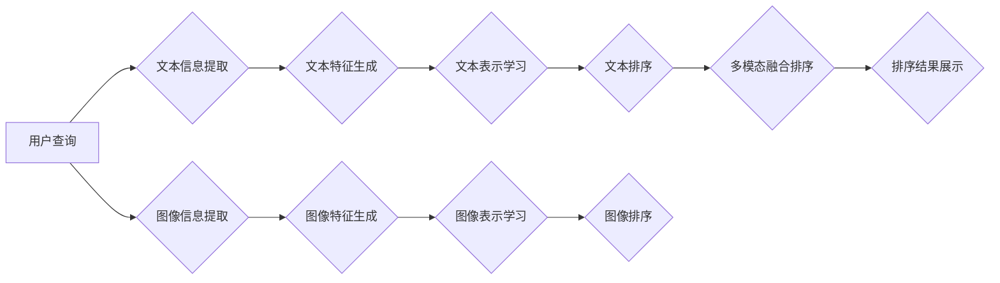

                 

## 电商搜索中的多模态融合排序模型

> 关键词：电商搜索、多模态融合、排序模型、深度学习、推荐系统

## 1. 背景介绍

电商平台的搜索引擎是用户获取商品信息和完成购买的关键入口。传统的电商搜索模型主要依赖文本信息，如商品标题、描述等，但随着用户需求的不断变化，单纯依靠文本信息已难以满足用户对商品的全面理解。用户在搜索商品时，往往会结合多种信息进行判断，例如商品图片、视频、价格、评论等。因此，如何有效融合多模态信息，提升电商搜索的准确性和用户体验，成为一个重要的研究方向。

多模态融合排序模型旨在将不同模态的信息（如文本、图像、视频等）融合在一起，构建更全面的商品表示，从而提高搜索结果的质量。近年来，随着深度学习技术的快速发展，多模态融合排序模型取得了显著的进展。

## 2. 核心概念与联系

### 2.1 多模态信息

多模态信息是指由多种感知模式（如文本、图像、音频、视频等）组成的信息。在电商搜索场景中，常见的多模态信息包括：

* **文本信息:** 商品标题、描述、属性、评论等。
* **图像信息:** 商品图片、展示图、细节图等。
* **视频信息:** 商品演示视频、用户评价视频等。
* **音频信息:** 商品声音、用户语音等。

### 2.2 排序模型

排序模型是将搜索结果按照相关性进行排列的模型。在电商搜索中，排序模型的目标是将与用户查询最相关的商品排在最前面。常见的排序模型包括：

* **基于特征的排序模型:** 将商品信息转换为特征向量，然后使用机器学习算法进行排序。
* **深度学习排序模型:** 使用深度神经网络学习商品的表示，并进行排序。

### 2.3 多模态融合

多模态融合是指将不同模态的信息融合在一起，构建更全面的信息表示。常用的多模态融合方法包括：

* **特征级融合:** 将不同模态的信息转换为特征向量，然后将特征向量进行拼接或融合。
* **表示级融合:** 将不同模态的信息分别转换为表示向量，然后将表示向量进行融合。
* **决策级融合:** 将不同模态的信息分别进行排序，然后将排序结果进行融合。

**多模态融合排序模型架构**



## 3. 核心算法原理 & 具体操作步骤

### 3.1 算法原理概述

多模态融合排序模型的核心算法原理是将不同模态的信息融合在一起，构建更全面的商品表示，从而提高搜索结果的质量。常用的算法包括：

* **深度学习模型:** 

    * **Transformer:** Transformer模型能够有效地捕捉文本序列中的长距离依赖关系，在多模态融合排序中表现出色。
    * **CNN:** CNN模型擅长提取图像特征，可以用于提取商品图片中的视觉信息。
    * **RNN:** RNN模型能够处理序列数据，可以用于处理商品描述等文本序列信息。

* **融合策略:** 

    * **Early Fusion:** 将不同模态的信息在特征生成阶段进行融合。
    * **Late Fusion:** 将不同模态的信息分别进行排序，然后将排序结果进行融合。
    * **Hybrid Fusion:** 将Early Fusion和Late Fusion两种策略结合起来。

### 3.2 算法步骤详解

1. **数据预处理:** 将多模态数据进行清洗、格式化和转换，例如将图像转换为特征向量，将文本转换为词向量等。
2. **特征提取:** 使用不同的模型提取不同模态的信息特征，例如使用CNN提取图像特征，使用Transformer提取文本特征。
3. **表示学习:** 将提取到的特征进行融合，构建更全面的商品表示。可以使用深度学习模型，例如Transformer，进行表示学习。
4. **排序模型训练:** 使用训练数据训练排序模型，例如使用深度学习模型进行训练。
5. **排序结果展示:** 将训练好的排序模型应用于实际搜索场景，将搜索结果按照相关性进行排列，并展示给用户。

### 3.3 算法优缺点

**优点:**

* 能够融合多种信息，构建更全面的商品表示。
* 能够提高搜索结果的准确性和用户体验。

**缺点:**

* 训练数据量大，模型训练复杂。
* 需要对不同模态信息进行有效的融合，否则可能会导致信息冗余或冲突。

### 3.4 算法应用领域

多模态融合排序模型在电商搜索、推荐系统、图像识别、语音识别等领域都有广泛的应用。

## 4. 数学模型和公式 & 详细讲解 & 举例说明

### 4.1 数学模型构建

假设我们有 $N$ 个商品，每个商品包含 $M$ 种模态信息，例如文本信息、图像信息、视频信息等。我们用 $x_i^m$ 表示第 $i$ 个商品的第 $m$ 种模态信息，其中 $i \in \{1, 2, ..., N\}$，$m \in \{1, 2, ..., M\}$。

我们的目标是构建一个排序模型，将商品按照与用户查询的相关性进行排序。我们可以使用以下数学模型来表示商品的表示：

$$
h_i = f(x_i^1, x_i^2, ..., x_i^M)
$$

其中，$h_i$ 是第 $i$ 个商品的表示向量，$f$ 是一个多模态融合函数。

### 4.2 公式推导过程

多模态融合函数 $f$ 可以使用多种方法构建，例如：

* **特征级融合:** 将不同模态的信息转换为特征向量，然后将特征向量进行拼接或融合。

$$
h_i = Concatenate(f_1(x_i^1), f_2(x_i^2), ..., f_M(x_i^M))
$$

其中，$f_m$ 是第 $m$ 种模态信息的特征提取函数，$Concatenate$ 是拼接函数。

* **表示级融合:** 将不同模态的信息分别转换为表示向量，然后将表示向量进行融合。

$$
h_i = g(f_1(x_i^1), f_2(x_i^2), ..., f_M(x_i^M))
$$

其中，$g$ 是一个多模态融合函数，例如平均池化、加权求和等。

### 4.3 案例分析与讲解

假设我们有一个电商平台，用户搜索“红色T恤”。平台需要根据用户查询，将所有商品按照与查询的相关性进行排序。

我们可以使用多模态融合排序模型，将商品的文本信息、图像信息进行融合，构建更全面的商品表示。例如，我们可以使用Transformer模型提取商品标题和描述的文本特征，使用CNN模型提取商品图片的视觉特征。然后，我们可以使用平均池化函数将文本特征和视觉特征进行融合，构建商品的最终表示向量。

最终，我们可以使用排序模型，例如深度学习模型，将商品的表示向量与用户查询进行比较，并根据相似度进行排序。

## 5. 项目实践：代码实例和详细解释说明

### 5.1 开发环境搭建

* Python 3.7+
* TensorFlow 2.0+
* PyTorch 1.0+
* CUDA 10.1+ (可选，用于GPU加速)

### 5.2 源代码详细实现

```python
import tensorflow as tf

# 定义多模态融合模型
class MultiModalFusionModel(tf.keras.Model):
    def __init__(self, text_embedding_dim, image_embedding_dim):
        super(MultiModalFusionModel, self).__init__()
        self.text_encoder = tf.keras.layers.Embedding(vocab_size, text_embedding_dim)
        self.image_encoder = tf.keras.layers.Conv2D(filters=image_embedding_dim, kernel_size=(3, 3), activation='relu')
        self.fusion_layer = tf.keras.layers.Concatenate()
        self.output_layer = tf.keras.layers.Dense(1)

    def call(self, text_input, image_input):
        text_embedding = self.text_encoder(text_input)
        image_embedding = self.image_encoder(image_input)
        fused_embedding = self.fusion_layer([text_embedding, image_embedding])
        output = self.output_layer(fused_embedding)
        return output

# 实例化模型
model = MultiModalFusionModel(text_embedding_dim=128, image_embedding_dim=64)

# 训练模型
# ...

# 预测结果
predictions = model.predict(text_input, image_input)
```

### 5.3 代码解读与分析

* **模型定义:** 我们定义了一个多模态融合模型，包含文本编码器、图像编码器、融合层和输出层。
* **文本编码器:** 使用Embedding层将文本序列转换为词向量。
* **图像编码器:** 使用Conv2D层提取图像特征。
* **融合层:** 使用Concatenate层将文本特征和图像特征进行拼接。
* **输出层:** 使用Dense层将融合特征转换为排序得分。
* **模型训练:** 使用训练数据训练模型，优化模型参数。
* **预测结果:** 使用训练好的模型预测商品的排序得分。

### 5.4 运行结果展示

运行结果展示可以包括：

* **排序结果:** 展示模型预测的商品排序结果。
* **指标评估:** 使用指标，例如NDCG、MAP等，评估模型的性能。
* **可视化分析:** 使用可视化工具，例如T-SNE、PCA等，分析模型的特征表示。

## 6. 实际应用场景

### 6.1 电商搜索场景

多模态融合排序模型在电商搜索场景中可以有效提升搜索结果的质量。例如，当用户搜索“红色T恤”时，模型可以融合商品的文本信息、图像信息，并根据用户查询的意图进行排序，从而推荐更符合用户需求的商品。

### 6.2 商品推荐场景

多模态融合排序模型也可以用于商品推荐场景。例如，电商平台可以根据用户的浏览历史、购买记录等信息，构建用户的兴趣画像，然后使用多模态融合排序模型推荐用户可能感兴趣的商品。

### 6.3 其他应用场景

多模态融合排序模型还可以应用于其他场景，例如：

* **图像检索:** 根据用户输入的文本查询，检索与文本相关的图像。
* **视频检索:** 根据用户输入的文本查询，检索与文本相关的视频。
* **多媒体内容分析:** 分析多媒体内容，例如文本、图像、视频等，并提取其中的关键信息。

### 6.4 未来应用展望

随着深度学习技术的不断发展，多模态融合排序模型的应用场景将会更加广泛。未来，我们可以期待：

* **更强大的多模态融合模型:** 能够更好地融合不同模态的信息，构建更全面的表示。
* **更个性化的排序结果:** 能够根据用户的个性化需求进行排序，提供更精准的推荐。
* **更智能的交互方式:** 用户可以利用语音、图像等多种方式进行交互，与多模态融合排序模型进行更自然、更智能的对话。

## 7. 工具和资源推荐

### 7.1 学习资源推荐

* **书籍:**
    * Deep Learning by Ian Goodfellow, Yoshua Bengio, and Aaron Courville
    * Natural Language Processing with Python by Steven Bird, Ewan Klein, and Edward Loper
* **在线课程:**
    * Deep Learning Specialization by Andrew Ng (Coursera)
    * Natural Language Processing Specialization by deeplearning.ai (Coursera)
* **博客和网站:**
    * Towards Data Science
    * Machine Learning Mastery
    * Google AI Blog

### 7.2 开发工具推荐

* **深度学习框架:** TensorFlow, PyTorch, Keras
* **数据处理工具:** Pandas, NumPy
* **可视化工具:** Matplotlib, Seaborn, TensorBoard

### 7.3 相关论文推荐

* **Transformer:** Attention Is All You Need
* **多模态融合:**
    * Multimodal Learning with Deep Neural Networks
    * A Survey on Multimodal Deep Learning

## 8. 总结：未来发展趋势与挑战

### 8.1 研究成果总结

多模态融合排序模型在电商搜索、推荐系统等领域取得了显著的进展，能够有效提升搜索结果的质量和用户体验。

### 8.2 未来发展趋势

* **模型架构创新:** 探索更强大的多模态融合模型架构，例如基于图神经网络、自注意力机制的模型。
* **跨模态知识表示:** 研究跨模态知识表示方法，例如将文本、图像、视频等信息融合到统一的知识图谱中。
* **个性化排序:** 研究更个性化的排序方法，例如根据用户的兴趣、偏好、行为等信息进行排序。

### 8.3 面临的挑战

* **数据获取和标注:** 多模态数据获取和标注成本高，需要开发更有效的标注方法。
* **模型训练和优化:** 多模态融合模型训练复杂，需要开发更有效的训练和优化算法。
* **解释性和可解释性:** 多模态融合模型的决策过程较为复杂，需要提高模型的解释性和可解释性。

### 8.4 研究展望

未来，多模态融合排序模型的研究将继续深入，探索更强大的模型架构、更有效的训练方法和更个性化的排序策略，为用户提供更智能、更便捷的搜索和推荐体验。

## 9. 附录：常见问题与解答

**Q1: 多模态融合排序模型的训练数据量需要很大吗？**

A1: 训练多模态融合排序模型确实需要较大的数据量，但随着深度学习技术的进步，模型的训练效率不断提高，数据量要求也在降低。

**Q2: 多模态融合排序模型的训练复杂吗？**

A2: 多模态融合排序模型的训练相对复杂，需要考虑不同模态信息的融合策略、模型架构设计等因素。

**Q3: 多模态融合排序模型的解释性和可解释性如何？**

A3: 多模态融合排序模型的决策过程较为复杂，解释性和可解释性相对较低。目前，研究者们正在探索提高模型解释性的方法。


作者：禅与计算机程序设计艺术 / Zen and the Art of Computer Programming<end_of_turn>

