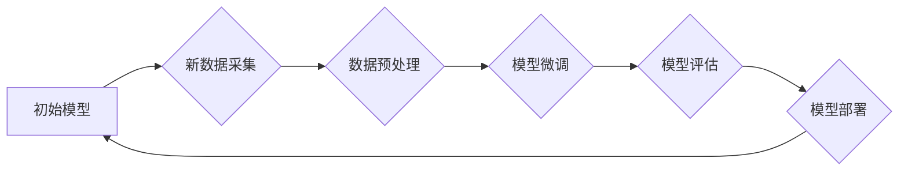

                 

## 电商搜索推荐中的AI大模型数据增量更新策略

> 关键词：电商搜索推荐、AI大模型、数据增量更新、模型训练、在线学习、效率优化、推荐系统

## 1. 背景介绍

在当今数据爆炸的时代，电商平台面临着海量商品和用户数据，如何精准推荐用户感兴趣的商品，提升用户体验和转化率成为关键挑战。AI大模型凭借其强大的学习能力和泛化能力，在电商搜索推荐领域展现出巨大潜力。然而，AI大模型的训练成本高昂，且需要海量数据进行训练和更新，这给电商平台带来了新的难题。

数据增量更新策略应运而生，它旨在通过对模型进行部分更新，而非重新训练整个模型，从而降低训练成本，提高效率。本文将深入探讨电商搜索推荐中AI大模型的数据增量更新策略，分析其原理、算法、应用场景以及未来发展趋势。

## 2. 核心概念与联系

### 2.1  电商搜索推荐

电商搜索推荐是指根据用户的搜索历史、浏览记录、购买行为等数据，为用户推荐相关商品的系统。其目标是提高用户搜索结果的精准度和相关性，引导用户发现感兴趣的商品，最终提升转化率。

### 2.2  AI大模型

AI大模型是指在海量数据上训练的深度学习模型，具有强大的学习能力和泛化能力。在电商搜索推荐领域，常用的AI大模型包括：

* **Transformer模型**: 擅长处理序列数据，例如文本和商品描述，能够捕捉用户搜索意图和商品特征之间的复杂关系。
* **图神经网络**: 能够建模商品之间的关联关系，例如类别、属性、评论等，从而推荐用户可能感兴趣的商品。
* **协同过滤模型**: 基于用户的历史行为和商品的相似度进行推荐，能够发现用户潜在的兴趣。

### 2.3  数据增量更新

数据增量更新是指在模型训练完成后，仅更新模型的一部分参数，而非重新训练整个模型。它可以有效降低训练成本和时间，同时保持模型的性能。

**数据增量更新策略的流程图:**



## 3. 核心算法原理 & 具体操作步骤

### 3.1  算法原理概述

数据增量更新策略的核心在于如何高效地更新模型参数，以适应新数据带来的变化。常用的算法包括：

* **在线学习**: 

在线学习是一种迭代更新模型参数的算法，它在每次收到新数据时，都会对模型进行微调。在线学习算法通常具有较低的延迟和资源消耗，但可能导致模型在训练初期性能不稳定。

* **联邦学习**: 

联邦学习是一种分布式机器学习算法，它允许模型在多个设备上进行训练，而无需将数据集中到一个中心服务器。联邦学习可以有效保护用户隐私，并利用分散的数据进行模型训练。

* **知识蒸馏**: 

知识蒸馏是一种迁移学习技术，它将一个大型模型的知识迁移到一个小型模型中。知识蒸馏可以有效降低模型的训练成本和推理时间，同时保持模型的性能。

### 3.2  算法步骤详解

以在线学习为例，其具体操作步骤如下：

1. **初始化模型**: 使用预训练模型或随机初始化模型参数。
2. **数据预处理**: 对新数据进行预处理，例如文本清洗、特征提取等。
3. **模型微调**: 使用新数据对模型进行微调，更新模型参数。
4. **模型评估**: 使用验证集评估模型性能，并根据评估结果调整模型超参数。
5. **模型部署**: 将更新后的模型部署到生产环境中。

### 3.3  算法优缺点

| 算法 | 优点 | 缺点 |
|---|---|---|
| 在线学习 | 低延迟、低资源消耗 | 训练初期性能不稳定 |
| 联邦学习 | 保护用户隐私、利用分散数据 | 通信成本高、模型同步复杂 |
| 知识蒸馏 | 降低训练成本、降低推理时间 | 需要大型模型作为教师模型 |

### 3.4  算法应用领域

数据增量更新策略广泛应用于各种领域，例如：

* **电商搜索推荐**: 

根据用户行为数据不断更新推荐模型，提高推荐精准度。
* **自然语言处理**: 

根据新文本数据更新语言模型，提升文本理解和生成能力。
* **计算机视觉**: 

根据新图像数据更新图像识别模型，提高识别准确率。

## 4. 数学模型和公式 & 详细讲解 & 举例说明

### 4.1  数学模型构建

在线学习算法通常使用梯度下降法更新模型参数。假设模型参数为$\theta$,损失函数为$L(\theta,D)$,其中$D$为训练数据。梯度下降法的更新规则为：

$$\theta = \theta - \eta \nabla_{\theta} L(\theta,D)$$

其中$\eta$为学习率，$\nabla_{\theta} L(\theta,D)$为损失函数关于模型参数$\theta$的梯度。

### 4.2  公式推导过程

梯度下降法的核心思想是沿着损失函数的负梯度方向更新模型参数，从而降低损失函数的值。

损失函数的梯度表示损失函数变化的方向和幅度。更新模型参数的方向与梯度的反方向一致，更新幅度由学习率决定。

### 4.3  案例分析与讲解

假设我们有一个电商搜索推荐模型，其目标是预测用户对商品的点击概率。我们可以使用在线学习算法，根据用户的点击行为数据不断更新模型参数，提高预测准确率。

例如，当用户点击了一款商品时，模型的损失函数值会降低。此时，模型参数会沿着损失函数的负梯度方向更新，从而提高对该类商品的预测准确率。

## 5. 项目实践：代码实例和详细解释说明

### 5.1  开发环境搭建

* Python 3.7+
* TensorFlow/PyTorch
* 数据存储库 (例如 MySQL, MongoDB)

### 5.2  源代码详细实现

```python
import tensorflow as tf

# 定义模型
model = tf.keras.Sequential([
    tf.keras.layers.Embedding(input_dim=vocab_size, output_dim=embedding_dim),
    tf.keras.layers.LSTM(units=hidden_units),
    tf.keras.layers.Dense(units=1, activation='sigmoid')
])

# 定义损失函数和优化器
loss_fn = tf.keras.losses.BinaryCrossentropy()
optimizer = tf.keras.optimizers.Adam(learning_rate=0.001)

# 定义训练循环
def train_step(images, labels):
    with tf.GradientTape() as tape:
        predictions = model(images)
        loss = loss_fn(labels, predictions)
    gradients = tape.gradient(loss, model.trainable_variables)
    optimizer.apply_gradients(zip(gradients, model.trainable_variables))
    return loss

# 加载数据
(x_train, y_train), (x_test, y_test) = load_data()

# 训练模型
epochs = 10
for epoch in range(epochs):
    for batch in range(len(x_train) // batch_size):
        loss = train_step(x_train[batch * batch_size:(batch + 1) * batch_size], y_train[batch * batch_size:(batch + 1) * batch_size])
        print(f'Epoch {epoch+1}, Batch {batch+1}, Loss: {loss.numpy()}')

# 评估模型
loss, accuracy = model.evaluate(x_test, y_test)
print(f'Test Loss: {loss}, Test Accuracy: {accuracy}')
```

### 5.3  代码解读与分析

* 代码首先定义了电商搜索推荐模型，使用 Embedding 层、LSTM 层和 Dense 层组成。
* 然后定义了损失函数和优化器，使用 BinaryCrossentropy 作为损失函数，Adam 作为优化器。
* 训练循环使用 GradientTape 来计算梯度，并使用 optimizer 更新模型参数。
* 最后加载数据，训练模型并评估模型性能。

### 5.4  运行结果展示

运行结果展示了模型在训练过程中的损失值变化以及在测试集上的损失值和准确率。

## 6. 实际应用场景

### 6.1  电商搜索推荐系统

数据增量更新策略可以应用于电商搜索推荐系统，根据用户的实时行为数据不断更新推荐模型，提高推荐精准度和用户体验。

### 6.2  个性化推荐

数据增量更新策略可以用于个性化推荐系统，根据用户的历史行为和偏好数据，不断更新推荐模型，为用户提供更个性化的商品推荐。

### 6.3  内容推荐

数据增量更新策略可以应用于内容推荐系统，根据用户的阅读历史和兴趣数据，不断更新推荐模型，为用户推荐更相关的文章、视频和音频内容。

### 6.4  未来应用展望

随着数据量的不断增长和AI技术的不断发展，数据增量更新策略将在更多领域得到应用，例如：

* **医疗诊断**: 根据患者的病历和症状数据，不断更新诊断模型，提高诊断准确率。
* **金融风险控制**: 根据用户的交易记录和行为数据，不断更新风险模型，降低金融风险。
* **自动驾驶**: 根据车辆的传感器数据和驾驶环境数据，不断更新驾驶模型，提高自动驾驶安全性。

## 7. 工具和资源推荐

### 7.1  学习资源推荐

* **书籍**:
    * 深度学习
    * 机器学习实战
* **在线课程**:
    * Coursera
    * edX
    * Udacity

### 7.2  开发工具推荐

* **TensorFlow**: 开源深度学习框架
* **PyTorch**: 开源深度学习框架
* **Scikit-learn**: 机器学习库

### 7.3  相关论文推荐

* **BERT**: Pre-training of Deep Bidirectional Transformers for Language Understanding
* **GPT-3**: Language Models are Few-Shot Learners
* **DALL-E**: A Generative Model for Image Synthesis

## 8. 总结：未来发展趋势与挑战

### 8.1  研究成果总结

数据增量更新策略在电商搜索推荐领域取得了显著成果，能够有效降低模型训练成本和时间，提高模型性能。

### 8.2  未来发展趋势

未来数据增量更新策略的发展趋势包括：

* **更有效的算法**: 

研究更有效的在线学习算法，提高模型的训练效率和性能。
* **更灵活的更新策略**: 

根据不同场景和数据特点，设计更灵活的更新策略，例如针对不同数据类型的更新策略。
* **更强大的模型**: 

结合更强大的AI模型，例如Transformer模型和图神经网络，提高推荐精准度和用户体验。

### 8.3  面临的挑战

数据增量更新策略也面临一些挑战，例如：

* **数据质量**: 

数据增量更新策略依赖于高质量的数据，数据质量问题会影响模型性能。
* **模型稳定性**: 

在线学习算法可能导致模型在训练初期性能不稳定，需要采取措施保证模型的稳定性。
* **隐私保护**: 

数据增量更新策略需要处理用户隐私数据，需要采取措施保证用户隐私安全。

### 8.4  研究展望

未来研究方向包括：

* **探索更有效的在线学习算法**: 

研究更鲁棒、更高效的在线学习算法，提高模型的训练效率和性能。
* **研究针对不同数据类型的更新策略**: 

设计针对不同数据类型的更新策略，例如文本数据、图像数据、时间序列数据等。
* **探索数据增量更新策略与联邦学习的结合**: 

将数据增量更新策略与联邦学习结合，提高模型的隐私保护能力和训练效率。


## 9. 附录：常见问题与解答

**Q1: 数据增量更新策略与模型重新训练相比，有什么优势？**

**A1:** 数据增量更新策略相比模型重新训练，具有以下优势：

* **降低训练成本**: 

仅更新模型的一部分参数，而非重新训练整个模型，可以显著降低训练成本和时间。
* **提高训练效率**: 

数据增量更新策略可以利用已有模型的知识，更快地适应新数据。
* **保持模型稳定性**: 

数据增量更新策略可以避免模型在重新训练过程中出现性能波动。

**Q2: 数据增量更新策略有哪些局限性？**

**A2:** 数据增量更新策略也存在一些局限性：

* **数据质量**: 

数据增量更新策略依赖于高质量的数据，数据质量问题会影响模型性能。
* **模型稳定性**: 

在线学习算法可能导致模型在训练初期性能不稳定，需要采取措施保证模型的稳定性。
* **隐私保护**: 

数据增量更新策略需要处理用户隐私数据，需要采取措施保证用户隐私安全。


作者：禅与计算机程序设计艺术 / Zen and the Art of Computer Programming 
<end_of_turn>

