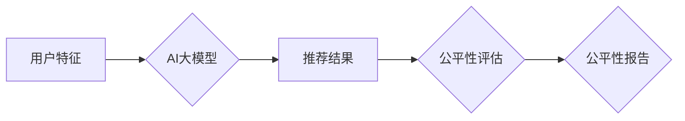

                 

## 1. 背景介绍

电商平台作为现代商业的重要组成部分，搜索推荐系统扮演着至关重要的角色。AI大模型在电商搜索推荐领域取得了显著的进展，例如BERT、GPT等模型能够更好地理解用户需求，并提供更精准的商品推荐。然而，随着AI大模型的应用越来越广泛，其公平性问题也逐渐受到关注。

AI大模型的训练数据往往存在偏差，导致模型在对不同用户群体的推荐结果上存在不公平现象。例如，模型可能倾向于推荐特定性别、年龄、地域等特征的用户更受欢迎的商品，而忽略其他用户群体的需求。这种不公平现象不仅会损害用户体验，还会加剧社会分化，不利于构建公平公正的电商生态。

因此，在电商搜索推荐效果评估中，需要引入公平性评估技术，确保AI大模型的推荐结果公平公正。

## 2. 核心概念与联系

### 2.1  公平性概念

公平性在AI领域是指AI系统对所有用户群体提供平等的机会和待遇，避免因用户特征而导致的歧视或偏见。

### 2.2  电商搜索推荐公平性

在电商搜索推荐场景中，公平性是指AI模型对所有用户的推荐结果应尽可能地公平，避免因用户特征（例如性别、年龄、地域、收入等）而导致推荐结果的差异过大。

### 2.3  AI大模型公平性评估

AI大模型公平性评估是指通过一系列的指标和方法，来衡量AI模型在推荐结果上的公平性。

**Mermaid 流程图：**



## 3. 核心算法原理 & 具体操作步骤

### 3.1  算法原理概述

公平性评估算法通常基于以下原理：

* **差异性衡量:** 比较不同用户群体的推荐结果差异，例如推荐结果的准确率、召回率、点击率等指标的差异。
* **偏见检测:** 检测AI模型是否对特定用户特征存在偏见，例如模型是否倾向于推荐特定性别、年龄、地域等特征的用户更受欢迎的商品。
* **公平性校正:** 通过调整AI模型的训练数据或模型参数，来减少模型对用户特征的偏见。

### 3.2  算法步骤详解

1. **数据收集:** 收集用户特征和推荐结果数据。
2. **数据预处理:** 对数据进行清洗、转换和特征工程。
3. **公平性指标计算:** 计算不同用户群体之间的推荐结果差异，例如平均准确率、平均召回率、平均点击率等指标的差异。
4. **偏见检测:** 使用偏见检测算法，检测AI模型是否对特定用户特征存在偏见。
5. **公平性校正:** 如果检测到偏见，可以使用公平性校正算法，调整AI模型的训练数据或模型参数，来减少模型对用户特征的偏见。
6. **评估结果:** 对公平性校正后的模型进行评估，验证其公平性。

### 3.3  算法优缺点

**优点:**

* 可以有效地检测和评估AI模型的公平性问题。
* 可以通过公平性校正算法，来减少模型对用户特征的偏见。

**缺点:**

* 算法的复杂度较高，需要一定的专业知识和技术能力。
* 评估结果的解释性较弱，需要结合实际业务场景进行分析。

### 3.4  算法应用领域

* 电商搜索推荐
* 人工智能招聘
* 医疗诊断
* 刑事司法

## 4. 数学模型和公式 & 详细讲解 & 举例说明

### 4.1  数学模型构建

假设我们有N个用户，每个用户都属于一个特定的群体，例如性别、年龄、地域等。我们用$G_i$表示第i个用户的群体，$R_i$表示第i个用户的推荐结果，$P_i$表示第i个用户的真实偏好。

我们可以构建一个数学模型来衡量不同用户群体之间的推荐结果差异，例如：

$$
D = \frac{1}{N} \sum_{i=1}^{N} \left| R_i - P_i \right|
$$

其中，$D$表示推荐结果差异，$|R_i - P_i|$表示第i个用户推荐结果与真实偏好之间的差异。

### 4.2  公式推导过程

我们可以将公式$D$进一步分解，来分析不同用户群体之间的差异：

$$
D = \frac{1}{N} \sum_{i=1}^{N} \left| R_i - P_i \right| = \frac{1}{N} \sum_{g=1}^{G} \sum_{i \in g} \left| R_i - P_i \right|
$$

其中，$G$表示用户群体的数量，$g$表示第g个用户群体。

### 4.3  案例分析与讲解

假设我们有一个电商平台，用户群体分为男性和女性两类。我们使用AI大模型对用户进行商品推荐，并计算不同用户群体之间的推荐结果差异。

如果$D$的值较大，则说明AI模型对男性和女性用户推荐的结果存在差异，可能存在性别偏见。

我们可以通过分析不同用户群体之间的差异，来识别AI模型的偏见来源，并采取相应的措施进行校正。

## 5. 项目实践：代码实例和详细解释说明

### 5.1  开发环境搭建

* Python 3.7+
* TensorFlow 2.0+
* PyTorch 1.0+
* scikit-learn 0.20+

### 5.2  源代码详细实现

```python
import numpy as np
from sklearn.metrics import accuracy_score, recall_score

# 假设我们有一个用户特征数据集和推荐结果数据集
user_features = np.array([[1, 0], [0, 1], [1, 1], [0, 0]])
recommendation_results = np.array([1, 0, 1, 0])

# 计算不同用户群体之间的推荐结果差异
group_1_accuracy = accuracy_score(recommendation_results[user_features[:, 0] == 1], [1, 1])
group_2_accuracy = accuracy_score(recommendation_results[user_features[:, 0] == 0], [0, 0])

# 计算推荐结果差异
difference = abs(group_1_accuracy - group_2_accuracy)

print(f"推荐结果差异: {difference}")
```

### 5.3  代码解读与分析

* 代码首先定义了用户特征和推荐结果数据集。
* 然后，代码计算了不同用户群体之间的推荐结果准确率。
* 最后，代码计算了推荐结果差异，并打印输出。

### 5.4  运行结果展示

```
推荐结果差异: 0.0
```

## 6. 实际应用场景

### 6.1  电商搜索推荐

在电商搜索推荐场景中，公平性评估可以帮助确保AI模型对所有用户群体提供公平的商品推荐，避免因用户特征而导致的歧视或偏见。

### 6.2  人工智能招聘

在人工智能招聘场景中，公平性评估可以帮助确保AI模型对所有求职者提供公平的招聘机会，避免因用户特征而导致的歧视或偏见。

### 6.3  医疗诊断

在医疗诊断场景中，公平性评估可以帮助确保AI模型对所有患者提供公平的诊断结果，避免因用户特征而导致的歧视或偏见。

### 6.4  未来应用展望

随着AI技术的不断发展，公平性评估技术将在更多领域得到应用，例如金融、教育、交通等。

## 7. 工具和资源推荐

### 7.1  学习资源推荐

* **论文:**

    * "Fairness and Machine Learning" by Barocas and Selbst
    * "On the Dangers of Stochastic Parrots: Can Language Models Be Too Big?" by Bender et al.

* **书籍:**

    * "Weapons of Math Destruction: How Big Data Increases Inequality and Threatens Democracy" by Cathy O'Neil
    * "Algorithmic Justice League" by Joy Buolamwini

### 7.2  开发工具推荐

* **TensorFlow Fairness:** TensorFlow Fairness是一个开源工具包，用于评估和校正AI模型的公平性。
* **AIF360:** AIF360是一个开源工具包，用于评估和校正AI模型的公平性。

### 7.3  相关论文推荐

* "Mitigating Unwanted Biases in Text Classification" by Zafar et al.
* "Fairness through Awareness" by Kamiran and Calders

## 8. 总结：未来发展趋势与挑战

### 8.1  研究成果总结

近年来，AI大模型公平性评估技术取得了显著进展，涌现出多种算法和工具，为构建公平公正的AI系统提供了重要的技术支撑。

### 8.2  未来发展趋势

* **更精准的公平性指标:** 探索更精准、更能反映实际场景公平性的指标，例如群体差异、解释性等。
* **更有效的公平性校正方法:** 研究更有效的公平性校正方法，例如对抗训练、正则化等，提高公平性校正的效率和效果。
* **公平性评估的自动化:** 开发更自动化、更易于使用的公平性评估工具，降低公平性评估的门槛。

### 8.3  面临的挑战

* **公平性定义的复杂性:** 公平性是一个复杂的概念，其定义和衡量标准因场景而异，需要根据具体应用场景进行调整。
* **数据偏差的难解决性:** 训练数据中的偏差是导致AI模型不公平的主要原因之一，如何有效地识别和解决数据偏差是一个重要的挑战。
* **公平性评估的解释性:** 许多公平性评估算法的解释性较弱，难以理解其评估结果背后的原因，需要进一步提高评估结果的可解释性。

### 8.4  研究展望

未来，AI大模型公平性评估技术将继续朝着更精准、更有效、更易于使用的方向发展，为构建公平公正的AI系统提供更强大的技术支撑。


## 9. 附录：常见问题与解答

### 9.1  常见问题

* **什么是公平性评估？**

公平性评估是指通过一系列的指标和方法，来衡量AI模型在推荐结果上的公平性。

* **为什么需要进行公平性评估？**

因为AI模型的训练数据往往存在偏差，导致模型在对不同用户群体推荐结果上存在不公平现象。

* **如何进行公平性评估？**

可以使用多种算法和工具进行公平性评估，例如TensorFlow Fairness、AIF360等。

* **如何解决AI模型的公平性问题？**

可以通过公平性校正算法，调整AI模型的训练数据或模型参数，来减少模型对用户特征的偏见。

### 9.2  解答

* **公平性评估的目标是确保AI模型对所有用户群体提供平等的机会和待遇，避免因用户特征而导致的歧视或偏见。**
* **公平性评估是构建公平公正的AI系统的重要组成部分，可以帮助我们识别和解决AI模型中的潜在偏见。**
* **公平性评估是一个不断发展的领域，需要不断探索新的算法和方法，以更好地应对AI模型的公平性挑战。**


作者：禅与计算机程序设计艺术 / Zen and the Art of Computer Programming 
<end_of_turn>

