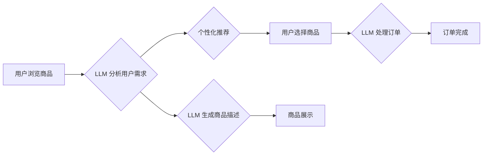

                 

## 电子商务：LLM 优化在线销售

> 关键词：大型语言模型 (LLM)、电子商务、客户服务、个性化推荐、内容生成、销售转化率、自然语言处理 (NLP)

## 1. 背景介绍

电子商务在全球范围内蓬勃发展，线上购物已成为人们生活不可或缺的一部分。然而，随着市场竞争的加剧，企业需要不断寻求创新手段来提升用户体验、提高销售转化率。大型语言模型 (LLM) 作为人工智能领域的一项突破性技术，为电子商务提供了全新的机遇。

LLM 拥有强大的自然语言处理能力，能够理解和生成人类语言，并从中提取有价值的信息。将其应用于电子商务领域，可以实现以下目标：

* **智能化客户服务:**  LLM 可以接管部分客户服务工作，例如回答常见问题、处理订单查询等，提高客户服务效率和用户满意度。
* **个性化推荐:**  LLM 可以根据用户的浏览历史、购买记录等数据，提供更精准的商品推荐，提升用户购物体验和销售额。
* **内容生成:**  LLM 可以自动生成商品描述、促销文案等内容，节省企业人力成本，提高内容质量和更新频率。
* **销售转化率提升:**  通过以上功能的优化，LLM 可以帮助企业提升用户粘性，提高转化率，最终促进销售增长。

## 2. 核心概念与联系

### 2.1  LLM 简介

大型语言模型 (LLM) 是指训练数据量巨大、参数规模庞大的深度学习模型。通过学习海量文本数据，LLM 能够掌握语言的语法、语义和上下文关系，从而实现对自然语言的理解和生成。

常见的 LLM 架构包括 Transformer、GPT 等。这些模型通过自注意力机制和多层编码解码结构，能够捕捉文本中的长距离依赖关系，生成更流畅、更自然的文本。

### 2.2  电子商务与 LLM 的结合

LLM 的强大能力可以与电子商务平台的各个环节相结合，实现多方面的优化。

**流程图:**



## 3. 核心算法原理 & 具体操作步骤

### 3.1  算法原理概述

LLM 的核心算法原理是基于深度学习的 Transformer 架构。Transformer 模型通过自注意力机制和多层编码解码结构，能够捕捉文本中的长距离依赖关系，实现对自然语言的理解和生成。

**自注意力机制:**  自注意力机制能够计算每个词与其他词之间的相关性，从而捕捉文本中的语义关系。

**多层编码解码结构:**  编码器将输入文本编码成语义向量，解码器根据编码后的语义向量生成输出文本。

### 3.2  算法步骤详解

1. **数据预处理:**  收集并预处理电子商务相关数据，例如商品描述、用户评论、浏览记录等。
2. **模型训练:**  使用 Transformer 架构的 LLM 模型，训练模型以理解和生成自然语言。
3. **模型评估:**  使用测试数据评估模型的性能，例如准确率、召回率等。
4. **模型部署:**  将训练好的模型部署到电子商务平台，并将其应用于实际场景。

### 3.3  算法优缺点

**优点:**

* 强大的自然语言理解和生成能力
* 能够捕捉文本中的长距离依赖关系
* 可应用于多种电子商务场景

**缺点:**

* 训练数据量大，计算资源需求高
* 模型参数规模庞大，部署成本高
* 存在潜在的偏见和误差

### 3.4  算法应用领域

* **智能客服:**  LLM 可以接管部分客户服务工作，例如回答常见问题、处理订单查询等。
* **个性化推荐:**  LLM 可以根据用户的浏览历史、购买记录等数据，提供更精准的商品推荐。
* **内容生成:**  LLM 可以自动生成商品描述、促销文案等内容，节省企业人力成本。
* **搜索引擎优化:**  LLM 可以帮助企业优化网站内容，提高搜索引擎排名。

## 4. 数学模型和公式 & 详细讲解 & 举例说明

### 4.1  数学模型构建

LLM 的数学模型主要基于 Transformer 架构，其核心是自注意力机制和多层编码解码结构。

**自注意力机制:**  

自注意力机制的计算公式如下:

$$
Attention(Q, K, V) = softmax(\frac{QK^T}{\sqrt{d_k}})V
$$

其中:

* $Q$：查询矩阵
* $K$：键矩阵
* $V$：值矩阵
* $d_k$：键向量的维度
* $softmax$：softmax 函数

**多层编码解码结构:**  

编码器和解码器分别由多层 Transformer 块组成。每个 Transformer 块包含自注意力层、前馈神经网络层和残差连接。

### 4.2  公式推导过程

自注意力机制的计算过程可以分为以下步骤:

1. 计算查询向量 $Q$、键向量 $K$ 和值向量 $V$。
2. 计算 $QK^T$ 的矩阵乘积，并进行归一化。
3. 应用 softmax 函数，得到每个词对其他词的注意力权重。
4. 将注意力权重与值向量 $V$ 进行加权求和，得到最终的输出向量。

### 4.3  案例分析与讲解

例如，在商品推荐场景中，LLM 可以根据用户的浏览历史和购买记录，计算每个商品与用户的相关性。通过自注意力机制，LLM 可以捕捉用户对不同商品的兴趣偏好，并生成个性化的商品推荐列表。

## 5. 项目实践：代码实例和详细解释说明

### 5.1  开发环境搭建

* Python 3.7+
* TensorFlow 或 PyTorch 深度学习框架
* CUDA 和 cuDNN (可选，用于 GPU 加速)

### 5.2  源代码详细实现

以下是一个使用 TensorFlow 实现 LLM 商品推荐的简单代码示例:

```python
import tensorflow as tf

# 定义模型架构
class RecommenderModel(tf.keras.Model):
    def __init__(self, embedding_dim, num_layers):
        super(RecommenderModel, self).__init__()
        self.embedding = tf.keras.layers.Embedding(input_dim=vocab_size, output_dim=embedding_dim)
        self.transformer = tf.keras.layers.Transformer(num_layers=num_layers)

    def call(self, inputs):
        embeddings = self.embedding(inputs)
        outputs = self.transformer(embeddings)
        return outputs

# 训练模型
model = RecommenderModel(embedding_dim=128, num_layers=6)
model.compile(optimizer='adam', loss='mse')
model.fit(train_data, train_labels, epochs=10)

# 生成推荐
user_id = 123
user_history = [1, 2, 3]
recommendations = model.predict([user_id, user_history])
```

### 5.3  代码解读与分析

* 该代码定义了一个名为 `RecommenderModel` 的模型，其架构基于 Transformer。
* 模型的输入是用户的 ID 和浏览历史，输出是推荐商品的概率分布。
* 模型使用 Adam 优化器和均方误差损失函数进行训练。

### 5.4  运行结果展示

训练完成后，模型可以用于生成商品推荐。例如，对于用户 ID 为 123，浏览历史为 [1, 2, 3] 的用户，模型可以预测出用户可能感兴趣的商品。

## 6. 实际应用场景

### 6.1  智能客服

LLM 可以接管部分客户服务工作，例如回答常见问题、处理订单查询等。例如，电商平台可以部署一个基于 LLM 的智能客服机器人，帮助用户解决购物过程中遇到的问题。

### 6.2  个性化推荐

LLM 可以根据用户的浏览历史、购买记录等数据，提供更精准的商品推荐。例如，电商平台可以利用 LLM 建立用户画像，并根据用户的兴趣偏好推荐相关商品。

### 6.3  内容生成

LLM 可以自动生成商品描述、促销文案等内容，节省企业人力成本。例如，电商平台可以利用 LLM 自动生成商品的详细描述，并根据不同的促销活动生成相应的文案。

### 6.4  未来应用展望

随着 LLM 技术的不断发展，其在电子商务领域的应用场景将更加广泛。例如，LLM 可以用于：

* **多语言支持:**  LLM 可以支持多种语言，帮助电商平台拓展海外市场。
* **语音交互:**  LLM 可以理解和生成语音，帮助用户通过语音进行购物。
* **虚拟试衣间:**  LLM 可以结合计算机视觉技术，实现虚拟试衣间功能，帮助用户在线试穿衣服。

## 7. 工具和资源推荐

### 7.1  学习资源推荐

* **书籍:**
    * 《深度学习》 - Ian Goodfellow, Yoshua Bengio, Aaron Courville
    * 《自然语言处理》 - Jurafsky, Martin
* **在线课程:**
    * Coursera: 自然语言处理
    * Udacity: 深度学习

### 7.2  开发工具推荐

* **TensorFlow:**  https://www.tensorflow.org/
* **PyTorch:**  https://pytorch.org/
* **Hugging Face Transformers:**  https://huggingface.co/transformers/

### 7.3  相关论文推荐

* **Attention Is All You Need:**  https://arxiv.org/abs/1706.03762
* **BERT: Pre-training of Deep Bidirectional Transformers for Language Understanding:**  https://arxiv.org/abs/1810.04805

## 8. 总结：未来发展趋势与挑战

### 8.1  研究成果总结

LLM 在电子商务领域的应用取得了显著成果，例如智能客服、个性化推荐、内容生成等功能得到了有效提升。

### 8.2  未来发展趋势

* **模型规模和性能的提升:**  未来 LLM 模型的规模和性能将继续提升，能够处理更复杂的任务，提供更精准的推荐和服务。
* **多模态融合:**  LLM 将与其他模态数据，例如图像、音频等融合，实现更全面的用户体验。
* **可解释性增强:**  研究人员将致力于提高 LLM 的可解释性，帮助用户理解模型的决策过程。

### 8.3  面临的挑战

* **数据隐私和安全:**  LLM 的训练需要大量用户数据，如何保护用户隐私和数据安全是一个重要挑战。
* **模型偏见和误差:**  LLM 模型可能存在偏见和误差，需要不断进行改进和优化。
* **部署成本和效率:**  大型 LLM 模型的部署成本和效率仍然是一个挑战，需要探索更有效的部署方案。

### 8.4  研究展望

未来，LLM 在电子商务领域的应用将更加广泛和深入，为用户提供更智能、更个性化的购物体验。研究人员将继续探索 LLM 的新应用场景，并解决其面临的挑战，推动 LLM 技术的持续发展。

## 9. 附录：常见问题与解答

**Q1: LLM 的训练需要多少数据？**

A1: LLM 的训练数据量通常非常庞大，通常需要数百万甚至数十亿个文本样本。

**Q2: LLM 的部署成本高吗？**

A2:  是的，大型 LLM 模型的部署成本较高，需要强大的计算资源和存储空间。

**Q3: LLM 是否存在偏见和误差？**

A3:  是的，LLM 模型可能存在偏见和误差，这是因为其训练数据可能存在偏差。

**作者：禅与计算机程序设计艺术 / Zen and the Art of Computer Programming** 


<end_of_turn>

