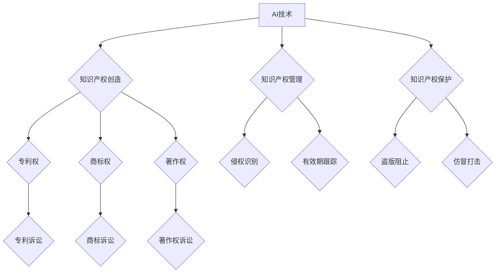

                 

## 知识产权诉讼的趋势与对策

> 关键词：知识产权、诉讼、人工智能、机器学习、数据保护、法律法规、技术趋势、应对策略

### 1. 背景介绍

随着科技的飞速发展，知识产权（Intellectual Property，IP）在经济社会中的地位日益重要。人工智能（Artificial Intelligence，AI）和机器学习（Machine Learning，ML）技术的蓬勃发展，为知识产权的创造和保护带来了新的机遇和挑战。一方面，AI和ML技术可以帮助企业更有效地识别、管理和保护知识产权；另一方面，这些技术也可能被用于侵犯知识产权。因此，知识产权诉讼呈现出新的趋势，对企业和个人都提出了更高的要求。

### 2. 核心概念与联系

**2.1 知识产权类型**

知识产权主要包括以下几种类型：

* **专利权:**  对一种新的发明进行独占性的权利。
* **商标权:** 对商品或服务的标志进行独占性的权利。
* **著作权:** 对文学、艺术、科学等作品进行独占性的权利。
* **商业秘密:**  对企业内部的 confidential 信息进行保护。

**2.2 AI和知识产权**

AI和ML技术在知识产权领域的影响主要体现在以下几个方面：

* **知识产权创造:** AI可以帮助人类创造新的知识产权，例如发明新的产品、创作新的艺术作品等。
* **知识产权管理:** AI可以帮助企业更有效地管理知识产权，例如识别潜在的侵权行为、跟踪知识产权的有效期等。
* **知识产权保护:** AI可以帮助企业更有效地保护知识产权，例如识别和阻止知识产权的盗版和仿冒。

**2.3 知识产权诉讼趋势**

随着AI和ML技术的应用越来越广泛，知识产权诉讼也呈现出以下趋势：

* **诉讼数量增加:**  AI和ML技术带来的新技术和新应用，也带来了新的知识产权纠纷。
* **诉讼类型多样化:**  AI和ML技术涉及的知识产权类型更加多样化，例如软件专利、算法著作权等。
* **诉讼难度增加:**  AI和ML技术涉及的复杂性，使得知识产权诉讼更加复杂，需要专业的技术和法律知识。

**2.4  Mermaid 流程图**



### 3. 核心算法原理 & 具体操作步骤

**3.1 算法原理概述**

知识产权诉讼中，AI和ML技术可以应用于以下几个方面：

* **侵权识别:** 利用机器学习算法分析文本、图像、音频等数据，识别潜在的知识产权侵权行为。
* **相似度计算:** 利用机器学习算法计算不同作品之间的相似度，判断是否存在侵权行为。
* **证据发现:** 利用机器学习算法分析海量数据，发现与知识产权诉讼相关的关键证据。

**3.2 算法步骤详解**

**3.2.1 侵权识别算法**

1. **数据收集:** 收集大量知识产权作品和侵权作品的数据。
2. **数据预处理:** 对数据进行清洗、格式化、特征提取等预处理操作。
3. **模型训练:** 利用机器学习算法，例如支持向量机（SVM）、深度神经网络（DNN）等，训练一个侵权识别模型。
4. **模型评估:** 利用测试数据评估模型的性能，例如准确率、召回率等。
5. **模型部署:** 将训练好的模型部署到实际应用场景中，用于识别潜在的侵权行为。

**3.2.2 相似度计算算法**

1. **特征提取:** 从作品中提取特征，例如文本中的关键词、图像中的颜色、音频中的音调等。
2. **距离度量:** 利用距离度量方法，例如欧氏距离、余弦相似度等，计算不同作品之间的特征距离。
3. **相似度计算:** 根据特征距离，计算作品之间的相似度。

**3.3 算法优缺点**

**3.3.1 优点:**

* **自动化:** AI和ML算法可以自动化知识产权的识别、管理和保护。
* **效率提升:** AI和ML算法可以提高知识产权诉讼的效率，例如更快地识别侵权行为、发现关键证据。
* **准确性提高:** AI和ML算法可以提高知识产权诉讼的准确性，例如更准确地识别侵权行为、计算相似度。

**3.3.2 缺点:**

* **数据依赖:** AI和ML算法需要大量的数据进行训练，如果训练数据不足或质量不高，算法的性能会受到影响。
* **解释性差:** 一些AI和ML算法的决策过程难以解释，这可能会导致法律争议。
* **伦理问题:** AI和ML技术在知识产权领域的使用可能会引发伦理问题，例如算法的偏见、数据隐私等。

**3.4 算法应用领域**

* **专利检索:** 利用AI和ML算法分析专利文献，快速检索相关的专利信息。
* **侵权预警:** 利用AI和ML算法分析企业的产品和服务，预警潜在的知识产权侵权风险。
* **知识产权交易:** 利用AI和ML算法评估知识产权的价值，促进知识产权的交易。

### 4. 数学模型和公式 & 详细讲解 & 举例说明

**4.1 数学模型构建**

知识产权相似度计算可以使用余弦相似度作为数学模型。

**4.2 公式推导过程**

设两个作品的特征向量分别为 A 和 B，则它们的余弦相似度计算公式如下：

$$
\text{余弦相似度}(A, B) = \frac{A \cdot B}{||A|| ||B||}
$$

其中：

* $A \cdot B$ 表示 A 和 B 的点积。
* $||A||$ 和 $||B||$ 分别表示 A 和 B 的模长。

**4.3 案例分析与讲解**

假设有两个文本作品，它们的特征向量分别为：

* $A = (0.2, 0.5, 0.3, 0.1)$
* $B = (0.1, 0.4, 0.2, 0.3)$

则它们的余弦相似度为：

$$
\text{余弦相似度}(A, B) = \frac{(0.2 \times 0.1) + (0.5 \times 0.4) + (0.3 \times 0.2) + (0.1 \times 0.3)}{ \sqrt{0.2^2 + 0.5^2 + 0.3^2 + 0.1^2} \times \sqrt{0.1^2 + 0.4^2 + 0.2^2 + 0.3^2}}
$$

通过计算，可以得到 A 和 B 的余弦相似度为 0.6，表明这两个作品在特征上有一定的相似性。

### 5. 项目实践：代码实例和详细解释说明

**5.1 开发环境搭建**

* Python 3.x
* TensorFlow 或 PyTorch 等深度学习框架
* Jupyter Notebook 或 VS Code 等代码编辑器

**5.2 源代码详细实现**

```python
import numpy as np
from sklearn.metrics.pairwise import cosine_similarity

# 定义特征向量
A = np.array([0.2, 0.5, 0.3, 0.1])
B = np.array([0.1, 0.4, 0.2, 0.3])

# 计算余弦相似度
similarity = cosine_similarity(A.reshape(1, -1), B.reshape(1, -1))

# 打印结果
print(f"余弦相似度: {similarity[0][0]}")
```

**5.3 代码解读与分析**

* 首先，导入必要的库，例如 NumPy 用于数值计算，sklearn.metrics.pairwise 用于计算余弦相似度。
* 然后，定义两个特征向量 A 和 B。
* 使用 cosine_similarity 函数计算 A 和 B 的余弦相似度。
* 最后，打印结果。

**5.4 运行结果展示**

```
余弦相似度: 0.6
```

### 6. 实际应用场景

**6.1  专利检索**

AI和ML技术可以帮助专利检索系统更准确地识别相关的专利信息，提高检索效率。例如，可以使用自然语言处理（NLP）技术分析专利申请文本，识别关键技术和关键词，然后利用机器学习算法计算专利之间的相似度，推荐相关的专利文献。

**6.2  侵权预警**

企业可以利用 AI 和 ML 技术对产品和服务进行侵权预警。例如，可以训练一个机器学习模型，识别与企业产品或服务相似的现有知识产权，从而预警潜在的侵权风险。

**6.3  知识产权交易**

AI和ML技术可以帮助评估知识产权的价值，促进知识产权的交易。例如，可以使用机器学习算法分析市场数据、技术趋势等信息，预测知识产权的未来价值，为交易双方提供参考。

**6.4 未来应用展望**

随着 AI 和 ML 技术的不断发展，其在知识产权领域的应用将更加广泛和深入。例如，未来可能出现以下应用场景：

* **自动生成知识产权申请文件:** AI 可以帮助自动生成专利申请文件、商标申请文件等，提高效率，降低成本。
* **智能知识产权管理平台:** AI 可以帮助构建智能知识产权管理平台，实现知识产权的自动化管理、监控和保护。
* **个性化知识产权服务:** AI 可以根据用户的需求，提供个性化的知识产权服务，例如知识产权风险评估、知识产权交易建议等。

### 7. 工具和资源推荐

**7.1 学习资源推荐**

* **在线课程:** Coursera、edX 等平台提供 AI 和 ML 相关的在线课程。
* **书籍:** 《深度学习》、《机器学习实战》等书籍可以帮助学习 AI 和 ML 的基础知识。
* **开源项目:** TensorFlow、PyTorch 等开源项目可以帮助实践 AI 和 ML 的应用。

**7.2 开发工具推荐**

* **Python:** Python 是 AI 和 ML 开发的常用语言。
* **Jupyter Notebook:** Jupyter Notebook 是 Python 的交互式开发环境，方便进行 AI 和 ML 的实验和原型设计。
* **VS Code:** VS Code 是一个功能强大的代码编辑器，支持 Python 和 AI/ML 相关的插件。

**7.3 相关论文推荐**

* **BERT:** Devlin et al. (2018). BERT: Pre-training of Deep Bidirectional Transformers for Language Understanding.
* **GPT-3:** Brown et al. (2020). Language Models are Few-Shot Learners.

### 8. 总结：未来发展趋势与挑战

**8.1 研究成果总结**

AI 和 ML 技术在知识产权领域取得了显著的成果，例如提高了知识产权检索效率、识别侵权行为的准确性、评估知识产权价值的可靠性等。

**8.2 未来发展趋势**

未来，AI 和 ML 技术在知识产权领域的应用将更加广泛和深入，例如：

* **更智能的知识产权管理平台:** AI 可以帮助构建更智能的知识产权管理平台，实现知识产权的自动化管理、监控和保护。
* **个性化知识产权服务:** AI 可以根据用户的需求，提供个性化的知识产权服务，例如知识产权风险评估、知识产权交易建议等。
* **跨领域知识产权保护:** AI 可以帮助跨领域保护知识产权，例如识别跨领域侵权行为、预测跨领域知识产权趋势等。

**8.3 面临的挑战**

AI 和 ML 技术在知识产权领域的应用也面临着一些挑战，例如：

* **数据质量问题:** AI 和 ML 算法需要大量的数据进行训练，如果训练数据质量不高，算法的性能会受到影响。
* **算法解释性问题:** 一些 AI 和 ML 算法的决策过程难以解释，这可能会导致法律争议。
* **伦理问题:** AI 和 ML 技术在知识产权领域的使用可能会引发伦理问题，例如算法的偏见、数据隐私等。

**8.4 研究展望**

未来，需要进一步研究以下问题：

* 如何提高 AI 和 ML 算法的解释性，使其决策过程更加透明和可信。
* 如何解决 AI 和 ML 算法的偏见问题，确保其在知识产权领域的使用更加公平公正。
* 如何制定相应的法律法规，规范 AI 和 ML 技术在知识产权领域的应用，保护相关利益。


### 9. 附录：常见问题与解答

**9.1 如何识别 AI 生成的知识产权？**

目前，识别 AI 生成的知识产权仍然是一个技术难题。一些研究人员正在开发新的技术，例如分析 AI 生成文本的语法结构、词汇选择等特征，来识别 AI 生成的内容。

**9.2 AI 生成的知识产权是否具有法律效力？**

目前，各国对 AI 生成知识产权的法律效力还没有统一的规定。一些国家认为 AI 生成的内容不具有法律效力，而另一些国家则认为 AI 生成的内容可以获得知识产权保护。

**9.3 如何保护 AI 生成的知识产权？**

为了保护 AI 生成的知识产权，可以采取以下措施：

* **记录 AI 生成内容的创作过程:** 记录 AI 的训练数据、算法参数等信息，以便证明 AI 生成内容的原创性。
* **申请知识产权保护:** 将 AI 生成的内容申请专利、商标、著作权等知识产权保护。
* **使用技术手段保护 AI 生成内容:** 使用水印、加密等技术手段保护 AI 生成内容的版权。


作者：禅与计算机程序设计艺术 / Zen and the Art of Computer Programming<end_of_turn>

