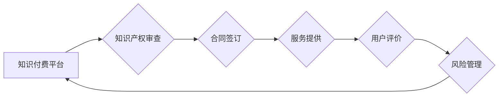

                 

## 知识付费的法律风险及规避

> 关键词：知识付费、版权、侵权、合同、隐私、数据安全、规避风险

### 1. 背景介绍

知识付费作为一种新型的商业模式，近年来在互联网时代蓬勃发展。它以知识、技能、经验等为核心产品，通过线上平台向用户提供付费学习服务。知识付费模式的兴起，为知识产权的传播和商业化提供了新的途径，同时也带来了新的法律风险。

随着知识付费市场的快速扩张，一些平台和创作者在运营过程中存在着版权侵权、合同纠纷、用户隐私泄露、数据安全等问题，引发了社会关注和法律争议。因此，深入了解知识付费的法律风险，并采取有效措施规避风险，对于平台、创作者和用户都至关重要。

### 2. 核心概念与联系

**2.1 知识付费的核心概念**

知识付费是指以知识、技能、经验等为核心产品，通过线上平台向用户提供付费学习服务的商业模式。

**2.2 知识付费与法律关系**

知识付费模式涉及到多个法律领域，包括：

* **知识产权法:** 知识付费平台和创作者在提供知识产品时，需要确保其知识产权合法，避免侵犯他人著作权、专利权等。
* **合同法:** 知识付费平台和用户之间签订的学习服务协议，需要明确双方权利义务，避免合同纠纷。
* **网络安全法:** 知识付费平台需要采取措施保护用户个人信息和数据安全，避免泄露和滥用。
* **消费者权益保护法:** 知识付费平台需要提供真实有效的服务，保障用户的合法权益。

**2.3 知识付费的法律风险**

* **版权侵权:** 未经授权使用他人的知识产权进行付费传播，构成侵权行为。
* **合同纠纷:** 平台和用户之间在服务内容、价格、退款等方面存在争议，导致合同纠纷。
* **用户隐私泄露:** 平台未采取有效措施保护用户个人信息，导致信息泄露。
* **数据安全问题:** 平台未采取有效措施保障用户数据安全，导致数据被篡改或泄露。
* **虚假宣传:** 平台或创作者虚假宣传知识产品内容或效果，误导用户。

**2.4 知识付费的法律规避**

* **加强知识产权保护:** 平台和创作者应确保其知识产权合法，并采取措施防止知识产权侵权。
* **规范合同关系:** 平台和用户之间应签订明确的学习服务协议，明确双方权利义务，避免合同纠纷。
* **加强用户隐私保护:** 平台应采取措施保护用户个人信息和数据安全，并遵守相关法律法规。
* **建立健全数据安全体系:** 平台应建立健全数据安全管理体系，保障用户数据安全。
* **规范营销行为:** 平台和创作者应规范营销行为，避免虚假宣传。

**2.5 Mermaid 流程图**



### 3. 核心算法原理 & 具体操作步骤

**3.1 算法原理概述**

知识付费平台的运营涉及到多个算法，例如推荐算法、内容审核算法、用户画像算法等。这些算法的原理和应用方式直接影响到平台的运营效果和用户体验。

**3.2 算法步骤详解**

* **推荐算法:** 基于用户的学习历史、兴趣偏好、行为数据等信息，推荐用户可能感兴趣的知识产品。
* **内容审核算法:** 利用自然语言处理、机器学习等技术，对知识产品内容进行审核，过滤违规内容，保障平台内容安全。
* **用户画像算法:** 通过分析用户的学习行为、社交关系、兴趣爱好等数据，构建用户的画像，以便平台提供更精准的个性化服务。

**3.3 算法优缺点**

* **推荐算法:** 优点是能够提高用户学习效率，增强用户粘性。缺点是可能存在推荐偏差，导致用户接受信息单一化。
* **内容审核算法:** 优点是能够有效过滤违规内容，保障平台内容安全。缺点是可能存在误判，导致优质内容被误删。
* **用户画像算法:** 优点是能够提供更精准的个性化服务，提升用户体验。缺点是可能存在隐私泄露风险，需要加强数据安全保护。

**3.4 算法应用领域**

* **教育培训:** 推荐学习资源、个性化学习路径、智能答疑等。
* **职业技能:** 推荐职业技能培训课程、职业发展规划、求职指导等。
* **兴趣爱好:** 推荐兴趣爱好课程、社群互动、线下活动等。

### 4. 数学模型和公式 & 详细讲解 & 举例说明

**4.1 数学模型构建**

知识付费平台的运营涉及到多个数学模型，例如用户行为预测模型、知识产品推荐模型、平台收益预测模型等。这些模型可以帮助平台更好地理解用户需求，优化运营策略，提高平台收益。

**4.2 公式推导过程**

例如，用户行为预测模型可以利用用户历史学习行为数据，构建一个基于贝叶斯定理的预测模型，预测用户未来学习行为。

**4.3 案例分析与讲解**

假设一个知识付费平台想要预测用户是否会购买某个知识产品。可以利用用户历史购买行为、学习时长、评价等数据，构建一个逻辑回归模型，预测用户购买概率。

**4.4 数学公式示例**

$$
P(购买|用户特征) = \frac{e^{w_0 + w_1 * 用户特征_1 + w_2 * 用户特征_2 + ...}}{1 + e^{w_0 + w_1 * 用户特征_1 + w_2 * 用户特征_2 + ...}}
$$

其中：

* $P(购买|用户特征)$: 用户购买知识产品的概率
* $w_0, w_1, w_2, ...$: 模型参数
* $用户特征_1, 用户特征_2, ...$: 用户的特征变量，例如年龄、性别、学习时长、评价等

### 5. 项目实践：代码实例和详细解释说明

**5.1 开发环境搭建**

* Python 3.x
* TensorFlow 或 PyTorch 等深度学习框架
* Jupyter Notebook 或 VS Code 等开发环境

**5.2 源代码详细实现**

```python
# 导入必要的库
import tensorflow as tf

# 定义模型结构
model = tf.keras.models.Sequential([
    tf.keras.layers.Dense(64, activation='relu', input_shape=(用户特征维度,)),
    tf.keras.layers.Dense(32, activation='relu'),
    tf.keras.layers.Dense(1, activation='sigmoid')
])

# 编译模型
model.compile(optimizer='adam',
              loss='binary_crossentropy',
              metrics=['accuracy'])

# 训练模型
model.fit(用户特征数据, 购买标签数据, epochs=10)

# 预测用户购买概率
预测结果 = model.predict(新的用户特征数据)
```

**5.3 代码解读与分析**

* 代码首先导入必要的库，然后定义一个简单的深度学习模型。
* 模型结构包括三个全连接层，第一层输入层维度为用户特征维度，最后一层输出层维度为1，激活函数为sigmoid，用于预测用户购买概率。
* 模型使用Adam优化器，损失函数为二分类交叉熵，评估指标为准确率。
* 训练模型需要用户特征数据和购买标签数据，训练完成后可以利用模型预测新的用户购买概率。

**5.4 运行结果展示**

训练完成后，可以将模型预测结果与实际购买情况进行比较，评估模型的预测准确率。

### 6. 实际应用场景

* **在线教育平台:** 推荐个性化学习课程、预测用户学习进度、评估用户学习效果。
* **职业技能培训平台:** 推荐职业技能培训课程、预测用户职业发展路径、评估用户职业技能水平。
* **兴趣爱好平台:** 推荐兴趣爱好课程、预测用户兴趣爱好发展趋势、评估用户兴趣爱好水平。

**6.4 未来应用展望**

随着人工智能技术的不断发展，知识付费平台将更加智能化、个性化、高效化。未来，知识付费平台将更加注重用户体验，提供更加精准的个性化服务，并与其他行业融合，拓展新的应用场景。

### 7. 工具和资源推荐

**7.1 学习资源推荐**

* **在线课程:** Coursera、edX、Udemy 等平台提供丰富的知识付费课程。
* **书籍:** 《深度学习》、《机器学习》、《自然语言处理》等书籍。
* **开源项目:** TensorFlow、PyTorch 等深度学习框架的开源项目。

**7.2 开发工具推荐**

* **Python:** 作为人工智能领域的编程语言，Python 拥有丰富的库和工具，适合开发知识付费平台。
* **Jupyter Notebook:** 用于编写和运行 Python 代码，并可视化数据分析结果。
* **VS Code:** 一款功能强大的代码编辑器，支持多种编程语言和插件。

**7.3 相关论文推荐**

* **推荐系统:** "Collaborative Filtering for Implicit Feedback Datasets"
* **内容审核:** "Deep Learning for Text Classification"
* **用户画像:** "User Profiling with Deep Learning"

### 8. 总结：未来发展趋势与挑战

**8.1 研究成果总结**

知识付费模式的快速发展，推动了人工智能技术在教育、培训、兴趣爱好等领域的应用。深度学习算法在推荐系统、内容审核、用户画像等方面取得了显著成果，为知识付费平台的运营提供了技术支撑。

**8.2 未来发展趋势**

* **更加智能化:** 利用人工智能技术，提供更加个性化、精准的学习服务。
* **更加多元化:** 拓展知识付费的应用场景，覆盖更多领域。
* **更加融合化:** 与其他行业融合，形成新的商业模式。

**8.3 面临的挑战**

* **数据安全:** 保护用户个人信息和数据安全，避免泄露和滥用。
* **算法偏见:** 避免算法产生偏见，导致用户体验不佳。
* **知识产权保护:** 确保知识产权合法，避免侵权纠纷。

**8.4 研究展望**

未来，知识付费平台需要更加注重用户体验，提供更加个性化、精准的学习服务。同时，需要加强数据安全保护，避免算法产生偏见，并积极探索新的知识付费模式，推动知识付费行业健康发展。

### 9. 附录：常见问题与解答

**9.1 如何避免知识付费平台的版权侵权风险？**

* 确保知识产权合法，拥有知识产权的授权。
* 对知识产品进行版权登记，建立证据链。
* 使用版权保护软件，防止知识产品被盗版。
* 积极维权，一旦发现侵权行为，及时采取法律措施。

**9.2 如何保护用户个人信息和数据安全？**

* 建立完善的数据安全管理体系，保障用户数据安全。
* 明确用户个人信息收集、使用、存储等规则，并获得用户同意。
* 加强数据加密和访问控制，防止数据泄露。
* 定期进行安全漏洞扫描和修复。

**9.3 如何避免知识付费平台的合同纠纷？**

* 签订明确的学习服务协议，明确双方权利义务。
* 规范服务内容、价格、退款等条款。
* 建立完善的售后服务机制，及时解决用户问题。
* 避免虚假宣传，确保服务内容真实有效。


作者：禅与计算机程序设计艺术 / Zen and the Art of Computer Programming 
<end_of_turn>

