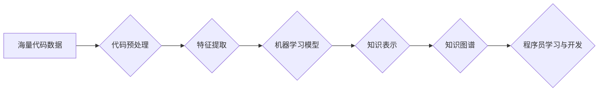

                 

## 知识发现引擎如何改变程序员的学习模式

> 关键词：知识发现引擎、程序员学习、代码理解、编程效率、机器学习、深度学习、知识图谱

## 1. 背景介绍

在当今软件开发领域，程序员面临着日益增长的学习压力。随着编程语言、框架和技术的不断演进，掌握新知识和技能变得更加紧迫。传统的学习模式，例如阅读书籍、观看视频和参加培训课程，虽然有效，但效率有限，难以满足快速迭代的开发需求。

知识发现引擎 (Knowledge Discovery Engine，简称 KDE) 作为一种新兴的技术，为程序员的学习模式带来了革命性的改变。KDE 利用机器学习和深度学习算法，从海量代码数据中挖掘知识，并将其以易于理解的方式呈现给程序员，从而加速学习过程，提升编程效率。

## 2. 核心概念与联系

### 2.1  知识发现引擎 (KDE)

KDE 是指能够从海量数据中自动发现隐藏的知识和模式的系统。在软件开发领域，KDE 主要用于分析和理解代码，并从中提取有价值的信息，例如代码结构、功能模块、依赖关系、常见错误模式等。

### 2.2  代码理解

代码理解是指计算机能够理解和解释人类编写的代码，并从中提取语义信息的过程。KDE 通过分析代码语法、语义和上下文，实现对代码的理解。

### 2.3  知识图谱

知识图谱 (Knowledge Graph，简称 KG) 是以节点和边表示知识的图结构。KDE 可以将代码理解的结果构建成知识图谱，以便程序员更直观地理解代码结构和关系。

**Mermaid 流程图**



## 3. 核心算法原理 & 具体操作步骤

### 3.1  算法原理概述

KDE 的核心算法主要包括：

* **自然语言处理 (NLP)**：用于分析代码的文本结构和语义。
* **机器学习 (ML)**：用于从代码数据中学习模式和关系。
* **深度学习 (DL)**：用于构建更复杂的代码理解模型。

### 3.2  算法步骤详解

1. **代码预处理**: 将原始代码转换为机器可理解的格式，例如去除注释、空格和换行符。
2. **特征提取**: 从预处理后的代码中提取特征，例如语法结构、变量类型、函数调用等。
3. **模型训练**: 使用机器学习或深度学习算法，将提取的特征与代码的语义信息进行关联，训练代码理解模型。
4. **知识表示**: 将训练好的模型应用于新的代码数据，提取代码的知识表示，例如代码结构、功能模块、依赖关系等。
5. **知识图谱构建**: 将提取的知识表示构建成知识图谱，以便程序员更直观地理解代码结构和关系。

### 3.3  算法优缺点

**优点**:

* 自动化代码理解，提高效率。
* 从海量代码中发现隐藏的知识。
* 提供个性化的学习建议。

**缺点**:

* 需要大量的训练数据。
* 模型训练复杂，需要专业知识。
* 对于代码的复杂性和语义理解仍存在挑战。

### 3.4  算法应用领域

* **代码搜索**: 基于知识图谱的代码搜索，可以更准确地找到相关代码片段。
* **代码推荐**: 根据程序员的编程习惯和需求，推荐相关的代码片段或库。
* **代码自动完成**: 根据上下文信息，自动完成代码的编写。
* **代码缺陷检测**: 识别代码中的潜在缺陷和错误。
* **代码重构**: 根据代码结构和语义，建议代码的重构方案。

## 4. 数学模型和公式 & 详细讲解 & 举例说明

### 4.1  数学模型构建

KDE 的数学模型通常基于图论和机器学习算法。

* **图论**: 用于表示代码的结构和关系，例如代码节点代表代码元素，边代表代码元素之间的关系。
* **机器学习**: 用于学习代码的语义信息和模式，例如使用深度神经网络对代码进行编码和解码。

### 4.2  公式推导过程

KDE 的公式推导过程涉及到机器学习算法的训练过程，例如：

* **损失函数**: 用于衡量模型预测结果与真实值的差异。
* **优化算法**: 用于更新模型参数，使得损失函数最小化。

例如，在训练一个代码生成模型时，可以使用交叉熵损失函数来衡量模型预测结果与真实代码之间的差异。

$$
Loss = -\sum_{i=1}^{N} y_i \log(p_i)
$$

其中：

* $N$ 是代码长度。
* $y_i$ 是真实代码的第 $i$ 个字符的 one-hot 编码。
* $p_i$ 是模型预测代码的第 $i$ 个字符的概率分布。

### 4.3  案例分析与讲解

可以以一个具体的案例分析 KDE 的应用，例如：

* 使用 KDE 分析一个开源软件项目的代码，并构建知识图谱，以便程序员更快速地理解软件的结构和功能。
* 使用 KDE 训练一个代码自动完成模型，可以根据程序员的输入代码片段，自动完成后续代码的编写。

## 5. 项目实践：代码实例和详细解释说明

### 5.1  开发环境搭建

* **操作系统**: Linux 或 macOS
* **编程语言**: Python
* **深度学习框架**: TensorFlow 或 PyTorch
* **代码库**: GitHub 或 GitLab

### 5.2  源代码详细实现

由于篇幅限制，这里只提供一个简单的代码示例，展示 KDE 的基本原理。

```python
import nltk
from nltk.tokenize import word_tokenize

# 代码预处理
def preprocess_code(code):
  tokens = word_tokenize(code)
  # 去除注释、空格和换行符等
  return tokens

# 特征提取
def extract_features(tokens):
  # 提取语法结构、变量类型、函数调用等特征
  return features

# 模型训练
# 使用机器学习或深度学习算法训练代码理解模型
model = train_model(features)

# 代码理解
def understand_code(code):
  tokens = preprocess_code(code)
  features = extract_features(tokens)
  # 使用训练好的模型进行代码理解
  understanding = model.predict(features)
  return understanding
```

### 5.3  代码解读与分析

* `preprocess_code()` 函数用于预处理代码，去除不必要的字符。
* `extract_features()` 函数用于提取代码的特征。
* `train_model()` 函数用于训练代码理解模型。
* `understand_code()` 函数用于使用训练好的模型理解代码。

### 5.4  运行结果展示

运行结果将展示代码的理解结果，例如代码的功能、结构、依赖关系等。

## 6. 实际应用场景

### 6.1  代码搜索

KDE 可以构建代码知识图谱，实现基于语义的代码搜索。例如，程序员可以搜索“处理用户登录的代码”，KDE 可以根据代码的功能和语义，找到相关的代码片段。

### 6.2  代码推荐

KDE 可以根据程序员的编程习惯和需求，推荐相关的代码片段或库。例如，程序员正在开发一个 web 应用，KDE 可以推荐相关的 web 框架和组件。

### 6.3  代码自动完成

KDE 可以根据上下文信息，自动完成代码的编写。例如，程序员输入了 “for i in range(10):”，KDE 可以自动完成 “print(i)” 。

### 6.4  未来应用展望

KDE 的应用场景还在不断扩展，未来可能应用于：

* 代码缺陷检测
* 代码重构
* 代码生成
* 代码翻译
* 代码安全分析

## 7. 工具和资源推荐

### 7.1  学习资源推荐

* **书籍**:
    * "Deep Learning for Coders with fastai and PyTorch" by Jeremy Howard and Sylvain Gugger
    * "Hands-On Machine Learning with Scikit-Learn, Keras & TensorFlow" by Aurélien Géron
* **在线课程**:
    * Coursera: "Deep Learning Specialization" by Andrew Ng
    * Udacity: "Deep Learning Nanodegree"
* **博客**:
    * Towards Data Science
    * Machine Learning Mastery

### 7.2  开发工具推荐

* **代码编辑器**: VS Code, Atom, Sublime Text
* **深度学习框架**: TensorFlow, PyTorch
* **代码库**: GitHub, GitLab

### 7.3  相关论文推荐

* "CodeBERT: A Pre-trained Language Model for Code"
* "GraphCode: A Graph Neural Network for Code Understanding"
* "Code2Vec: Learning Distributed Representations of Code"

## 8. 总结：未来发展趋势与挑战

### 8.1  研究成果总结

KDE 作为一种新兴技术，取得了显著的成果，例如：

* 自动化代码理解，提高编程效率。
* 从海量代码中发现隐藏的知识。
* 提供个性化的学习建议。

### 8.2  未来发展趋势

KDE 的未来发展趋势包括：

* 更准确的代码理解，能够理解更复杂的代码。
* 更个性化的学习建议，根据程序员的学习风格和需求提供定制化的学习方案。
* 更广泛的应用场景，例如代码生成、代码翻译、代码安全分析等。

### 8.3  面临的挑战

KDE 还面临着一些挑战，例如：

* 需要大量的训练数据。
* 模型训练复杂，需要专业知识。
* 对于代码的复杂性和语义理解仍存在挑战。

### 8.4  研究展望

未来，KDE 的研究将继续深入，例如：

* 开发更强大的代码理解模型。
* 探索新的代码表示方法。
* 将 KDE 与其他人工智能技术结合，例如自然语言生成、机器翻译等。

## 9. 附录：常见问题与解答

* **Q: KDE 是否可以替代程序员？**

A: KDE 无法替代程序员，它只是帮助程序员更高效地学习和开发代码。程序员仍然需要具备创造力和解决问题的能力。

* **Q: KDE 的训练数据来源？**

A: KDE 的训练数据可以来自开源代码库、商业代码库、代码论坛等。

* **Q: 如何使用 KDE？**

A: 可以使用现有的 KDE 工具或平台，也可以根据自己的需求开发定制化的 KDE 系统。

作者：禅与计算机程序设计艺术 / Zen and the Art of Computer Programming 


<end_of_turn>

