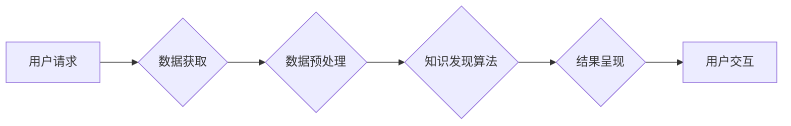

                 

## 知识发现引擎的前端技术选型与实现

> 关键词：知识发现引擎、前端技术、用户界面、交互设计、数据可视化、React、Vue、Angular、D3.js、Chart.js

### 1. 背景介绍

知识发现引擎 (Knowledge Discovery Engine, KDE) 旨在从海量数据中挖掘隐藏的知识和模式，为用户提供洞察力和决策支持。随着数据量的爆炸式增长，KDE 的应用场景日益广泛，涵盖商业分析、科学研究、医疗诊断等领域。

前端技术作为 KDE 的重要组成部分，直接影响着用户体验和知识发现效率。一个优秀的 KDE 前端需要具备以下特点：

* **易用性:** 用户无需专业技术背景即可轻松使用。
* **交互性:** 提供丰富的交互方式，方便用户探索和分析数据。
* **可视化:** 将复杂的数据以直观易懂的方式呈现，帮助用户理解知识发现结果。
* **可扩展性:** 可以根据不同的应用场景和数据类型进行定制和扩展。

### 2. 核心概念与联系

KDE 前端技术主要涉及以下核心概念：

* **用户界面 (UI):**  KDE 前端的视觉呈现，包括布局、导航、按钮等元素。
* **交互设计 (UX):**  用户与 KDE 前端交互的方式和体验，包括用户流程、反馈机制、错误提示等。
* **数据可视化 (Data Visualization):** 将数据以图形、图表等形式呈现，帮助用户理解数据趋势和模式。

**Mermaid 流程图:**



### 3. 核心算法原理 & 具体操作步骤

#### 3.1  算法原理概述

KDE 中常用的知识发现算法包括：

* **关联规则挖掘:**  发现数据集中频繁出现的项集之间的关联关系。
* **聚类分析:** 将数据点根据相似性进行分组。
* **分类预测:** 根据已知数据类别预测新数据的类别。
* **异常检测:**  识别数据集中与众不同的数据点。

#### 3.2  算法步骤详解

以关联规则挖掘为例，其基本步骤如下：

1. **数据预处理:**  清洗、转换和格式化数据，使其适合算法处理。
2. **频繁项集挖掘:**  找出数据集中频繁出现的项集。
3. **关联规则生成:**  根据频繁项集生成关联规则，并计算其支持度和置信度。
4. **规则筛选:**  根据预设的阈值筛选出满足条件的关联规则。

#### 3.3  算法优缺点

**关联规则挖掘算法:**

* **优点:**  能够发现数据中隐藏的关联关系，提供对业务的洞察。
* **缺点:**  对数据量要求较高，计算复杂度高。

#### 3.4  算法应用领域

关联规则挖掘算法广泛应用于：

* **市场营销:**  发现客户购买行为的关联关系，进行精准营销。
* **推荐系统:**  根据用户的历史行为推荐相关商品或服务。
* **医疗诊断:**  发现疾病的潜在关联因素，辅助诊断。

### 4. 数学模型和公式 & 详细讲解 & 举例说明

#### 4.1  数学模型构建

关联规则挖掘算法的核心是频繁项集挖掘，其数学模型可以描述为：

* **支持度 (Support):**  一个项集在数据集中的出现频率。
* **置信度 (Confidence):**  在给定一个项集的前提下，另一个项集出现的概率。

#### 4.2  公式推导过程

* **支持度公式:**

$$
Support(I) = \frac{Number of transactions containing I}{Total number of transactions}
$$

* **置信度公式:**

$$
Confidence(I \rightarrow J) = \frac{Support(I \cup J)}{Support(I)}
$$

其中：

* I 和 J 是两个项集。
* I ∪ J 表示 I 和 J 的并集。

#### 4.3  案例分析与讲解

假设我们有一个包含购物记录的数据集，其中包含以下项集：

* {牛奶, 面包}
* {牛奶, 鸡蛋}
* {面包, 鸡蛋}
* {牛奶, 面包, 鸡蛋}

我们可以计算以下关联规则的支持度和置信度：

* **规则:** {牛奶} → {面包}
* **支持度:** 3/4 = 0.75
* **置信度:** 3/3 = 1

* **规则:** {牛奶} → {鸡蛋}
* **支持度:** 2/4 = 0.5
* **置信度:** 2/3 = 0.67

### 5. 项目实践：代码实例和详细解释说明

#### 5.1  开发环境搭建

* **操作系统:**  Windows, macOS, Linux
* **编程语言:**  Python
* **开发工具:**  VS Code, Atom, Sublime Text
* **库和框架:**  React, Vue, Angular, D3.js, Chart.js

#### 5.2  源代码详细实现

以下是一个使用 React 实现 KDE 前端的简单代码示例：

```jsx
import React, { useState, useEffect } from 'react';

function App() {
  const [data, setData] = useState([]);

  useEffect(() => {
    // 从后端获取数据
    fetch('/api/data')
      .then(response => response.json())
      .then(data => setData(data));
  }, []);

  return (
    <div>
      <h1>知识发现引擎</h1>
      <div>
        {/* 数据可视化组件 */}
        <Chart data={data} />
      </div>
    </div>
  );
}

export default App;
```

#### 5.3  代码解读与分析

* **useState 和 useEffect:**  React Hooks 用于管理组件的状态和副作用。
* **fetch:**  用于从后端获取数据。
* **Chart:**  自定义数据可视化组件，可以根据需要使用 D3.js 或 Chart.js 等库实现。

#### 5.4  运行结果展示

运行上述代码后，将显示一个包含数据可视化组件的页面。

### 6. 实际应用场景

KDE 前端技术在以下场景中具有广泛的应用：

* **商业智能:**  分析销售数据、客户行为、市场趋势等，为决策提供支持。
* **科学研究:**  挖掘生物信息、天文数据、气候数据等，发现新的科学规律。
* **医疗诊断:**  分析患者病历、检查结果等，辅助医生进行诊断和治疗。

### 6.4  未来应用展望

随着人工智能和数据分析技术的不断发展，KDE 前端技术将朝着以下方向发展：

* **更智能的交互:**  利用自然语言处理和机器学习技术，实现更智能的交互方式。
* **更丰富的可视化:**  开发更先进的数据可视化技术，将复杂的数据以更直观的方式呈现。
* **更个性化的体验:**  根据用户的需求和偏好，提供个性化的知识发现体验。

### 7. 工具和资源推荐

#### 7.1  学习资源推荐

* **书籍:**  《数据挖掘：概念与技术》
* **在线课程:**  Coursera, edX, Udemy

#### 7.2  开发工具推荐

* **前端框架:**  React, Vue, Angular
* **数据可视化库:**  D3.js, Chart.js
* **数据分析工具:**  Python (Pandas, Scikit-learn), R

#### 7.3  相关论文推荐

* **关联规则挖掘:**  Agrawal, R., Imielinski, T., & Swami, A. (1993). Mining association rules between sets of items in large databases.
* **聚类分析:**  Jain, A. K. (2010). Data clustering: 50 years beyond K-means.

### 8. 总结：未来发展趋势与挑战

#### 8.1  研究成果总结

KDE 前端技术的发展取得了显著成果，为用户提供了更便捷、更直观、更智能的知识发现体验。

#### 8.2  未来发展趋势

KDE 前端技术将朝着更智能、更个性化、更可扩展的方向发展。

#### 8.3  面临的挑战

* **数据规模和复杂度:**  随着数据量的爆炸式增长，KDE 前端需要处理越来越大、越来越复杂的的数据。
* **交互体验:**  如何设计更直观、更易用的交互方式，帮助用户更有效地探索和分析数据。
* **可解释性:**  如何解释和展示知识发现结果，使其更易于理解和应用。

#### 8.4  研究展望

未来研究将重点关注以下几个方面：

* **开发更强大的数据分析算法:**  提高知识发现效率和准确性。
* **设计更智能的交互方式:**  利用人工智能技术，实现更自然、更人性化的交互体验。
* **提升知识发现结果的可解释性:**  帮助用户更好地理解和应用知识发现结果。

### 9. 附录：常见问题与解答

* **Q1: KDE 前端技术有哪些主流的选择？**

* **A1:** React, Vue, Angular 等前端框架是常用的选择。

* **Q2: 如何选择合适的 KDE 前端技术？**

* **A2:** 需要根据具体应用场景、数据类型、用户需求等因素进行选择。

* **Q3: KDE 前端技术有哪些发展趋势？**

* **A3:** 智能交互、丰富可视化、个性化体验等是未来发展趋势。


作者：禅与计算机程序设计艺术 / Zen and the Art of Computer Programming 
<end_of_turn>

