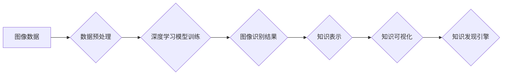

                 

## 知识发现引擎的图像识别技术应用

> 关键词：图像识别、知识发现引擎、深度学习、计算机视觉、人工智能、数据挖掘、机器学习、图像分类

## 1. 背景介绍

随着互联网和物联网的快速发展，海量图像数据正在以指数级增长。如何有效地从这些图像数据中提取有价值的知识，并将其应用于实际场景，成为一个重要的研究课题。知识发现引擎（Knowledge Discovery Engine，KDE）作为一种能够从数据中发现隐藏模式和规律的系统，在图像数据分析领域展现出巨大的潜力。

传统的图像识别技术主要依赖于人工特征工程，需要专家对图像进行手动标注和特征提取，效率低且难以处理复杂场景。而深度学习技术的出现，为图像识别带来了革命性的变革。深度学习模型能够自动学习图像特征，并实现更准确、更鲁棒的识别效果。

将深度学习技术与知识发现引擎相结合，可以构建一个更智能、更全面的图像数据分析系统。这种系统能够自动识别图像中的物体、场景、事件等，并将其转化为可理解的知识，为用户提供更深入的洞察和决策支持。

## 2. 核心概念与联系

### 2.1 知识发现引擎（KDE）

知识发现引擎是一种能够从海量数据中自动发现隐藏模式、规律和知识的系统。它通常由数据预处理、数据挖掘、知识表示和知识可视化等多个模块组成。

* **数据预处理:** 对原始数据进行清洗、转换和格式化，使其适合后续的挖掘分析。
* **数据挖掘:** 使用各种算法和技术，从数据中发现模式、关联、分类和聚类等知识。
* **知识表示:** 将发现的知识以结构化形式表示，例如知识图谱、规则等。
* **知识可视化:** 将知识以直观易懂的方式呈现，帮助用户理解和分析。

### 2.2 图像识别

图像识别是指计算机能够理解和解释图像内容的技术。它包括图像分类、目标检测、图像分割等多个子任务。

* **图像分类:** 将图像归类到预定义的类别中，例如猫、狗、车等。
* **目标检测:** 在图像中识别和定位特定目标，例如人、车、树等。
* **图像分割:** 将图像划分为不同的区域，每个区域代表不同的物体或场景。

### 2.3 深度学习

深度学习是一种机器学习的子领域，它使用多层神经网络来模拟人类大脑的学习过程。深度学习模型能够自动学习图像特征，并实现更准确、更鲁棒的识别效果。

**核心概念与联系流程图:**



## 3. 核心算法原理 & 具体操作步骤

### 3.1 算法原理概述

图像识别算法的核心是学习图像特征。深度学习模型通过多层神经网络，从图像数据中自动学习到不同层次的特征，最终实现对图像的理解和识别。常见的深度学习图像识别算法包括卷积神经网络（CNN）、循环神经网络（RNN）和生成对抗网络（GAN）。

* **卷积神经网络（CNN）:** CNN 是一种专门设计用于处理图像数据的深度学习模型。它利用卷积操作和池化操作来提取图像特征，并通过全连接层进行分类或识别。
* **循环神经网络（RNN）:** RNN 是一种能够处理序列数据的深度学习模型。它可以用于图像识别任务，例如视频分析和图像 Captioning。
* **生成对抗网络（GAN）:** GAN 是一种由两个神经网络组成的模型，一个生成器网络负责生成图像，另一个判别器网络负责判断图像的真实性。GAN 可以用于图像生成、图像修复和图像风格迁移等任务。

### 3.2 算法步骤详解

**以 CNN 为例，图像识别算法的具体操作步骤如下：**

1. **数据预处理:** 对图像数据进行尺寸调整、归一化和数据增强等操作，使其适合 CNN 模型的训练。
2. **模型构建:** 根据任务需求，选择合适的 CNN 架构，并定义模型的层数、卷积核大小、激活函数等参数。
3. **模型训练:** 使用训练数据训练 CNN 模型，通过反向传播算法调整模型参数，使模型能够准确识别图像。
4. **模型评估:** 使用测试数据评估模型的性能，例如准确率、召回率和 F1-score 等指标。
5. **模型部署:** 将训练好的模型部署到实际应用场景中，例如图像分类系统、目标检测系统等。

### 3.3 算法优缺点

**CNN 算法的优缺点:**

* **优点:**

    * 能够自动学习图像特征，无需人工特征工程。
    * 识别精度高，能够处理复杂图像场景。
    * 适用范围广，可以应用于多种图像识别任务。

* **缺点:**

    * 训练数据量大，需要大量的 labeled 数据。
    * 计算量大，训练时间长。
    * 对数据噪声敏感，容易受到图像模糊、光照变化等因素的影响。

### 3.4 算法应用领域

CNN 算法在图像识别领域有着广泛的应用，例如：

* **人脸识别:** 用于身份验证、人脸搜索和人脸跟踪等应用。
* **物体检测:** 用于自动驾驶、安防监控和机器人视觉等应用。
* **图像分类:** 用于医疗图像诊断、产品识别和内容推荐等应用。
* **图像分割:** 用于医学图像分析、卫星图像分析和自动驾驶地图构建等应用。

## 4. 数学模型和公式 & 详细讲解 & 举例说明

### 4.1 数学模型构建

CNN 算法的核心是卷积操作和池化操作。卷积操作通过卷积核对图像进行滑动计算，提取图像局部特征。池化操作则对卷积后的特征图进行降维，减少计算量并提高模型鲁棒性。

**卷积操作公式:**

$$
y(i,j) = \sum_{m=0}^{M-1} \sum_{n=0}^{N-1} x(i+m,j+n) * w(m,n)
$$

其中：

* $y(i,j)$ 是卷积结果的像素值。
* $x(i+m,j+n)$ 是输入图像的像素值。
* $w(m,n)$ 是卷积核的权重值。
* $M$ 和 $N$ 是卷积核的大小。

**池化操作公式:**

$$
y(i,j) = \max_{m=i*s}^{i*s+s-1} \max_{n=j*s}^{j*s+s-1} x(m,n)
$$

其中：

* $y(i,j)$ 是池化结果的像素值。
* $x(m,n)$ 是输入特征图的像素值。
* $s$ 是池化窗口的大小。

### 4.2 公式推导过程

卷积操作的公式推导过程可以参考相关机器学习教材。

池化操作的公式推导过程可以参考相关计算机视觉教材。

### 4.3 案例分析与讲解

**举例说明:**

假设我们有一个 3x3 的图像，以及一个 2x2 的卷积核。

卷积操作会将卷积核滑动到图像上，每个位置进行卷积计算，得到一个新的特征图。

池化操作会将特征图划分为多个区域，每个区域取最大值作为该区域的输出值。

## 5. 项目实践：代码实例和详细解释说明

### 5.1 开发环境搭建

* **操作系统:** Ubuntu 18.04
* **编程语言:** Python 3.6
* **深度学习框架:** TensorFlow 2.0
* **其他工具:** Jupyter Notebook、Git

### 5.2 源代码详细实现

```python
import tensorflow as tf

# 定义 CNN 模型
model = tf.keras.models.Sequential([
    tf.keras.layers.Conv2D(32, (3, 3), activation='relu', input_shape=(28, 28, 1)),
    tf.keras.layers.MaxPooling2D((2, 2)),
    tf.keras.layers.Conv2D(64, (3, 3), activation='relu'),
    tf.keras.layers.MaxPooling2D((2, 2)),
    tf.keras.layers.Flatten(),
    tf.keras.layers.Dense(10, activation='softmax')
])

# 编译模型
model.compile(optimizer='adam',
              loss='sparse_categorical_crossentropy',
              metrics=['accuracy'])

# 训练模型
model.fit(x_train, y_train, epochs=5)

# 评估模型
loss, accuracy = model.evaluate(x_test, y_test)
print('Test loss:', loss)
print('Test accuracy:', accuracy)
```

### 5.3 代码解读与分析

* **模型定义:** 使用 TensorFlow 的 Keras API 定义了一个简单的 CNN 模型。模型包含两个卷积层、两个最大池化层、一个 Flatten 层和一个全连接层。
* **模型编译:** 使用 Adam 优化器、交叉熵损失函数和准确率指标编译模型。
* **模型训练:** 使用训练数据训练模型，训练 5 个 epochs。
* **模型评估:** 使用测试数据评估模型的性能，打印测试损失和准确率。

### 5.4 运行结果展示

训练完成后，可以将模型保存并部署到实际应用场景中。

## 6. 实际应用场景

### 6.1 图像分类

* **医疗图像诊断:** 使用 CNN 模型对 X 光片、CT 扫描和 MRI 图像进行分类，辅助医生诊断疾病。
* **产品识别:** 使用 CNN 模型识别商品图像，用于电商平台的商品搜索和推荐。
* **内容推荐:** 使用 CNN 模型识别图像内容，推荐相关内容给用户。

### 6.2 目标检测

* **自动驾驶:** 使用 CNN 模型检测道路上的车辆、行人、交通信号灯等目标，辅助自动驾驶系统决策。
* **安防监控:** 使用 CNN 模型检测监控视频中的异常行为，例如入侵、盗窃等。
* **机器人视觉:** 使用 CNN 模型帮助机器人识别周围环境中的目标，例如障碍物、物体等。

### 6.3 图像分割

* **医学图像分析:** 使用 CNN 模型分割医学图像中的器官、组织和肿瘤等区域，辅助医生进行诊断和治疗。
* **卫星图像分析:** 使用 CNN 模型分割卫星图像中的土地类型、植被覆盖率等区域，用于农业监测、环境保护等应用。
* **自动驾驶地图构建:** 使用 CNN 模型分割道路、车道、行人等区域，构建自动驾驶地图。

### 6.4 未来应用展望

随着深度学习技术的不断发展，图像识别技术将应用于更多领域，例如：

* **虚拟现实和增强现实:** 使用图像识别技术增强虚拟现实和增强现实体验。
* **智能家居:** 使用图像识别技术控制智能家居设备，例如灯光、空调等。
* **个性化教育:** 使用图像识别技术为学生提供个性化的学习体验。

## 7. 工具和资源推荐

### 7.1 学习资源推荐

* **书籍:**

    * 深度学习 (Deep Learning) - Ian Goodfellow, Yoshua Bengio, Aaron Courville
    * 计算机视觉:算法与应用 (Computer Vision: Algorithms and Applications) - Richard Szeliski

* **在线课程:**

    * Coursera: 深度学习 Specialization
    * Udacity: 计算机视觉 Nanodegree

### 7.2 开发工具推荐

* **深度学习框架:** TensorFlow, PyTorch, Keras
* **图像处理库:** OpenCV, Pillow
* **数据可视化工具:** Matplotlib, Seaborn

### 7.3 相关论文推荐

* **AlexNet:** ImageNet Classification with Deep Convolutional Neural Networks
* **VGGNet:** Very Deep Convolutional Networks for Large-Scale Image Recognition
* **ResNet:** Deep Residual Learning for Image Recognition

## 8. 总结：未来发展趋势与挑战

### 8.1 研究成果总结

近年来，深度学习技术在图像识别领域取得了显著进展，模型精度大幅提升，应用场景不断扩展。

### 8.2 未来发展趋势

* **模型更深更广:** 研究更深层次、更广范围的 CNN 模型，提高模型的识别能力和泛化能力。
* **迁移学习:** 利用预训练模型进行迁移学习，降低模型训练成本和数据需求。
* **解释性 AI:** 研究图像识别模型的解释性，帮助用户理解模型的决策过程。
* **边缘计算:** 将图像识别模型部署到边缘设备，实现实时、低延迟的图像识别。

### 8.3 面临的挑战

* **数据标注:** 深度学习模型需要大量的 labeled 数据进行训练，数据标注成本高且耗时。
* **模型可解释性:** 深度学习模型的决策过程难以理解，缺乏可解释性。
* **模型安全性:** 深度学习模型容易受到攻击，需要提高模型的安全性。

### 8.4 研究展望

未来，图像识别技术将继续朝着更智能、更安全、更可解释的方向发展，并应用于更多领域，为人类社会带来更多便利和福祉。

## 9. 附录：常见问题与解答

**Q1: 如何选择合适的 CNN 模型架构？**

**A1:** 选择合适的 CNN 模型架构取决于具体的应用场景和数据特点。

* **图像分类:** 可以使用 AlexNet, VGGNet, ResNet 等经典架构。
* **目标检测:** 可以使用 YOLO, SSD, Faster R-CNN 等目标检测架构。
* **图像分割:** 可以使用 U-Net, SegNet, DeepLab 等图像分割架构。

**Q2: 如何解决数据标注问题？**

**A2:** 可以采用以下方法解决数据标注问题:

* **人工标注:** 由人工标注员对数据进行标注。
* **自动标注:** 使用自动标注工具对数据进行标注。
* **数据增强:** 使用数据增强技术增加训练数据的数量和多样性。

**Q3: 如何提高模型的安全性？**

**A3:** 可以采用以下方法提高模型的安全性:

* **对抗训练:** 使用对抗样本训练模型，提高模型对攻击的鲁棒性。
* **模型剪枝:** 移除模型中的冗余参数，降低模型的复杂度和攻击面。
* **联邦学习:** 将模型训练分散到多个设备上，保护数据隐私。


作者：禅与计算机程序设计艺术 / Zen and the Art of Computer Programming<end_of_turn>

