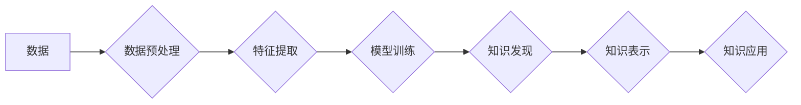

                 

## 知识发现引擎：开启人类知识新篇章

> 关键词：知识发现、机器学习、深度学习、数据挖掘、自然语言处理、知识图谱、人工智能

### 1. 背景介绍

人类文明的进步离不开对知识的不断发现和积累。从古至今，人类一直在探索如何更有效地获取、组织和利用知识。随着信息时代的到来，海量数据涌现，传统的知识发现方法显得力不从心。如何从海量数据中挖掘出有价值的知识，并将其转化为可利用的洞察力，成为当今人工智能领域的一项重要课题。

知识发现引擎 (Knowledge Discovery Engine，简称 KDE) 正是应运而生以应对这一挑战的智能系统。它通过结合机器学习、深度学习、数据挖掘、自然语言处理等技术，从海量数据中自动发现隐藏的模式、趋势和关系，并将其以可理解的形式呈现给用户。KDE 的出现，标志着人类知识发现进入了一个全新的时代，将极大地推动人类对知识的理解和应用。

### 2. 核心概念与联系

#### 2.1  知识发现

知识发现是指从数据中提取、识别和解释有价值、可解释的知识的过程。它是一个跨学科的领域，涉及到计算机科学、统计学、人工智能、数据库等多个领域。

#### 2.2  数据挖掘

数据挖掘是知识发现的重要组成部分，它利用统计学、机器学习等方法，从海量数据中发现隐藏的模式和规律。数据挖掘技术包括分类、聚类、关联规则挖掘、异常检测等。

#### 2.3  机器学习

机器学习是人工智能的重要分支，它通过训练模型，使机器能够从数据中学习，并对新的数据进行预测或分类。机器学习算法包括监督学习、无监督学习和强化学习等。

#### 2.4  深度学习

深度学习是机器学习的一种高级形式，它利用多层神经网络来模拟人类大脑的学习过程。深度学习算法在图像识别、自然语言处理等领域取得了突破性的进展。

#### 2.5  知识图谱

知识图谱是一种结构化的知识表示形式，它将实体和关系以图的形式表示，可以有效地存储和组织知识。知识图谱可以帮助KDE更好地理解和推理知识。

**Mermaid 流程图**



### 3. 核心算法原理 & 具体操作步骤

#### 3.1  算法原理概述

KDE 的核心算法原理是基于机器学习和深度学习的知识发现方法。这些方法可以分为以下几类：

* **监督学习:** 利用标记数据训练模型，用于预测或分类新的数据。
* **无监督学习:** 从未标记的数据中发现隐藏的模式和结构。
* **半监督学习:** 利用少量标记数据和大量未标记数据训练模型。
* **强化学习:** 通过奖励和惩罚机制训练模型，使其在特定环境中做出最优决策。

#### 3.2  算法步骤详解

KDE 的具体操作步骤如下：

1. **数据收集和预处理:** 收集相关数据，并进行清洗、转换、格式化等预处理操作，以确保数据质量和模型训练的有效性。
2. **特征提取:** 从原始数据中提取有价值的特征，这些特征可以是文本、图像、音频等多种形式。
3. **模型训练:** 选择合适的机器学习或深度学习算法，并利用训练数据训练模型。
4. **知识发现:** 利用训练好的模型对新的数据进行分析，发现隐藏的模式、趋势和关系。
5. **知识表示:** 将发现的知识以可理解的形式表示，例如知识图谱、规则等。
6. **知识应用:** 将发现的知识应用于实际问题，例如决策支持、预测分析、个性化推荐等。

#### 3.3  算法优缺点

**优点:**

* 自动化知识发现: KDE 可以自动从海量数据中发现知识，减轻人工负担。
* 发现隐藏模式: KDE 可以发现人类难以察觉的隐藏模式和关系。
* 提高效率: KDE 可以快速高效地处理海量数据，提高知识发现效率。

**缺点:**

* 数据依赖: KDE 的性能取决于数据的质量和数量。
* 算法选择: 选择合适的算法对于知识发现效果至关重要。
* 解释性: 一些深度学习算法的决策过程难以解释。

#### 3.4  算法应用领域

KDE 的应用领域非常广泛，包括：

* **科学研究:** 从实验数据中发现新的科学规律。
* **商业分析:** 从市场数据中发现客户行为模式，进行精准营销。
* **医疗诊断:** 从患者数据中发现疾病诊断线索。
* **金融风险管理:** 从金融数据中发现潜在的风险。
* **教育教学:** 从学生数据中发现学习规律，个性化教学。

### 4. 数学模型和公式 & 详细讲解 & 举例说明

#### 4.1  数学模型构建

KDE 的数学模型通常基于统计学和概率论。常用的模型包括：

* **贝叶斯网络:** 用于表示概率关系，可以进行推理和预测。
* **隐马尔可夫模型:** 用于处理序列数据，例如文本和语音。
* **支持向量机:** 用于分类和回归问题。
* **深度神经网络:** 用于处理复杂数据，例如图像和文本。

#### 4.2  公式推导过程

例如，贝叶斯网络中的概率计算公式为：

$$P(A|B) = \frac{P(B|A)P(A)}{P(B)}$$

其中：

* $P(A|B)$ 是在已知 B 为真的情况下 A 为真的概率。
* $P(B|A)$ 是在已知 A 为真的情况下 B 为真的概率。
* $P(A)$ 是 A 为真的概率。
* $P(B)$ 是 B 为真的概率。

#### 4.3  案例分析与讲解

假设我们有一个贝叶斯网络，用于预测明天是否下雨。网络中包含两个节点：

* $A$: 今天是否下雨。
* $B$: 明天是否下雨。

我们知道：

* $P(A) = 0.3$ (今天下雨的概率)
* $P(B|A) = 0.8$ (如果今天下雨，明天下雨的概率)
* $P(B|\overline{A}) = 0.2$ (如果今天不下雨，明天下雨的概率)

根据贝叶斯公式，我们可以计算出明天下雨的概率：

$$P(B) = P(B|A)P(A) + P(B|\overline{A})P(\overline{A})$$

$$P(B) = (0.8 \times 0.3) + (0.2 \times 0.7) = 0.38$$

因此，明天下雨的概率为 38%。

### 5. 项目实践：代码实例和详细解释说明

#### 5.1  开发环境搭建

KDE 的开发环境通常包括：

* **操作系统:** Linux、Windows 或 macOS。
* **编程语言:** Python、Java 或 C++。
* **机器学习库:** scikit-learn、TensorFlow 或 PyTorch。
* **数据库:** MySQL、PostgreSQL 或 MongoDB。

#### 5.2  源代码详细实现

以下是一个简单的 Python 代码示例，演示如何使用 scikit-learn 库进行文本分类，这是一个 KDE 的基本应用场景：

```python
from sklearn.feature_extraction.text import TfidfVectorizer
from sklearn.linear_model import LogisticRegression
from sklearn.model_selection import train_test_split

# 样本数据
texts = [
    "今天天气真好",
    "明天要下雨了",
    "感觉很开心",
    "心情有点低落"
]
labels = [1, 0, 1, 0]

# 数据预处理
vectorizer = TfidfVectorizer()
X = vectorizer.fit_transform(texts)

# 数据分割
X_train, X_test, y_train, y_test = train_test_split(X, labels, test_size=0.2)

# 模型训练
model = LogisticRegression()
model.fit(X_train, y_train)

# 模型评估
accuracy = model.score(X_test, y_test)
print(f"模型准确率: {accuracy}")

# 新数据预测
new_text = "今天心情不错"
new_text_vector = vectorizer.transform([new_text])
prediction = model.predict(new_text_vector)
print(f"新数据预测结果: {prediction}")
```

#### 5.3  代码解读与分析

这段代码首先使用 TfidfVectorizer 将文本数据转换为数字特征，然后使用 LogisticRegression 模型进行文本分类。代码还演示了数据分割、模型训练、模型评估和新数据预测等步骤。

#### 5.4  运行结果展示

运行这段代码后，会输出模型的准确率和对新数据的预测结果。

### 6. 实际应用场景

#### 6.1  科学研究

KDE 可以帮助科学家从海量实验数据中发现新的科学规律，例如：

* **药物研发:** 从基因组数据中发现新的药物靶点。
* **气候变化研究:** 从气候数据中发现气候变化的趋势和模式。
* **宇宙学研究:** 从天文数据中发现新的天体和宇宙现象。

#### 6.2  商业分析

KDE 可以帮助企业从市场数据中发现客户行为模式，例如：

* **精准营销:** 根据客户的购买历史和浏览记录，进行个性化推荐。
* **市场预测:** 根据市场趋势和客户行为，预测未来的市场需求。
* **风险管理:** 根据财务数据和市场数据，识别潜在的风险。

#### 6.3  医疗诊断

KDE 可以帮助医生从患者数据中发现疾病诊断线索，例如：

* **疾病预测:** 根据患者的病史和症状，预测患病风险。
* **个性化治疗:** 根据患者的基因组数据和病史，制定个性化的治疗方案。
* **药物研发:** 从患者数据中发现新的药物靶点。

#### 6.4  未来应用展望

随着人工智能技术的不断发展，KDE 的应用场景将更加广泛，例如：

* **智能教育:** 根据学生的学习情况，提供个性化的学习方案。
* **智能交通:** 根据交通流量和路况，优化交通流量。
* **智能城市:** 根据城市数据，提高城市管理效率。

### 7. 工具和资源推荐

#### 7.1  学习资源推荐

* **书籍:**
    * 《数据挖掘：概念与技术》
    * 《机器学习》
    * 《深度学习》
* **在线课程:**
    * Coursera: 数据科学、机器学习、深度学习
    * edX: 数据科学、机器学习、深度学习
    * Udacity: 数据科学、机器学习、深度学习

#### 7.2  开发工具推荐

* **编程语言:** Python, Java, C++
* **机器学习库:** scikit-learn, TensorFlow, PyTorch
* **数据库:** MySQL, PostgreSQL, MongoDB
* **数据可视化工具:** Tableau, Power BI

#### 7.3  相关论文推荐

* **《Knowledge Discovery in Databases》**
* **《Machine Learning》**
* **《Artificial Intelligence》**

### 8. 总结：未来发展趋势与挑战

#### 8.1  研究成果总结

KDE 的研究取得了显著进展，已经能够从海量数据中发现有价值的知识，并将其应用于多个领域。

#### 8.2  未来发展趋势

KDE 的未来发展趋势包括：

* **更强大的算法:** 开发更强大的机器学习和深度学习算法，能够从更复杂的数据中发现更深层次的知识。
* **更智能的知识表示:** 开发更智能的知识表示形式，能够更好地捕捉知识之间的关系和结构。
* **更广泛的应用场景:** 将 KDE 应用于更多领域，例如智能教育、智能交通、智能城市等。

#### 8.3  面临的挑战

KDE 还面临一些挑战，例如：

* **数据质量:** KDE 的性能取决于数据的质量和数量。
* **算法解释性:** 一些深度学习算法的决策过程难以解释。
* **知识可信度:** 发现的知识需要进行验证和评估，以确保其可信度。

#### 8.4  研究展望

未来，KDE 研究将继续朝着更智能、更强大、更广泛的方向发展，为人类知识发现和应用提供更强大的工具。

### 9. 附录：常见问题与解答

#### 9.1  Q1: KDE 和数据挖掘有什么区别？

**A1:** KDE 是数据挖掘的一种高级形式，它利用机器学习和深度学习技术，能够从数据中发现更深层次的知识。

#### 9.2  Q2: KDE 的应用场景有哪些？

**A2:** KDE 的应用场景非常广泛，包括科学研究、商业分析、医疗诊断、智能教育、智能交通等。

#### 9.3  Q3: 如何选择合适的 KDE 算法？

**A3:** 选择合适的 KDE 算法取决于具体的应用场景和数据特点。需要根据数据的类型、规模、特征等因素进行选择。


作者：禅与计算机程序设计艺术 / Zen and the Art of Computer Programming 
<end_of_turn>

