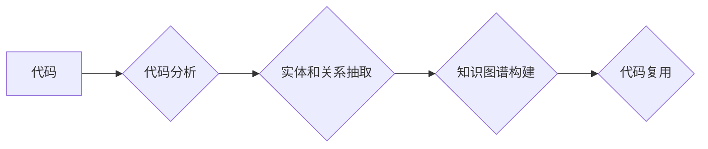

                 

## 知识图谱在代码复用中的创新应用

> 关键词：知识图谱、代码复用、软件工程、代码理解、机器学习、软件开发效率

## 1. 背景介绍

在软件开发领域，代码复用一直是提高开发效率、降低成本和保证软件质量的关键策略。传统的代码复用方法主要依赖于代码库搜索和手动查找，效率低下且难以发现潜在的复用机会。随着人工智能技术的快速发展，知识图谱（Knowledge Graph，KG）为代码复用带来了新的可能性。

知识图谱是一种数据结构，它以实体和关系的形式表示知识，能够有效地捕捉代码之间的语义关联。将代码表示为知识图谱，可以帮助我们更好地理解代码结构、功能和依赖关系，从而实现更智能、更精准的代码复用。

## 2. 核心概念与联系

### 2.1 知识图谱概述

知识图谱是一种基于实体和关系的数据模型，用于表示和组织知识。它由以下三个基本要素组成：

* **实体（Entity）：** 代表知识图谱中的事物，例如代码函数、类、变量等。
* **关系（Relation）：** 描述实体之间的连接和依赖关系，例如“调用”、“继承”、“依赖”等。
* **属性（Property）：** 描述实体的特征和属性，例如函数的输入参数、类的继承关系等。

知识图谱可以以图形化的形式表示，实体用节点表示，关系用边表示。这种结构化表示方式能够有效地捕捉代码之间的语义关联，为代码复用提供新的思路。

### 2.2 代码知识图谱

代码知识图谱是将代码表示为知识图谱的一种形式。它将代码中的实体（如函数、类、变量）和关系（如调用、继承、依赖）抽取出来，构建成一个代码相关的知识图谱。

代码知识图谱的构建可以利用代码分析工具和自然语言处理技术。通过分析代码结构、注释和文档，可以识别代码中的实体和关系，并将其表示为知识图谱的形式。

### 2.3 代码复用与知识图谱

知识图谱为代码复用提供了新的可能性，主要体现在以下几个方面：

* **精准匹配：** 知识图谱能够捕捉代码之间的语义关联，可以更精准地匹配代码片段，提高复用效率。
* **发现潜在复用机会：** 知识图谱可以帮助我们发现代码之间的隐藏关系，从而发现潜在的复用机会。
* **代码理解和重构：** 知识图谱可以帮助我们更好地理解代码结构和功能，从而进行更有效的代码重构和维护。

**Mermaid 流程图**



## 3. 核心算法原理 & 具体操作步骤

### 3.1 算法原理概述

代码知识图谱构建的核心算法主要包括代码解析、实体识别、关系抽取和知识图谱构建四个步骤。

* **代码解析：** 将源代码转换为抽象语法树（Abstract Syntax Tree，AST），以便于后续的分析和处理。
* **实体识别：** 从AST中识别代码中的实体，例如函数、类、变量等。
* **关系抽取：** 从AST中识别代码中的关系，例如函数调用、继承关系、依赖关系等。
* **知识图谱构建：** 将识别出的实体和关系构建成知识图谱。

### 3.2 算法步骤详解

1. **代码解析：** 使用代码解析工具（如ANTLR、JavaCC）将源代码转换为AST。AST是一种树形结构，它表示代码的语法结构。
2. **实体识别：** 利用自然语言处理技术（如词性标注、命名实体识别）从AST中识别代码中的实体。例如，函数名、类名、变量名等都是代码实体。
3. **关系抽取：** 分析AST中的代码结构，识别代码中的关系。例如，函数调用关系、继承关系、依赖关系等。可以使用规则匹配、机器学习等方法进行关系抽取。
4. **知识图谱构建：** 将识别出的实体和关系构建成知识图谱。可以使用RDF、OWL等标准格式表示知识图谱。

### 3.3 算法优缺点

**优点：**

* **精准匹配：** 知识图谱能够捕捉代码之间的语义关联，可以更精准地匹配代码片段。
* **发现潜在复用机会：** 知识图谱可以帮助我们发现代码之间的隐藏关系，从而发现潜在的复用机会。
* **代码理解和重构：** 知识图谱可以帮助我们更好地理解代码结构和功能，从而进行更有效的代码重构和维护。

**缺点：**

* **构建复杂：** 代码知识图谱的构建需要复杂的算法和技术，需要大量的计算资源和时间。
* **数据质量依赖：** 代码知识图谱的质量取决于代码的质量和注释的完整性。
* **知识更新困难：** 代码库不断更新，需要定期更新代码知识图谱，这需要额外的维护成本。

### 3.4 算法应用领域

代码知识图谱的应用领域非常广泛，包括：

* **代码复用：** 帮助开发人员更精准地查找和复用代码片段，提高开发效率。
* **代码理解：** 帮助开发人员更好地理解代码结构和功能，从而进行更有效的代码阅读、重构和维护。
* **代码生成：** 利用代码知识图谱，可以生成新的代码片段，例如自动生成代码注释、代码测试用例等。
* **代码安全：** 利用代码知识图谱，可以识别代码中的安全漏洞，提高代码安全性和可靠性。

## 4. 数学模型和公式 & 详细讲解 & 举例说明

### 4.1 数学模型构建

代码知识图谱可以表示为一个图结构，其中节点代表代码实体，边代表代码关系。可以使用图论中的概念和算法来分析和处理代码知识图谱。

**节点：**

* 节点类型：函数、类、变量、模块等。
* 节点属性：名称、类型、参数、返回值等。

**边：**

* 边类型：调用、继承、依赖、使用等。
* 边属性：方向、权重等。

### 4.2 公式推导过程

**节点相似度计算：**

可以使用余弦相似度、Jaccard相似度等度量方法计算节点之间的相似度。

**$$
Sim(A, B) = \frac{A \cdot B}{||A|| ||B||}
$$**

其中：

* $Sim(A, B)$ 表示节点 A 和节点 B 的相似度。
* $A \cdot B$ 表示 A 和 B 的点积。
* $||A||$ 和 $||B||$ 分别表示 A 和 B 的长度。

**边权重计算：**

可以使用代码调用频率、代码依赖关系等因素来计算边的权重。

**$$
Weight(e) = f(call\_frequency, dependency\_strength)
$$**

其中：

* $Weight(e)$ 表示边 e 的权重。
* $call\_frequency$ 表示边 e 的调用频率。
* $dependency\_strength$ 表示边 e 的依赖关系强度。

### 4.3 案例分析与讲解

假设我们有一个代码知识图谱，其中包含以下实体和关系：

* 实体：函数 A、函数 B、类 C、类 D。
* 关系：A 调用 B、C 继承 D。

我们可以使用上述公式计算节点和边的相似度和权重。例如，我们可以计算函数 A 和函数 B 的相似度，以及函数 A 调用函数 B 的边权重。

## 5. 项目实践：代码实例和详细解释说明

### 5.1 开发环境搭建

* **编程语言：** Python
* **框架：** PyTorch、TensorFlow 等深度学习框架
* **工具：** SpaCy、NLTK 等自然语言处理工具
* **数据库：** Neo4j、GraphDB 等图数据库

### 5.2 源代码详细实现

```python
# 代码实体识别
import spacy

nlp = spacy.load("en_core_web_sm")

def extract_entities(code):
    doc = nlp(code)
    entities = [(ent.text, ent.label_) for ent in doc.ents]
    return entities

# 代码关系抽取
# ...

# 知识图谱构建
# ...
```

### 5.3 代码解读与分析

* 代码实体识别：使用 SpaCy 库对代码进行分析，识别代码中的实体，例如函数名、类名、变量名等。
* 代码关系抽取：使用规则匹配、机器学习等方法从代码结构中识别代码之间的关系，例如函数调用关系、继承关系、依赖关系等。
* 知识图谱构建：将识别出的实体和关系构建成知识图谱，可以使用 RDF、OWL 等标准格式表示知识图谱。

### 5.4 运行结果展示

运行上述代码，可以得到代码中的实体和关系，并构建成知识图谱。

## 6. 实际应用场景

### 6.1 代码复用平台

代码知识图谱可以用于构建代码复用平台，帮助开发人员更精准地查找和复用代码片段。例如，可以根据开发人员的需求，从代码知识图谱中搜索出符合条件的代码片段，并提供代码示例和使用说明。

### 6.2 代码理解工具

代码知识图谱可以用于构建代码理解工具，帮助开发人员更好地理解代码结构和功能。例如，可以根据代码知识图谱，生成代码的结构图、调用图、依赖图等，帮助开发人员直观地了解代码的整体结构和各个模块之间的关系。

### 6.3 代码生成工具

代码知识图谱可以用于构建代码生成工具，帮助开发人员自动生成代码片段。例如，可以根据代码知识图谱，自动生成代码注释、代码测试用例等。

### 6.4 未来应用展望

随着人工智能技术的不断发展，代码知识图谱的应用场景将会更加广泛。例如，可以利用代码知识图谱进行代码安全分析、代码质量评估、代码自动修复等。

## 7. 工具和资源推荐

### 7.1 学习资源推荐

* **书籍：**
    * 《知识图谱》
    * 《深度学习》
* **在线课程：**
    * Coursera 上的知识图谱课程
    * edX 上的深度学习课程

### 7.2 开发工具推荐

* **代码解析工具：** ANTLR、JavaCC
* **自然语言处理工具：** SpaCy、NLTK
* **图数据库：** Neo4j、GraphDB

### 7.3 相关论文推荐

* **代码知识图谱构建：**
    * "CodeBERT: A Pre-trained Language Model for Code"
    * "Graph Neural Networks for Code Understanding"
* **代码复用：**
    * "A Survey of Code Reuse Techniques"
    * "Code Search: A Survey"

## 8. 总结：未来发展趋势与挑战

### 8.1 研究成果总结

代码知识图谱在代码复用、代码理解、代码生成等领域取得了显著的成果。它能够帮助开发人员更精准地查找和复用代码片段，更好地理解代码结构和功能，提高代码开发效率。

### 8.2 未来发展趋势

未来，代码知识图谱的研究将朝着以下几个方向发展：

* **更精准的代码理解：** 利用更先进的自然语言处理技术和深度学习算法，提高代码知识图谱的理解能力。
* **更智能的代码生成：** 利用代码知识图谱，实现更智能的代码生成，例如自动生成代码注释、代码测试用例等。
* **更广泛的应用场景：** 将代码知识图谱应用到更多领域，例如代码安全分析、代码质量评估、代码自动修复等。

### 8.3 面临的挑战

代码知识图谱的研究也面临着一些挑战：

* **数据质量问题：** 代码知识图谱的质量取决于代码的质量和注释的完整性。
* **知识更新困难：** 代码库不断更新，需要定期更新代码知识图谱，这需要额外的维护成本。
* **算法复杂度：** 代码知识图谱的构建和分析需要复杂的算法和技术，需要大量的计算资源和时间。

### 8.4 研究展望

尽管面临着一些挑战，但代码知识图谱的研究前景仍然非常广阔。随着人工智能技术的不断发展，相信代码知识图谱将会在软件开发领域发挥越来越重要的作用。

## 9. 附录：常见问题与解答

**Q1：代码知识图谱的构建需要哪些技术？**

**A1：** 代码知识图谱的构建需要自然语言处理技术、代码解析技术、图数据库技术等。

**Q2：代码知识图谱的应用场景有哪些？**

**A2：** 代码知识图谱的应用场景包括代码复用、代码理解、代码生成、代码安全分析等。

**Q3：代码知识图谱的未来发展趋势是什么？**

**A3：** 未来，代码知识图谱的研究将朝着更精准的代码理解、更智能的代码生成、更广泛的应用场景等方向发展。


作者：禅与计算机程序设计艺术 / Zen and the Art of Computer Programming<end_of_turn>

