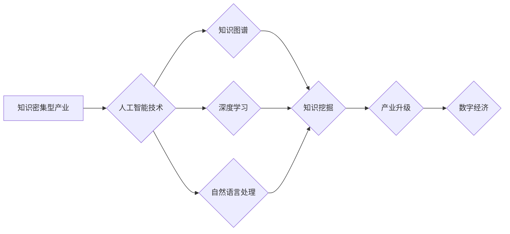

                 

## 知识密集型产业的发展趋势

> 关键词：人工智能、知识图谱、深度学习、自然语言处理、数据挖掘、产业升级、创新驱动、数字经济

### 1. 背景介绍

随着信息技术的飞速发展，全球经济结构正在发生深刻变化，知识密集型产业逐渐成为经济增长的主引擎。知识密集型产业是指以知识、技术、创意和创新为主要生产要素的产业，其核心竞争力在于知识的积累、应用和转化。

近年来，人工智能（AI）技术取得了突破性进展，为知识密集型产业的发展注入了强劲动力。AI技术的应用能够有效提升知识的获取、处理和利用效率，推动知识密集型产业的创新和升级。

### 2. 核心概念与联系

**2.1 知识密集型产业**

知识密集型产业是指以知识、技术、创意和创新为主要生产要素的产业，其核心竞争力在于知识的积累、应用和转化。

**2.2 人工智能**

人工智能（AI）是指模拟人类智能行为的计算机系统。AI技术涵盖了多个领域，包括机器学习、深度学习、自然语言处理、计算机视觉等。

**2.3 知识图谱**

知识图谱是一种基于知识表示的数据库，它以实体和关系为节点，构建知识网络，能够有效存储、组织和推理知识。

**2.4 知识挖掘**

知识挖掘是指从海量数据中提取有价值的知识的过程。

**2.5 产业升级**

产业升级是指通过技术创新、产品结构调整和产业链优化，提升产业的附加值和竞争力。

**2.6 数字经济**

数字经济是指以数字技术为基础，以数据为核心要素，以网络为平台，以智能为驱动，以创新为动力，以服务为导向的新型经济形态。

**Mermaid 流程图**



### 3. 核心算法原理 & 具体操作步骤

**3.1 算法原理概述**

知识密集型产业的发展离不开人工智能技术的支撑，而人工智能技术的核心算法包括机器学习、深度学习、自然语言处理等。

**3.2 算法步骤详解**

**3.2.1 机器学习**

机器学习算法通过学习数据样本，建立模型，并根据模型预测未来结果。

**步骤：**

1. 数据收集和预处理：收集相关数据，并进行清洗、转换和特征工程等预处理操作。
2. 模型选择：根据任务需求选择合适的机器学习算法，例如线性回归、逻辑回归、决策树、支持向量机等。
3. 模型训练：使用训练数据训练模型，调整模型参数，使模型能够准确预测结果。
4. 模型评估：使用测试数据评估模型的性能，例如准确率、召回率、F1-score等。
5. 模型部署：将训练好的模型部署到实际应用场景中，用于预测和决策。

**3.2.2 深度学习**

深度学习算法是一种更高级的机器学习算法，它使用多层神经网络模拟人类大脑的学习过程。

**步骤：**

1. 数据收集和预处理：与机器学习类似，需要收集和预处理相关数据。
2. 网络结构设计：设计深度神经网络的结构，包括层数、节点数、激活函数等。
3. 模型训练：使用训练数据训练深度神经网络，调整网络参数，使网络能够学习数据特征。
4. 模型评估：使用测试数据评估模型的性能，例如准确率、召回率、F1-score等。
5. 模型部署：将训练好的深度神经网络部署到实际应用场景中，用于预测和决策。

**3.2.3 自然语言处理**

自然语言处理算法能够理解和处理人类语言。

**步骤：**

1. 文本预处理：对文本进行清洗、分词、词性标注等预处理操作。
2. 模型训练：使用训练数据训练自然语言处理模型，例如词嵌入模型、序列标注模型、语言模型等。
3. 模型评估：使用测试数据评估模型的性能，例如准确率、召回率、F1-score等。
4. 模型部署：将训练好的自然语言处理模型部署到实际应用场景中，用于文本分类、情感分析、机器翻译等任务。

**3.3 算法优缺点**

**3.3.1 机器学习**

**优点：**

* 能够从数据中学习，自动发现模式和规律。
* 适用范围广，可以应用于各种类型的数据和任务。

**缺点：**

* 需要大量的训练数据。
* 模型解释性较差，难以理解模型的决策过程。

**3.3.2 深度学习**

**优点：**

* 表现力强，能够学习到更复杂的特征。
* 在图像识别、语音识别等领域取得了突破性进展。

**缺点：**

* 训练成本高，需要大量的计算资源和时间。
* 模型参数众多，容易过拟合。

**3.3.3 自然语言处理**

**优点：**

* 能够理解和处理人类语言，为人类与机器的交互提供了新的可能性。

**缺点：**

* 自然语言的复杂性和歧义性使得自然语言处理任务非常具有挑战性。
* 模型的准确性和鲁棒性还有待提高。

**3.4 算法应用领域**

机器学习、深度学习和自然语言处理算法广泛应用于各个领域，例如：

* **医疗保健：**疾病诊断、药物研发、个性化医疗
* **金融服务：**欺诈检测、风险管理、投资决策
* **制造业：**质量控制、预测维护、智能制造
* **零售业：**个性化推荐、库存管理、客户服务
* **教育：**智能辅导、个性化学习、在线教育

### 4. 数学模型和公式 & 详细讲解 & 举例说明

**4.1 数学模型构建**

**4.1.1 线性回归模型**

线性回归模型假设数据之间存在线性关系，可以使用一条直线来拟合数据。

**公式：**

$$y = mx + c$$

其中：

* $y$ 是预测值
* $x$ 是输入特征
* $m$ 是斜率
* $c$ 是截距

**4.1.2 逻辑回归模型**

逻辑回归模型用于分类问题，它将输入特征映射到0到1之间的概率值，表示样本属于某个类别的概率。

**公式：**

$$P(y=1|x) = \frac{1}{1 + e^{-(wx + b)}}$$

其中：

* $P(y=1|x)$ 是样本属于类别1的概率
* $x$ 是输入特征
* $w$ 是权重向量
* $b$ 是偏置项

**4.2 公式推导过程**

**4.2.1 线性回归模型的损失函数**

线性回归模型的损失函数通常使用均方误差（MSE）。

**公式：**

$$MSE = \frac{1}{n} \sum_{i=1}^{n} (y_i - \hat{y}_i)^2$$

其中：

* $n$ 是样本数量
* $y_i$ 是真实值
* $\hat{y}_i$ 是预测值

**4.2.2 逻辑回归模型的损失函数**

逻辑回归模型的损失函数通常使用交叉熵损失函数。

**公式：**

$$Loss = -\frac{1}{n} \sum_{i=1}^{n} y_i \log(P(y_i=1|x_i)) + (1-y_i) \log(1-P(y_i=1|x_i))$$

其中：

* $n$ 是样本数量
* $y_i$ 是真实值
* $P(y_i=1|x_i)$ 是样本属于类别1的概率

**4.3 案例分析与讲解**

**4.3.1 线性回归模型案例**

假设我们想要预测房价，输入特征包括房屋面积、房间数量等。可以使用线性回归模型建立房价预测模型。

**4.3.2 逻辑回归模型案例**

假设我们想要预测客户是否会购买产品，输入特征包括客户年龄、收入等。可以使用逻辑回归模型建立客户购买预测模型。

### 5. 项目实践：代码实例和详细解释说明

**5.1 开发环境搭建**

* Python 3.x
* Jupyter Notebook
* TensorFlow 或 PyTorch

**5.2 源代码详细实现**

```python
# 线性回归模型示例
import tensorflow as tf

# 定义模型
model = tf.keras.Sequential([
    tf.keras.layers.Dense(units=1, input_shape=[1])
])

# 编译模型
model.compile(optimizer='sgd', loss='mse')

# 训练模型
model.fit(x_train, y_train, epochs=100)

# 预测结果
predictions = model.predict(x_test)
```

**5.3 代码解读与分析**

* 使用 TensorFlow 库构建线性回归模型。
* 模型包含一个全连接层，输入特征维度为1，输出维度为1。
* 使用随机梯度下降（SGD）优化器，均方误差（MSE）作为损失函数。
* 使用训练数据训练模型100个epochs。
* 使用测试数据预测结果。

**5.4 运行结果展示**

运行代码后，可以得到模型的训练过程和预测结果。

### 6. 实际应用场景

**6.1 医疗保健**

* 疾病诊断：使用机器学习算法分析患者的医疗记录、影像数据等，辅助医生诊断疾病。
* 药物研发：使用深度学习算法分析药物分子结构和生物活性数据，加速药物研发过程。
* 个性化医疗：根据患者的基因信息、生活习惯等，提供个性化的医疗方案。

**6.2 金融服务**

* 欺诈检测：使用机器学习算法分析交易数据，识别异常交易行为，防止欺诈行为。
* 风险管理：使用深度学习算法分析市场数据、客户数据等，评估金融风险，制定风险管理策略。
* 投资决策：使用机器学习算法分析市场趋势、公司财务数据等，辅助投资决策。

**6.3 制造业**

* 质量控制：使用机器视觉算法分析产品图像，识别缺陷，提高产品质量。
* 预测维护：使用机器学习算法分析设备运行数据，预测设备故障，进行及时维护。
* 智能制造：使用人工智能技术实现自动化生产，提高生产效率。

**6.4 未来应用展望**

随着人工智能技术的不断发展，其在知识密集型产业的应用场景将更加广泛，例如：

* 个性化教育：根据学生的学习情况，提供个性化的学习方案。
* 智能客服：使用自然语言处理技术，开发智能客服系统，提供24小时在线服务。
* 自动驾驶：使用深度学习算法，开发自动驾驶汽车，提高交通安全和效率。

### 7. 工具和资源推荐

**7.1 学习资源推荐**

* **在线课程：** Coursera、edX、Udacity 等平台提供人工智能、机器学习、深度学习等方面的在线课程。
* **书籍：** 《深度学习》、《机器学习实战》、《人工智能：一种现代方法》等书籍。
* **博客和论坛：** TensorFlow、PyTorch、机器之心等网站和论坛提供人工智能相关的博客文章、技术讨论和社区支持。

**7.2 开发工具推荐**

* **Python：** 广泛用于人工智能开发的编程语言。
* **TensorFlow：** 开源深度学习框架。
* **PyTorch：** 开源深度学习框架。
* **Jupyter Notebook：** 用于交互式编程和数据可视化的工具。

**7.3 相关论文推荐**

* **《ImageNet Classification with Deep Convolutional Neural Networks》**
* **《Attention Is All You Need》**
* **《BERT: Pre-training of Deep Bidirectional Transformers for Language Understanding》**

### 8. 总结：未来发展趋势与挑战

**8.1 研究成果总结**

近年来，人工智能技术取得了显著进展，在知识密集型产业的应用也越来越广泛。

**8.2 未来发展趋势**

* **模型规模和能力的提升：** 未来人工智能模型将更加庞大，能够处理更复杂的任务。
* **算法的泛化能力增强：** 未来人工智能算法将更加鲁棒，能够适应不同的数据和场景。
* **人工智能与其他技术的融合：** 人工智能将与其他技术，例如物联网、区块链等融合，形成新的应用场景。

**8.3 面临的挑战**

* **数据安全和隐私保护：** 人工智能算法依赖于大量数据，如何保证数据安全和隐私保护是一个重要挑战。
* **算法解释性和可信度：** 许多人工智能算法的决策过程难以解释，如何提高算法的解释性和可信度是一个重要问题。
* **伦理和社会影响：** 人工智能技术的发展可能带来一些伦理和社会问题，需要进行深入思考和探讨。

**8.4 研究展望**

未来，人工智能技术将继续发展，为知识密集型产业带来更多机遇。我们需要加强基础研究，探索更先进的算法和模型；同时，也要关注人工智能技术的伦理和社会影响，确保其健康发展。

### 9. 附录：常见问题与解答

**9.1 如何选择合适的机器学习算法？**

选择合适的机器学习算法需要根据具体任务和数据特点进行选择。

**9.2 如何评估机器学习模型的性能？**

常用的评估指标包括准确率、召回率、F1-score、AUC等。

**9.3 如何解决机器学习模型的过拟合问题？**

常用的方法包括正则化、交叉验证、数据增强等。


作者：禅与计算机程序设计艺术 / Zen and the Art of Computer Programming<end_of_turn>

