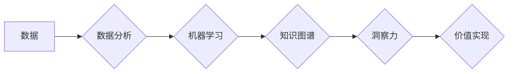

                 

## 知识的价值实现：洞察力的关键作用

> 关键词：知识图谱、洞察力、机器学习、数据分析、人工智能、价值实现、数据驱动决策

### 1. 背景介绍

在当今数据爆炸的时代，海量数据无处不在，从社交媒体到金融交易，从医疗记录到工业传感器，数据正在以指数级增长。然而，数据本身并无价值，真正的价值在于从中提取有意义的洞察力，并将其转化为可操作的知识。

传统的知识管理方法难以应对海量数据的挑战，而人工智能（AI）技术的兴起为知识的价值实现提供了新的机遇。AI算法能够从海量数据中识别模式、发现关联，并生成新的知识，从而帮助我们更好地理解世界，做出更明智的决策。

### 2. 核心概念与联系

**2.1 知识图谱**

知识图谱是一种基于知识表示的数据库，它以实体和关系的形式组织知识，并通过推理和查询来获取新的知识。知识图谱能够将分散的数据整合在一起，形成一个统一的知识体系，从而提高知识的发现性和可利用性。

**2.2 洞察力**

洞察力是指从数据中发现的非显性的模式、趋势和关系，它能够帮助我们理解问题背后的本质，并为决策提供新的视角。洞察力是知识的最终目标，也是数据分析的核心价值。

**2.3 机器学习**

机器学习是人工智能的一个分支，它通过算法训练模型，使模型能够从数据中学习，并进行预测或分类。机器学习算法能够从数据中发现隐藏的模式，并生成新的知识，从而为洞察力的发现提供强大的工具。

**2.4 数据分析**

数据分析是指从数据中提取有价值的信息的过程，它包括数据收集、清洗、处理、分析和可视化等步骤。数据分析是洞察力的基础，它为机器学习算法提供数据输入，并帮助我们理解分析结果。

**2.5  价值实现**

价值实现是指将知识转化为实际效益的过程，它包括决策优化、流程改进、创新驱动等方面。洞察力是价值实现的关键驱动力，它能够帮助我们做出更明智的决策，提高效率，创造新的价值。

**Mermaid 流程图**



### 3. 核心算法原理 & 具体操作步骤

**3.1 算法原理概述**

在知识的价值实现过程中，机器学习算法扮演着至关重要的角色。常见的机器学习算法包括：

* **监督学习:** 利用标记数据训练模型，预测未知数据。例如，分类、回归等。
* **无监督学习:** 从未标记数据中发现模式和结构。例如，聚类、降维等。
* **强化学习:** 通过试错学习，在环境中获得最大奖励。例如，游戏AI、机器人控制等。

**3.2 算法步骤详解**

以监督学习为例，其基本步骤如下：

1. **数据收集和预处理:** 收集相关数据，并进行清洗、转换、特征工程等预处理步骤。
2. **模型选择:** 根据任务需求选择合适的机器学习模型。
3. **模型训练:** 利用标记数据训练模型，调整模型参数，使其能够准确预测未知数据。
4. **模型评估:** 使用测试数据评估模型的性能，并进行调优。
5. **模型部署:** 将训练好的模型部署到实际应用场景中。

**3.3 算法优缺点**

不同的机器学习算法具有不同的优缺点，需要根据具体任务选择合适的算法。例如，决策树算法易于理解和解释，但泛化能力较弱；神经网络算法具有强大的学习能力，但训练复杂度高。

**3.4 算法应用领域**

机器学习算法广泛应用于各个领域，例如：

* **医疗诊断:** 利用病历数据预测疾病风险，辅助医生诊断。
* **金融风险控制:** 利用交易数据识别欺诈行为，降低金融风险。
* **个性化推荐:** 利用用户行为数据推荐个性化商品或服务。
* **自然语言处理:** 利用文本数据进行文本分类、情感分析、机器翻译等。

### 4. 数学模型和公式 & 详细讲解 & 举例说明

**4.1 数学模型构建**

机器学习算法通常基于数学模型，例如线性回归模型、逻辑回归模型、支持向量机模型等。这些模型通过数学公式来描述数据之间的关系，并进行预测或分类。

**4.2 公式推导过程**

例如，线性回归模型的目标是找到一条直线，使得这条直线与数据点之间的误差最小。其数学公式如下：

$$y = w_0 + w_1x$$

其中，$y$ 是预测值，$x$ 是输入特征，$w_0$ 和 $w_1$ 是模型参数。

通过最小化误差函数，可以求解出最佳的模型参数。

**4.3 案例分析与讲解**

假设我们有一组数据，记录了房屋面积和房屋价格的关系。我们可以使用线性回归模型来预测房屋价格。

通过训练模型，我们可以得到最佳的模型参数，例如：$w_0 = 10000$，$w_1 = 500$。

这意味着，对于面积为 $x$ 平方米的房屋，其价格可以预测为 $10000 + 500x$ 元。

### 5. 项目实践：代码实例和详细解释说明

**5.1 开发环境搭建**

可以使用 Python 语言和相关的机器学习库，例如 scikit-learn，来实现机器学习项目。

**5.2 源代码详细实现**

```python
from sklearn.linear_model import LinearRegression
import pandas as pd

# 加载数据
data = pd.read_csv('house_data.csv')

# 划分训练集和测试集
X = data[['area']]
y = data['price']
from sklearn.model_selection import train_test_split
X_train, X_test, y_train, y_test = train_test_split(X, y, test_size=0.2)

# 创建线性回归模型
model = LinearRegression()

# 训练模型
model.fit(X_train, y_train)

# 预测测试集数据
y_pred = model.predict(X_test)

# 评估模型性能
from sklearn.metrics import mean_squared_error
mse = mean_squared_error(y_test, y_pred)
print('Mean Squared Error:', mse)
```

**5.3 代码解读与分析**

这段代码首先加载数据，然后将数据划分成训练集和测试集。接着，创建线性回归模型，并使用训练集训练模型。最后，使用测试集数据进行预测，并评估模型性能。

**5.4 运行结果展示**

运行代码后，会输出模型的均方误差值，该值越小，模型的预测性能越好。

### 6. 实际应用场景

**6.1 医疗诊断**

利用机器学习算法分析患者的病历数据、影像数据等，可以辅助医生诊断疾病，提高诊断准确率。

**6.2 金融风险控制**

利用机器学习算法分析交易数据、客户行为数据等，可以识别欺诈行为、预测风险，降低金融风险。

**6.3 个性化推荐**

利用机器学习算法分析用户的行为数据、偏好数据等，可以为用户提供个性化的商品或服务推荐，提高用户体验。

**6.4 未来应用展望**

随着人工智能技术的不断发展，机器学习算法将在更多领域得到应用，例如自动驾驶、智能制造、智慧城市等。

### 7. 工具和资源推荐

**7.1 学习资源推荐**

* **书籍:**
    * 《机器学习》 - 周志华
    * 《深度学习》 - Ian Goodfellow
* **在线课程:**
    * Coursera: Machine Learning
    * edX: Artificial Intelligence

**7.2 开发工具推荐**

* **Python:** 
    * scikit-learn
    * TensorFlow
    * PyTorch

**7.3 相关论文推荐**

* **AlphaGo论文:** https://arxiv.org/abs/1607.02886
* **BERT论文:** https://arxiv.org/abs/1810.04805

### 8. 总结：未来发展趋势与挑战

**8.1 研究成果总结**

近年来，人工智能领域取得了显著的进展，机器学习算法在各个领域得到了广泛应用。

**8.2 未来发展趋势**

未来，人工智能技术将继续发展，朝着更智能、更安全、更可解释的方向发展。

* **深度学习:** 深度学习算法将继续发展，应用于更复杂的任务，例如图像识别、自然语言处理等。
* **强化学习:** 强化学习算法将应用于更多现实世界的问题，例如自动驾驶、机器人控制等。
* **联邦学习:** 联邦学习将允许在不共享数据的情况下进行模型训练，提高数据隐私保护。

**8.3 面临的挑战**

人工智能技术的发展也面临着一些挑战，例如：

* **数据安全和隐私:** 如何保护数据安全和隐私是人工智能发展的关键问题。
* **算法可解释性:** 如何解释人工智能算法的决策过程，提高算法的可信度和可接受性。
* **伦理问题:** 人工智能技术的发展可能带来一些伦理问题，例如算法偏见、工作岗位替代等。

**8.4 研究展望**

未来，我们需要继续加强人工智能基础研究，解决算法的可解释性、安全性、伦理等问题，并推动人工智能技术向更安全、更可持续的方向发展。

### 9. 附录：常见问题与解答

**9.1 如何选择合适的机器学习算法？**

选择合适的机器学习算法需要根据具体任务需求和数据特点进行选择。例如，对于分类任务，可以考虑使用决策树、支持向量机、神经网络等算法；对于回归任务，可以考虑使用线性回归、逻辑回归、支持向量回归等算法。

**9.2 如何评估机器学习模型的性能？**

常用的机器学习模型性能评估指标包括准确率、召回率、F1-score、AUC等。

**9.3 如何解决机器学习算法的过拟合问题？**

过拟合是指模型对训练数据过拟合，导致在测试数据上的性能下降。

解决过拟合问题的方法包括：

* **增加训练数据量**
* **使用正则化技术**
* **使用交叉验证**
* **减少模型复杂度**


作者：禅与计算机程序设计艺术 / Zen and the Art of Computer Programming 
<end_of_turn>

