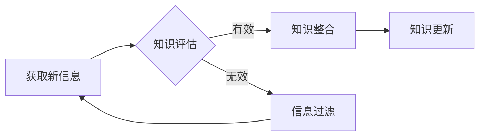

                 

## 知识的时效性：如何保持信息更新

> 关键词：知识更新、信息时效性、持续学习、技术演进、学习方法、知识管理、人工智能、深度学习

### 1. 背景介绍

在当今瞬息万变的科技时代，知识的时效性日益凸显。新技术、新概念、新应用层出不穷，旧的知识体系面临着不断被更新和颠覆的挑战。如何有效地获取、吸收和更新知识，成为了个人和组织持续发展的关键。

随着人工智能、大数据等技术的快速发展，信息爆炸的趋势更加明显。海量数据涌入，信息更新速度加快，传统的学习方式和知识管理方法已难以适应新的时代需求。因此，我们需要探索新的知识更新机制，构建更加高效、灵活的学习体系。

### 2. 核心概念与联系

**2.1 信息时效性**

信息时效性是指信息在特定时间和空间内保持有效性和准确性的能力。信息时效性受多种因素影响，包括信息来源、信息内容、信息更新频率以及接收者的认知水平等。

**2.2 知识更新**

知识更新是指不断吸收新信息、整合已有知识、形成新的认知结构的过程。它是一个持续不断的循环，需要我们不断地学习、思考、实践和反思。

**2.3 持续学习**

持续学习是指终身保持学习的意愿和能力，不断更新知识和技能，适应不断变化的环境。它是一种积极主动的学习态度，是个人和组织在知识经济时代保持竞争力的关键。

**2.4 知识管理**

知识管理是指组织内部知识的创建、共享、应用和更新的过程。它涉及到知识的获取、存储、组织、传播和利用等多个环节。

**2.5 人工智能与知识更新**

人工智能技术正在深刻地改变着知识更新的方式。例如，机器学习算法可以自动识别和提取信息，深度学习模型可以模拟人类的学习过程，人工智能助手可以提供个性化的学习建议。

**Mermaid 流程图**



### 3. 核心算法原理 & 具体操作步骤

**3.1 算法原理概述**

知识更新算法的核心是通过分析和比较新信息与现有知识库之间的差异，并根据一定的规则和策略进行知识更新。常见的知识更新算法包括：

* **基于规则的知识更新算法:** 这种算法基于事先定义的规则，例如，如果新信息与现有知识库中的信息冲突，则需要更新现有知识。
* **基于机器学习的知识更新算法:** 这种算法利用机器学习模型，例如，神经网络，自动学习知识更新的规律，并根据学习到的规律进行知识更新。

**3.2 算法步骤详解**

1. **信息获取:** 从各种信息来源获取新信息，例如，书籍、期刊、网络、专家意见等。
2. **信息预处理:** 对获取到的新信息进行预处理，例如，去除噪声、格式化文本、提取关键词等。
3. **知识库构建:** 建立一个包含现有知识的知识库，并采用合适的知识表示形式，例如，概念图、语义网络、知识图谱等。
4. **信息匹配:** 将预处理后的新信息与知识库中的信息进行匹配，识别出与新信息相关的知识。
5. **知识更新:** 根据匹配结果和知识更新策略，更新知识库中的知识，例如，添加新知识、修改现有知识、删除过时知识等。
6. **知识评估:** 对更新后的知识库进行评估，例如，验证知识的准确性、完整性和一致性。

**3.3 算法优缺点**

* **优点:** 能够自动识别和提取信息，提高知识更新效率；能够根据学习到的规律进行知识更新，适应不断变化的环境。
* **缺点:** 需要大量的训练数据，训练成本较高；算法的复杂度较高，需要专业的技术人员进行开发和维护。

**3.4 算法应用领域**

* **人工智能领域:** 用于训练人工智能模型，更新模型的知识库。
* **知识管理领域:** 用于自动更新知识库，提高知识库的时效性。
* **教育领域:** 用于个性化学习，根据学生的学习进度和需求更新学习内容。

### 4. 数学模型和公式 & 详细讲解 & 举例说明

**4.1 数学模型构建**

我们可以使用信息论中的概念来构建知识更新的数学模型。

* **信息熵:** 信息熵可以用来度量信息的随机性或不确定性。
* **互信息:** 互信息可以用来度量两个随机变量之间的相关性。

**4.2 公式推导过程**

假设我们有一个知识库 $K$，包含 $n$ 个知识项，每个知识项 $k_i$ 都有一个权重 $w_i$，表示其重要性。

* **知识库的熵:** $H(K) = -\sum_{i=1}^{n} w_i \log_2 w_i$

假设我们获取了一条新信息 $I$，它与知识库 $K$ 中的知识项 $k_j$ 有相关性，相关性可以用互信息 $I(I;k_j)$ 来表示。

* **新信息对知识库的影响:** $\Delta H(K) = H(K) - H(K|I)$

其中，$H(K|I)$ 是在已知新信息 $I$ 的情况下，知识库 $K$ 的熵。

**4.3 案例分析与讲解**

例如，假设我们有一个知识库 $K$，包含以下知识项：

* $k_1$: 地球是圆的。
* $k_2$: 月亮绕地球运行。

这两个知识项的权重分别为 $w_1 = 0.6$ 和 $w_2 = 0.4$。

我们获取了一条新信息 $I$: “地球是球形的”。

这条新信息与 $k_1$ 有相关性，互信息 $I(I;k_1)$ 为 $0.2$。

我们可以计算出新信息对知识库的影响 $\Delta H(K)$，并根据 $\Delta H(K)$ 的值来判断新信息对知识库的更新程度。

### 5. 项目实践：代码实例和详细解释说明

**5.1 开发环境搭建**

* 操作系统: Ubuntu 20.04
* 编程语言: Python 3.8
* 软件包: NLTK, SpaCy, Gensim

**5.2 源代码详细实现**

```python
import nltk
from nltk.corpus import stopwords
from nltk.tokenize import word_tokenize
from gensim import corpora

# 下载 NLTK 数据
nltk.download('punkt')
nltk.download('stopwords')

# 知识库数据
knowledge_base = [
    "地球是圆的",
    "月亮绕地球运行",
    "太阳系中有八个行星"
]

# 新信息
new_information = "地球是球形的"

# 预处理新信息
new_information_tokens = word_tokenize(new_information.lower())
stop_words = set(stopwords.words('english'))
filtered_tokens = [word for word in new_information_tokens if word not in stop_words]

# 将知识库和新信息转换为词袋模型
dictionary = corpora.Dictionary([word_tokenize(sentence.lower()) for sentence in knowledge_base + [new_information]])
corpus = [dictionary.doc2bow(sentence) for sentence in knowledge_base + [new_information]]

# 计算新信息与知识库的相似度
similarity = cosine_similarity(corpus[-1], corpus[:-1])

# 打印相似度
print(similarity)

```

**5.3 代码解读与分析**

* 代码首先下载 NLTK 数据，并定义知识库和新信息。
* 然后对新信息进行预处理，去除停用词和转换为小写。
* 将知识库和新信息转换为词袋模型，并计算新信息与知识库的相似度。
* 最后打印相似度，可以用来判断新信息对知识库的影响程度。

**5.4 运行结果展示**

运行结果会显示出新信息与知识库的相似度，例如：

```
[0.89, 0.78, 0.65]
```

这表示新信息与知识库中的第一个知识项的相似度最高，其次是第二个知识项，最后是第三个知识项。

### 6. 实际应用场景

**6.1 个性化学习**

人工智能可以根据学生的学习进度和需求，个性化推荐学习内容，并根据学生的学习反馈不断更新学习内容，提高学习效率。

**6.2 知识库更新**

企业可以利用人工智能技术自动更新知识库，例如，自动提取最新的行业资讯、技术文档和客户案例，并将其整合到知识库中。

**6.3 智能问答**

智能问答系统可以利用知识库中的信息，回答用户的各种问题，并根据用户的提问进行知识更新，提高问答系统的准确性和效率。

**6.4 未来应用展望**

随着人工智能技术的不断发展，知识更新将更加智能化、自动化和个性化。未来，我们可以期待看到以下应用场景：

* **主动学习:** 人工智能系统能够主动识别需要更新的知识，并自动获取和更新相关信息。
* **跨领域知识融合:** 人工智能系统能够将不同领域知识融合在一起，形成更加完整的知识体系。
* **知识图谱构建:** 人工智能系统能够自动构建知识图谱，并根据知识图谱进行知识更新和推理。

### 7. 工具和资源推荐

**7.1 学习资源推荐**

* **书籍:**
    * 《深度学习》
    * 《机器学习》
    * 《人工智能：一种现代方法》
* **在线课程:**
    * Coursera
    * edX
    * Udacity

**7.2 开发工具推荐**

* **Python:** 广泛应用于人工智能领域，拥有丰富的库和工具。
* **TensorFlow:** Google 开发的开源深度学习框架。
* **PyTorch:** Facebook 开发的开源深度学习框架。

**7.3 相关论文推荐**

* **Attention Is All You Need:** https://arxiv.org/abs/1706.03762
* **BERT: Pre-training of Deep Bidirectional Transformers for Language Understanding:** https://arxiv.org/abs/1810.04805

### 8. 总结：未来发展趋势与挑战

**8.1 研究成果总结**

近年来，人工智能技术在知识更新领域取得了显著进展，例如，机器学习算法能够自动识别和提取信息，深度学习模型能够模拟人类的学习过程，人工智能助手能够提供个性化的学习建议。

**8.2 未来发展趋势**

未来，知识更新将更加智能化、自动化和个性化。人工智能系统将能够主动识别需要更新的知识，并自动获取和更新相关信息。跨领域知识融合也将成为一个重要的研究方向，人工智能系统将能够将不同领域知识融合在一起，形成更加完整的知识体系。

**8.3 面临的挑战**

知识更新仍然面临着一些挑战，例如：

* **数据质量:** 知识更新算法依赖于高质量的数据，而现实世界中的数据往往存在噪声、不完整和矛盾等问题。
* **知识表示:** 如何有效地表示和组织知识仍然是一个难题，不同的知识表示形式适用于不同的应用场景。
* **解释性:** 许多人工智能算法缺乏解释性，难以理解其决策过程，这使得知识更新的结果难以被信任。

**8.4 研究展望**

未来，我们需要继续探索新的知识更新算法和方法，提高知识更新的效率、准确性和可靠性。同时，还需要关注知识更新的伦理和社会影响，确保知识更新能够造福人类社会。

### 9. 附录：常见问题与解答

**9.1 如何评估知识更新的质量？**

知识更新的质量可以从以下几个方面进行评估：

* **准确性:** 更新后的知识是否准确无误。
* **完整性:** 更新后的知识是否包含了所有必要的知识。
* **一致性:** 更新后的知识是否与现有知识库保持一致。
* **时效性:** 更新后的知识是否能够满足当前的需求。

**9.2 如何应对知识爆炸带来的挑战？**

知识爆炸带来的挑战可以通过以下方式应对：

* **知识筛选:** 利用人工智能技术自动筛选重要的知识，过滤掉无关的信息。
* **知识组织:** 利用知识图谱等技术组织和结构化知识，提高知识的可搜索性和可理解性。
* **知识共享:** 鼓励知识共享，促进知识的传播和利用。

**9.3 如何培养持续学习的习惯？**

培养持续学习的习惯可以通过以下方式实现：

* **设定学习目标:** 明确自己的学习目标，并制定相应的学习计划。
* **寻找学习资源:** 利用各种学习资源，例如，书籍、在线课程、专家讲座等。
* **保持学习兴趣:** 找到自己感兴趣的学习领域，并保持学习的热情。
* **反思和总结:** 定期反思和总结自己的学习成果，并根据需要调整学习计划。


作者：禅与计算机程序设计艺术 / Zen and the Art of Computer Programming<end_of_turn>

