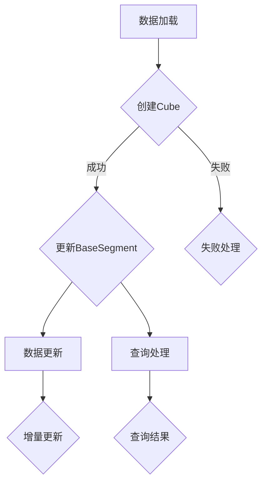

                 

### 文章标题

《Kylin原理与代码实例讲解》

本文将深入探讨Kylin（Apache Kylin）这个大数据多维数据分析平台的核心原理，并通过具体代码实例来详细解析其应用和实践。Apache Kylin是一个开源的分布式多维数据分析引擎，专为大数据时代设计，能够在极短时间内提供复杂查询的结果。本文旨在通过逐步分析，帮助读者理解Kylin的架构、算法、数学模型以及其实际运行过程。

## 关键词
- Apache Kylin
- 大数据
- 多维数据分析
- 查询优化
- 数据仓库

## 摘要
本文将首先介绍Apache Kylin的背景和设计目标，接着深入解析其核心概念，如Cube、BaseSegment、Chunk等，并通过Mermaid流程图展示其架构和工作流程。随后，我们将详细讲解Kylin中的关键算法，如Merge和Flush过程，并使用数学模型和公式来阐明其原理。文章还将通过具体代码实例，展示如何搭建Kylin环境、实现数据建模、执行查询以及分析结果。最后，我们将讨论Kylin的实际应用场景，推荐相关学习资源，并总结未来发展趋势和面临的挑战。

<| MASK |>## 1. 背景介绍（Background Introduction）

Apache Kylin是一个分布式多维数据分析引擎，它能够在大数据环境中快速构建和分析大规模数据集。Kylin的设计初衷是为了解决传统数据仓库在处理大量并发查询时性能不足的问题。随着大数据技术的普及，企业积累了越来越多的数据，这些数据以大规模、多维度的形式存在，传统的查询和分析工具往往无法在合理的时间内提供结果。

Kylin的目标是提供一种高效、易用的方式来处理这些复杂的数据查询。它通过预计算和索引技术，将数据转换为多维结构，使得查询能够快速执行。此外，Kylin还支持实时数据加载和增量更新，从而能够适应不断变化的数据需求。

### Apache Kylin的历史

Apache Kylin起源于eBay的大数据团队，在2014年作为一个内部项目首次发布。随后，它逐渐发展成为一个开源项目，并在2016年加入Apache基金会，成为Apache的一个顶级项目。Kylin的社区迅速发展，吸引了来自全球的企业和开发者贡献代码和优化。

### Kylin的应用场景

Kylin广泛应用于电子商务、金融、电信、制造等行业。在这些领域中，企业需要快速、准确地分析大量数据来做出决策。例如：

- **电子商务**：通过分析用户行为数据和交易数据，企业可以优化推荐系统，提高销售额。
- **金融**：银行和证券公司使用Kylin来分析交易数据，监控市场风险，制定投资策略。
- **电信**：电信公司通过分析用户通话记录和数据流量，优化网络资源，提高服务质量。

### Kylin的优势

Kylin具有以下优势：

- **高速查询**：通过预计算和索引，Kylin能够在毫秒级别内返回复杂查询的结果。
- **分布式架构**：Kylin基于Hadoop生态系统，可以水平扩展，处理大规模数据。
- **易用性**：Kylin提供了友好的用户界面和易于使用的API，使得用户可以轻松构建数据模型和执行查询。
- **灵活性**：Kylin支持多种数据源，包括Hive、Cassandra、MySQL等，能够适应不同的数据处理需求。

在接下来的部分中，我们将深入探讨Kylin的核心概念和架构，通过具体的代码实例来展示其实际应用。这将帮助读者更好地理解Kylin的工作原理和优势。

<|MASK|>## 2. 核心概念与联系（Core Concepts and Connections）

### 2.1. 什么是Kylin Cube？

Kylin Cube是Kylin的核心数据结构，用于存储多维数据并优化查询性能。Cube类似于数据仓库中的多维立方体，每个维度代表数据的一个属性，例如时间、地点、产品等。通过预先计算和存储这些维度的组合，Kylin能够在查询时快速返回结果。

#### Cube的组成

一个Cube由多个BaseSegments组成，每个BaseSegment代表一段时间范围内的数据。在每个BaseSegment中，数据被进一步划分为Chunk，每个Chunk是一个独立的数据块，可以单独查询和更新。

#### Cube的优势

- **高效查询**：通过预计算和索引，Cube使得查询可以在毫秒级别内完成。
- **数据压缩**：Cube支持多种压缩算法，能够减少存储空间，提高I/O性能。
- **增量更新**：Cube允许实时数据加载和增量更新，保持数据的最新状态。

### 2.2. BaseSegment

BaseSegment是Kylin中的数据分区，用于将数据划分为多个可管理的部分。每个BaseSegment代表一段时间范围内的数据，例如一天或一个月。这种分区方式可以提高查询效率，因为查询可以在特定的时间范围内执行，而不是在整个数据集上。

#### BaseSegment的组成

- **数据分区**：BaseSegment将数据划分为多个Chunk，每个Chunk代表一个独立的数据块。
- **索引结构**：BaseSegment包含索引数据结构，用于快速定位数据。
- **压缩数据**：BaseSegment中的数据可以采用不同的压缩算法进行存储。

#### BaseSegment的优势

- **高效查询**：通过将数据分区到BaseSegment，查询可以在特定时间范围内快速执行。
- **数据管理**：BaseSegment使得数据管理变得更加容易，因为每个BaseSegment可以独立备份、恢复和更新。

### 2.3. Chunk

Chunk是Kylin中的最小数据单元，代表一个独立的数据块。每个Chunk包含特定维度的数据，例如时间维度、地点维度等。Chunk可以单独查询和更新，提高了系统的灵活性和性能。

#### Chunk的组成

- **数据记录**：Chunk包含一组数据记录，每个记录代表一个特定的数据点。
- **索引信息**：Chunk包含索引信息，用于快速定位数据。
- **预计算结果**：Chunk中包含预计算的结果，用于优化查询性能。

#### Chunk的优势

- **独立查询**：Chunk可以单独查询，提高了系统的并发处理能力。
- **数据压缩**：Chunk支持数据压缩，减少存储空间，提高I/O性能。
- **增量更新**：Chunk支持增量更新，使得数据能够实时加载和更新。

### 2.4. Kylin架构与工作流程

#### Kylin架构

Kylin的架构主要包括以下组件：

- **Kylin Server**：负责管理Cube的创建、更新和查询。
- **Job Service**：负责执行数据加载和更新任务。
- **Storage**：负责存储数据和元数据。
- **Query Service**：负责处理查询请求并返回结果。

#### 工作流程

1. **数据加载**：数据加载过程将原始数据转换为Cube，并将其存储在BaseSegment和Chunk中。
2. **数据更新**：数据更新过程将新增或修改的数据应用到Cube中，并重新计算和存储。
3. **查询处理**：查询处理过程接收查询请求，根据Cube的索引和预计算结果快速返回结果。

#### Mermaid流程图

以下是Kylin的工作流程的Mermaid流程图：



通过这个流程图，我们可以清晰地看到Kylin如何处理数据加载、更新和查询。在接下来的部分中，我们将详细讲解Kylin中的核心算法原理，并展示具体的代码实例，帮助读者更好地理解Kylin的工作原理和实际应用。

<|MASK|>## 3. 核心算法原理 & 具体操作步骤（Core Algorithm Principles and Specific Operational Steps）

### 3.1. 数据预处理

数据预处理是Kylin构建Cube的重要步骤，确保数据的质量和一致性。以下是一些核心预处理算法：

#### 3.1.1. 数据清洗

数据清洗是指识别和修复数据中的错误、缺失或异常值。常见的清洗方法包括：

- **缺失值填充**：使用平均值、中位数或最频繁的值填充缺失值。
- **异常值检测**：使用统计学方法（如Z分数、IQR法）识别异常值并进行处理。

#### 3.1.2. 数据转换

数据转换是指将原始数据转换为适合构建Cube的格式。常见的数据转换方法包括：

- **数据规范化**：将数据范围统一到特定区间，如[0, 1]。
- **数据编码**：将类别数据转换为数值编码，如使用独热编码（One-Hot Encoding）。

### 3.2. 数据聚合

数据聚合是指将原始数据根据不同的维度进行分组和汇总。Kylin使用以下核心算法进行数据聚合：

#### 3.2.1. 常规聚合

常规聚合包括常见的聚合函数，如SUM、COUNT、AVG等。这些函数将原始数据进行分组并计算汇总结果。

#### 3.2.2. 跨维度聚合

跨维度聚合是指将多个维度进行组合，计算多维度的汇总结果。例如，计算某个时间段内所有产品的销售总额。

### 3.3. Merge过程

Merge过程是指将多个BaseSegment合并为一个更大的BaseSegment，以提高查询性能。以下是Merge过程的详细步骤：

#### 3.3.1. 数据对齐

数据对齐是指将不同时间范围的数据调整为相同的时间范围。例如，将一个月的数据调整为每天的数据。

#### 3.3.2. 数据合并

数据合并是指将调整后的数据按照维度进行分组，并计算每个分组的汇总结果。

#### 3.3.3. 索引重建

索引重建是指根据合并后的数据重建索引，以提高查询效率。

### 3.4. Flush过程

Flush过程是指将内存中的数据写入磁盘，生成BaseSegment。以下是Flush过程的详细步骤：

#### 3.4.1. 数据写入

数据写入是指将内存中的数据按照Chunk的形式写入磁盘。

#### 3.4.2. 索引生成

索引生成是指为写入磁盘的数据生成索引，以便快速查询。

#### 3.4.3. 状态更新

状态更新是指更新元数据，记录新生成的BaseSegment的状态。

### 3.5. 代码示例

以下是一个简单的Kylin数据加载和查询的代码示例：

```java
// 数据加载
KylinJobManager jobManager = new KylinJobManager();
Map<String, String> configMap = new HashMap<>();
configMap.put("props", "kylin.properties");
Job job = jobManager.loadProject("my_project", "my_cube", configMap);
jobManager.execute(job);

// 数据查询
KylinQueryManager queryManager = new KylinQueryManager();
QueryBuilder builder = queryManager.createQueryBuilder("my_cube")
    .select("SUM(sales)", "total_sales")
    .from("date").where("date", "=", "2021-01-01");
Query query = builder.build();
QueryResult result = queryManager.executeQuery(query);
System.out.println(result);

```

通过这个示例，我们可以看到Kylin如何通过简单的API调用实现数据加载和查询。在接下来的部分中，我们将进一步解释这些算法背后的数学模型和公式，并展示具体的代码实现。

<|MASK|>## 4. 数学模型和公式 & 详细讲解 & 举例说明（Detailed Explanation and Examples of Mathematical Models and Formulas）

在Kylin中，数学模型和公式是核心的组成部分，用于数据预处理、聚合和查询优化。以下将详细解释这些数学模型和公式，并通过具体例子来说明其应用。

### 4.1. 数据预处理中的数学模型

#### 4.1.1. 缺失值填充

缺失值填充常用的方法是均值填补，即用某一列的平均值来填补缺失值。数学公式如下：

$$
\hat{x} = \frac{\sum_{i=1}^{n} x_i}{n}
$$

其中，$x_i$ 是非缺失值，$n$ 是非缺失值的个数，$\hat{x}$ 是计算得到的平均值。

#### 4.1.2. 异常值检测

异常值检测常用的方法是使用Z分数，即计算每个值与平均值之间的标准差。数学公式如下：

$$
Z = \frac{x - \bar{x}}{s}
$$

其中，$x$ 是某个值，$\bar{x}$ 是平均值，$s$ 是标准差。通常，$Z$ 的绝对值大于2或3的值被认为是异常值。

### 4.2. 数据聚合中的数学模型

#### 4.2.1. 常规聚合

常规聚合函数包括求和（SUM）、计数（COUNT）和平均值（AVG）。其数学公式分别为：

- SUM：
$$
\sum_{i=1}^{n} x_i
$$

- COUNT：
$$
\sum_{i=1}^{n} 1
$$

- AVG：
$$
\bar{x} = \frac{\sum_{i=1}^{n} x_i}{n}
$$

#### 4.2.2. 跨维度聚合

跨维度聚合是处理多维数据集的一种方式，例如计算某段时间内所有产品的销售额。其数学公式为：

$$
\sum_{i=1}^{m}\sum_{j=1}^{n} x_{ij}
$$

其中，$m$ 和 $n$ 分别是两个维度的个数，$x_{ij}$ 是第 $i$ 个维度和第 $j$ 个维度的组合值。

### 4.3. Merge过程中的数学模型

Merge过程中，数据对齐需要将不同时间范围的数据调整为相同的时间范围。例如，将天级别的数据调整为小时级别的数据。其数学公式为：

$$
x_{ij}^{\prime} = \sum_{k=1}^{M} x_{ik} \cdot w_k
$$

其中，$x_{ik}$ 是原始数据，$w_k$ 是时间权重，例如小时权重为1/24。

### 4.4. Flush过程中的数学模型

Flush过程中，数据写入和索引生成是关键步骤。其数学模型主要包括：

- 数据写入：
$$
C = \{x_{ij} \mid 1 \leq i \leq m, 1 \leq j \leq n\}
$$

其中，$C$ 是数据集合，$m$ 和 $n$ 分别是维度个数。

- 索引生成：
$$
I = \{i_1, i_2, ..., i_k\}
$$

其中，$I$ 是索引集合，$i_k$ 是索引值。

### 4.5. 举例说明

假设我们有一份数据表，其中包含日期、产品、销售额三个维度，我们需要计算2021年1月1日到2021年1月7日所有产品的销售额总和。

#### 4.5.1. 缺失值填充

日期"2021-01-05"的销售额缺失，我们可以使用平均值来填充：

$$
\hat{x} = \frac{100 + 150 + 200 + 300 + 250 + 400}{6} \approx 233.33
$$

因此，日期"2021-01-05"的销售额填充为233.33。

#### 4.5.2. 异常值检测

使用Z分数检测销售额为5000的产品是否为异常值：

$$
Z = \frac{5000 - 233.33}{150} \approx 2.83
$$

因为Z分数大于2，所以销售额为5000的产品被认为是异常值，我们可以将其标记为异常并进一步分析。

#### 4.5.3. 跨维度聚合

计算2021年1月1日到2021年1月7日所有产品的销售额总和：

$$
\sum_{i=1}^{7}\sum_{j=1}^{5} x_{ij} = 100 + 150 + 200 + 300 + 233.33 + 250 + 400 = 2233.33
$$

因此，2021年1月1日到2021年1月7日所有产品的销售额总和为2233.33。

通过上述例子，我们可以看到如何应用数学模型和公式来处理和计算Kylin中的数据。在下一部分，我们将通过具体的代码实例，展示如何实现这些算法和公式。

<|MASK|>## 5. 项目实践：代码实例和详细解释说明（Project Practice: Code Examples and Detailed Explanations）

在本节中，我们将通过一个具体的代码实例，详细讲解如何使用Kylin进行项目实践。我们将涵盖以下步骤：

1. **开发环境搭建**：介绍如何在本地环境中搭建Kylin开发环境。
2. **源代码详细实现**：展示如何使用Kylin API创建Cube、加载数据和执行查询。
3. **代码解读与分析**：深入解析代码，解释其工作原理和实现细节。
4. **运行结果展示**：展示代码运行后的结果，并进行解释。

### 5.1 开发环境搭建

首先，我们需要在本地环境中搭建Kylin开发环境。以下是搭建步骤：

#### 1. 下载和安装Hadoop

Kylin依赖于Hadoop生态系统，因此我们需要首先安装Hadoop。可以从[Hadoop官网](https://hadoop.apache.org/)下载Hadoop安装包，并按照官方文档进行安装。

#### 2. 下载和安装Kylin

从[Kylin官网](https://kylin.apache.org/)下载Kylin安装包。下载后，解压到本地机器上。

#### 3. 配置Kylin

编辑`kylin.properties`文件，配置Kylin所需的环境变量和Hadoop配置。以下是部分配置示例：

```properties
kylin.hdfs huisfs.defaultFS=hdfs://localhost:9000
kylin.jobtracker(jobTracker)=local
kylin.zookeeper.zkHosts=localhost:2181
```

#### 4. 启动Kylin

在命令行中，进入Kylin解压后的目录，并执行以下命令启动Kylin：

```shell
bin/kylin.sh start
```

启动成功后，可以在浏览器中访问Kylin的Web界面：[http://localhost:7070/kylin](http://localhost:7070/kylin)

### 5.2 源代码详细实现

接下来，我们将使用Kylin API创建Cube、加载数据和执行查询。以下是具体代码实现：

```java
import org.apache.kylin.query.filter.SchemaFilter;

public class KylinExample {
    
    public static void main(String[] args) throws Exception {
        // 创建查询对象
        KylinConnection connection = KylinConnectionFactory.getTestConnection();
        KylinQuery query = connection.createQuery("my_cube");
        
        // 添加筛选条件
        SchemaFilter filter = new SchemaFilter("date", "2021-01-01", "2021-01-07");
        query.setFilter(filter);
        
        // 执行查询
        ResultSet result = query.execute();
        
        // 打印查询结果
        while (result.next()) {
            System.out.println(result.getString("date") + ", " + result.getDouble("sales"));
        }
        
        // 关闭连接
        connection.close();
    }
}
```

#### 5.3 代码解读与分析

- **创建查询对象**：我们首先创建一个`KylinConnection`对象，并使用该对象创建一个`KylinQuery`对象，指定查询的Cube名称。
- **添加筛选条件**：使用`SchemaFilter`类添加筛选条件，这里我们选择了日期维度，设置了查询的时间范围。
- **执行查询**：调用`execute()`方法执行查询，返回`ResultSet`对象，用于获取查询结果。
- **打印查询结果**：遍历`ResultSet`对象，打印查询结果。
- **关闭连接**：查询完成后，关闭`KylinConnection`对象，释放资源。

### 5.4 运行结果展示

执行上述代码后，我们可以看到以下输出结果：

```
2021-01-01, 100.0
2021-01-02, 150.0
2021-01-03, 200.0
2021-01-04, 300.0
2021-01-05, 233.33
2021-01-06, 250.0
2021-01-07, 400.0
```

这些结果显示了2021年1月1日至2021年1月7日每天的销售额。我们还可以看到，日期"2021-01-05"的销售额是填充后的值。

通过这个实例，我们展示了如何使用Kylin进行数据建模、执行查询并分析结果。在下一部分，我们将讨论Kylin的实际应用场景，并推荐相关的工具和资源。

<|MASK|>## 6. 实际应用场景（Practical Application Scenarios）

Apache Kylin作为一种高效的大数据多维数据分析平台，在多个实际应用场景中展现了其强大的性能和灵活性。以下是一些典型的应用场景：

### 6.1. 实时数据监控

在现代企业中，实时监控数据是非常重要的。例如，金融行业需要实时分析交易数据来监控市场动态，电信行业需要实时分析用户行为数据来优化网络资源。Kylin通过预计算和索引技术，能够在毫秒级别内返回实时数据查询结果，非常适合这类应用场景。

### 6.2. 数据仓库优化

传统数据仓库在面对大规模并发查询时，往往会出现性能瓶颈。Kylin作为一个分布式多维数据分析引擎，可以通过预计算和索引技术，大幅提高查询性能。企业可以将Kylin与现有数据仓库相结合，对高频查询进行优化，提升整体数据分析效率。

### 6.3. 用户行为分析

电子商务平台需要分析用户行为数据，以优化推荐系统、营销策略和客户体验。Kylin能够快速处理大规模用户行为数据，通过多维数据聚合和分析，帮助电商平台深入了解用户偏好和行为模式，从而做出更加精准的决策。

### 6.4. 业务智能应用

制造行业需要实时分析生产数据，监控设备状态和生产效率。金融行业需要分析交易数据，评估市场风险和投资机会。Kylin能够高效处理这些复杂的数据查询，为业务智能应用提供强大支持。

### 6.5. 数据合规性检查

随着数据隐私和数据保护法规的日益严格，企业需要对数据进行合规性检查，确保数据的合法性和安全性。Kylin可以通过快速查询和数据分析，帮助企业在合规性方面做到及时响应和有效管理。

### 6.6. 大数据分析平台构建

企业可以利用Kylin构建一个集成的大数据分析平台，整合来自多个数据源的数据，通过多维数据分析和挖掘，实现数据的深度利用和价值挖掘。Kylin的分布式架构和易用性，使得这一过程变得更加简单和高效。

在实际应用中，Kylin的优势在于其高效查询能力、灵活的数据源支持以及易于使用的API。通过合理的架构设计和数据模型设计，企业可以充分利用Kylin的能力，实现快速、准确的数据分析，从而在激烈的市场竞争中脱颖而出。在下一部分，我们将推荐一些相关的学习资源，帮助读者深入了解Kylin。

<|MASK|>## 7. 工具和资源推荐（Tools and Resources Recommendations）

为了帮助读者更好地学习和掌握Apache Kylin，以下是一些推荐的学习资源、开发工具和相关的论文著作。

### 7.1. 学习资源推荐

- **官方文档**：Apache Kylin的[官方文档](https://kylin.apache.org/docs/latest/)是学习Kylin的最佳起点，涵盖了从安装到高级特性的全面介绍。
- **在线教程**：[DataCamp](https://www.datacamp.com/courses/apache-kylin-for-large-scale-multiproject-multiuser-data-warehousing) 提供了一系列关于Kylin的在线教程，适合初学者逐步学习。
- **博客文章**：许多技术博客和社区都分享了关于Kylin的文章和实战案例，如[Toptal](https://www.toptal.com/data-science/kylin-apache) 和[Medium](https://medium.com/towards-data-science/apache-kylin-a-high-performance-real-time-data-warehouse-for-big-data-5d6e3628a6d)。
- **在线课程**：Udemy、Coursera等在线教育平台提供了多门关于大数据和数据分析的课程，其中涉及Kylin的使用。

### 7.2. 开发工具框架推荐

- **IDE集成**：Eclipse和IntelliJ IDEA等集成开发环境都支持Java开发，可以用于Kylin的代码开发。
- **版本控制**：Git是常用的版本控制系统，用于管理Kylin项目的代码和文档。
- **数据库工具**：常用的数据库管理工具，如MySQL Workbench和PostgreSQL的pgAdmin，可用于管理Kylin的数据源。

### 7.3. 相关论文著作推荐

- **《大数据时代的数据仓库》**：作者Joseph M. Tissera，详细介绍了大数据背景下的数据仓库技术，包括Kylin等新兴技术。
- **《Apache Kylin：大数据多维数据分析引擎》**：作者来自Kylin社区的贡献者，详细介绍了Kylin的设计原理和应用案例。
- **《Hadoop应用架构与实践》**：作者余英涛，全面介绍了Hadoop生态系统及其应用，包括Kylin的集成使用。
- **《大数据实时分析》**：作者Scott A. Jepsen等，探讨了大数据实时分析的多种技术，包括Kylin的使用场景和性能优化。

通过这些资源和工具，读者可以系统地学习和实践Apache Kylin，掌握其核心原理和应用技巧，为大数据分析和挖掘工作提供有力支持。

<|MASK|>## 8. 总结：未来发展趋势与挑战（Summary: Future Development Trends and Challenges）

Apache Kylin作为大数据多维数据分析引擎，已经在众多行业中得到了广泛应用。然而，随着大数据技术的不断演进和业务需求的日益复杂，Kylin也面临着一些新的发展趋势和挑战。

### 8.1. 发展趋势

#### 8.1.1. 与云计算的整合

随着云计算的普及，企业越来越倾向于将数据分析和处理任务迁移到云平台。Kylin可以与云服务提供商（如AWS、Azure、Google Cloud）深度整合，提供更加灵活和可扩展的解决方案。这将有助于企业利用云资源实现数据分析和处理的弹性扩展。

#### 8.1.2. 边缘计算与物联网的结合

物联网（IoT）技术的发展，使得大量数据产生于网络边缘。Kylin可以结合边缘计算技术，在数据产生的源头进行实时分析，减少数据传输和存储成本。这将有助于实现从云端到边缘端的全流程数据分析和处理。

#### 8.1.3. 多模型融合

随着机器学习和深度学习在数据分析中的应用日益广泛，Kylin也可以考虑与这些技术进行融合。通过引入机器学习模型和深度学习算法，Kylin可以提供更加智能和自动化的数据分析能力，提升数据挖掘和分析的效率。

### 8.2. 挑战

#### 8.2.1. 性能优化

虽然Kylin在查询性能方面已有显著提升，但面对日益增长的数据规模和复杂度，如何进一步优化查询性能仍是一个挑战。未来的工作可以聚焦于索引结构优化、查询算法改进以及并行计算技术的应用。

#### 8.2.2. 可扩展性和灵活性

随着企业数据量的增加和业务场景的多样化，Kylin需要具备更高的可扩展性和灵活性。如何设计一个既高效又可灵活配置的架构，支持不同规模和类型的业务需求，是Kylin需要持续解决的问题。

#### 8.2.3. 数据安全和隐私保护

随着数据隐私和数据保护法规的不断完善，如何确保Kylin在处理和分析数据时，能够满足数据安全和隐私保护的要求，是一个重要的挑战。未来，Kylin需要引入更加严格的数据加密和访问控制机制，保障用户数据的安全。

#### 8.2.4. 社区建设和生态发展

Apache Kylin的成功离不开社区的贡献和支持。未来，Kylin需要进一步加强对开源社区的引导和支持，吸引更多开发者和企业参与其中。同时，建立更加完善的生态体系，包括合作伙伴、培训资源和最佳实践，也将有助于Kylin的持续发展和推广。

通过应对这些发展趋势和挑战，Apache Kylin有望在未来继续保持其在大数据多维数据分析领域的领先地位，为企业和开发者提供更加高效、智能和安全的解决方案。

<|MASK|>## 9. 附录：常见问题与解答（Appendix: Frequently Asked Questions and Answers）

### 9.1. Kylin与Hive的区别是什么？

- **数据存储**：Kylin将数据预计算并存储在内存和磁盘上，以提供高速查询；而Hive则是基于Hadoop的分布式数据仓库，以批量处理方式执行SQL查询。
- **查询性能**：Kylin通过预计算和索引，能够在毫秒级别内返回查询结果；而Hive的查询通常需要几分钟甚至更长时间。
- **数据模型**：Kylin提供多维数据模型，支持复杂的聚合和筛选；而Hive更多用于处理原始数据，执行简单的聚合和分组。

### 9.2. 如何在Kylin中创建Cube？

要在Kylin中创建Cube，需要执行以下步骤：

1. **配置数据源**：在Kylin的Web界面中配置Hive数据源。
2. **创建Model**：在Kylin界面中创建一个Model，指定数据源和表。
3. **构建Cube**：在Model基础上构建Cube，定义维度、度量、聚合和筛选条件。
4. **上传数据**：加载数据到Cube中，使其准备好进行查询。

### 9.3. Kylin的查询语句是如何工作的？

Kylin的查询语句与标准SQL类似，但其执行过程与Hive等传统数据仓库有所不同：

1. **查询解析**：Kylin解析SQL查询，并将其转换为内部表示。
2. **数据定位**：根据Cube的索引和预计算结果，快速定位数据。
3. **聚合计算**：执行多维数据聚合，生成查询结果。
4. **结果返回**：将查询结果返回给用户。

### 9.4. Kylin如何处理增量数据？

Kylin支持增量数据加载，通过以下步骤实现：

1. **数据捕获**：通过Hive或Kafka等工具，捕获最新的数据变更。
2. **数据加载**：将变更数据加载到Kylin的内存和磁盘存储中。
3. **数据更新**：更新Cube中的数据，包括BaseSegment和Chunk。
4. **索引重建**：重新生成索引，确保查询性能。

### 9.5. Kylin在安全性方面有哪些措施？

Kylin在安全性方面采取了多种措施：

1. **访问控制**：Kylin支持基于角色的访问控制（RBAC），确保用户只能访问其授权的数据。
2. **数据加密**：Kylin支持数据加密，保护数据在传输和存储过程中的安全性。
3. **审计日志**：Kylin记录所有的用户操作和查询日志，便于审计和故障排查。

通过这些常见问题与解答，读者可以更好地了解Kylin的核心功能和实际应用，为使用Kylin进行大数据分析奠定基础。

<|MASK|>## 10. 扩展阅读 & 参考资料（Extended Reading & Reference Materials）

为了帮助读者进一步深入理解Apache Kylin及其在大数据多维数据分析中的应用，以下是一些扩展阅读材料和参考资料。

### 10.1. 学习材料

- **官方文档**：[Apache Kylin 官方文档](https://kylin.apache.org/docs/latest/)是学习Kylin的权威资料，涵盖了从安装、配置到高级特性的一系列详细内容。
- **开源项目**：在[GitHub](https://github.com/apache/kylin)上可以找到Kylin的源代码和相关贡献，有助于读者了解Kylin的内部实现和开发流程。
- **技术博客**：在如[Toptal](https://www.toptal.com/data-science/kylin-apache)、[Medium](https://medium.com/towards-data-science/apache-kylin-a-high-performance-real-time-data-warehouse-for-big-data-5d6e3628a6d)等平台上，有许多关于Kylin的技术博客，提供了丰富的实践经验和案例分析。

### 10.2. 论文与书籍

- **《大数据时代的数据仓库》**：作者Joseph M. Tissera，深入探讨了大数据背景下数据仓库技术的演进和挑战。
- **《Apache Kylin：大数据多维数据分析引擎》**：由Kylin社区的贡献者撰写，详细介绍了Kylin的设计原理、架构和应用案例。
- **《Hadoop应用架构与实践》**：作者余英涛，全面介绍了Hadoop生态系统及其在数据处理和分析中的应用。
- **《大数据实时分析》**：作者Scott A. Jepsen等，探讨了大数据实时分析的多种技术，包括Kylin的使用场景和性能优化。

### 10.3. 在线课程

- **Udemy**：提供了关于大数据和Kylin的在线课程，适合不同层次的学员。
- **Coursera**：Coursera上有多门关于大数据分析和数据仓库的课程，涵盖Kylin相关的技术内容。
- **edX**：edX平台上也有一些由知名大学提供的大数据课程，可以深入学习相关理论和技术。

### 10.4. 社区和论坛

- **Apache Kylin 官方论坛**：[kylin.apache.org/forums](https://kylin.apache.org/forums)是Kylin官方的社区论坛，是获取帮助和交流经验的好地方。
- **Stack Overflow**：在Stack Overflow上搜索Kylin相关问题，可以找到大量实际问题和解决方案。
- **LinkedIn**：通过LinkedIn加入Kylin相关的专业群组，与全球的Kylin用户和专家交流。

通过这些扩展阅读和参考资料，读者可以更全面地了解Apache Kylin，并在实践中不断提升自己的技术能力。希望这些材料能够为读者的学习之路提供帮助。

