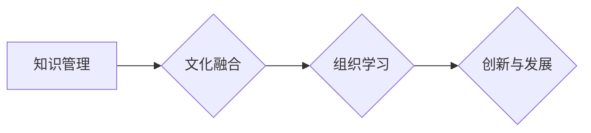

                 

## 关键词：知识管理、跨国公司、文化融合、知识共享、协作平台、组织学习、知识资产

## 1. 背景介绍

随着全球化进程的加速，跨国公司在全球范围内扩张，并面临着日益复杂的文化融合挑战。不同文化背景的员工之间存在着思维方式、价值观、沟通风格等方面的差异，这些差异可能会导致信息传递不畅、协作效率低下、决策失误等问题，阻碍跨国公司的发展。

知识管理（Knowledge Management，KM）作为一种旨在促进组织内知识的创建、共享、应用和保留的系统性方法，在跨国公司文化融合中发挥着越来越重要的作用。通过建立有效的知识管理体系，跨国公司可以有效地克服文化差异带来的挑战，促进知识共享和协作，从而实现文化融合和组织学习。

## 2. 核心概念与联系

### 2.1 知识管理

知识管理是指组织内知识的创建、获取、共享、应用和保留的系统性方法。它涉及到以下几个关键方面：

* **知识的识别和捕捉:** 识别组织内潜在的知识资源，并将其捕捉和记录下来。
* **知识的存储和组织:** 将捕捉到的知识存储在可访问的数据库或平台中，并进行分类和组织。
* **知识的共享和传播:** 促进员工之间知识的共享和传播，打破信息孤岛。
* **知识的应用和创新:** 将知识应用于实际工作中，促进组织的创新和发展。
* **知识的保留和传承:** 保留组织内积累的知识，并将其传承给下一代员工。

### 2.2 文化融合

文化融合是指不同文化背景的人们在相互尊重、理解和包容的基础上，共同创造一种新的文化氛围的过程。它是一个复杂而动态的过程，需要跨国公司付出持续的努力和投入。

### 2.3 知识管理与文化融合的联系

知识管理和文化融合相互促进，共同推动跨国公司的发展。有效的知识管理体系可以帮助跨国公司克服文化差异带来的挑战，促进文化融合。

**Mermaid 流程图**



## 3. 核心算法原理 & 具体操作步骤

### 3.1 算法原理概述

在跨国公司文化融合中，知识管理的核心算法原理是基于**知识图谱**和**协作网络**的构建。

* **知识图谱:** 将组织内知识以图谱的形式表示，包括知识点、关系和属性。知识图谱可以帮助跨国公司更好地理解和组织知识，并促进知识的发现和共享。
* **协作网络:** 建立一个跨国公司员工的协作网络，通过网络平台促进员工之间的沟通和协作。协作网络可以帮助跨国公司打破文化壁垒，促进知识的传播和应用。

### 3.2 算法步骤详解

1. **知识收集和建模:** 收集跨国公司员工的知识，包括经验、技能、案例、文档等，并将其建模为知识图谱。
2. **知识分类和组织:** 将知识图谱中的知识点进行分类和组织，以便于员工查找和使用。
3. **协作平台搭建:** 建立一个跨国公司员工的协作平台，提供知识共享、沟通协作、项目管理等功能。
4. **知识共享和传播:** 鼓励员工在协作平台上分享知识，并提供相应的激励机制。
5. **知识应用和创新:** 促进员工将知识应用于实际工作中，并鼓励员工进行创新。
6. **知识评估和改进:** 定期评估知识管理体系的成效，并根据实际情况进行改进。

### 3.3 算法优缺点

**优点:**

* 能够有效地克服文化差异带来的挑战。
* 促进知识共享和协作，提高组织效率。
* 增强组织的学习能力和创新能力。

**缺点:**

* 建立知识管理体系需要投入大量的时间和资源。
* 需要改变员工的思维方式和工作习惯。
* 需要不断地维护和更新知识库。

### 3.4 算法应用领域

* 跨国公司文化融合
* 组织学习和知识共享
* 创新和技术开发
* 员工培训和发展

## 4. 数学模型和公式 & 详细讲解 & 举例说明

### 4.1 数学模型构建

知识管理在跨国公司文化融合中的作用可以抽象为一个**多变量优化模型**。

其中，目标函数是衡量文化融合程度的指标，例如文化认同度、协作效率、创新能力等。

模型变量包括：

* **知识共享程度:** 员工之间知识的流动和传播程度。
* **文化敏感度:** 员工对不同文化背景的理解和尊重程度。
* **沟通效率:** 员工之间信息传递的流畅程度。
* **协作能力:** 员工之间共同完成任务的能力。

### 4.2 公式推导过程

目标函数可以定义为：

$$
F(x_1, x_2, x_3, x_4) = \alpha_1 x_1 + \alpha_2 x_2 + \alpha_3 x_3 + \alpha_4 x_4
$$

其中：

* $F(x_1, x_2, x_3, x_4)$ 是文化融合程度的指标。
* $x_1, x_2, x_3, x_4$ 分别代表知识共享程度、文化敏感度、沟通效率、协作能力。
* $\alpha_1, \alpha_2, \alpha_3, \alpha_4$ 是各个变量的权重系数。

### 4.3 案例分析与讲解

假设一家跨国公司想要提高文化融合程度，可以通过以下方式调整模型变量：

* **提高知识共享程度:** 建立知识库、组织知识分享活动、鼓励员工之间交流学习。
* **提高文化敏感度:** 进行跨文化培训、组织文化交流活动、营造尊重多元文化的氛围。
* **提高沟通效率:** 使用统一的沟通平台、提供语言培训、建立跨文化沟通指南。
* **提高协作能力:** 组织跨部门协作项目、建立协作团队、提供协作工具和培训。

通过调整这些变量，跨国公司可以提高文化融合程度，促进组织发展。

## 5. 项目实践：代码实例和详细解释说明

### 5.1 开发环境搭建

* 操作系统: Ubuntu 20.04
* 编程语言: Python 3.8
* 开发工具: Jupyter Notebook

### 5.2 源代码详细实现

```python
# 知识图谱构建
import networkx as nx

# 创建知识图谱
graph = nx.Graph()

# 添加知识点
graph.add_node("知识点1")
graph.add_node("知识点2")
graph.add_node("知识点3")

# 添加关系
graph.add_edge("知识点1", "知识点2", relation="包含")
graph.add_edge("知识点2", "知识点3", relation="依赖")

# 协作平台搭建
from flask import Flask, render_template

app = Flask(__name__)

@app.route("/")
def index():
    return render_template("index.html")

if __name__ == "__main__":
    app.run(debug=True)
```

### 5.3 代码解读与分析

* **知识图谱构建:** 使用 Python 的 NetworkX 库构建知识图谱，添加知识点和关系。
* **协作平台搭建:** 使用 Python 的 Flask 库搭建一个简单的协作平台，提供首页展示。

### 5.4 运行结果展示

运行上述代码，可以启动一个简单的协作平台，并通过 NetworkX 库可视化知识图谱。

## 6. 实际应用场景

* **跨国公司员工培训:** 利用知识图谱和协作平台，为跨国公司员工提供跨文化培训，帮助他们了解不同文化背景的知识和习惯。
* **跨国公司项目管理:** 利用协作平台，促进跨国公司项目团队成员之间的沟通和协作，提高项目效率。
* **跨国公司知识共享:** 利用知识图谱和协作平台，促进跨国公司员工之间知识的共享和传播，提高组织的知识资产价值。

### 6.4 未来应用展望

随着人工智能、大数据等技术的不断发展，知识管理在跨国公司文化融合中的作用将更加重要。未来，知识管理系统将更加智能化、个性化和协作化，能够更好地满足跨国公司员工的需求，促进跨国公司文化融合和组织发展。

## 7. 工具和资源推荐

### 7.1 学习资源推荐

* **书籍:**
    * 《知识管理：理论与实践》
    * 《组织学习：知识管理的未来》
* **在线课程:**
    * Coursera: Knowledge Management
    * edX: Managing Knowledge in Organizations

### 7.2 开发工具推荐

* **知识图谱构建工具:**
    * Neo4j
    * GraphDB
* **协作平台开发框架:**
    * Flask
    * Django

### 7.3 相关论文推荐

* **Davenport, T. H., & Prusak, L. (1998). Working knowledge: How organizations manage what they know. Harvard Business School Press.**
* **Nonaka, I., & Takeuchi, H. (1995). The knowledge-creating company: How Japanese companies create the dynamics of innovation. Oxford University Press.**

## 8. 总结：未来发展趋势与挑战

### 8.1 研究成果总结

本文探讨了知识管理在跨国公司文化融合中的作用，并介绍了相关的核心概念、算法原理、应用场景和工具资源。

### 8.2 未来发展趋势

* **人工智能驱动的知识管理:** 利用人工智能技术，实现知识自动识别、分类、推荐和分析，提高知识管理的效率和智能化水平。
* **个性化知识管理:** 根据员工的个性化需求，提供定制化的知识服务，提高知识的利用率和价值。
* **跨平台协作知识管理:** 打破平台和系统之间的壁垒，实现跨平台的知识共享和协作，促进组织的知识流动和融合。

### 8.3 面临的挑战

* **跨文化差异:** 不同文化背景的员工对知识的理解和表达方式存在差异，需要开发跨文化化的知识管理工具和方法。
* **知识共享的激励机制:** 鼓励员工主动分享知识，需要建立有效的激励机制，并营造一种开放、包容的文化氛围。
* **知识管理技术的复杂性:** 知识管理技术涉及多个领域，需要跨学科的合作和人才培养。

### 8.4 研究展望

未来，需要进一步研究人工智能、大数据、云计算等新技术的应用，开发更加智能化、个性化和协作化的知识管理系统，并探索更有效的跨文化知识管理方法，为跨国公司文化融合和组织发展提供更强大的支持。

## 9. 附录：常见问题与解答

**问题:** 如何评估知识管理系统的成效？

**解答:** 可以通过以下指标评估知识管理系统的成效：

* 知识共享程度
* 知识应用率
* 组织学习效率
* 创新能力
* 文化融合程度

**问题:** 如何克服跨文化差异带来的挑战？

**解答:** 可以通过以下方法克服跨文化差异带来的挑战：

* 进行跨文化培训
* 组织文化交流活动
* 建立跨文化沟通指南
* 营造尊重多元文化的氛围

**问题:** 如何激励员工分享知识？

**解答:** 可以通过以下方式激励员工分享知识：

* 建立知识贡献奖励机制
* 提供知识分享平台和工具
* 组织知识分享活动
* 营造开放、包容的文化氛围


作者：禅与计算机程序设计艺术 / Zen and the Art of Computer Programming 
<end_of_turn>

