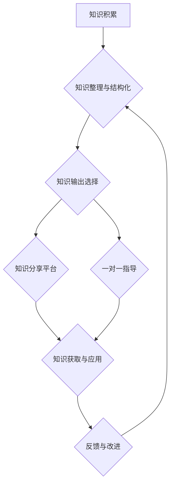

                 

## 知识输出与管理者个人影响力的提升

> 关键词：知识管理、个人影响力、知识输出、领导力、沟通技巧、数据驱动、人工智能

### 1. 背景介绍

在当今瞬息万变的商业环境中，管理者需要具备强大的个人影响力来领导团队、推动决策和实现组织目标。个人影响力并非天生的，而是可以通过不断学习、实践和提升来获得。其中，知识输出扮演着至关重要的角色。

知识输出是指将个人积累的知识、经验和洞察力以有效的方式传递给他人，从而提升他人的认知水平、技能水平和工作效率。对于管理者而言，知识输出不仅可以提升团队整体效能，还能增强自身在团队中的领导地位和影响力。

然而，知识输出并非易事。管理者需要掌握有效的知识传递方法，并能够根据不同的受众群体和情境进行灵活调整。此外，知识输出还需要与数据驱动、人工智能等新兴技术相结合，才能更加高效、精准和可持续。

### 2. 核心概念与联系

**2.1 知识管理与个人影响力**

知识管理 (KM) 是指组织内知识的创建、共享、应用和保留的系统化过程。个人影响力则是指一个人在群体或组织中能够有效地影响他人的能力。两者之间存在着密切的联系：

* **知识是影响力的基础：** 拥有丰富的知识储备和深刻的洞察力，是个人影响力的重要基础。
* **知识输出是影响力的体现：** 通过有效的知识输出，管理者可以将自己的知识和经验传递给团队成员，从而提升团队整体效能和凝聚力，进而增强自身的影响力。
* **知识管理体系支持个人影响力：** 完善的知识管理体系可以帮助管理者更好地组织、存储和分享知识，从而提高知识输出的效率和效果。

**2.2  知识输出与领导力**

领导力是管理者影响力的核心体现。有效的知识输出可以帮助管理者提升领导力，具体体现在以下方面：

* **塑造团队愿景：** 通过清晰地传达自己的知识和洞察力，管理者可以帮助团队成员理解组织目标和战略方向，从而凝聚团队力量，共同实现目标。
* **激发团队创新：** 分享知识和经验可以激发团队成员的思考和创新，促进团队的知识积累和发展。
* **培养团队人才：** 通过知识输出，管理者可以帮助团队成员提升技能水平和专业能力，从而培养团队人才，增强团队竞争力。

**2.3  知识输出与沟通技巧**

有效的知识输出离不开良好的沟通技巧。管理者需要掌握以下沟通技巧：

* **倾听和理解：** 在知识输出之前，需要认真倾听团队成员的需求和问题，才能针对性地提供帮助。
* **清晰表达：** 使用简洁明了的语言，避免使用专业术语或过于复杂的逻辑结构，确保知识能够被团队成员理解。
* **互动和反馈：** 知识输出不是单向的传递，需要与团队成员进行互动，收集反馈，并根据反馈进行调整和改进。

**2.4  知识输出与数据驱动**

数据驱动是现代管理的重要趋势。管理者可以通过数据分析来了解团队成员的知识需求和学习偏好，从而进行更精准的知识输出。

**2.5  知识输出与人工智能**

人工智能技术可以帮助管理者自动化知识输出过程，例如：

* **知识库构建：** 利用人工智能技术自动提取和整理知识，构建知识库，方便团队成员查找和使用。
* **个性化学习推荐：** 根据团队成员的知识需求和学习偏好，人工智能可以推荐个性化的学习资源。
* **智能问答系统：** 利用人工智能技术构建智能问答系统，帮助团队成员快速解决问题。

**2.6  知识输出流程图**



### 3. 核心算法原理 & 具体操作步骤

**3.1  算法原理概述**

知识输出的核心算法原理是基于信息传递和知识图谱构建。

* **信息传递：** 知识输出的核心是将知识从拥有者传递给接收者。这需要考虑知识的类型、形式、接收者的认知水平和学习方式等因素。
* **知识图谱构建：** 知识图谱是一种用于组织和表示知识的结构化数据模型。通过构建知识图谱，可以将知识进行分类、关联和检索，方便知识的发现和利用。

**3.2  算法步骤详解**

1. **知识收集和整理：** 从各种来源收集相关知识，并进行整理和结构化，例如将知识转化为文本、图表、视频等多种形式。
2. **知识分类和标签：** 根据知识的主题、内容和属性进行分类和标签，以便于知识的检索和组织。
3. **知识图谱构建：** 将知识点和关系进行连接，构建知识图谱，以便于知识的发现和推理。
4. **知识输出选择：** 根据接收者的需求和学习方式选择合适的知识输出方式，例如在线课程、文档、视频、一对一指导等。
5. **知识分享平台：** 建立知识分享平台，方便团队成员进行知识交流和学习。
6. **知识评估和反馈：** 收集知识输出的反馈，评估知识的有效性和可理解性，并进行改进和优化。

**3.3  算法优缺点**

* **优点：**
    * 可以有效地组织和管理知识，提高知识的利用效率。
    * 可以根据接收者的需求进行个性化的知识输出，提高学习效果。
    * 可以利用人工智能技术自动化知识输出过程，提高效率和精准度。
* **缺点：**
    * 知识图谱的构建需要投入大量的时间和精力。
    * 知识输出的质量取决于知识的准确性和完整性。
    * 需要不断更新和维护知识库，才能保证知识的时效性。

**3.4  算法应用领域**

* **企业知识管理：** 帮助企业构建知识库，提高知识共享和利用效率。
* **教育培训：** 提供个性化的学习资源和教学方案，提高学习效果。
* **科研研究：** 帮助科研人员快速查找和利用相关知识，加速科研成果的产生。

### 4. 数学模型和公式 & 详细讲解 & 举例说明

**4.1  数学模型构建**

知识输出可以看作是一个信息传递过程，可以用数学模型来描述。

* **信息熵：** 信息熵可以用来衡量知识的不确定性。
* **信息增益：** 信息增益可以用来衡量知识传递的效果。

**4.2  公式推导过程**

* **信息熵公式：**

$$H(X) = - \sum_{i=1}^{n} p(x_i) \log_2 p(x_i)$$

其中：

* $X$ 是一个随机变量，代表知识。
* $p(x_i)$ 是 $x_i$ 的概率。

* **信息增益公式：**

$$Gain(S, A) = H(S) - \sum_{v \in V} \frac{|S_v|}{|S|} H(S_v)$$

其中：

* $S$ 是训练数据集。
* $A$ 是一个特征。
* $V$ 是 $A$ 的取值集合。
* $S_v$ 是 $S$ 中 $A$ 取值为 $v$ 的子集。

**4.3  案例分析与讲解**

假设我们有一个关于水果的知识库，包含苹果、香蕉、橙子三种水果的信息。

* **信息熵：** 如果我们不知道水果是什么，那么信息熵最大。随着我们获取更多关于水果的信息，信息熵会逐渐减小。
* **信息增益：** 如果我们知道水果的颜色，那么我们可以根据颜色来判断水果的种类，从而提高信息增益。

### 5. 项目实践：代码实例和详细解释说明

**5.1  开发环境搭建**

* **操作系统：** Ubuntu 20.04 LTS
* **编程语言：** Python 3.8
* **开发工具：** VS Code
* **库依赖：**

```
pip install numpy pandas matplotlib scikit-learn
```

**5.2  源代码详细实现**

```python
import pandas as pd
from sklearn.tree import DecisionTreeClassifier
from sklearn.model_selection import train_test_split
from sklearn.metrics import accuracy_score

# 加载水果数据集
data = pd.read_csv('fruit_data.csv')

# 选择特征和目标变量
features = ['color', 'shape', 'size']
target = 'fruit_type'

# 将数据分割为训练集和测试集
X_train, X_test, y_train, y_test = train_test_split(data[features], data[target], test_size=0.2, random_state=42)

# 创建决策树模型
model = DecisionTreeClassifier()

# 训练模型
model.fit(X_train, y_train)

# 对测试集进行预测
y_pred = model.predict(X_test)

# 计算模型准确率
accuracy = accuracy_score(y_test, y_pred)
print(f'模型准确率: {accuracy}')
```

**5.3  代码解读与分析**

* **数据加载和预处理：** 使用 pandas 库加载水果数据集，并选择特征和目标变量。
* **数据分割：** 使用 train_test_split 函数将数据分割为训练集和测试集。
* **模型创建和训练：** 使用 DecisionTreeClassifier 类创建决策树模型，并使用 fit 函数对模型进行训练。
* **模型预测：** 使用 predict 函数对测试集进行预测。
* **模型评估：** 使用 accuracy_score 函数计算模型的准确率。

**5.4  运行结果展示**

运行代码后，会输出模型的准确率。

### 6. 实际应用场景

**6.1  企业知识管理系统**

知识输出可以应用于企业知识管理系统，帮助企业构建知识库，提高知识共享和利用效率。例如，可以将员工的经验总结、项目文档、技术方案等知识进行整理和存储，并通过搜索引擎、知识图谱等工具进行检索和访问。

**6.2  在线学习平台**

知识输出可以应用于在线学习平台，提供个性化的学习资源和教学方案。例如，可以根据用户的学习进度、知识水平和学习偏好，推荐相关的课程、视频、练习题等学习资源。

**6.3  远程协作工具**

知识输出可以应用于远程协作工具，帮助团队成员进行知识共享和协作。例如，可以将项目文档、会议记录、讨论内容等知识进行共享和协作编辑，方便团队成员随时随地获取和更新信息。

**6.4  未来应用展望**

随着人工智能技术的不断发展，知识输出将更加智能化、个性化和自动化。例如：

* **智能知识推荐：** 利用人工智能技术分析用户的知识需求和学习偏好，推荐更精准的学习资源。
* **个性化学习路径：** 根据用户的知识水平和学习目标，自动生成个性化的学习路径。
* **虚拟导师：** 利用人工智能技术构建虚拟导师，为用户提供个性化的知识指导和答疑服务。

### 7. 工具和资源推荐

**7.1  学习资源推荐**

* **书籍：**
    * 《知识管理：从理论到实践》
    * 《领导力：影响力的本质》
    * 《沟通的艺术》
* **在线课程：**
    * Coursera: 知识管理
    * Udemy: 领导力
    * edX: 沟通技巧

**7.2  开发工具推荐**

* **知识管理平台：** Confluence, Notion, SharePoint
* **在线学习平台：** Moodle, Canvas, Thinkific
* **远程协作工具：** Slack, Microsoft Teams, Zoom

**7.3  相关论文推荐**

* **知识管理：**
    * Nonaka, I., & Takeuchi, H. (1995). The knowledge-creating company. Oxford University Press.
    * Davenport, T. H. (1994). Saving the best for last: How to make knowledge management work. Harvard Business Review, 72(6), 119-129.
* **领导力：**
    * Bass, B. M. (1990). From transactional to transformational leadership: Learning to lead in changing times. The Leadership Quarterly, 1(3), 3-37.
    * Kouzes, J. M., & Posner, B. Z. (2017). The leadership challenge. Wiley.
* **沟通技巧：**
    * Cialdini, R. B. (2009). Influence: The psychology of persuasion. HarperCollins.
    * Covey, S. R. (1989). The 7 habits of highly effective people. Simon & Schuster.

### 8. 总结：未来发展趋势与挑战

**8.1  研究成果总结**

知识输出的研究取得了显著进展，已经形成了较为完善的理论体系和实践方法。

* **知识管理理论：** 知识管理理论已经发展到从单一的知识存储和共享，到知识创造、应用和创新等更高级的阶段。
* **知识输出方法：** 知识输出方法已经从传统的文档和培训课程，发展到更加灵活和个性化的在线学习平台、虚拟导师等。
* **人工智能技术：** 人工智能技术为知识输出提供了强大的工具支持，例如智能知识推荐、个性化学习路径等。

**8.2  未来发展趋势**

* **更加智能化：** 人工智能技术将进一步推动知识输出的智能化，例如自动生成知识图谱、个性化学习方案等。
* **更加个性化：** 知识输出将更加注重用户的个性化需求，例如根据用户的学习风格、知识水平和学习目标提供定制化的学习资源。
* **更加协作化：** 知识输出将更加强调团队协作，例如构建协作式知识库、共同学习和知识分享平台等。

**8.3  面临的挑战**

* **知识质量问题：** 知识输出的质量取决于知识的准确性和完整性，需要建立有效的知识审核和评估机制。
* **知识共享问题：** 知识共享需要克服组织文化、利益冲突等方面的障碍，需要建立有效的激励机制和知识共享平台。
* **技术应用问题：** 人工智能技术在知识输出中的应用还面临着技术瓶颈和伦理挑战，需要不断探索和完善。

**8.4  研究展望**

未来，知识输出的研究将更加注重以下方面：

* **知识质量评估和提升：** 研究更加有效的知识质量评估方法和知识提升机制。
* **知识共享机制设计：** 研究更加有效的知识共享机制，促进知识的流通和应用。
* **人工智能技术应用：** 研究人工智能技术在知识输出中的更广泛和深入的应用，例如智能知识发现、个性化知识推荐等。


### 9. 附录：常见问题与解答

**9.1  知识输出的难点是什么？**

知识输出的难点在于：

* **知识的抽象性和复杂性：** 知识往往是抽象的和复杂的，需要找到合适的表达方式才能被有效地传递。
* **接收者的认知水平和学习方式：** 知识输出需要根据接收者的认知水平和学习方式进行调整，才能保证知识的理解和应用。
* **知识的时效性和更新性：** 知识是不断更新的，需要建立有效的知识更新机制，保证知识的时效性。

**9.2  如何提高知识输出的效率？**

提高知识输出效率的方法包括：

* **使用合适的知识输出工具：** 利用知识管理平台、在线学习平台等工具，提高知识的组织、存储和分享效率。
* **采用有效的知识传递方法：** 使用多种知识传递方法，例如讲座、案例分析、互动讨论等，提高知识的理解和应用。
* **建立有效的知识反馈机制：** 收集知识输出的反馈，及时进行改进和优化，提高知识输出的质量和效果。


作者：禅与计算机程序设计艺术 / Zen and the Art of Computer Programming<end_of_turn>

