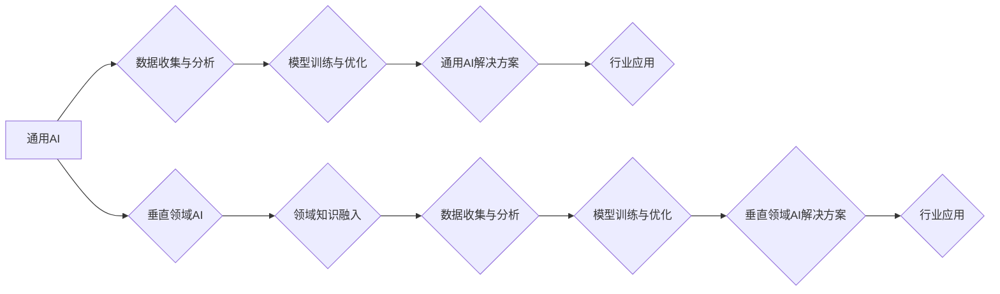

                 

## 硅谷的多元化发展：AI企业创新，探索垂直领域独特价值

> 关键词：人工智能、垂直领域、AI企业、创新、硅谷、行业应用、深度学习、机器学习、数据驱动

## 1. 背景介绍

硅谷，作为全球科技创新的中心，近年来见证了人工智能（AI）的爆发式发展。从最初的语音识别和图像处理，到如今的自然语言处理、推荐系统和自动驾驶，AI技术正在深刻地改变着各个行业。然而，随着AI技术的成熟，我们也开始看到一个新的趋势：AI企业不再局限于通用型解决方案，而是开始专注于特定垂直领域，探索AI技术在特定领域中的独特价值。

这种多元化发展趋势的背后，是AI技术的不断进步和数据量的爆炸式增长。一方面，深度学习算法的突破，使得AI模型能够更精准地理解和处理复杂的数据；另一方面，云计算和大数据技术的普及，为AI企业提供了海量数据训练和应用的平台。

垂直领域AI企业，通过对特定行业的深入了解和数据积累，能够开发出更精准、更有效的AI解决方案，满足特定行业的独特需求。例如，在医疗领域，AI企业可以利用患者的电子病历、影像数据等信息，开发出辅助诊断、个性化治疗的AI系统；在金融领域，AI企业可以利用交易数据、客户行为数据等信息，开发出风险控制、欺诈检测的AI系统。

## 2. 核心概念与联系

### 2.1 垂直领域AI

垂直领域AI是指将人工智能技术应用于特定行业或领域的实践。这种应用方式不同于通用型AI，它更注重针对特定行业的具体问题和需求，开发出定制化的AI解决方案。

### 2.2 数据驱动

数据驱动是垂直领域AI的核心驱动力。AI模型的训练和优化都需要大量的数据支持。垂直领域AI企业通过收集和分析行业数据，能够为AI模型提供更精准、更丰富的训练数据，从而提升AI模型的性能和准确性。

### 2.3 领域知识

领域知识是垂直领域AI成功的关键因素之一。AI企业需要具备对特定行业的深刻理解，才能开发出真正切实可行的AI解决方案。

**Mermaid 流程图**



## 3. 核心算法原理 & 具体操作步骤

### 3.1 算法原理概述

垂直领域AI通常采用深度学习算法，例如卷积神经网络（CNN）、循环神经网络（RNN）和Transformer等。这些算法能够从海量数据中学习复杂的模式和特征，从而实现对特定问题的精准解决。

### 3.2 算法步骤详解

1. **数据收集与预处理:** 收集与目标领域相关的海量数据，并进行清洗、格式化和特征提取等预处理工作。
2. **模型选择与训练:** 根据具体应用场景选择合适的深度学习算法，并利用收集到的数据进行模型训练。
3. **模型评估与优化:** 通过测试集评估模型的性能，并根据评估结果进行模型参数调整和优化。
4. **模型部署与应用:** 将训练好的模型部署到实际应用场景中，并进行持续监控和维护。

### 3.3 算法优缺点

**优点:**

* **高精度:** 深度学习算法能够学习复杂的模式和特征，从而实现对特定问题的精准解决。
* **自动化:** 深度学习模型的训练和优化过程可以自动化，降低人工成本。
* **可扩展性:** 深度学习模型可以轻松扩展到更大的数据集和更复杂的应用场景。

**缺点:**

* **数据依赖:** 深度学习算法需要大量的数据进行训练，否则模型性能会下降。
* **计算资源需求:** 深度学习模型的训练需要大量的计算资源，成本较高。
* **可解释性:** 深度学习模型的决策过程较为复杂，难以解释其背后的逻辑。

### 3.4 算法应用领域

垂直领域AI算法广泛应用于各个行业，例如：

* **医疗保健:** 辅助诊断、个性化治疗、药物研发
* **金融服务:** 风险控制、欺诈检测、客户服务
* **制造业:** 质量控制、预测维护、生产优化
* **零售业:** 商品推荐、库存管理、客户关系管理
* **教育:** 个性化学习、智能辅导、自动批改

## 4. 数学模型和公式 & 详细讲解 & 举例说明

### 4.1 数学模型构建

垂直领域AI的数学模型通常基于统计学习和机器学习理论，例如线性回归、逻辑回归、支持向量机、决策树等。这些模型通过学习数据中的模式和关系，建立起预测或分类的数学关系。

### 4.2 公式推导过程

例如，线性回归模型的目标是找到一条直线，使得预测值与真实值之间的误差最小。其数学公式如下：

$$y = w_0 + w_1x_1 + w_2x_2 + ... + w_nx_n + \epsilon$$

其中：

* $y$ 是预测值
* $x_1, x_2, ..., x_n$ 是输入特征
* $w_0, w_1, w_2, ..., w_n$ 是模型参数
* $\epsilon$ 是误差项

通过最小化误差函数，例如均方误差，可以求解出模型参数 $w_0, w_1, w_2, ..., w_n$。

### 4.3 案例分析与讲解

例如，在医疗领域，可以使用线性回归模型预测患者的住院时间。输入特征可以包括患者的年龄、性别、疾病类型、治疗方案等，而输出特征是患者的住院时间。通过训练模型，可以建立起预测住院时间的数学关系，帮助医生制定更合理的治疗方案。

## 5. 项目实践：代码实例和详细解释说明

### 5.1 开发环境搭建

垂直领域AI项目的开发环境通常包括以下组件：

* **操作系统:** Linux 或 macOS
* **编程语言:** Python
* **深度学习框架:** TensorFlow、PyTorch、Keras
* **数据处理工具:** Pandas、NumPy
* **云计算平台:** AWS、Azure、GCP

### 5.2 源代码详细实现

以下是一个使用Python和TensorFlow框架实现图像分类的简单代码示例：

```python
import tensorflow as tf

# 定义模型结构
model = tf.keras.models.Sequential([
  tf.keras.layers.Conv2D(32, (3, 3), activation='relu', input_shape=(28, 28, 1)),
  tf.keras.layers.MaxPooling2D((2, 2)),
  tf.keras.layers.Conv2D(64, (3, 3), activation='relu'),
  tf.keras.layers.MaxPooling2D((2, 2)),
  tf.keras.layers.Flatten(),
  tf.keras.layers.Dense(10, activation='softmax')
])

# 编译模型
model.compile(optimizer='adam',
              loss='sparse_categorical_crossentropy',
              metrics=['accuracy'])

# 训练模型
model.fit(x_train, y_train, epochs=5)

# 评估模型
loss, accuracy = model.evaluate(x_test, y_test)
print('Test loss:', loss)
print('Test accuracy:', accuracy)
```

### 5.3 代码解读与分析

这段代码定义了一个简单的卷积神经网络模型，用于图像分类任务。模型包含两个卷积层、两个最大池化层、一个全连接层和一个输出层。

* **Conv2D层:** 用于提取图像特征。
* **MaxPooling2D层:** 用于降维，减少计算量。
* **Flatten层:** 将多维特征转换为一维向量。
* **Dense层:** 用于分类。

模型使用Adam优化器、交叉熵损失函数和准确率作为评估指标。

### 5.4 运行结果展示

训练完成后，模型可以用来预测新的图像类别。

## 6. 实际应用场景

### 6.1 医疗保健

* **辅助诊断:** AI模型可以分析患者的影像数据，例如X光片、CT扫描和MRI扫描，辅助医生诊断疾病。
* **个性化治疗:** AI模型可以根据患者的基因信息、病史和生活方式等数据，制定个性化的治疗方案。
* **药物研发:** AI模型可以加速药物研发过程，例如预测药物的活性、安全性以及潜在的副作用。

### 6.2 金融服务

* **风险控制:** AI模型可以分析客户的信用记录、交易行为等数据，评估客户的风险等级，帮助金融机构防范欺诈和信用风险。
* **欺诈检测:** AI模型可以识别异常交易行为，例如重复交易、高额交易和跨境交易，帮助金融机构防范欺诈。
* **客户服务:** AI模型可以提供智能客服，例如聊天机器人，帮助金融机构提高客户服务效率。

### 6.3 制造业

* **质量控制:** AI模型可以分析生产过程中的数据，例如产品尺寸、重量和外观等信息，识别产品缺陷，提高产品质量。
* **预测维护:** AI模型可以分析设备运行数据，预测设备故障，帮助企业提前进行维护，降低设备停机时间。
* **生产优化:** AI模型可以优化生产流程，例如生产计划、资源分配和物流管理，提高生产效率。

### 6.4 未来应用展望

随着AI技术的不断发展，垂直领域AI将应用于更多领域，例如教育、农业、能源等。AI将帮助企业提高效率、降低成本、创造新的价值。

## 7. 工具和资源推荐

### 7.1 学习资源推荐

* **在线课程:** Coursera、edX、Udacity
* **书籍:** 深度学习，机器学习，自然语言处理
* **博客:** Towards Data Science、Machine Learning Mastery

### 7.2 开发工具推荐

* **深度学习框架:** TensorFlow、PyTorch、Keras
* **数据处理工具:** Pandas、NumPy
* **云计算平台:** AWS、Azure、GCP

### 7.3 相关论文推荐

* **深度学习论文:** ImageNet Classification with Deep Convolutional Neural Networks
* **机器学习论文:** The Elements of Statistical Learning
* **自然语言处理论文:** Attention Is All You Need

## 8. 总结：未来发展趋势与挑战

### 8.1 研究成果总结

垂直领域AI已经取得了显著的成果，在医疗保健、金融服务、制造业等领域取得了广泛应用。

### 8.2 未来发展趋势

* **模型更加精准:** 随着算法的不断改进和数据量的增加，AI模型的预测精度和分类准确率将进一步提高。
* **应用场景更加广泛:** AI将应用于更多领域，例如教育、农业、能源等。
* **模型更加可解释:** 研究人员将致力于开发更加可解释的AI模型，帮助人们理解AI模型的决策过程。

### 8.3 面临的挑战

* **数据获取和隐私保护:** 垂直领域AI需要大量的数据进行训练，如何获取高质量的数据并保护用户隐私是一个重要的挑战。
* **模型可移植性和通用性:** 不同领域的AI模型可能难以移植到其他领域，如何提高模型的可移植性和通用性是一个重要的研究方向。
* **伦理和社会影响:** AI技术的应用可能会带来一些伦理和社会问题，例如算法偏见、就业替代等，需要引起人们的重视和讨论。

### 8.4 研究展望

未来，垂直领域AI将继续朝着更加精准、更加广泛、更加可解释的方向发展。研究人员将致力于解决数据获取、模型可移植性和伦理等挑战，推动AI技术在各个领域的应用，为人类社会创造更大的价值。

## 9. 附录：常见问题与解答

**Q1: 垂直领域AI与通用AI有什么区别？**

**A1:** 通用AI是指能够执行各种任务的AI系统，而垂直领域AI是指针对特定行业或领域的AI系统。通用AI的目标是创造能够像人类一样思考和学习的AI，而垂直领域AI的目标是解决特定领域的特定问题。

**Q2: 如何选择合适的深度学习算法？**

**A2:** 选择合适的深度学习算法取决于具体的应用场景和数据特点。例如，图像分类任务通常使用卷积神经网络，而自然语言处理任务通常使用循环神经网络或Transformer。

**Q3: 如何解决数据获取和隐私保护问题？**

**A3:** 数据获取可以通过公开数据集、数据合作平台等方式获得。隐私保护可以通过数据匿名化、联邦学习等技术实现。

**作者：禅与计算机程序设计艺术 / Zen and the Art of Computer Programming** 


<end_of_turn>

