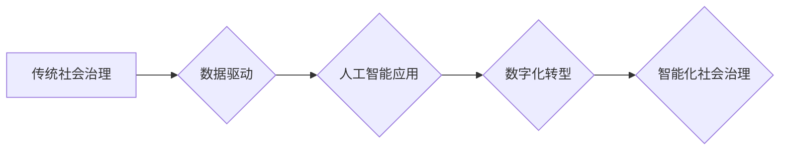

                 

## 科技创新：社会治理的新思路

> 关键词：人工智能、社会治理、科技创新、算法、数据分析、可持续发展、伦理规范

## 1. 背景介绍

在当今世界，科技创新正以惊人的速度发展，深刻地改变着人类社会生活的方方面面。人工智能、大数据、云计算等新兴技术不断涌现，为社会治理带来了前所未有的机遇和挑战。传统社会治理模式面临着效率低下、信息不对称、决策滞后等问题，迫切需要借助科技力量进行革新。

社会治理是一个复杂而多维的系统，涉及到经济、政治、文化、社会等多个领域。传统的社会治理模式往往依赖于人为主导的决策和管理，效率低下，难以应对日益复杂的社会问题。而科技创新，特别是人工智能技术的应用，为社会治理提供了新的思路和方法。

## 2. 核心概念与联系

### 2.1  人工智能在社会治理中的应用

人工智能（AI）是指模拟人类智能行为的计算机系统。在社会治理领域，AI技术可以应用于多个方面，例如：

* **预测分析:** 利用大数据分析和机器学习算法，预测社会问题发生趋势，为决策提供数据支持。
* **智能决策:** 基于AI算法，对复杂社会问题进行分析和评估，辅助决策者做出更科学、更有效的决策。
* **流程优化:** 利用AI技术自动化处理重复性任务，提高社会治理效率。
* **公众服务:** 开发AI驱动的智能客服系统，为公众提供更便捷、更智能化的服务。

### 2.2  数据驱动式社会治理

数据是人工智能技术的核心驱动力。数据驱动式社会治理是指利用大数据分析和人工智能技术，从海量数据中挖掘价值，为社会治理提供决策依据。

数据驱动式社会治理的优势在于：

* **科学决策:** 基于数据分析，决策更加客观、科学。
* **提高效率:** 自动化处理数据，提高社会治理效率。
* **增强透明度:** 数据公开透明，提高社会治理的透明度。

### 2.3  社会治理的数字化转型

社会治理的数字化转型是指利用信息技术，将传统社会治理模式数字化，提高效率、透明度和可持续性。

数字化转型包括以下几个方面：

* **信息化建设:** 建设完善的社会治理信息平台，实现数据共享和协同办公。
* **智能化应用:** 利用人工智能技术，开发智能化社会治理应用，提高决策效率和服务水平。
* **开放式平台:** 建设开放式社会治理平台，鼓励社会各界参与社会治理。

**Mermaid 流程图**



## 3. 核心算法原理 & 具体操作步骤

### 3.1  算法原理概述

在社会治理领域，常用的算法包括：

* **机器学习算法:** 用于从数据中学习模式，进行预测和分类。例如，用于预测犯罪热点、识别欺诈行为等。
* **深度学习算法:** 是一种更高级的机器学习算法，能够处理更复杂的数据，例如图像、语音等。
* **自然语言处理算法:** 用于处理和理解自然语言文本，例如用于分析舆情、自动生成报告等。

### 3.2  算法步骤详解

以机器学习算法为例，其基本步骤包括：

1. **数据收集:** 收集与社会治理相关的海量数据。
2. **数据预处理:** 对数据进行清洗、转换、特征提取等处理，使其适合算法训练。
3. **模型选择:** 选择合适的机器学习算法模型。
4. **模型训练:** 利用训练数据，训练机器学习模型。
5. **模型评估:** 利用测试数据，评估模型的性能。
6. **模型部署:** 将训练好的模型部署到实际应用场景中。

### 3.3  算法优缺点

**优点:**

* **自动化:** 可以自动化处理大量数据，提高效率。
* **精准度:** 可以根据数据分析，做出更精准的预测和决策。
* **可扩展性:** 可以根据需要扩展算法模型，处理更复杂的数据。

**缺点:**

* **数据依赖:** 算法性能依赖于数据质量和数量。
* **黑盒效应:** 一些算法模型难以解释其决策过程，缺乏透明度。
* **伦理风险:** 算法可能存在偏见，导致不公平的结果。

### 3.4  算法应用领域

* **公共安全:** 预测犯罪热点、识别潜在威胁、辅助执法。
* **医疗卫生:** 辅助诊断、预测疾病风险、优化医疗资源配置。
* **教育:** 个性化学习推荐、自动批改作业、辅助教师教学。
* **环境保护:** 监测环境污染、预测自然灾害、优化资源利用。

## 4. 数学模型和公式 & 详细讲解 & 举例说明

### 4.1  数学模型构建

在社会治理领域，可以使用数学模型来描述社会现象和系统行为。例如，可以使用SIR模型来描述疾病传播过程，可以使用Agent-Based Modeling来模拟社会群体行为。

### 4.2  公式推导过程

以SIR模型为例，其基本公式如下：

* $S(t) = \frac{N}{1 + \frac{R(t)}{I(t)}}$

其中：

* $S(t)$:  t时刻未感染人数
* $I(t)$:  t时刻感染人数
* $R(t)$:  t时刻已康复人数
* $N$:  总人口数

该公式描述了感染者、未感染者和已康复者之间的动态关系。

### 4.3  案例分析与讲解

SIR模型可以用于预测疾病传播趋势，为疫情防控提供决策依据。例如，在新冠疫情期间，可以使用SIR模型预测疫情传播速度和高峰期，制定相应的防控措施。

## 5. 项目实践：代码实例和详细解释说明

### 5.1  开发环境搭建

* **操作系统:** Ubuntu 20.04 LTS
* **编程语言:** Python 3.8
* **开发工具:** Jupyter Notebook
* **库依赖:** numpy, pandas, matplotlib, scikit-learn

### 5.2  源代码详细实现

```python
import numpy as np
import matplotlib.pyplot as plt

# SIR模型参数
N = 1000  # 总人口数
I0 = 1  # 初始感染者数
R0 = 0  # 初始已康复者数
S0 = N - I0 - R0  # 初始未感染者数
beta = 0.5  # 传染率
gamma = 0.2  # 恢复率

# 时间步长
dt = 0.1
# 模拟时间
t_max = 50

# 初始化数据
t = np.arange(0, t_max, dt)
S = np.zeros(len(t))
I = np.zeros(len(t))
R = np.zeros(len(t))

# 设置初始值
S[0] = S0
I[0] = I0
R[0] = R0

# SIR模型迭代计算
for i in range(1, len(t)):
    dS = -beta * S[i-1] * I[i-1] / N
    dI = beta * S[i-1] * I[i-1] / N - gamma * I[i-1]
    dR = gamma * I[i-1]
    S[i] = S[i-1] + dS * dt
    I[i] = I[i-1] + dI * dt
    R[i] = R[i-1] + dR * dt

# 绘制SIR模型曲线
plt.plot(t, S, label='未感染者')
plt.plot(t, I, label='感染者')
plt.plot(t, R, label='已康复者')
plt.xlabel('时间')
plt.ylabel('人数')
plt.legend()
plt.show()
```

### 5.3  代码解读与分析

该代码实现了一个简单的SIR模型，模拟了疾病传播过程。

* 首先，定义了SIR模型的参数，包括总人口数、初始感染者数、初始已康复者数、传染率和恢复率。
* 然后，使用NumPy库创建了一个时间数组，并初始化了未感染者、感染者和已康复者的数量。
* 接着，使用循环迭代计算每个时间点的未感染者、感染者和已康复者数量，并根据SIR模型公式更新数据。
* 最后，使用Matplotlib库绘制了SIR模型曲线，展示了疾病传播过程。

### 5.4  运行结果展示

运行该代码后，会生成一个曲线图，展示了未感染者、感染者和已康复者数量随时间的变化趋势。

## 6. 实际应用场景

### 6.1  公共安全领域

* **犯罪预测:** 利用机器学习算法分析历史犯罪数据，预测未来犯罪热点，帮助警方部署警力。
* **交通管理:** 利用大数据分析和人工智能技术，优化交通信号灯控制，缓解交通拥堵。
* **公共安全事件预警:** 利用传感器数据和机器学习算法，识别潜在的安全威胁，及时预警和处置。

### 6.2  医疗卫生领域

* **疾病预防:** 利用数据分析和机器学习算法，预测疾病流行趋势，制定预防措施。
* **精准医疗:** 利用基因组数据和人工智能技术，为患者提供个性化的医疗方案。
* **医疗资源优化:** 利用数据分析和人工智能技术，优化医疗资源配置，提高医疗服务效率。

### 6.3  教育领域

* **个性化学习:** 利用人工智能技术，根据学生的学习情况，提供个性化的学习内容和建议。
* **智能批改:** 利用自然语言处理技术，自动批改学生的作业，提高教师的工作效率。
* **在线教育平台:** 利用人工智能技术，开发智能化的在线教育平台，提供更便捷、更有效的学习体验。

### 6.4  未来应用展望

随着人工智能技术的不断发展，其在社会治理领域的应用将更加广泛和深入。未来，人工智能将可能在以下方面发挥更大的作用：

* **更精准的预测和决策:** 利用更先进的算法和更丰富的數據，实现更精准的社会问题预测和决策。
* **更智能化的服务:** 开发更智能化的社会治理应用，为公众提供更便捷、更智能化的服务。
* **更可持续的社会发展:** 利用人工智能技术，优化资源配置，促进可持续发展。

## 7. 工具和资源推荐

### 7.1  学习资源推荐

* **在线课程:** Coursera, edX, Udacity 等平台提供人工智能、数据科学等相关课程。
* **书籍:** 《深度学习》、《机器学习实战》等书籍。
* **开源社区:** GitHub, Kaggle 等平台提供丰富的开源代码和数据资源。

### 7.2  开发工具推荐

* **编程语言:** Python, R 等。
* **机器学习库:** scikit-learn, TensorFlow, PyTorch 等。
* **数据分析工具:** Pandas, NumPy 等。

### 7.3  相关论文推荐

* **深度学习论文:** 《ImageNet Classification with Deep Convolutional Neural Networks》
* **机器学习论文:** 《Support Vector Machines》
* **社会治理论文:** 《The Use of Artificial Intelligence in Public Policy》

## 8. 总结：未来发展趋势与挑战

### 8.1  研究成果总结

科技创新为社会治理带来了新的机遇和挑战。人工智能、大数据等技术为社会治理提供了新的思路和方法，可以提高效率、透明度和可持续性。

### 8.2  未来发展趋势

未来，社会治理将更加数字化、智能化和可持续化。人工智能技术将更加深入地应用于社会治理各个领域，为社会发展提供更强大的支持。

### 8.3  面临的挑战

* **数据安全和隐私保护:** 社会治理的数字化转型需要处理大量敏感数据，如何保障数据安全和隐私保护是重要的挑战。
* **算法公平性和可解释性:** 算法可能存在偏见，导致不公平的结果，如何确保算法公平性和可解释性是需要解决的问题。
* **伦理规范和法律法规:** 人工智能技术的应用涉及到伦理和法律问题，需要制定相应的规范和法律法规。

### 8.4  研究展望

未来，社会治理领域需要加强对人工智能技术的研发和应用，探索人工智能与社会治理的融合发展路径，推动社会治理的创新发展。

## 9. 附录：常见问题与解答

**Q1: 人工智能技术在社会治理中的应用有哪些？**

**A1:** 人工智能技术在社会治理中的应用非常广泛，例如：预测犯罪热点、识别欺诈行为、辅助诊断、个性化学习、优化交通管理等。

**Q2: 人工智能技术在社会治理中的伦理问题有哪些？**

**A2:** 人工智能技术的应用可能存在算法偏见、数据隐私泄露、决策透明度不足等伦理问题，需要加强伦理规范和法律法规的制定。

**Q3: 如何保障人工智能技术在社会治理中的安全性和可靠性？**

**A3:** 需要加强人工智能算法的安全性测试和评估，建立健全的监管机制，确保人工智能技术在社会治理中的安全性和可靠性。


作者：禅与计算机程序设计艺术 / Zen and the Art of Computer Programming<end_of_turn>

