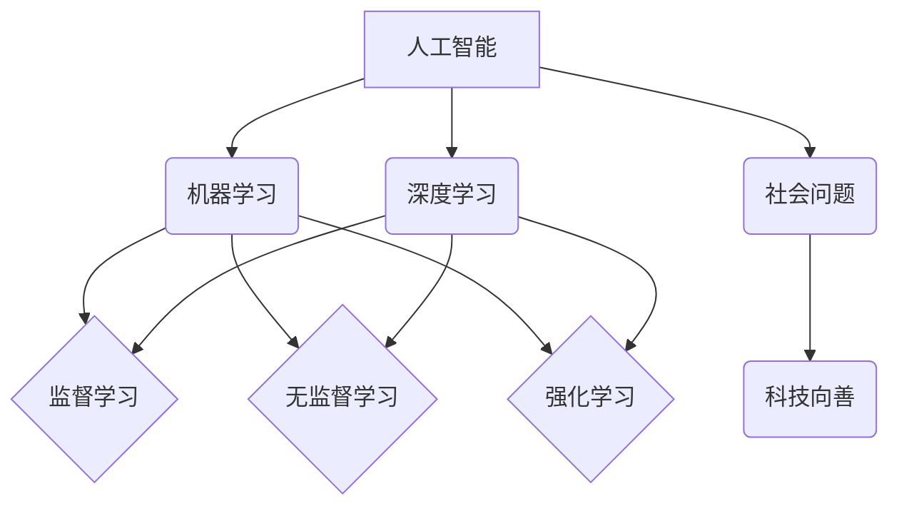

                 

## 科技向善：用科技的力量解决社会难题

> 关键词：人工智能、机器学习、深度学习、社会问题、可持续发展、伦理、技术创新

### 1. 背景介绍

人类社会正处于前所未有的变革时期，科技发展日新月异，深刻地改变着我们的生活方式、工作模式和社会结构。人工智能（AI）作为科技发展的重要驱动力，正在展现出强大的潜力，为解决社会难题提供新的思路和方法。然而，科技发展也带来了一系列伦理和社会挑战，如何确保科技向善，造福人类社会，成为我们共同面临的课题。

### 2. 核心概念与联系

**2.1  人工智能（AI）**

人工智能是指模拟人类智能行为的计算机系统。它涵盖了广泛的领域，包括机器学习、深度学习、自然语言处理、计算机视觉等。

**2.2  机器学习（ML）**

机器学习是人工智能的一个重要分支，它使计算机能够从数据中学习，并根据学习到的知识进行预测或决策。机器学习算法可以分为监督学习、无监督学习和强化学习三种类型。

**2.3  深度学习（DL）**

深度学习是机器学习的一个子领域，它利用多层神经网络来模拟人类大脑的学习过程。深度学习算法在图像识别、语音识别、自然语言处理等领域取得了突破性的进展。

**2.4  社会问题**

社会问题是指影响社会稳定、发展和福祉的各种问题，例如贫困、疾病、教育不平等、环境污染等。

**2.5  科技向善**

科技向善是指利用科技的力量解决社会问题，促进人类社会进步和福祉。

**核心概念与联系流程图**



### 3. 核心算法原理 & 具体操作步骤

**3.1  算法原理概述**

机器学习算法的核心原理是通过训练模型来学习数据中的模式和规律。训练模型的过程通常包括以下步骤：

1. **数据收集和预处理:** 收集相关数据并进行清洗、转换和特征工程等预处理操作。

2. **模型选择:** 根据具体问题选择合适的机器学习算法模型。

3. **模型训练:** 使用训练数据训练模型，调整模型参数以最小化预测误差。

4. **模型评估:** 使用测试数据评估模型的性能，例如准确率、召回率、F1-score等。

5. **模型部署:** 将训练好的模型部署到实际应用场景中，用于预测或决策。

**3.2  算法步骤详解**

以监督学习中的线性回归算法为例，详细说明其步骤：

1. **数据收集和预处理:** 收集包含输入特征和目标变量的数据集。

2. **特征选择:** 选择与目标变量相关的特征作为模型输入。

3. **模型构建:** 建立线性回归模型，其表达式为：y = w0 + w1*x1 + w2*x2 + ... + wn*xn，其中y为目标变量，x1, x2, ..., xn为输入特征，w0, w1, w2, ..., wn为模型参数。

4. **模型训练:** 使用梯度下降算法优化模型参数，使其能够最小化预测误差。

5. **模型评估:** 使用测试数据评估模型的性能，例如均方误差（MSE）或R-squared值。

6. **模型部署:** 将训练好的模型部署到实际应用场景中，例如预测房价、股票价格等。

**3.3  算法优缺点**

**优点:**

* 算法简单易懂，易于实现。

* 训练速度相对较快。

* 可解释性强，模型参数具有直观意义。

**缺点:**

* 对非线性关系的拟合能力较弱。

* 对异常值敏感。

* 只能处理数值型特征。

**3.4  算法应用领域**

线性回归算法广泛应用于以下领域：

* 房价预测

* 股票价格预测

* 销售预测

* 医疗诊断

* 经济预测

### 4. 数学模型和公式 & 详细讲解 & 举例说明

**4.1  数学模型构建**

线性回归模型的数学表达式为：

$$y = w0 + w1*x1 + w2*x2 + ... + wn*xn + \epsilon$$

其中：

* y 为目标变量
* x1, x2, ..., xn 为输入特征
* w0, w1, w2, ..., wn 为模型参数
* $\epsilon$ 为误差项

**4.2  公式推导过程**

模型参数的优化目标是最小化预测误差，常用的优化方法是梯度下降算法。梯度下降算法通过迭代更新模型参数，逐步逼近最小误差点。

**4.3  案例分析与讲解**

假设我们想要预测房屋价格，输入特征包括房屋面积、房间数、地理位置等，目标变量为房屋价格。我们可以使用线性回归模型来建立房屋价格预测模型。

通过训练模型，我们可以得到模型参数，例如：

* w0 = 100000
* w1 = 500
* w2 = 10000

这意味着，房屋面积每增加1平方米，价格会增加500元；房间数每增加1个，价格会增加10000元。

### 5. 项目实践：代码实例和详细解释说明

**5.1  开发环境搭建**

本项目使用Python语言进行开发，需要安装以下软件：

* Python 3.x

* Scikit-learn

* NumPy

* Pandas

**5.2  源代码详细实现**

```python
import pandas as pd
from sklearn.linear_model import LinearRegression
from sklearn.model_selection import train_test_split

# 加载数据
data = pd.read_csv('house_price.csv')

# 选择特征和目标变量
X = data[['area', 'rooms']]
y = data['price']

# 将数据划分为训练集和测试集
X_train, X_test, y_train, y_test = train_test_split(X, y, test_size=0.2, random_state=42)

# 创建线性回归模型
model = LinearRegression()

# 训练模型
model.fit(X_train, y_train)

# 预测测试集数据
y_pred = model.predict(X_test)

# 评估模型性能
from sklearn.metrics import mean_squared_error
mse = mean_squared_error(y_test, y_pred)
print('均方误差:', mse)
```

**5.3  代码解读与分析**

1. 首先，我们加载数据并选择特征和目标变量。

2. 然后，我们将数据划分为训练集和测试集，用于训练和评估模型。

3. 接下来，我们创建线性回归模型并使用训练数据进行训练。

4. 训练完成后，我们使用测试数据进行预测，并评估模型性能。

**5.4  运行结果展示**

运行代码后，会输出模型的均方误差值，该值越小，模型的预测精度越高。

### 6. 实际应用场景

**6.1  医疗诊断**

人工智能可以用于分析患者的医疗影像数据，辅助医生进行疾病诊断。例如，深度学习算法可以用于识别肺癌、乳腺癌等疾病。

**6.2  精准农业**

人工智能可以用于分析农业数据，例如土壤条件、天气预报、作物生长情况等，帮助农民提高产量和降低成本。例如，无人机可以利用人工智能技术进行田间巡逻，识别病虫害并进行精准喷洒。

**6.3  金融风险控制**

人工智能可以用于分析金融数据，识别欺诈行为和金融风险。例如，银行可以使用人工智能技术进行客户风险评估，防止贷款欺诈。

**6.4  未来应用展望**

随着人工智能技术的不断发展，其应用场景将更加广泛，例如：

* 自动驾驶

* 个性化教育

* 智能家居

* 人机交互

### 7. 工具和资源推荐

**7.1  学习资源推荐**

* **在线课程:** Coursera、edX、Udacity等平台提供丰富的机器学习和深度学习课程。

* **书籍:** 《深度学习》、《机器学习实战》等书籍是学习人工智能的经典教材。

* **开源项目:** TensorFlow、PyTorch等开源项目提供了丰富的机器学习工具和资源。

**7.2  开发工具推荐**

* **Python:** Python 是机器学习和深度学习开发的常用语言。

* **Jupyter Notebook:** Jupyter Notebook 是一个交互式编程环境，方便进行机器学习实验和代码调试。

* **Scikit-learn:** Scikit-learn 是一个 Python 机器学习库，提供了丰富的算法和工具。

**7.3  相关论文推荐**

* **《ImageNet Classification with Deep Convolutional Neural Networks》**

* **《Attention Is All You Need》**

* **《BERT: Pre-training of Deep Bidirectional Transformers for Language Understanding》**

### 8. 总结：未来发展趋势与挑战

**8.1  研究成果总结**

近年来，人工智能取得了显著的进展，在图像识别、语音识别、自然语言处理等领域取得了突破性的成果。

**8.2  未来发展趋势**

未来，人工智能将朝着以下方向发展：

* **更强大的计算能力:** 随着计算能力的提升，人工智能模型将更加复杂和强大。

* **更丰富的学习数据:** 数据是人工智能发展的关键要素，未来将会有更多的数据被用于训练人工智能模型。

* **更广泛的应用场景:** 人工智能将应用于越来越多的领域，例如医疗、教育、金融等。

**8.3  面临的挑战**

人工智能发展也面临着一些挑战：

* **算法可解释性:** 许多人工智能算法难以解释其决策过程，这可能导致信任问题。

* **数据隐私和安全:** 人工智能的训练和应用需要大量数据，如何保护数据隐私和安全是一个重要问题。

* **伦理问题:** 人工智能的应用可能带来一些伦理问题，例如算法偏见、工作岗位替代等。

**8.4  研究展望**

未来，我们需要加强人工智能伦理研究，制定相应的规范和政策，确保人工智能技术安全、可控、可持续地发展，造福人类社会。

### 9. 附录：常见问题与解答

**9.1  什么是机器学习？**

机器学习是一种人工智能技术，它使计算机能够从数据中学习，并根据学习到的知识进行预测或决策。

**9.2  什么是深度学习？**

深度学习是机器学习的一个子领域，它利用多层神经网络来模拟人类大脑的学习过程。

**9.3  人工智能有哪些应用场景？**

人工智能的应用场景非常广泛，例如医疗诊断、精准农业、金融风险控制、自动驾驶等。

**9.4  如何学习人工智能？**

可以通过在线课程、书籍、开源项目等方式学习人工智能。

**9.5  人工智能的未来发展趋势是什么？**

未来，人工智能将朝着更强大的计算能力、更丰富的学习数据、更广泛的应用场景的方向发展。


作者：禅与计算机程序设计艺术 / Zen and the Art of Computer Programming 
<end_of_turn>

