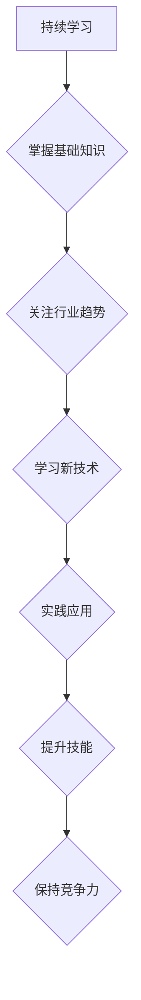

                 

## 程序员如何应对技术栈快速迭代

> 关键词：技术栈、迭代、学习、适应、未来趋势、持续学习、编程技能、职业发展

### 1. 背景介绍

在当今科技飞速发展的时代，技术栈的迭代速度令人眼花缭乱。新技术层出不穷，旧技术不断被更新迭代，程序员们面临着前所未有的挑战。如何应对技术栈的快速迭代，保持自身的竞争力，成为程序员们共同关心的问题。

### 2. 核心概念与联系

**2.1 技术栈的定义**

技术栈是指开发软件或应用程序所使用的各种技术、工具和框架的集合。它包括编程语言、框架、数据库、操作系统、云平台等多个方面。

**2.2 技术栈迭代的驱动因素**

技术栈的快速迭代主要由以下几个因素驱动：

* **用户需求的变化:** 用户对软件功能和体验的要求不断提高，迫使开发人员采用新的技术来满足这些需求。
* **硬件技术的进步:** 硬件技术的进步为开发人员提供了更强大的计算能力和存储空间，促进了新的技术和架构的出现。
* **算法和模型的创新:** 算法和模型的创新为开发人员提供了新的解决方案和思路，推动了技术栈的更新迭代。
* **开源社区的贡献:** 开源社区的活跃发展为技术栈的迭代提供了源源不断的动力，新的开源工具和框架不断涌现。

**2.3 技术栈迭代对程序员的影响**

技术栈的快速迭代对程序员的影响是多方面的：

* **学习压力:** 程序员需要不断学习新的技术和工具，才能跟上技术发展步伐。
* **职业发展:** 掌握最新的技术栈可以提升程序员的职业竞争力，获得更好的职业发展机会。
* **工作效率:** 掌握合适的技术栈可以提高程序员的工作效率，更快地完成项目开发。

**2.4 技术栈迭代的应对策略**

程序员需要采取积极的应对策略，才能在技术栈快速迭代的时代保持竞争力。

**Mermaid 流程图**

### 3. 核心算法原理 & 具体操作步骤

**3.1 算法原理概述**

在技术栈快速迭代的时代，掌握一些核心算法的原理和操作步骤，可以帮助程序员更快速地学习和应用新的技术。

**3.2 算法步骤详解**

* **排序算法:** 常见的排序算法包括冒泡排序、插入排序、快速排序、归并排序等。
* **搜索算法:** 常见的搜索算法包括线性搜索、二分搜索等。
* **图算法:** 常见的图算法包括深度优先搜索、广度优先搜索、最小生成树算法等。
* **动态规划算法:** 动态规划算法是一种解决复杂问题的优化算法，它通过将问题分解成子问题，并存储子问题的解，来避免重复计算。

**3.3 算法优缺点**

不同的算法具有不同的优缺点，程序员需要根据实际情况选择合适的算法。

**3.4 算法应用领域**

核心算法在各个领域都有广泛的应用，例如：

* **数据结构:** 算法是数据结构的基础，用于实现数据存储、访问和操作。
* **人工智能:** 算法是人工智能的核心，用于实现机器学习、深度学习等功能。
* **网络安全:** 算法用于加密、解密、身份验证等网络安全领域。

### 4. 数学模型和公式 & 详细讲解 & 举例说明

**4.1 数学模型构建**

数学模型可以用来描述和分析算法的性能。例如，时间复杂度和空间复杂度是常用的数学模型，用于衡量算法的效率。

**4.2 公式推导过程**

时间复杂度和空间复杂度通常用大O符号来表示。

* **时间复杂度:** 指的是算法执行时间随输入规模变化的增长率。
* **空间复杂度:** 指的是算法执行过程中使用的内存空间大小。

**4.3 案例分析与讲解**

例如，冒泡排序算法的时间复杂度为O(n^2)，空间复杂度为O(1)。

**4.4 数学公式**

$$
T(n) = O(n^2)
$$

$$
S(n) = O(1)
$$

### 5. 项目实践：代码实例和详细解释说明

**5.1 开发环境搭建**

程序员需要选择合适的开发环境，例如：

* **操作系统:** Windows、Linux、macOS
* **编程语言:** Python、Java、C++
* **IDE:** Eclipse、IntelliJ IDEA、VS Code

**5.2 源代码详细实现**

程序员需要根据项目需求编写源代码，并进行测试和调试。

**5.3 代码解读与分析**

程序员需要对代码进行解读和分析，理解代码的逻辑和功能。

**5.4 运行结果展示**

程序员需要运行代码，并观察运行结果，确保代码能够正常工作。

### 6. 实际应用场景

**6.1  电商平台**

技术栈在电商平台的应用场景非常广泛，例如：

* **商品推荐:** 利用机器学习算法，根据用户的浏览历史和购买记录，推荐相关的商品。
* **支付系统:** 利用安全可靠的支付平台，保障用户的支付安全。
* **物流管理:** 利用物流管理系统，优化物流配送流程，提高配送效率。

**6.2  社交媒体平台**

技术栈在社交媒体平台的应用场景也十分重要，例如：

* **用户身份验证:** 利用安全可靠的身份验证机制，保障用户的账号安全。
* **内容推荐:** 利用算法推荐用户感兴趣的内容，提高用户粘性。
* **消息推送:** 利用消息推送系统，及时通知用户最新信息。

**6.3  金融科技**

技术栈在金融科技领域的应用场景日益广泛，例如：

* **风险控制:** 利用机器学习算法，识别和控制金融风险。
* **欺诈检测:** 利用机器学习算法，识别和预防金融欺诈行为。
* **个性化金融服务:** 利用大数据分析，提供个性化的金融服务。

**6.4 未来应用展望**

随着技术的不断发展，技术栈在各个领域的应用场景将会更加广泛，例如：

* **元宇宙:** 技术栈将为元宇宙的构建提供基础支撑。
* **Web3.0:** 技术栈将推动Web3.0的开发和应用。
* **人工智能:** 技术栈将成为人工智能发展的关键基础。

### 7. 工具和资源推荐

**7.1 学习资源推荐**

* **在线课程:** Coursera、edX、Udemy
* **书籍:** 《程序员的自我修养》、《代码的艺术》
* **博客:** Hacker News、Medium

**7.2 开发工具推荐**

* **版本控制系统:** Git、GitHub
* **代码编辑器:** VS Code、Sublime Text
* **调试工具:** GDB、LLDB

**7.3 相关论文推荐**

* **算法导论:** Cormen, Leiserson, Rivest, Stein
* **深入理解计算机系统:** Hennessy, Patterson

### 8. 总结：未来发展趋势与挑战

**8.1 研究成果总结**

技术栈的快速迭代对程序员提出了新的挑战，但也带来了新的机遇。掌握核心算法原理、学习新的技术栈、不断提升自身技能，是程序员在技术时代保持竞争力的关键。

**8.2 未来发展趋势**

未来技术栈的迭代速度将会更快，新的技术和工具将会不断涌现。程序员需要具备持续学习的能力，才能跟上技术发展步伐。

**8.3 面临的挑战**

* **学习成本:** 新技术的学习成本越来越高，程序员需要投入更多的时间和精力进行学习。
* **知识更新速度:** 技术更新速度非常快，程序员需要不断更新自己的知识，才能保持竞争力。
* **职业发展压力:** 技术栈的快速迭代导致程序员的职业发展压力越来越大，需要不断提升自身技能，才能获得更好的职业发展机会。

**8.4 研究展望**

未来研究方向包括：

* **自动化学习:** 研究如何利用人工智能技术，自动学习和掌握新的技术栈。
* **个性化学习:** 研究如何根据程序员的学习风格和需求，提供个性化的学习方案。
* **跨领域学习:** 研究如何帮助程序员跨领域学习，掌握更广泛的技术知识。

### 9. 附录：常见问题与解答

**9.1 如何选择合适的技术栈？**

选择合适的技术栈需要根据项目需求、团队经验、市场趋势等因素综合考虑。

**9.2 如何保持持续学习？**

* **关注行业趋势:** 阅读技术博客、参加技术会议、关注开源社区。
* **实践应用:** 将学习到的知识应用到实际项目中，巩固学习成果。
* **与他人交流:** 与其他程序员交流学习经验，互相学习。

**9.3 如何应对技术栈的快速迭代？**

* **保持开放心态:** 接受新的技术和工具，不断学习和适应。
* **掌握核心技能:** 掌握一些核心算法和编程思想，可以帮助你快速学习新的技术。
* **注重实践:** 将学习到的知识应用到实际项目中，才能真正掌握技术。

作者：禅与计算机程序设计艺术 / Zen and the Art of Computer Programming 
<end_of_turn>

