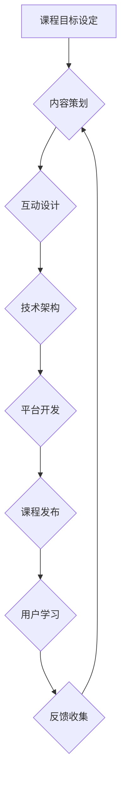

                 

## 程序员知识付费：打造沉浸式课程

> 关键词：知识付费、程序员、沉浸式学习、在线课程、教学设计、技术社区、课程营销

### 1. 背景介绍

近年来，随着互联网技术的发展和普及，知识付费行业蓬勃发展，其中程序员领域的知识付费市场尤为火爆。大量程序员涌入知识付费领域，分享自己的技术经验和学习心得，而程序员也越来越愿意通过付费的方式获取高质量的学习资源。

然而，传统的在线课程模式往往存在着内容枯燥、互动性差、学习体验不佳等问题，难以真正满足程序员对深度学习的需求。因此，如何打造沉浸式课程，提升程序员的学习体验，成为知识付费领域亟待解决的关键问题。

### 2. 核心概念与联系

**2.1 沉浸式学习**

沉浸式学习是指一种能够将学习者完全融入到学习环境中，增强学习者的参与度和体验感的一种学习方式。它强调将理论知识与实践操作相结合，通过互动、体验、游戏化等手段，激发学习者的学习兴趣和动力。

**2.2 程序员知识付费**

程序员知识付费是指程序员通过线上平台或线下活动，将自己的技术知识和经验以付费的形式提供给其他程序员。它涵盖了各种形式的知识产权，例如视频课程、在线文档、代码库、技术博客等。

**2.3 课程设计与技术架构**

打造沉浸式程序员课程需要结合课程设计理念和技术架构，构建一个能够满足程序员深度学习需求的学习平台。

**Mermaid 流程图**



### 3. 核心算法原理 & 具体操作步骤

**3.1 算法原理概述**

沉浸式课程的打造需要运用多种算法原理，例如推荐算法、个性化学习算法、知识图谱构建算法等，以实现个性化学习推荐、知识点关联分析、学习进度追踪等功能。

**3.2 算法步骤详解**

* **推荐算法:** 基于用户学习历史、兴趣偏好、知识点掌握情况等数据，推荐相关课程、学习资源和技术社区。
* **个性化学习算法:** 根据用户的学习进度、掌握情况和学习风格，动态调整学习内容、学习节奏和学习方式，提供个性化的学习路径。
* **知识图谱构建算法:** 将课程内容、技术概念、代码示例等信息构建成知识图谱，实现知识点之间的关联分析和知识导航。

**3.3 算法优缺点**

* **推荐算法:** 优点：能够精准推荐用户感兴趣的学习资源，提高用户学习效率。缺点：容易陷入推荐偏差，缺乏多样性。
* **个性化学习算法:** 优点：能够根据用户的实际情况提供定制化的学习体验，提高学习效果。缺点：需要大量用户数据进行训练和优化，算法复杂度较高。
* **知识图谱构建算法:** 优点：能够构建知识体系，帮助用户理解知识之间的关联，提升学习深度。缺点：知识图谱构建需要大量人工标注和维护，成本较高。

**3.4 算法应用领域**

* **在线教育平台:** 推荐课程、个性化学习路径、知识点关联分析等。
* **技术社区:** 推荐技术文档、代码示例、技术论坛等。
* **软件开发工具:** 代码自动补全、代码错误提示、代码优化建议等。

### 4. 数学模型和公式 & 详细讲解 & 举例说明

**4.1 数学模型构建**

沉浸式课程的构建可以抽象为一个多变量优化问题，目标是最大化用户学习体验，其中涉及到用户兴趣、学习进度、知识掌握情况、课程内容质量等多个因素。

**4.2 公式推导过程**

假设用户学习体验可以用以下公式表示：

$$
Learning Experience = f(Interest, Progress, Mastery, Quality)
$$

其中：

* Interest: 用户对课程的兴趣程度
* Progress: 用户的学习进度
* Mastery: 用户对知识点的掌握程度
* Quality: 课程内容的质量

每个因素都可以用具体的指标进行量化，例如：

* Interest: 点击率、观看时长、评论数量等
* Progress: 完成章节数量、学习时长、知识点覆盖率等
* Mastery: 知识点测试成绩、代码实践能力等
* Quality: 课程内容的完整性、准确性、实用性等

通过对这些指标进行分析和优化，可以不断提升用户学习体验。

**4.3 案例分析与讲解**

例如，对于一个编程课程，我们可以通过分析用户的代码实践能力，判断其对知识点的掌握程度。如果用户的代码实践能力较低，我们可以推荐一些相关的练习题或案例，帮助用户巩固知识点。

### 5. 项目实践：代码实例和详细解释说明

**5.1 开发环境搭建**

打造沉浸式程序员课程需要搭建一个完整的开发环境，包括服务器、数据库、前端框架、后端框架等。

**5.2 源代码详细实现**

以下是一个简单的沉浸式课程平台的代码示例，使用 Python 和 Flask 框架实现：

```python
from flask import Flask, render_template

app = Flask(__name__)

@app.route('/')
def index():
    return render_template('index.html')

if __name__ == '__main__':
    app.run(debug=True)
```

**5.3 代码解读与分析**

这段代码定义了一个简单的 Flask 应用程序，提供一个首页。

* `from flask import Flask, render_template`: 导入 Flask 框架和模板渲染功能。
* `app = Flask(__name__)`: 创建一个 Flask 应用程序实例。
* `@app.route('/')`: 定义一个路由规则，当访问根路径 '/' 时，执行 `index()` 函数。
* `def index()`: 定义首页函数，返回 `index.html` 模板文件。
* `if __name__ == '__main__':`: 确保代码只在脚本执行时运行。
* `app.run(debug=True)`: 启动 Flask 应用程序，开启调试模式。

**5.4 运行结果展示**

运行这段代码后，访问 `http://127.0.0.1:5000/`，将会看到一个简单的网页。

### 6. 实际应用场景

**6.1 在线编程课程平台**

沉浸式课程可以应用于在线编程课程平台，例如 Codecademy、Udemy、Coursera 等，提供更具互动性和体验感的学习体验。

**6.2 技术社区论坛**

沉浸式课程可以应用于技术社区论坛，例如 Stack Overflow、GitHub 等，提供更深入的技术学习资源和社区互动。

**6.3 企业内部培训**

企业可以利用沉浸式课程进行内部培训，例如软件开发培训、数据分析培训等，提高员工的技能水平和工作效率。

**6.4 未来应用展望**

随着人工智能、虚拟现实、增强现实等技术的不断发展，沉浸式课程将更加智能化、个性化、交互化，为程序员提供更丰富的学习体验。

### 7. 工具和资源推荐

**7.1 学习资源推荐**

* **在线课程平台:** Codecademy, Udemy, Coursera, edX
* **技术社区论坛:** Stack Overflow, GitHub, Reddit
* **技术博客:** Hacker News, Medium, Dev.to

**7.2 开发工具推荐**

* **前端框架:** React, Vue.js, Angular
* **后端框架:** Flask, Django, Node.js
* **数据库:** MySQL, PostgreSQL, MongoDB

**7.3 相关论文推荐**

* **Immersive Learning Environments for Software Engineering Education**
* **Personalized Learning in Software Engineering Education**
* **Knowledge Graph Construction for Software Engineering Education**

### 8. 总结：未来发展趋势与挑战

**8.1 研究成果总结**

沉浸式课程为程序员提供了更具互动性和体验感的学习方式，能够提升学习效率和学习效果。

**8.2 未来发展趋势**

未来，沉浸式课程将更加智能化、个性化、交互化，并与人工智能、虚拟现实、增强现实等技术深度融合。

**8.3 面临的挑战**

* **技术实现难度:** 构建沉浸式课程需要整合多种技术，技术实现难度较高。
* **内容制作成本:** 制作高质量的沉浸式课程内容需要投入大量人力和物力。
* **用户体验设计:** 需要不断优化用户体验，确保课程能够真正满足用户的学习需求。

**8.4 研究展望**

未来，需要进一步研究沉浸式课程的教学效果、用户体验设计、技术架构优化等方面，推动沉浸式课程在程序员知识付费领域的应用和发展。

### 9. 附录：常见问题与解答

**9.1 如何打造沉浸式课程？**

打造沉浸式课程需要结合课程设计理念和技术架构，构建一个能够满足程序员深度学习需求的学习平台。

**9.2 沉浸式课程有哪些优势？**

沉浸式课程能够提升用户学习兴趣、学习效率和学习效果，提供更具互动性和体验感的学习体验。

**9.3 沉浸式课程有哪些应用场景？**

沉浸式课程可以应用于在线编程课程平台、技术社区论坛、企业内部培训等场景。


作者：禅与计算机程序设计艺术 / Zen and the Art of Computer Programming 
<end_of_turn>

