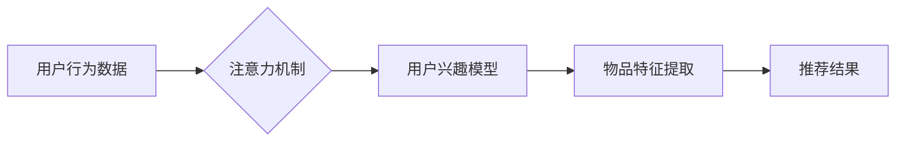

                 

## 1. 背景介绍

在信息爆炸的时代，海量数据无处不在，如何有效地从其中提取有价值的信息成为了一个关键问题。推荐系统作为信息过滤和个性化服务的核心技术，在电商、社交媒体、新闻资讯等领域发挥着越来越重要的作用。传统的推荐算法往往依赖于用户的历史行为数据，但随着用户行为的复杂性和数据规模的不断增长，这些算法的准确性和泛化能力面临着挑战。

注意力机制作为一种模仿人类认知机制的新兴技术，在自然语言处理、计算机视觉等领域取得了显著的成果。它能够学习到数据中最重要的部分，并对这些部分给予更多的关注，从而提高模型的性能。近年来，注意力机制也被应用于推荐系统，取得了令人瞩目的效果。

## 2. 核心概念与联系

### 2.1  推荐系统

推荐系统旨在根据用户的历史行为、偏好和上下文信息，预测用户对特定物品的兴趣，并推荐最相关的物品。常见的推荐算法包括基于内容的推荐、基于协同过滤的推荐和基于深度学习的推荐。

### 2.2  注意力机制

注意力机制是一种模仿人类视觉和语言理解机制的技术，它能够学习到数据中最重要的部分，并对这些部分给予更多的关注。注意力机制的核心思想是通过一个加权机制，将输入数据中的不同部分赋予不同的权重，从而突出重要信息。

### 2.3  注意力机制在推荐系统中的应用

注意力机制可以应用于推荐系统的多个环节，例如：

* **用户兴趣建模:** 通过注意力机制学习用户对不同物品的兴趣程度，构建更精准的用户兴趣模型。
* **物品特征提取:** 通过注意力机制学习物品最重要的特征，提高物品表示的有效性。
* **推荐排序:** 通过注意力机制学习用户对不同物品的偏好排序，提高推荐结果的准确性。

**Mermaid 流程图**



## 3. 核心算法原理 & 具体操作步骤

### 3.1  算法原理概述

注意力机制的核心思想是通过一个加权机制，将输入数据中的不同部分赋予不同的权重，从而突出重要信息。在推荐系统中，注意力机制通常用于学习用户对不同物品的兴趣程度，或者学习物品最重要的特征。

常见的注意力机制模型包括：

* **自注意力机制 (Self-Attention):**  用于学习序列中不同元素之间的关系，可以捕捉到长距离依赖关系。
* **交叉注意力机制 (Cross-Attention):** 用于学习两个不同序列之间的关系，例如用户行为序列和物品特征序列。

### 3.2  算法步骤详解

**以自注意力机制为例，其具体操作步骤如下：**

1. **计算查询 (Query)、键 (Key) 和值 (Value) 向量:** 将输入序列映射到三个不同的向量空间，分别表示查询、键和值。
2. **计算注意力权重:** 使用查询向量和键向量的点积计算注意力权重，权重表示每个元素对查询的关注程度。
3. **对值向量进行加权求和:** 使用注意力权重对值向量进行加权求和，得到最终的输出向量。

### 3.3  算法优缺点

**优点:**

* 能够学习到数据中最重要的部分，提高模型的性能。
* 可以捕捉到长距离依赖关系。
* 适用于多种数据类型，例如文本、图像和时间序列。

**缺点:**

* 计算复杂度较高。
* 需要大量的训练数据。
* 训练过程可能比较困难。

### 3.4  算法应用领域

注意力机制在推荐系统、自然语言处理、计算机视觉等领域都有广泛的应用。

* **推荐系统:** 用于学习用户兴趣、物品特征和推荐排序。
* **自然语言处理:** 用于机器翻译、文本摘要、问答系统等任务。
* **计算机视觉:** 用于图像识别、目标检测、图像分割等任务。

## 4. 数学模型和公式 & 详细讲解 & 举例说明

### 4.1  数学模型构建

假设我们有一个输入序列 $X = \{x_1, x_2, ..., x_n\}$, 其中每个元素 $x_i$ 代表一个单词或一个特征。我们想要学习到每个元素对查询的关注程度，并将其表示为一个注意力权重向量 $A = \{a_1, a_2, ..., a_n\}$.

### 4.2  公式推导过程

注意力权重 $a_i$ 可以通过以下公式计算:

$$a_i = \frac{exp(score(x_i, q))}{\sum_{j=1}^{n} exp(score(x_j, q))}$$

其中，$q$ 是查询向量，$score(x_i, q)$ 是查询向量 $q$ 和键向量 $x_i$ 之间的相似度得分，通常使用点积计算。

### 4.3  案例分析与讲解

例如，假设我们有一个查询向量 $q$ 和一个输入序列 $X = \{“猫”，“狗”，“鸟”\}$，我们想要学习到每个单词对查询的关注程度。

我们可以将每个单词映射到一个键向量 $K = \{k_1, k_2, k_3\}$, 其中 $k_i$ 是单词 $x_i$ 的键向量。然后，我们可以计算每个单词的注意力权重 $a_i = \frac{exp(score(k_i, q))}{\sum_{j=1}^{3} exp(score(k_j, q))}$.

最终，注意力权重向量 $A$ 可以表示为 $\{a_1, a_2, a_3\}$, 其中 $a_i$ 表示单词 $x_i$ 对查询 $q$ 的关注程度。

## 5. 项目实践：代码实例和详细解释说明

### 5.1  开发环境搭建

* Python 3.x
* TensorFlow 或 PyTorch
* Jupyter Notebook

### 5.2  源代码详细实现

```python
import tensorflow as tf

# 定义自注意力机制层
class SelfAttention(tf.keras.layers.Layer):
    def __init__(self, units):
        super(SelfAttention, self).__init__()
        self.Wq = tf.keras.layers.Dense(units)
        self.Wk = tf.keras.layers.Dense(units)
        self.Wv = tf.keras.layers.Dense(units)
        self.fc = tf.keras.layers.Dense(units)

    def call(self, inputs):
        # 分别计算查询、键和值向量
        q = self.Wq(inputs)
        k = self.Wk(inputs)
        v = self.Wv(inputs)

        # 计算注意力权重
        attention_scores = tf.matmul(q, k, transpose_b=True) / tf.math.sqrt(tf.cast(units, tf.float32))
        attention_weights = tf.nn.softmax(attention_scores, axis=-1)

        # 对值向量进行加权求和
        context_vector = tf.matmul(attention_weights, v)

        # 将上下文向量映射到输出空间
        output = self.fc(context_vector)

        return output

# 示例用法
inputs = tf.random.normal((1, 10, 512))
attention_layer = SelfAttention(units=512)
output = attention_layer(inputs)
print(output.shape)
```

### 5.3  代码解读与分析

* 该代码定义了一个自注意力机制层 `SelfAttention`, 其中包含三个稠密层用于计算查询、键和值向量，以及一个稠密层用于将上下文向量映射到输出空间。
* `call` 方法实现了自注意力机制的核心逻辑，包括计算注意力权重和对值向量进行加权求和。
* 示例用法演示了如何使用 `SelfAttention` 层对输入数据进行处理。

### 5.4  运行结果展示

运行该代码会输出一个形状为 `(1, 10, 512)` 的张量，表示经过自注意力机制处理后的输出。

## 6. 实际应用场景

### 6.1  电商推荐

注意力机制可以用于学习用户对不同商品的兴趣程度，并推荐最相关的商品。例如，在淘宝的商品推荐系统中，注意力机制可以学习到用户对不同商品属性的关注程度，例如颜色、品牌、价格等，从而推荐更符合用户需求的商品。

### 6.2  新闻推荐

注意力机制可以用于学习用户对不同新闻主题的兴趣程度，并推荐最相关的新闻。例如，在今日头条的新闻推荐系统中，注意力机制可以学习到用户对不同新闻类别、作者、时间段的关注程度，从而推荐更符合用户兴趣的新闻。

### 6.3  个性化广告

注意力机制可以用于学习用户对不同广告的兴趣程度，并推荐最相关的广告。例如，在腾讯广告平台的个性化广告系统中，注意力机制可以学习到用户对不同广告类别、产品、品牌、价格的关注程度，从而推荐更符合用户需求的广告。

### 6.4  未来应用展望

随着注意力机制的不断发展，其在推荐系统中的应用场景将会更加广泛。例如，注意力机制可以用于：

* **多模态推荐:** 将文本、图像、视频等多种模态信息融合在一起，构建更全面的用户兴趣模型。
* **动态推荐:** 根据用户的实时行为和上下文信息，动态调整推荐结果。
* **解释性推荐:** 解释推荐结果背后的逻辑，提高用户对推荐系统的信任度。

## 7. 工具和资源推荐

### 7.1  学习资源推荐

* **论文:**
    * Attention Is All You Need (Vaswani et al., 2017)
    * Transformer-XL: Attentive Language Models Beyond a Fixed-Length Context (Dai et al., 2019)
* **博客:**
    * The Illustrated Transformer (Jay Alammar)
    * Attention is All You Need: A Visual Explanation (Distill.pub)

### 7.2  开发工具推荐

* **TensorFlow:** https://www.tensorflow.org/
* **PyTorch:** https://pytorch.org/

### 7.3  相关论文推荐

* **BERT:** Devlin et al., 2018
* **GPT-3:** Brown et al., 2020
* **T5:** Raffel et al., 2019

## 8. 总结：未来发展趋势与挑战

### 8.1  研究成果总结

注意力机制在推荐系统中的应用取得了显著的成果，能够有效地提高推荐系统的准确性和泛化能力。

### 8.2  未来发展趋势

未来，注意力机制在推荐系统中的应用将会更加深入和广泛，例如：

* **多模态注意力:** 将文本、图像、视频等多种模态信息融合在一起，构建更全面的用户兴趣模型。
* **动态注意力:** 根据用户的实时行为和上下文信息，动态调整推荐结果。
* **解释性注意力:** 解释推荐结果背后的逻辑，提高用户对推荐系统的信任度。

### 8.3  面临的挑战

尽管注意力机制取得了显著的成果，但仍面临一些挑战，例如：

* **计算复杂度:** 随着模型规模的增大，注意力机制的计算复杂度也会随之增加，需要寻找更有效的计算方法。
* **数据依赖性:** 注意力机制需要大量的训练数据，在数据稀疏的情况下，模型性能会下降。
* **可解释性:** 注意力机制的决策过程相对复杂，难以解释模型的推荐结果，需要提高模型的可解释性。

### 8.4  研究展望

未来，研究者将继续探索注意力机制在推荐系统中的应用，并致力于解决上述挑战，以构建更智能、更精准、更可解释的推荐系统。

## 9. 附录：常见问题与解答

### 9.1  Q: 注意力机制和深度学习有什么关系？

### 9.2  A:

注意力机制是一种深度学习中的重要技术，它可以帮助深度学习模型学习到数据中最重要的部分，从而提高模型的性能。

### 9.3  Q: 注意力机制有哪些应用场景？

### 9.4  A:

注意力机制在推荐系统、自然语言处理、计算机视觉等领域都有广泛的应用。

### 9.5  Q: 如何选择合适的注意力机制模型？

### 9.6  A:

选择合适的注意力机制模型需要根据具体应用场景和数据特点进行选择。例如，对于序列数据，自注意力机制是一个不错的选择；对于两个不同序列之间的关系，交叉注意力机制是一个更好的选择。


作者：禅与计算机程序设计艺术 / Zen and the Art of Computer Programming 
<end_of_turn>

