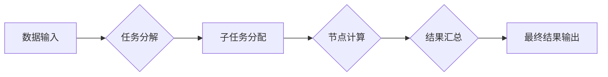

                 

## 群体智慧：人类计算的未来之路

> 关键词：群体智慧、人类计算、协同计算、分布式人工智能、大规模数据分析、机器学习、算法优化、社会网络分析

## 1. 背景介绍

随着人工智能技术的飞速发展，我们正处于一个前所未有的时代。传统的人工智能系统主要依赖于中心化的计算模型，由单个或少数强大的计算机完成复杂的计算任务。然而，随着数据量的爆炸式增长和计算能力的提升，传统的中心化模型面临着瓶颈。

群体智慧，也称为协同计算，是一种全新的计算范式，它充分利用了大量分散的计算资源和人类智慧的优势，通过协同合作完成复杂的任务。群体智慧的核心思想是将分散的计算任务分解成多个子任务，并由多个独立的计算节点协同完成。这些节点可以是计算机、移动设备、传感器甚至人类，它们通过网络连接，共享信息和计算结果，最终实现比单个节点更强大的计算能力。

## 2. 核心概念与联系

群体智慧的核心概念包括：

* **分布式计算:** 将计算任务分解成多个子任务，并由多个独立的计算节点协同完成。
* **协同合作:** 计算节点之间通过网络连接，共享信息和计算结果，共同完成任务。
* **自组织:** 计算节点无需事先规划，能够自动组织和协作，形成高效的计算网络。
* **集体智能:** 通过群体计算，能够实现比单个节点更强大的智能和决策能力。

**Mermaid 流程图:**



## 3. 核心算法原理 & 具体操作步骤

### 3.1  算法原理概述

群体智慧算法通常基于以下原理：

* **并行计算:** 将任务分解成多个子任务，并行执行，提高计算效率。
* **信息共享:** 计算节点之间共享信息和计算结果，避免重复计算，提高计算精度。
* **反馈机制:** 通过反馈机制，不断调整计算策略，优化计算结果。

### 3.2  算法步骤详解

1. **数据预处理:** 将原始数据进行清洗、转换和格式化，以便于后续计算。
2. **任务分解:** 将复杂任务分解成多个子任务，每个子任务可以由单个节点独立完成。
3. **子任务分配:** 将子任务分配给不同的计算节点，根据节点的计算能力和资源情况进行分配。
4. **节点计算:** 计算节点根据分配的任务，进行计算并生成结果。
5. **结果汇总:** 收集所有节点的计算结果，进行汇总和整合。
6. **最终结果输出:** 将汇总后的结果进行处理和输出，作为最终的计算结果。

### 3.3  算法优缺点

**优点:**

* **高并行度:** 能够充分利用多台计算节点的计算资源，提高计算效率。
* **容错性强:** 即使部分节点出现故障，也能保证整体计算任务的完成。
* **可扩展性强:** 可以根据需要增加计算节点，扩展计算能力。

**缺点:**

* **算法设计复杂:** 需要设计高效的算法和调度策略，才能保证计算效率和准确性。
* **数据同步问题:** 需要解决节点之间数据同步的问题，避免数据冲突和计算错误。
* **网络通信成本:** 节点之间需要频繁通信，可能会增加网络通信成本。

### 3.4  算法应用领域

群体智慧算法广泛应用于以下领域:

* **大规模数据分析:** 处理海量数据，发现隐藏的模式和趋势。
* **机器学习:** 训练复杂的机器学习模型，提高模型的精度和泛化能力。
* **科学计算:** 解决复杂的科学问题，例如蛋白质折叠、气候模拟等。
* **金融预测:** 预测股票价格、风险评估等。
* **推荐系统:** 为用户推荐个性化的商品和服务。

## 4. 数学模型和公式 & 详细讲解 & 举例说明

### 4.1  数学模型构建

群体智慧算法的数学模型通常基于概率论、统计学和图论等学科。

* **概率论:** 用于描述节点之间的信息传递和决策过程。
* **统计学:** 用于分析节点的计算结果和群体决策的准确性。
* **图论:** 用于描述节点之间的连接关系和信息传播路径。

### 4.2  公式推导过程

例如，在群体决策问题中，我们可以使用以下公式来描述节点的决策过程:

$$
p_i = \frac{\sum_{j \in N(i)} w_{ij} \cdot f_j}{\sum_{j \in N(i)} w_{ij}}
$$

其中:

* $p_i$ 是节点 $i$ 的决策概率。
* $N(i)$ 是节点 $i$ 的邻居节点集合。
* $w_{ij}$ 是节点 $i$ 和节点 $j$ 之间的权重，表示节点之间的信任度或影响力。
* $f_j$ 是节点 $j$ 的决策结果。

### 4.3  案例分析与讲解

例如，在社交网络中，我们可以使用群体智慧算法来预测用户的兴趣爱好。

假设我们有一个社交网络，其中每个用户都有一个兴趣爱好标签。我们可以将用户之间的关系表示为一个图，其中节点代表用户，边代表用户之间的关系。

然后，我们可以使用上述公式来计算每个用户的兴趣爱好预测概率。

例如，如果用户 $A$ 和用户 $B$ 是朋友，并且用户 $B$ 的兴趣爱好标签是“音乐”，那么用户 $A$ 的“音乐”兴趣爱好预测概率会增加。

## 5. 项目实践：代码实例和详细解释说明

### 5.1  开发环境搭建

* 操作系统: Ubuntu 20.04
* 编程语言: Python 3.8
* 软件包: numpy, pandas, matplotlib, scikit-learn

### 5.2  源代码详细实现

```python
import numpy as np
from sklearn.neighbors import KNeighborsClassifier

# 数据加载
data = np.loadtxt("data.csv", delimiter=",")
labels = np.loadtxt("labels.csv", delimiter=",")

# 数据预处理
# ...

# 模型训练
model = KNeighborsClassifier(n_neighbors=5)
model.fit(data, labels)

# 模型预测
predictions = model.predict(new_data)

# 结果评估
# ...
```

### 5.3  代码解读与分析

* 数据加载: 使用 numpy 库加载数据和标签。
* 数据预处理: 对数据进行清洗、转换和特征工程等操作。
* 模型训练: 使用 KNN 算法训练分类模型。
* 模型预测: 使用训练好的模型对新数据进行预测。
* 结果评估: 使用准确率、召回率等指标评估模型性能。

### 5.4  运行结果展示

* 模型训练结果: 准确率、召回率等指标。
* 模型预测结果: 对新数据的预测标签。

## 6. 实际应用场景

群体智慧技术在各个领域都有着广泛的应用场景:

### 6.1  医疗诊断

利用群体智慧技术，可以将多个医生、专家和患者的知识和经验汇集起来，提高疾病诊断的准确率和效率。

### 6.2  金融风险管理

群体智慧算法可以分析海量金融数据，识别潜在的风险，帮助金融机构进行风险管理和控制。

### 6.3  交通管理

群体智慧技术可以优化交通流量，减少拥堵，提高交通效率。

### 6.4  未来应用展望

随着人工智能技术的不断发展，群体智慧技术将有更广泛的应用场景:

* **个性化教育:** 根据学生的学习情况和需求，提供个性化的学习方案。
* **智能制造:** 利用群体智慧技术，实现智能工厂的自动化和协同生产。
* **城市智能化:** 利用群体智慧技术，构建智慧城市，提高城市管理效率和居民生活质量。

## 7. 工具和资源推荐

### 7.1  学习资源推荐

* **书籍:**
    * 《群体智慧》
    * 《协同计算》
* **在线课程:**
    * Coursera: Distributed Systems
    * edX: Introduction to Artificial Intelligence

### 7.2  开发工具推荐

* **Apache Spark:** 大规模数据处理框架。
* **Hadoop:** 分布式存储和计算框架。
* **Kubernetes:** 集群管理平台。

### 7.3  相关论文推荐

* **Collective Intelligence**
* **Distributed Machine Learning**
* **Swarm Intelligence**

## 8. 总结：未来发展趋势与挑战

### 8.1  研究成果总结

群体智慧技术已经取得了显著的成果，在各个领域都有着广泛的应用。

### 8.2  未来发展趋势

* **更强大的计算能力:** 随着硬件技术的进步，群体智慧算法将能够处理更复杂的任务。
* **更智能的算法:** 研究人员将开发更智能的群体智慧算法，提高算法的效率和准确性。
* **更广泛的应用场景:** 群体智慧技术将应用于更多领域，例如医疗、教育、金融等。

### 8.3  面临的挑战

* **数据安全和隐私保护:** 群体智慧算法需要处理大量数据，因此数据安全和隐私保护是一个重要的挑战。
* **算法可解释性:** 群体智慧算法的决策过程往往比较复杂，难以解释，这可能会导致人们对算法的信任度降低。
* **伦理问题:** 群体智慧技术可能会带来一些伦理问题，例如算法偏见、群体决策的风险等。

### 8.4  研究展望

未来，群体智慧技术将继续发展，并与其他人工智能技术融合，例如深度学习、自然语言处理等，为人类社会带来更多福祉。


## 9. 附录：常见问题与解答

* **什么是群体智慧？**

群体智慧是一种全新的计算范式，它充分利用了大量分散的计算资源和人类智慧的优势，通过协同合作完成复杂的任务。

* **群体智慧算法有哪些特点？**

群体智慧算法的特点包括高并行度、容错性强、可扩展性强等。

* **群体智慧技术有哪些应用场景？**

群体智慧技术广泛应用于大规模数据分析、机器学习、科学计算、金融预测、推荐系统等领域。


作者：禅与计算机程序设计艺术 / Zen and the Art of Computer Programming 
<end_of_turn>

