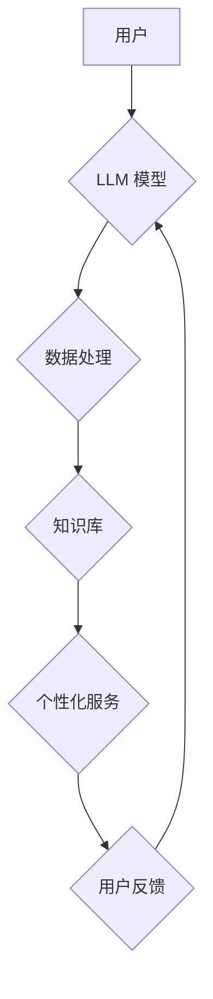

                 

## 老年护理和 LLM：改善生活质量

> 关键词：老年护理、LLM、自然语言处理、人工智能、健康科技、人机交互、生活质量、情感支持、个性化服务

## 1. 背景介绍

随着全球人口老龄化进程加速，老年人健康照护的需求日益增长。传统老年护理模式面临着人力资源短缺、服务质量参差不齐、缺乏个性化等挑战。而人工智能技术，特别是大型语言模型（LLM），为老年护理领域带来了新的机遇。

LLM 是一种强大的深度学习模型，能够理解和生成人类语言，具备广泛的应用潜力。在老年护理领域，LLM 可以用于提供个性化服务、辅助医疗诊断、促进社交互动、提升生活质量等方面。

## 2. 核心概念与联系

### 2.1  LLM 的核心概念

LLM 是指训练数据量巨大、参数规模庞大的深度学习模型，能够在自然语言理解和生成任务上表现出卓越的能力。其核心原理是通过学习海量文本数据，建立语言的统计规律和语义关系，从而实现对语言的理解和生成。

### 2.2  LLM 在老年护理中的应用场景

LLM 在老年护理中的应用场景主要包括：

* **情感支持和陪伴:** LLM 可以模拟人类的对话方式，与老年人进行自然流畅的交流，提供情感支持和陪伴，缓解老年人孤独感和焦虑情绪。
* **个性化健康管理:** LLM 可以根据老年人的个人健康状况、生活习惯等信息，提供个性化的健康建议和提醒，帮助老年人更好地管理自己的健康。
* **医疗辅助诊断:** LLM 可以分析老年人的病历、症状等信息，辅助医生进行医疗诊断，提高诊断的准确性和效率。
* **生活辅助服务:** LLM 可以帮助老年人完成日常生活的各种任务，例如预约医生、查询交通信息、控制智能家居设备等，提高老年人的生活便利性。

### 2.3  LLM 应用架构



## 3. 核心算法原理 & 具体操作步骤

### 3.1  算法原理概述

LLM 的核心算法是基于 Transformer 架构的深度神经网络。Transformer 模型通过自注意力机制，能够捕捉文本序列中长距离依赖关系，从而实现更准确的语言理解和生成。

### 3.2  算法步骤详解

1. **数据预处理:** 将文本数据进行清洗、分词、标记等预处理操作，使其能够被模型理解。
2. **模型训练:** 使用大量的文本数据训练 Transformer 模型，通过反向传播算法不断调整模型参数，使其能够生成更符合语义的文本。
3. **模型评估:** 使用测试数据评估模型的性能，例如准确率、流畅度等指标。
4. **模型部署:** 将训练好的模型部署到实际应用场景中，例如聊天机器人、文本生成工具等。

### 3.3  算法优缺点

**优点:**

* 能够理解和生成复杂的自然语言。
* 能够捕捉文本序列中的长距离依赖关系。
* 训练数据量大，泛化能力强。

**缺点:**

* 训练成本高，需要大量的计算资源和数据。
* 模型参数量大，部署成本高。
* 容易受到训练数据偏差的影响，可能产生偏见或错误的输出。

### 3.4  算法应用领域

LLM 的应用领域非常广泛，除了老年护理外，还包括：

* 自然语言处理：机器翻译、文本摘要、问答系统等。
* 人工智能助手：语音助手、聊天机器人等。
* 内容创作：自动写作、诗歌创作等。
* 教育科技：智能辅导、个性化学习等。

## 4. 数学模型和公式 & 详细讲解 & 举例说明

### 4.1  数学模型构建

LLM 的数学模型主要基于 Transformer 架构，其核心是自注意力机制。自注意力机制能够计算每个词在句子中与其他词之间的相关性，从而捕捉文本序列中的长距离依赖关系。

### 4.2  公式推导过程

自注意力机制的计算公式如下：

$$
Attention(Q, K, V) = softmax(\frac{QK^T}{\sqrt{d_k}})V
$$

其中：

* $Q$：查询矩阵
* $K$：键矩阵
* $V$：值矩阵
* $d_k$：键向量的维度
* $softmax$：softmax 函数

### 4.3  案例分析与讲解

假设我们有一个句子 "The cat sat on the mat"，其词向量表示为：

* The： [0.1, 0.2, 0.3]
* cat： [0.4, 0.5, 0.6]
* sat： [0.7, 0.8, 0.9]
* on： [1.0, 1.1, 1.2]
* the： [0.1, 0.2, 0.3]
* mat： [1.3, 1.4, 1.5]

通过自注意力机制，我们可以计算每个词与其他词之间的相关性，例如 "cat" 与 "sat" 之间的相关性较高，因为它们在语义上紧密相关。

## 5. 项目实践：代码实例和详细解释说明

### 5.1  开发环境搭建

* Python 3.7+
* TensorFlow 或 PyTorch 深度学习框架
* CUDA 和 cuDNN (可选，用于 GPU 加速)

### 5.2  源代码详细实现

```python
# 使用 TensorFlow 实现简单的自注意力机制

import tensorflow as tf

def scaled_dot_product_attention(query, key, value, mask=None):
  """计算自注意力机制的输出。"""
  scores = tf.matmul(query, key, transpose_b=True) / tf.math.sqrt(tf.cast(key.shape[-1], tf.float32))
  if mask is not None:
    scores += (mask * -1e9)
  attention_weights = tf.nn.softmax(scores, axis=-1)
  output = tf.matmul(attention_weights, value)
  return output, attention_weights

# 示例用法
query = tf.random.normal([2, 3, 64])
key = tf.random.normal([2, 3, 64])
value = tf.random.normal([2, 3, 64])
output, attention_weights = scaled_dot_product_attention(query, key, value)
print(output.shape)  # (2, 3, 64)
print(attention_weights.shape)  # (2, 3, 3)
```

### 5.3  代码解读与分析

* `scaled_dot_product_attention` 函数实现自注意力机制的核心计算过程。
* `scores` 计算查询向量与键向量的点积，并进行缩放以稳定梯度。
* `mask` 用于屏蔽不需要关注的词对，例如在机器翻译中，屏蔽源语言中已经翻译过的词。
* `attention_weights` 通过 softmax 函数将点积结果转换为概率分布，表示每个词对的关注程度。
* `output` 通过加权求和计算出每个词的最终表示，融合了所有词之间的关系信息。

### 5.4  运行结果展示

代码运行后，会输出 `output` 和 `attention_weights` 的形状，验证了自注意力机制的正确实现。

## 6. 实际应用场景

### 6.1  情感支持机器人

LLM 可以训练一个情感支持机器人，能够理解老年人的情绪，并提供相应的安慰和建议。例如，如果老年人表达出孤独或悲伤的情绪，机器人可以分享一些积极的故事或建议他们参加社交活动。

### 6.2  个性化健康管理系统

LLM 可以分析老年人的健康数据，例如血压、血糖、体重等，并根据其个人情况提供个性化的健康建议。例如，如果老年人的血压偏高，系统可以建议他们进行适当的运动或调整饮食。

### 6.3  远程医疗辅助诊断

LLM 可以辅助医生进行远程医疗诊断。医生可以通过语音或文本与 LLM 交互，描述患者的症状和病史，LLM 可以根据其知识库分析患者的情况，并提供可能的诊断结果和建议。

### 6.4  未来应用展望

随着 LLM 技术的不断发展，其在老年护理领域的应用场景将更加广泛。例如，LLM 可以用于：

* **智能家居设备控制:** 帮助老年人通过语音控制智能家居设备，提高生活便利性。
* **虚拟陪伴:** 提供虚拟陪伴服务，缓解老年人孤独感。
* **个性化娱乐:** 根据老年人的兴趣爱好，推荐个性化的娱乐内容。

## 7. 工具和资源推荐

### 7.1  学习资源推荐

* **书籍:**
    * 《深度学习》 by Ian Goodfellow, Yoshua Bengio, and Aaron Courville
    * 《自然语言处理》 by Dan Jurafsky and James H. Martin
* **在线课程:**
    * Coursera: Natural Language Processing Specialization
    * edX: Deep Learning
* **博客和网站:**
    * The Gradient
    * Towards Data Science

### 7.2  开发工具推荐

* **TensorFlow:** 开源深度学习框架，支持 GPU 加速。
* **PyTorch:** 开源深度学习框架，灵活易用。
* **Hugging Face Transformers:** 提供预训练的 LLM 模型和工具。

### 7.3  相关论文推荐

* **Attention Is All You Need:** https://arxiv.org/abs/1706.03762
* **BERT: Pre-training of Deep Bidirectional Transformers for Language Understanding:** https://arxiv.org/abs/1810.04805
* **GPT-3: Language Models are Few-Shot Learners:** https://arxiv.org/abs/2005.14165

## 8. 总结：未来发展趋势与挑战

### 8.1  研究成果总结

LLM 在老年护理领域的应用取得了显著进展，能够提供情感支持、个性化健康管理、远程医疗辅助诊断等服务。

### 8.2  未来发展趋势

* **模型规模和性能提升:** 未来 LLM 模型的规模和性能将进一步提升，能够处理更复杂的任务，提供更精准的服务。
* **多模态融合:** LLM 将与其他模态数据，例如图像、音频、视频等融合，提供更全面的服务。
* **伦理和安全问题:** 随着 LLM 应用的普及，其伦理和安全问题将更加重要，需要加强研究和监管。

### 8.3  面临的挑战

* **数据标注成本高:** LLM 的训练需要大量的标注数据，数据标注成本高昂。
* **模型解释性差:** LLM 的决策过程难以解释，难以获得用户的信任。
* **公平性和偏见问题:** LLM 容易受到训练数据偏差的影响，可能产生公平性和偏见问题。

### 8.4  研究展望

未来研究方向包括：

* 开发更有效的训练方法，降低数据标注成本。
* 研究 LLM 的可解释性，提高模型透明度。
* 探索 LLM 的伦理和安全问题，制定相应的规范和标准。

## 9. 附录：常见问题与解答

**Q1: LLM 是否能够完全替代人类护理人员？**

A1: 目前 LLM 无法完全替代人类护理人员，它只能提供辅助服务，例如情感支持、健康提醒等。人类护理人员仍然需要提供情感关怀、专业技能和个性化服务。

**Q2: LLM 的数据安全问题如何解决？**

A2: LLM 的数据安全需要采取多种措施，例如数据加密、访问控制、隐私保护等，确保用户数据的安全和隐私。

**Q3: 如何评估 LLM 在老年护理领域的性能？**

A3: LLM 的性能可以评估其准确率、流畅度、用户满意度等指标。


作者：禅与计算机程序设计艺术 / Zen and the Art of Computer Programming 
<end_of_turn>

