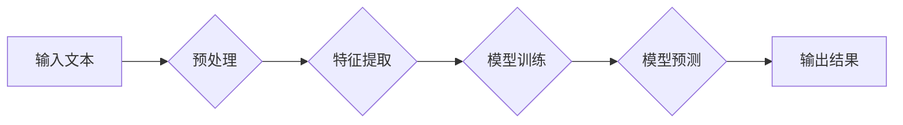

                 

## 自然语言处理的前沿：超越传统的语言理解

> 关键词：自然语言处理、深度学习、Transformer、BERT、GPT、语言模型、文本理解、机器翻译、对话系统

### 1. 背景介绍

自然语言处理（Natural Language Processing，NLP）作为人工智能领域的重要分支，致力于使计算机能够理解、处理和生成人类语言。从传统的基于规则的方法到如今的深度学习时代，NLP技术经历了飞速发展。传统的基于规则的方法依赖于人工编写的规则和知识库，难以应对语言的复杂性和多样性。而深度学习的兴起，特别是Transformer模型的出现，为NLP带来了革命性的变革，使得机器能够学习语言的复杂模式和语义关系，从而实现更精准、更自然的语言理解。

### 2. 核心概念与联系

**2.1 自然语言处理的核心概念**

* **文本分析:**  分析文本结构、语义和情感，提取关键信息和主题。
* **机器翻译:** 将一种语言的文本翻译成另一种语言。
* **语音识别:** 将语音信号转换为文本。
* **对话系统:**  与人类进行自然语言交互的系统，例如聊天机器人。
* **文本生成:**  生成符合语法和语义的文本，例如文章写作、故事创作。

**2.2 NLP技术架构**



**2.3 核心概念联系**

NLP技术涉及多个核心概念，它们相互关联，共同构成一个完整的NLP系统。输入文本首先经过预处理，去除噪声和格式化信息，然后提取文本特征，例如词向量、语法结构等。这些特征作为模型训练的输入，训练出一个能够理解和处理语言的模型。模型训练完成后，可以用于预测文本的语义、情感、类别等信息，最终输出结果。

### 3. 核心算法原理 & 具体操作步骤

**3.1 算法原理概述**

深度学习在NLP领域取得了巨大成功，其中Transformer模型是近年来最具影响力的架构之一。Transformer模型基于注意力机制，能够捕捉文本序列中长距离依赖关系，从而实现更精准的语言理解。

**3.2 算法步骤详解**

1. **词嵌入:** 将每个词转换为一个稠密的向量表示，例如Word2Vec、GloVe等词嵌入模型。
2. **多头注意力机制:**  计算每个词与其他词之间的注意力权重，捕捉词之间的语义关系。
3. **前馈神经网络:** 对每个词的注意力表示进行非线性变换，提取更深层的语义特征。
4. **位置编码:**  由于Transformer模型没有循环结构，无法捕捉词序信息，需要使用位置编码来嵌入词的相对位置信息。
5. **解码器:**  基于编码器的输出，生成目标文本序列。

**3.3 算法优缺点**

* **优点:** 能够捕捉长距离依赖关系，性能优于传统的RNN模型。
* **缺点:** 计算量大，训练成本高。

**3.4 算法应用领域**

* 机器翻译
* 文本摘要
* 问答系统
* 情感分析
* 代码生成

### 4. 数学模型和公式 & 详细讲解 & 举例说明

**4.1 数学模型构建**

Transformer模型的核心是注意力机制，其数学模型可以表示为：

$$
Attention(Q, K, V) = softmax(\frac{QK^T}{\sqrt{d_k}})V
$$

其中：

* $Q$：查询矩阵
* $K$：键矩阵
* $V$：值矩阵
* $d_k$：键向量的维度
* $softmax$：softmax函数

**4.2 公式推导过程**

注意力机制的目的是计算每个词与其他词之间的相关性，并根据相关性分配权重。公式中，$QK^T$计算了查询矩阵和键矩阵之间的点积，表示每个词与其他词之间的相似度。然后通过softmax函数将点积转换为概率分布，表示每个词对其他词的注意力权重。最后，将注意力权重与值矩阵相乘，得到每个词的加权平均值，即注意力输出。

**4.3 案例分析与讲解**

例如，在翻译句子“The cat sat on the mat”时，注意力机制可以计算每个词与其他词之间的相关性。例如，“cat”与“sat”之间存在强相关性，因为它们描述了猫的动作。而“cat”与“mat”之间也存在相关性，因为它们描述了猫的位置。注意力机制会根据这些相关性分配权重，使得模型更关注与翻译任务相关的词语。

### 5. 项目实践：代码实例和详细解释说明

**5.1 开发环境搭建**

* Python 3.6+
* TensorFlow/PyTorch
* CUDA (可选)

**5.2 源代码详细实现**

```python
import tensorflow as tf

# 定义Transformer模型
class Transformer(tf.keras.Model):
    def __init__(self, vocab_size, embedding_dim, num_heads, num_layers):
        super(Transformer, self).__init__()
        self.embedding = tf.keras.layers.Embedding(vocab_size, embedding_dim)
        self.transformer_layers = tf.keras.layers.StackedRNNCells([
            tf.keras.layers.MultiHeadAttention(num_heads=num_heads, key_dim=embedding_dim)
            for _ in range(num_layers)
        ])
        self.decoder = tf.keras.layers.Dense(vocab_size)

    def call(self, inputs):
        # 词嵌入
        embedded = self.embedding(inputs)
        # Transformer编码
        encoded = self.transformer_layers(embedded)
        # 解码
        decoded = self.decoder(encoded)
        return decoded

# 实例化模型
model = Transformer(vocab_size=10000, embedding_dim=128, num_heads=8, num_layers=6)

# 训练模型
model.compile(optimizer='adam', loss='sparse_categorical_crossentropy', metrics=['accuracy'])
model.fit(train_data, train_labels, epochs=10)
```

**5.3 代码解读与分析**

* 代码定义了一个Transformer模型，包含词嵌入层、Transformer编码层和解码层。
* 词嵌入层将每个词转换为一个稠密的向量表示。
* Transformer编码层使用多头注意力机制和前馈神经网络，捕捉文本序列中的长距离依赖关系。
* 解码层将编码器的输出转换为目标文本序列。
* 代码还展示了如何实例化模型、编译模型和训练模型。

**5.4 运行结果展示**

训练完成后，可以将模型应用于文本生成、机器翻译等任务。例如，可以输入一个句子，模型会生成一个翻译后的句子。

### 6. 实际应用场景

**6.1 机器翻译**

Transformer模型在机器翻译领域取得了突破性进展，例如Google Translate、DeepL等翻译工具都使用了Transformer模型。

**6.2 文本摘要**

Transformer模型可以用于自动生成文本摘要，例如提取文章的关键信息和主题。

**6.3 问答系统**

Transformer模型可以用于构建问答系统，例如回答用户提出的问题。

**6.4 情感分析**

Transformer模型可以用于分析文本的情感倾向，例如判断文本是正面、负面还是中性。

**6.5 代码生成**

Transformer模型可以用于生成代码，例如根据自然语言描述生成代码片段。

**6.6 未来应用展望**

随着Transformer模型的不断发展，其应用场景将更加广泛，例如：

* 更精准的语音识别和合成
* 更自然的对话系统
* 更智能的搜索引擎
* 更个性化的教育和娱乐体验

### 7. 工具和资源推荐

**7.1 学习资源推荐**

* **书籍:**
    * 《深度学习》
    * 《自然语言处理》
* **在线课程:**
    * Coursera: Natural Language Processing Specialization
    * Udacity: Deep Learning Nanodegree
* **博客和网站:**
    * The Gradient
    * Towards Data Science

**7.2 开发工具推荐**

* **TensorFlow:** 开源深度学习框架
* **PyTorch:** 开源深度学习框架
* **Hugging Face Transformers:** 预训练Transformer模型库

**7.3 相关论文推荐**

* Attention Is All You Need
* BERT: Pre-training of Deep Bidirectional Transformers for Language Understanding
* GPT-3: Language Models are Few-Shot Learners

### 8. 总结：未来发展趋势与挑战

**8.1 研究成果总结**

近年来，深度学习在NLP领域取得了巨大进展，Transformer模型成为NLP领域的主流架构。

**8.2 未来发展趋势**

* **更强大的预训练模型:** 预训练模型的规模和能力将不断提升，例如GPT-4、PaLM等。
* **更细粒度的理解:** 模型将能够更精准地理解文本的语义、情感和意图。
* **更跨模态的应用:** 模型将能够处理多种模态的数据，例如文本、图像、音频等。

**8.3 面临的挑战**

* **数据偏见:** 预训练模型可能存在数据偏见，导致模型输出不公平或不准确。
* **可解释性:** 深度学习模型的决策过程难以解释，这限制了模型在一些关键领域中的应用。
* **计算资源:** 训练大型预训练模型需要大量的计算资源，这对于资源有限的机构或个人来说是一个挑战。

**8.4 研究展望**

未来，NLP研究将继续探索更强大的模型、更细粒度的理解和更跨模态的应用。同时，也将致力于解决数据偏见、可解释性和计算资源等挑战，推动NLP技术朝着更安全、更可靠、更普惠的方向发展。

### 9. 附录：常见问题与解答

* **什么是Transformer模型？**

Transformer模型是一种基于注意力机制的深度学习架构，能够捕捉文本序列中的长距离依赖关系。

* **Transformer模型有哪些优点？**

Transformer模型能够捕捉长距离依赖关系，性能优于传统的RNN模型。

* **Transformer模型有哪些应用场景？**

Transformer模型广泛应用于机器翻译、文本摘要、问答系统、情感分析、代码生成等领域。

* **如何训练Transformer模型？**

训练Transformer模型需要大量的文本数据和强大的计算资源。可以使用TensorFlow或PyTorch等深度学习框架进行训练。

* **如何评估Transformer模型的性能？**

可以使用BLEU、ROUGE等指标评估Transformer模型的性能。

作者：禅与计算机程序设计艺术 / Zen and the Art of Computer Programming


<end_of_turn>

