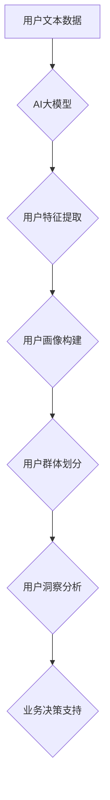

                 

## 融合AI大模型的用户群体分析技术

> 关键词：AI大模型、用户群体分析、数据挖掘、机器学习、自然语言处理、个性化推荐、用户画像

## 1. 背景介绍

随着人工智能技术的飞速发展，大规模语言模型（LLM）如GPT-3、LaMDA等涌现，其强大的文本生成、理解和翻译能力为用户群体分析带来了新的机遇。传统的用户群体分析方法主要依赖于结构化数据，如用户行为日志、问卷调查等，但这些数据往往无法全面刻画用户的复杂特征和潜在需求。而LLM能够从海量文本数据中挖掘用户意图、兴趣、价值观等隐含信息，为更深入的用户群体分析提供新的视角和手段。

融合AI大模型的用户群体分析技术，旨在利用大模型的强大能力，从文本数据中提取用户特征，构建用户画像，并进行细粒度用户群体的划分和分析。这种方法能够突破传统方法的局限性，提供更精准、更全面的用户洞察，从而帮助企业更好地理解用户需求，提供个性化服务，提升用户体验。

## 2. 核心概念与联系

### 2.1  AI大模型

AI大模型是指在海量数据上训练的深度学习模型，其参数规模巨大，具备强大的泛化能力和学习能力。常见的AI大模型类型包括：

* **语言模型:** 擅长理解和生成文本，如GPT-3、BERT、LaMDA等。
* **图像模型:** 擅长处理图像数据，如DALL-E 2、Stable Diffusion等。
* **多模态模型:** 能够处理多种数据类型，如文本、图像、音频等，如CLIP、Flamingo等。

### 2.2  用户群体分析

用户群体分析是指通过对用户数据进行收集、整理、分析，以揭示用户群体的特征、行为模式、需求偏好等，从而为企业制定更精准的营销策略、产品策略和用户运营策略提供依据。

### 2.3  融合AI大模型的用户群体分析技术

该技术将AI大模型与用户群体分析相结合，利用大模型的文本理解和生成能力，从用户文本数据中挖掘用户特征，构建用户画像，并进行细粒度用户群体的划分和分析。

**核心架构：**



## 3. 核心算法原理 & 具体操作步骤

### 3.1  算法原理概述

融合AI大模型的用户群体分析技术主要基于以下核心算法：

* **自然语言处理（NLP）:** 用于对用户文本数据进行预处理、分词、词性标注、依存句法分析等，提取文本语义信息。
* **机器学习（ML）:** 用于构建用户特征提取模型，例如基于文本内容的主题模型、情感分析模型、用户兴趣模型等。
* **聚类算法:** 用于对用户进行细粒度划分，例如K-means聚类、层次聚类等。

### 3.2  算法步骤详解

1. **数据收集:** 收集用户文本数据，例如用户评论、论坛帖子、社交媒体内容等。
2. **数据预处理:** 对用户文本数据进行清洗、去噪、格式化等预处理，去除停用词、标点符号等无用信息。
3. **特征提取:** 利用NLP算法对预处理后的文本数据进行分析，提取用户特征，例如用户兴趣、情感倾向、行为模式等。
4. **用户画像构建:** 将提取的用户特征进行整合，构建用户画像，描述用户的基本信息、兴趣爱好、消费习惯等。
5. **用户群体划分:** 利用聚类算法对用户进行细粒度划分，形成不同的用户群体，例如兴趣爱好相似的用户、消费习惯相似的用户等。
6. **用户洞察分析:** 对不同用户群体进行分析，挖掘用户群体的特征、行为模式、需求偏好等，为企业制定更精准的营销策略、产品策略和用户运营策略提供依据。

### 3.3  算法优缺点

**优点:**

* 能够从海量文本数据中挖掘用户隐含信息，提供更精准、更全面的用户洞察。
* 能够识别细粒度用户群体，满足个性化服务的需求。
* 能够不断学习和进化，随着数据量的增加，分析结果会更加准确。

**缺点:**

* 需要大量的文本数据进行训练，数据质量对模型效果有很大影响。
* 模型训练成本较高，需要强大的计算资源。
* 算法解释性较差，难以理解模型是如何得出结果的。

### 3.4  算法应用领域

* **电商平台:** 用户画像构建、精准推荐、个性化营销。
* **社交媒体:** 用户兴趣分析、内容推荐、社区运营。
* **金融行业:** 用户风险评估、个性化金融服务、欺诈检测。
* **教育行业:** 学生个性化学习推荐、教学内容优化。

## 4. 数学模型和公式 & 详细讲解 & 举例说明

### 4.1  数学模型构建

用户群体分析模型通常基于概率统计和机器学习方法，构建用户特征向量和用户相似度度量。

**用户特征向量:**

用户特征向量表示用户的属性和行为特征，例如用户年龄、性别、兴趣爱好、消费习惯等。

**用户相似度度量:**

用户相似度度量用于衡量不同用户之间的相似程度，常用的度量方法包括余弦相似度、皮尔逊相关系数等。

### 4.2  公式推导过程

**余弦相似度:**

$$
\text{相似度} = \frac{\mathbf{u} \cdot \mathbf{v}}{\|\mathbf{u}\| \|\mathbf{v}\|}
$$

其中：

* $\mathbf{u}$ 和 $\mathbf{v}$ 是两个用户特征向量。
* $\mathbf{u} \cdot \mathbf{v}$ 是两个向量之间的点积。
* $\|\mathbf{u}\|$ 和 $\|\mathbf{v}\|$ 是两个向量的模长。

**皮尔逊相关系数:**

$$
\text{相关系数} = \frac{\sum_{i=1}^{n}(x_i - \bar{x})(y_i - \bar{y})}{\sqrt{\sum_{i=1}^{n}(x_i - \bar{x})^2} \sqrt{\sum_{i=1}^{n}(y_i - \bar{y})^2}}
$$

其中：

* $x_i$ 和 $y_i$ 是两个用户在某一特征上的值。
* $\bar{x}$ 和 $\bar{y}$ 是两个特征的平均值。
* $n$ 是样本数量。

### 4.3  案例分析与讲解

假设我们有一个电商平台，想要分析用户的购买行为，构建用户画像。我们可以收集用户的购买记录、浏览记录、评价记录等文本数据，并利用NLP算法提取用户的兴趣爱好、消费习惯等特征。

然后，我们可以利用余弦相似度或皮尔逊相关系数等方法，计算不同用户之间的相似度，并进行聚类分析，将用户划分为不同的群体，例如喜欢购买电子产品的用户、喜欢购买服饰产品的用户等。

通过对不同用户群体的分析，我们可以了解不同用户群体的需求偏好，从而制定更精准的营销策略，例如针对喜欢购买电子产品的用户，推荐最新的电子产品，并提供优惠活动。

## 5. 项目实践：代码实例和详细解释说明

### 5.1  开发环境搭建

* Python 3.7+
* TensorFlow/PyTorch
* NLTK/SpaCy
* scikit-learn

### 5.2  源代码详细实现

```python
# 导入必要的库
import nltk
from sklearn.feature_extraction.text import TfidfVectorizer
from sklearn.cluster import KMeans

# 下载停用词列表
nltk.download('stopwords')

# 定义用户文本数据
user_texts = [
    "我喜欢阅读科技新闻和玩电子游戏。",
    "我更喜欢看电影和听音乐。",
    "我是一个程序员，喜欢学习新技术。",
    "我热爱旅行和摄影。",
    "我是一个学生，喜欢学习历史和文学。",
]

# 使用TF-IDF向量化用户文本数据
vectorizer = TfidfVectorizer(stop_words='english')
tfidf_matrix = vectorizer.fit_transform(user_texts)

# 使用K-Means算法进行聚类
kmeans = KMeans(n_clusters=3, random_state=42)
kmeans.fit(tfidf_matrix)

# 获取聚类结果
labels = kmeans.labels_

# 打印每个用户的聚类标签
for i, label in enumerate(labels):
    print(f"用户 {i+1} 的聚类标签: {label}")
```

### 5.3  代码解读与分析

* 代码首先导入必要的库，并下载停用词列表。
* 然后定义用户文本数据，并使用TF-IDF向量化用户文本数据，将文本转换为数字向量。
* 接着使用K-Means算法进行聚类，将用户划分为3个群体。
* 最后打印每个用户的聚类标签，展示聚类结果。

### 5.4  运行结果展示

运行代码后，会输出每个用户的聚类标签，例如：

```
用户 1 的聚类标签: 0
用户 2 的聚类标签: 1
用户 3 的聚类标签: 0
用户 4 的聚类标签: 2
用户 5 的聚类标签: 1
```

这表明用户1、3属于同一个群体，用户2、5属于另一个群体，用户4属于第三个群体。

## 6. 实际应用场景

### 6.1  电商平台

* **用户画像构建:** 利用用户评论、浏览记录等文本数据，构建用户画像，了解用户的兴趣爱好、消费习惯等。
* **精准推荐:** 根据用户的兴趣爱好和消费习惯，推荐个性化的商品。
* **个性化营销:** 根据用户的画像，制定个性化的营销策略，提高营销效果。

### 6.2  社交媒体

* **用户兴趣分析:** 分析用户的帖子内容、评论内容等，了解用户的兴趣爱好，为内容推荐提供依据。
* **内容推荐:** 根据用户的兴趣爱好，推荐相关的帖子、视频等内容。
* **社区运营:** 根据用户的兴趣爱好，划分不同的社区，促进用户之间的互动。

### 6.3  金融行业

* **用户风险评估:** 分析用户的交易记录、聊天记录等文本数据，评估用户的风险等级。
* **个性化金融服务:** 根据用户的风险偏好、收入水平等，提供个性化的金融服务。
* **欺诈检测:** 分析用户的交易记录、聊天记录等文本数据，识别潜在的欺诈行为。

### 6.4  未来应用展望

随着AI技术的不断发展，融合AI大模型的用户群体分析技术将有更广泛的应用场景，例如：

* **医疗健康:** 分析患者的病历、聊天记录等文本数据，辅助医生诊断疾病、制定治疗方案。
* **教育:** 分析学生的学习记录、作业内容等文本数据，个性化推荐学习资源，提高学习效率。
* **法律:** 分析法律文件、判决书等文本数据，辅助律师进行法律研究、案件分析。

## 7. 工具和资源推荐

### 7.1  学习资源推荐

* **书籍:**
    * 《深度学习》
    * 《自然语言处理》
    * 《机器学习实战》
* **在线课程:**
    * Coursera
    * edX
    * Udacity

### 7.2  开发工具推荐

* **Python:** 
    * TensorFlow
    * PyTorch
    * scikit-learn
* **NLP工具:**
    * NLTK
    * SpaCy
    * Gensim

### 7.3  相关论文推荐

* **BERT: Pre-training of Deep Bidirectional Transformers for Language Understanding**
* **GPT-3: Language Models are Few-Shot Learners**
* **K-Means Clustering Algorithm**

## 8. 总结：未来发展趋势与挑战

### 8.1  研究成果总结

融合AI大模型的用户群体分析技术取得了显著的成果，能够从海量文本数据中挖掘用户隐含信息，构建更精准的用户画像，为企业提供更有效的营销策略和用户运营策略。

### 8.2  未来发展趋势

* **模型规模和能力的提升:** 未来，AI大模型的规模和能力将会进一步提升，能够处理更复杂、更丰富的文本数据，提供更深入的用户洞察。
* **多模态融合:** 将文本数据与其他数据类型，例如图像、音频等进行融合，构建更全面的用户画像。
* **解释性模型的开发:** 开发更具解释性的AI模型，能够更好地理解模型是如何得出结果的，提高模型的可信度和可解释性。

### 8.3  面临的挑战

* **数据质量和隐私问题:** 

AI模型的性能依赖于数据质量，而用户文本数据往往存在噪声、不完整等问题。此外，用户隐私保护也是一个重要的挑战。
* **算法解释性和可控性:** 

当前的AI模型往往缺乏解释性，难以理解模型是如何得出结果的，这限制了模型的应用和信任度。
* **计算资源和成本:** 训练大型AI模型需要大量的计算资源和成本，这对于中小企业来说是一个挑战。

### 8.4  研究展望

未来，融合AI大模型的用户群体分析技术将继续发展，朝着更精准、更智能、更可解释的方向发展。

## 9. 附录：常见问题与解答

**Q1: 如何处理用户文本数据的噪声和不完整性？**

**A1:** 可以使用数据清洗和预处理技术，例如去除停用词、标点符号、HTML标签等，并对缺失值进行填充或删除。

**Q2: 如何保证用户隐私安全？**

**A2:** 可以采用数据脱敏技术，将用户敏感信息进行匿名化处理，并严格遵守数据安全和隐私保护相关法律法规。

**Q3: 如何评估模型的性能？**

**A3:** 可以使用多种指标来评估模型的性能，例如准确率、召回率、F1-score等。

**Q4: 如何解释AI模型的决策结果？**

**A4:** 可以使用可解释AI技术，例如LIME、SHAP等，解释模型是如何得出结果的。

**作者：禅与计算机程序设计艺术 / Zen and the Art of Computer Programming**


<end_of_turn>

