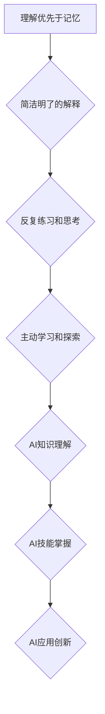

                 

## 费曼学习法在AI教育中的应用

> 关键词：费曼学习法、AI教育、教学方法、知识理解、概念构建、代码实践、项目实践、学习策略

## 1. 背景介绍

人工智能（AI）正以惊人的速度发展，其应用领域不断扩展，对人才的需求也日益增长。然而，AI教育面临着诸多挑战，传统的教学模式难以有效地传授复杂的AI知识和技能。如何提高AI教育的效率和质量，培养具备创新能力和实践能力的AI人才，成为亟待解决的问题。

费曼学习法是一种以理解为中心的学习方法，由美国物理学家理查德·费曼提出。它强调通过简洁明了的语言解释概念，并引导学生进行反复练习和思考，从而加深对知识的理解和掌握。近年来，费曼学习法在STEM教育领域取得了显著的成功，也逐渐被应用于AI教育中。

## 2. 核心概念与联系

费曼学习法的核心概念包括：

* **理解优先于记忆：** 强调学生要真正理解知识的本质，而不是死记硬背。
* **简洁明了的解释：** 教师应使用通俗易懂的语言，将复杂的概念分解成易于理解的片段。
* **反复练习和思考：** 学生需要通过反复练习和思考，巩固对知识的理解。
* **主动学习和探索：** 鼓励学生积极参与学习过程，提出问题，探索知识。

**费曼学习法与AI教育的联系：**

费曼学习法强调理解和实践，与AI教育的本质相符。AI教育需要学生不仅掌握AI算法和技术，更要理解其背后的原理和应用场景。



## 3. 核心算法原理 & 具体操作步骤

### 3.1  算法原理概述

**支持向量机（SVM）**是一种常用的机器学习算法，用于分类和回归问题。其核心思想是找到一个最佳的超平面，将数据点划分为不同的类别。

### 3.2  算法步骤详解

1. **数据预处理：** 将原始数据进行清洗、转换和特征工程，使其适合SVM算法的训练。
2. **核函数选择：** 根据数据的特性选择合适的核函数，将数据映射到高维空间，以便找到更优的超平面。
3. **参数优化：** 通过交叉验证等方法，选择最佳的惩罚参数C和核函数参数γ。
4. **模型训练：** 使用训练数据训练SVM模型，得到最佳的超平面。
5. **模型预测：** 将新数据输入模型，根据超平面的位置进行分类或回归预测。

### 3.3  算法优缺点

**优点：**

* 能够处理高维数据。
* 对非线性数据具有较好的分类能力。
* 具有较好的泛化能力。

**缺点：**

* 训练时间较长，尤其是在数据量较大时。
* 参数选择较为复杂，需要经验和技巧。
* 对数据噪声较为敏感。

### 3.4  算法应用领域

SVM广泛应用于图像识别、文本分类、语音识别、生物信息学等领域。

## 4. 数学模型和公式 & 详细讲解 & 举例说明

### 4.1  数学模型构建

SVM的目标是找到一个最佳的超平面，将数据点划分为不同的类别。超平面可以用以下线性方程表示：

$$w^Tx + b = 0$$

其中，$w$是权重向量，$x$是数据点，$b$是偏置项。

### 4.2  公式推导过程

SVM的目标函数是最大化间隔，间隔是指超平面到最近数据点的距离。间隔可以表示为：

$$margin = \frac{2}{\|w\|}$$

其中，$\|w\|$是权重向量的范数。

为了最大化间隔，SVM的目标函数可以表示为：

$$min \frac{1}{2}\|w\|^2$$

$$subject \ to \ y_i(w^Tx_i + b) \geq 1, \ i = 1, 2, ..., n$$

其中，$y_i$是数据点的类别标签，$n$是数据点的数量。

### 4.3  案例分析与讲解

假设我们有以下数据点：

* 数据点1： (1, 1), 类别标签：1
* 数据点2： (2, 2), 类别标签：1
* 数据点3： (3, 3), 类别标签：-1

我们可以使用SVM算法找到一个最佳的超平面，将这三个数据点划分为不同的类别。

## 5. 项目实践：代码实例和详细解释说明

### 5.1  开发环境搭建

* Python 3.x
* scikit-learn 库

### 5.2  源代码详细实现

```python
from sklearn import svm
from sklearn.datasets import make_classification
from sklearn.model_selection import train_test_split

# 生成样本数据
X, y = make_classification(n_samples=100, n_features=2, random_state=42)

# 将数据划分为训练集和测试集
X_train, X_test, y_train, y_test = train_test_split(X, y, test_size=0.2, random_state=42)

# 创建SVM模型
clf = svm.SVC(kernel='linear')

# 训练模型
clf.fit(X_train, y_train)

# 对测试集进行预测
y_pred = clf.predict(X_test)

# 计算准确率
accuracy = clf.score(X_test, y_test)
print(f'Accuracy: {accuracy}')
```

### 5.3  代码解读与分析

* 使用`make_classification`函数生成分类样本数据。
* 使用`train_test_split`函数将数据划分为训练集和测试集。
* 创建SVM模型，并选择线性核函数。
* 使用`fit`方法训练模型。
* 使用`predict`方法对测试集进行预测。
* 使用`score`方法计算模型的准确率。

### 5.4  运行结果展示

运行代码后，会输出模型的准确率。

## 6. 实际应用场景

SVM在许多实际应用场景中发挥着重要作用，例如：

* **图像识别：** SVM可以用于识别图像中的物体、人脸、场景等。
* **文本分类：** SVM可以用于分类文本邮件、新闻文章、社交媒体帖子等。
* **语音识别：** SVM可以用于识别语音命令、说话人识别等。
* **生物信息学：** SVM可以用于蛋白质结构预测、基因表达分析等。

### 6.4  未来应用展望

随着人工智能技术的不断发展，SVM在未来将有更广泛的应用前景，例如：

* **自动驾驶：** SVM可以用于识别道路标志、车辆、行人等，辅助自动驾驶系统决策。
* **医疗诊断：** SVM可以用于分析医学图像、基因数据，辅助医生进行诊断。
* **金融风险管理：** SVM可以用于识别欺诈交易、预测市场风险等。

## 7. 工具和资源推荐

### 7.1  学习资源推荐

* **书籍：**
    * 《支持向量机》
    * 《机器学习实战》
* **在线课程：**
    * Coursera 上的《机器学习》课程
    * edX 上的《机器学习》课程

### 7.2  开发工具推荐

* **Python:** 
    * scikit-learn 库
    * TensorFlow 库
    * PyTorch 库

### 7.3  相关论文推荐

* **《A Tutorial on Support Vector Machines for Pattern Recognition》**
* **《Support Vector Machines: Theory and Applications》**

## 8. 总结：未来发展趋势与挑战

### 8.1  研究成果总结

费曼学习法在AI教育中的应用取得了积极的成果，能够有效提高学生对AI知识的理解和掌握。

### 8.2  未来发展趋势

未来，费曼学习法在AI教育中的应用将更加深入和广泛，例如：

* **个性化学习：** 根据学生的学习进度和能力，定制化的学习路径和内容。
* **混合学习：** 将线上线下学习资源结合，打造更加丰富的学习体验。
* **人工智能辅助教学：** 利用AI技术，为学生提供个性化的学习建议和反馈。

### 8.3  面临的挑战

费曼学习法在AI教育中的应用也面临一些挑战，例如：

* **教师培训：** 教师需要接受专门的培训，掌握费曼学习法的教学方法。
* **教学资源开发：** 需要开发更多符合费曼学习法要求的教学资源。
* **评估体系建设：** 需要建立更加科学的评估体系，评估学生对AI知识的理解和掌握程度。

### 8.4  研究展望

未来，需要进一步研究费曼学习法在AI教育中的应用效果，探索更加有效的教学方法和策略，为培养AI人才提供更加优质的教育资源。

## 9. 附录：常见问题与解答

**问题：** 费曼学习法适用于哪些AI课程？

**解答：** 费曼学习法适用于所有AI课程，特别是那些需要学生理解AI算法和原理的课程。

**问题：** 如何将费曼学习法应用到AI课程中？

**解答：** 可以通过以下方式将费曼学习法应用到AI课程中：

* 教师使用简洁明了的语言解释AI概念。
* 学生进行反复练习和思考，巩固对知识的理解。
* 鼓励学生提出问题，探索知识。
* 利用项目实践，让学生将AI知识应用到实际问题中。


作者：禅与计算机程序设计艺术 / Zen and the Art of Computer Programming 
<end_of_turn>

