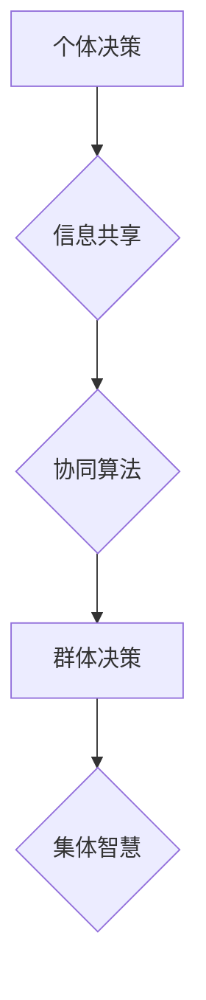

                 

## 集体智慧：群体决策的优势与陷阱

> 关键词：群体决策、集体智慧、协同算法、人工智能、机器学习、算法优化、决策科学、复杂系统

## 1. 背景介绍

在当今数据爆炸和信息时代，面对日益复杂和多变的挑战，个体智慧往往显得力不从心。群体决策，即由多个个体共同参与决策的过程，逐渐成为解决复杂问题的重要手段。集体智慧，即群体决策产生的智慧，往往超越了任何单个个体的认知能力，展现出强大的解决问题和创造价值的潜力。

从古至今，人类社会一直依赖群体决策来解决各种问题。从部落的议事决策到现代社会的民主选举，从科学研究的合作探索到商业企业的战略制定，群体决策无处不在。随着人工智能和机器学习技术的快速发展，群体决策的研究和应用也进入了新的阶段。

## 2. 核心概念与联系

**2.1 集体智慧的定义**

集体智慧是指由多个个体通过协作和信息共享，共同完成决策或解决问题的过程，产生的智慧和成果。它超越了单个个体的认知能力，展现出群体协同的强大力量。

**2.2 集体智慧的优势**

* **多样性:** 集体决策汇集了不同个体不同的观点、经验和知识，能够带来更全面的视角和更丰富的解决方案。
* **鲁棒性:** 集体决策能够抵御个体错误或偏见的影响，提高决策的可靠性和稳定性。
* **创新性:** 集体决策能够促进知识的碰撞和融合，激发新的想法和创新的解决方案。

**2.3 集体智慧的陷阱**

* **群体思维:** 集体决策容易陷入一种“同质化”的思维模式，忽视不同的意见和观点，导致决策的局限性和风险。
* **信息不对称:** 集体决策需要成员之间共享信息，但信息不对称会导致决策的偏差和错误。
* **协调成本:** 集体决策需要协调多个个体的行动和意愿，存在一定的协调成本和时间成本。

**2.4 集体智慧与人工智能**

人工智能技术为群体决策提供了新的工具和方法。例如，机器学习算法可以帮助分析和处理海量数据，识别群体决策中的潜在问题和风险，并提供更优的决策方案。

**Mermaid 流程图**



## 3. 核心算法原理 & 具体操作步骤

**3.1 算法原理概述**

群体决策算法旨在通过模拟群体行为，实现集体智慧的产生。常见的群体决策算法包括：

* **蚁群算法:** 借鉴蚂蚁寻找食物的群体行为，通过模拟蚂蚁的路径选择和信息传递，找到最优的决策方案。
* **粒子群算法:** 借鉴鸟群觅食的群体行为，通过模拟粒子群的运动和更新，找到最优的决策方案。
* **蜂群算法:** 借鉴蜜蜂寻找花蜜的群体行为，通过模拟蜂群的探测和反馈机制，找到最优的决策方案。

**3.2 算法步骤详解**

以蚁群算法为例，其具体操作步骤如下：

1. **初始化:** 随机生成若干个蚂蚁，每个蚂蚁代表一个决策方案。
2. **路径选择:** 每个蚂蚁根据当前位置和信息素浓度，选择下一个节点。
3. **信息素更新:** 蚂蚁在路径上留下信息素，信息素浓度越高，路径越容易被选择。
4. **循环迭代:** 重复步骤2和3，直到达到终止条件。
5. **结果输出:** 选择信息素浓度最高的路径，作为最终的决策方案。

**3.3 算法优缺点**

* **优点:** 能够找到全局最优解，具有较强的鲁棒性和适应性。
* **缺点:** 计算复杂度较高，收敛速度较慢。

**3.4 算法应用领域**

群体决策算法广泛应用于以下领域：

* **优化问题:** 例如，物流配送路线优化、资源分配优化、生产调度优化等。
* **机器学习:** 例如，分类、回归、聚类等任务。
* **金融投资:** 例如，股票预测、风险管理等。

## 4. 数学模型和公式 & 详细讲解 & 举例说明

**4.1 数学模型构建**

群体决策过程可以抽象为一个多主体系统，每个主体代表一个个体，其决策行为受自身状态和环境信息的影响。我们可以用以下数学模型来描述群体决策过程：

* **状态变量:**  每个个体的状态变量可以表示其决策偏好、知识水平、信息获取等因素。
* **转移函数:**  每个个体的状态变量随时间推移会发生变化，转移函数描述了状态变量的变化规律。
* **交互函数:**  个体之间可以通过信息共享、意见交流等方式进行交互，交互函数描述了交互行为对个体状态的影响。

**4.2 公式推导过程**

我们可以利用微分方程或差分方程来描述群体决策过程的动态变化。例如，我们可以用以下微分方程来描述个体决策偏好的变化：

```latex
\frac{d x_i}{dt} = f(x_i, x_j, I)
```

其中：

* $x_i$ 表示个体 $i$ 的决策偏好。
* $x_j$ 表示其他个体的决策偏好。
* $I$ 表示环境信息。
* $f$ 表示状态转移函数。

**4.3 案例分析与讲解**

例如，我们可以用群体决策模型来分析股票市场的价格波动。每个投资者可以看作是一个主体，其决策偏好可以表示为其对股票的买入或卖出意愿。投资者之间的交互可以是通过信息传播、市场趋势的跟随等方式实现的。

通过构建数学模型并进行仿真分析，我们可以研究不同投资者行为模式对股票市场价格的影响，并预测股票市场未来的走势。

## 5. 项目实践：代码实例和详细解释说明

**5.1 开发环境搭建**

* 编程语言: Python
* 库依赖: numpy, matplotlib, scikit-learn

**5.2 源代码详细实现**

```python
import numpy as np
from matplotlib import pyplot as plt

# 定义蚁群算法
def ant_colony_optimization(graph, num_ants, iterations):
    # 初始化蚂蚁
    ants = np.random.rand(num_ants, len(graph))
    # 初始化信息素
    pheromone = np.ones((len(graph), len(graph)))

    # 迭代优化
    for i in range(iterations):
        # 蚂蚁路径选择
        for ant in ants:
            # ...
        # 信息素更新
        pheromone = update_pheromone(pheromone, ants)
    # 返回最优路径
    return get_best_path(pheromone)

# ...

# 运行代码
graph = ... # 定义图结构
num_ants = 100
iterations = 1000
best_path = ant_colony_optimization(graph, num_ants, iterations)
print(best_path)
```

**5.3 代码解读与分析**

* `ant_colony_optimization` 函数实现蚁群算法的核心逻辑。
* `graph` 表示决策问题的图结构，节点代表决策方案，边权重代表方案之间的关联度。
* `num_ants` 表示蚂蚁的数量，决定了算法的探索能力。
* `iterations` 表示迭代次数，决定了算法的收敛速度。
* `update_pheromone` 函数更新信息素浓度，根据蚂蚁路径的优劣程度调整信息素的分布。
* `get_best_path` 函数根据信息素浓度选择最优路径。

**5.4 运行结果展示**

运行代码后，会输出最优决策方案的路径。

## 6. 实际应用场景

**6.1 医疗诊断**

群体决策算法可以用于分析患者的病历数据、影像资料等信息，由多个专家共同参与诊断，提高诊断的准确性和可靠性。

**6.2 舆情分析**

群体决策算法可以用于分析社交媒体上的舆情数据，识别热点话题、情绪倾向等信息，帮助企业和政府了解公众的意见和需求。

**6.3 投资决策**

群体决策算法可以用于分析市场数据、股票信息等，由多个投资专家共同参与决策，提高投资的收益率和风险控制能力。

**6.4 未来应用展望**

随着人工智能技术的不断发展，群体决策算法将在更多领域得到应用，例如：

* **自动驾驶:** 多个传感器和算法协同决策，提高自动驾驶系统的安全性。
* **机器人协作:** 多个机器人协同完成复杂任务，提高效率和灵活性。
* **个性化推荐:** 多个用户数据和算法协同推荐，提供更精准的个性化服务。

## 7. 工具和资源推荐

**7.1 学习资源推荐**

* **书籍:**
    * 集体智慧：群体决策的优势与陷阱
    * 人工智能：一种现代方法
* **在线课程:**
    * Coursera: 人工智能
    * edX: 机器学习

**7.2 开发工具推荐**

* **Python:** 广泛应用于人工智能和机器学习领域，拥有丰富的库和工具。
* **TensorFlow:** 开源深度学习框架，用于构建和训练神经网络模型。
* **PyTorch:** 开源深度学习框架，灵活易用，适合研究和开发。

**7.3 相关论文推荐**

* Ant Colony Optimization: A Metaheuristic Approach to Problem Solving
* Swarm Intelligence: From Nature to Computation
* Collective Intelligence: Creating a Prosperous World at Peace

## 8. 总结：未来发展趋势与挑战

**8.1 研究成果总结**

群体决策算法取得了显著的成果，在优化问题、机器学习、金融投资等领域得到了广泛应用。

**8.2 未来发展趋势**

* **更智能的群体决策算法:** 研究更智能、更鲁棒、更适应复杂环境的群体决策算法。
* **群体决策与人工智能的融合:** 将群体决策算法与人工智能技术融合，构建更强大的智能决策系统。
* **群体决策的伦理与社会影响:** 研究群体决策的伦理问题和社会影响，确保群体决策的公平、公正和可持续发展。

**8.3 面临的挑战**

* **算法复杂度:** 一些群体决策算法的计算复杂度较高，难以应用于大规模问题。
* **数据获取和处理:** 群体决策算法需要大量的数据进行训练和测试，数据获取和处理是一个重要的挑战。
* **群体决策的解释性:** 一些群体决策算法的决策过程难以解释，缺乏透明度和可信度。

**8.4 研究展望**

未来，群体决策研究将继续朝着更智能、更可解释、更具社会责任的方向发展，为解决复杂问题提供更有效的解决方案。

## 9. 附录：常见问题与解答

**9.1 如何选择合适的群体决策算法？**

选择合适的群体决策算法需要根据具体问题的特点和需求进行选择。例如，对于寻路问题，蚁群算法是一个不错的选择；对于优化问题，粒子群算法是一个更有效的选择。

**9.2 群体决策算法的计算复杂度如何降低？**

可以通过以下方法降低群体决策算法的计算复杂度：

* 使用启发式算法
* 采用并行计算技术
* 优化算法参数

**9.3 群体决策算法的透明度和可信度如何提高？**

可以通过以下方法提高群体决策算法的透明度和可信度：

* 使用可解释的机器学习模型
* 提供决策过程的详细记录
* 进行公开的测试和评估


作者：禅与计算机程序设计艺术 / Zen and the Art of Computer Programming 
<end_of_turn>

