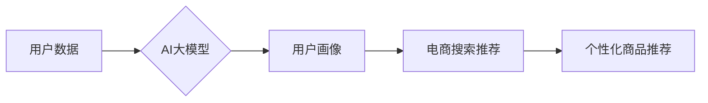
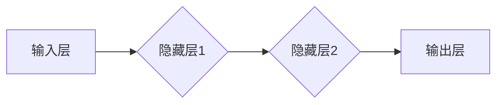

                 

## AI 大模型在电商搜索推荐中的用户画像技术：精准把握用户需求与行为偏好

> 关键词：AI大模型、用户画像、电商搜索推荐、深度学习、自然语言处理、推荐系统

## 1. 背景介绍

在当今数据爆炸的时代，电商平台面临着日益激烈的竞争。用户需求的多样化和个性化使得精准的搜索推荐成为电商平台的核心竞争力。传统的搜索推荐系统主要依赖于用户显性反馈（如关键词搜索、评分、评论等），但这些反馈往往不够全面，难以捕捉用户潜在的需求和行为偏好。

近年来，随着深度学习技术的快速发展，AI大模型在电商搜索推荐领域展现出巨大的潜力。AI大模型能够通过学习海量用户数据，构建更加精准的用户画像，从而实现更个性化的搜索推荐。

## 2. 核心概念与联系

### 2.1 用户画像

用户画像是指通过对用户数据进行分析和挖掘，构建出用户特征、行为模式、兴趣偏好等方面的描述。用户画像可以帮助电商平台更好地了解用户需求，提供更精准的商品推荐和个性化服务。

### 2.2 AI大模型

AI大模型是指在海量数据上训练的深度学习模型，具有强大的学习和泛化能力。常见的AI大模型包括Transformer、BERT、GPT等。

### 2.3 电商搜索推荐

电商搜索推荐是指根据用户的搜索行为、浏览历史、购买记录等信息，推荐用户可能感兴趣的商品。

**核心概念与联系流程图**



## 3. 核心算法原理 & 具体操作步骤

### 3.1 算法原理概述

AI大模型在电商搜索推荐中的用户画像技术主要基于深度学习和自然语言处理技术。

* **深度学习**: 通过多层神经网络，从海量用户数据中学习用户特征和行为模式。
* **自然语言处理**: 对用户文本数据进行分析和理解，提取用户兴趣、需求等信息。

常用的算法包括：

* **协同过滤**: 基于用户之间的相似性，推荐用户可能感兴趣的商品。
* **内容过滤**: 基于商品的特征和描述，推荐与用户兴趣相符的商品。
* **混合推荐**: 结合协同过滤和内容过滤，提高推荐的准确性和个性化程度。

### 3.2 算法步骤详解

1. **数据收集**: 收集用户行为数据，包括搜索历史、浏览记录、购买记录、评价信息等。
2. **数据预处理**: 对收集到的数据进行清洗、转换和格式化，以便于模型训练。
3. **特征工程**: 从用户数据中提取特征，例如用户年龄、性别、地理位置、兴趣爱好、购买偏好等。
4. **模型训练**: 使用深度学习算法训练模型，学习用户特征和行为模式。
5. **模型评估**: 使用测试数据评估模型的性能，并进行调参优化。
6. **推荐系统部署**: 将训练好的模型部署到生产环境中，为用户提供个性化商品推荐。

### 3.3 算法优缺点

**优点**:

* **精准度高**: AI大模型能够学习用户复杂的特征和行为模式，提供更加精准的推荐。
* **个性化强**: 可以根据用户的不同需求和偏好，提供个性化的商品推荐。
* **可扩展性强**: 可以轻松扩展到新的用户和商品。

**缺点**:

* **数据依赖性强**: 需要海量用户数据进行训练，否则模型性能会下降。
* **训练成本高**: 训练大型AI模型需要大量的计算资源和时间。
* **解释性差**: 深度学习模型的决策过程较为复杂，难以解释模型推荐的原因。

### 3.4 算法应用领域

AI大模型在电商搜索推荐领域的应用非常广泛，例如：

* **商品推荐**: 根据用户的兴趣和购买历史，推荐用户可能感兴趣的商品。
* **搜索结果排序**: 根据用户的搜索意图，对搜索结果进行排序，提高用户搜索体验。
* **个性化营销**: 根据用户的画像信息，进行精准的营销推广。

## 4. 数学模型和公式 & 详细讲解 & 举例说明

### 4.1 数学模型构建

用户画像模型可以构建为一个多层神经网络，其中每一层都包含多个神经元。每个神经元接收来自上一层的输入，并通过激活函数进行处理，输出到下一层。

**用户画像模型结构**



### 4.2 公式推导过程

用户画像模型的输出可以表示为：

$$
y = f(W_1x_1 + b_1)
$$

其中：

* $y$ 是模型的输出，即用户画像特征向量。
* $x_1$ 是输入层的神经元激活值，代表用户的特征信息。
* $W_1$ 是隐藏层1的权重矩阵。
* $b_1$ 是隐藏层1的偏置向量。
* $f$ 是激活函数，例如ReLU函数。

隐藏层2的输出可以表示为：

$$
z_2 = f(W_2z_1 + b_2)
$$

其中：

* $z_2$ 是隐藏层2的输出。
* $z_1$ 是隐藏层1的输出。
* $W_2$ 是隐藏层2的权重矩阵。
* $b_2$ 是隐藏层2的偏置向量。

输出层的输出可以表示为：

$$
y = f(W_3z_2 + b_3)
$$

其中：

* $y$ 是模型的输出，即用户画像特征向量。
* $z_2$ 是隐藏层2的输出。
* $W_3$ 是输出层的权重矩阵。
* $b_3$ 是输出层的偏置向量。

### 4.3 案例分析与讲解

假设我们有一个电商平台，用户数据包括用户的年龄、性别、购买历史、浏览记录等信息。我们可以使用AI大模型构建一个用户画像模型，将这些数据作为输入，学习用户的兴趣偏好和购买行为模式。

例如，我们可以训练一个模型，预测用户是否会购买某个商品。模型的输入包括用户的年龄、性别、购买历史、浏览记录等信息，输出为用户购买该商品的概率。

## 5. 项目实践：代码实例和详细解释说明

### 5.1 开发环境搭建

* **操作系统**: Ubuntu 20.04
* **编程语言**: Python 3.8
* **深度学习框架**: TensorFlow 2.0
* **其他工具**: Jupyter Notebook、Git

### 5.2 源代码详细实现

```python
import tensorflow as tf

# 定义用户画像模型
model = tf.keras.models.Sequential([
    tf.keras.layers.Dense(64, activation='relu', input_shape=(10,)),
    tf.keras.layers.Dense(32, activation='relu'),
    tf.keras.layers.Dense(1, activation='sigmoid')
])

# 编译模型
model.compile(optimizer='adam',
              loss='binary_crossentropy',
              metrics=['accuracy'])

# 训练模型
model.fit(x_train, y_train, epochs=10)

# 评估模型
loss, accuracy = model.evaluate(x_test, y_test)
print('Loss:', loss)
print('Accuracy:', accuracy)
```

### 5.3 代码解读与分析

* **模型定义**: 使用`tf.keras.models.Sequential`定义一个顺序模型，包含三个全连接层。
* **激活函数**: 使用ReLU函数作为隐藏层的激活函数，sigmoid函数作为输出层的激活函数。
* **编译模型**: 使用Adam优化器，Binary Crossentropy损失函数，并设置评估指标为准确率。
* **训练模型**: 使用训练数据`x_train`和标签数据`y_train`训练模型，训练10个epoch。
* **评估模型**: 使用测试数据`x_test`和标签数据`y_test`评估模型的性能。

### 5.4 运行结果展示

训练完成后，可以查看模型的损失值和准确率。

## 6. 实际应用场景

AI大模型在电商搜索推荐中的用户画像技术已经得到广泛应用，例如：

* **淘宝**: 使用AI大模型构建用户画像，推荐个性化商品和广告。
* **京东**: 利用AI大模型分析用户行为，优化搜索结果排序和商品推荐。
* **拼多多**: 基于用户画像，提供精准的营销推广和个性化服务。

### 6.4 未来应用展望

未来，AI大模型在电商搜索推荐领域的应用将更加广泛和深入，例如：

* **多模态用户画像**: 将文本、图像、视频等多模态数据融合，构建更加全面的用户画像。
* **动态用户画像**: 基于用户的实时行为，动态更新用户画像，提供更加精准的推荐。
* **个性化推荐策略**: 根据用户的不同需求和偏好，制定个性化的推荐策略。

## 7. 工具和资源推荐

### 7.1 学习资源推荐

* **书籍**:
    * 深度学习
    * 自然语言处理
* **在线课程**:
    * Coursera
    * edX
    * fast.ai

### 7.2 开发工具推荐

* **深度学习框架**: TensorFlow, PyTorch
* **数据处理工具**: Pandas, NumPy
* **机器学习库**: scikit-learn

### 7.3 相关论文推荐

* BERT: Pre-training of Deep Bidirectional Transformers for Language Understanding
* GPT-3: Language Models are Few-Shot Learners
* Transformer: Attention Is All You Need

## 8. 总结：未来发展趋势与挑战

### 8.1 研究成果总结

AI大模型在电商搜索推荐中的用户画像技术取得了显著成果，能够提供更加精准、个性化的商品推荐，提升用户体验和商业价值。

### 8.2 未来发展趋势

未来，AI大模型在电商搜索推荐领域的应用将更加深入，包括多模态用户画像、动态用户画像、个性化推荐策略等。

### 8.3 面临的挑战

* **数据隐私**: 用户数据隐私保护是一个重要的挑战。
* **模型解释性**: 深度学习模型的决策过程较为复杂，难以解释模型推荐的原因。
* **模型可解释性**: 如何提高模型的可解释性，让用户理解模型推荐的原因，也是一个重要的挑战。

### 8.4 研究展望

未来研究方向包括：

* **隐私保护**: 研究隐私保护机制，保障用户数据安全。
* **模型可解释性**: 研究模型可解释性方法，提高用户对模型推荐的信任度。
* **多模态融合**: 研究多模态数据融合技术，构建更加全面的用户画像。


## 9. 附录：常见问题与解答

**Q1: AI大模型的训练成本很高吗？**

A1: 确实，训练大型AI模型需要大量的计算资源和时间，成本较高。但随着计算资源的不断发展，训练成本也在逐渐降低。

**Q2: 如何保证AI大模型的公平性？**

A2: AI大模型的训练数据可能会存在偏差，导致模型输出结果不公平。需要采取措施，例如数据清洗、算法调整等，保证模型的公平性。

**Q3: AI大模型的未来发展趋势是什么？**

A3: 未来，AI大模型将更加智能化、个性化、安全可靠。


作者：禅与计算机程序设计艺术 / Zen and the Art of Computer Programming 
<end_of_turn>

