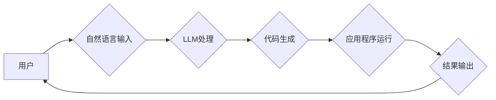

                 

## AI原生应用开发：LLM时代的编程新范式

> 关键词：大型语言模型 (LLM)、AI原生应用、自然语言交互、代码生成、编程新范式、AI辅助开发、代码可解释性

### 1. 背景介绍

近年来，大型语言模型 (LLM) 的快速发展，如 GPT-3、LaMDA 和 BLOOM 等，彻底改变了人工智能领域的面貌。这些模型展现出惊人的文本生成、理解和翻译能力，甚至能够进行代码生成和理解。这为软件开发领域带来了前所未有的机遇，催生了一种全新的编程范式——AI原生应用开发。

传统的软件开发模式依赖于人类程序员编写精确的代码，而 AI原生应用开发则将 LLM 作为核心引擎，利用其强大的自然语言处理能力，实现更灵活、更高效的开发流程。开发者不再需要精通复杂的编程语言，而是可以通过自然语言描述应用程序的功能需求，让 LLM 自动生成相应的代码。

### 2. 核心概念与联系

**2.1 AI原生应用**

AI原生应用是指完全利用人工智能技术开发的应用程序，其核心逻辑和功能都依赖于 AI 模型，例如 LLM、深度学习模型等。这些应用的特点是：

* **自然语言交互:** 用户可以通过自然语言与应用程序进行交互，无需学习复杂的命令或语法。
* **代码生成:** LLM 可以根据用户需求自动生成代码，简化开发流程，提高开发效率。
* **持续学习:** AI 原生应用可以不断学习和改进，随着用户使用和反馈，应用程序会变得更加智能和精准。

**2.2 LLM在AI原生应用中的作用**

LLM 在 AI 原生应用开发中扮演着至关重要的角色，其主要功能包括：

* **代码生成:** LLM 可以根据用户提供的自然语言描述，生成相应的代码片段或完整程序。
* **代码理解:** LLM 可以理解和解释已有的代码，帮助开发者进行代码维护、调试和重构。
* **代码翻译:** LLM 可以将代码从一种编程语言翻译成另一种编程语言，方便开发者跨语言开发。
* **代码文档生成:** LLM 可以根据代码自动生成文档，提高代码可读性和维护性。

**2.3 AI原生应用架构**



### 3. 核心算法原理 & 具体操作步骤

**3.1 算法原理概述**

LLM 的核心算法是基于 Transformer 架构的深度神经网络，它能够学习语言的复杂模式和关系。通过训练大量的文本数据，LLM 可以掌握语法规则、语义理解和文本生成能力。

在代码生成任务中，LLM 会将用户提供的自然语言描述作为输入，并通过一系列的编码和解码步骤，生成相应的代码输出。编码阶段将自然语言描述转换为数字表示，解码阶段则将数字表示转换为代码。

**3.2 算法步骤详解**

1. **预处理:** 将用户输入的自然语言描述进行预处理，例如分词、词性标注、去除停用词等。
2. **编码:** 使用 Transformer 网络将预处理后的文本序列编码成一个向量表示，该向量包含了文本的语义信息。
3. **解码:** 使用另一个 Transformer 网络解码编码后的向量，生成相应的代码序列。
4. **后处理:** 对生成的代码进行后处理，例如语法检查、格式化等。

**3.3 算法优缺点**

**优点:**

* **自然语言交互:** 用户可以通过自然语言与应用程序进行交互，降低开发门槛。
* **代码生成效率:** LLM 可以自动生成代码，提高开发效率。
* **代码质量:** 经过训练的 LLM 可以生成高质量的代码，减少人为错误。

**缺点:**

* **数据依赖:** LLM 的性能依赖于训练数据的质量和数量。
* **可解释性:** LLM 的决策过程难以解释，这可能导致代码难以维护和调试。
* **安全风险:** LLM 可能被用于生成恶意代码，需要加强安全防护。

**3.4 算法应用领域**

* **代码生成工具:** 自动生成代码片段或完整程序。
* **代码理解工具:** 帮助开发者理解和解释代码。
* **代码翻译工具:** 将代码从一种编程语言翻译成另一种编程语言。
* **代码文档生成工具:** 自动生成代码文档。

### 4. 数学模型和公式 & 详细讲解 & 举例说明

**4.1 数学模型构建**

LLM 的数学模型通常基于 Transformer 架构，其核心是注意力机制 (Attention)。注意力机制允许模型关注输入序列中与当前任务最相关的部分，从而提高模型的理解能力和生成能力。

**4.2 公式推导过程**

注意力机制的计算公式如下：

$$
Attention(Q, K, V) = softmax(\frac{QK^T}{\sqrt{d_k}})V
$$

其中：

* $Q$：查询矩阵
* $K$：键矩阵
* $V$：值矩阵
* $d_k$：键向量的维度
* $softmax$：softmax 函数

**4.3 案例分析与讲解**

假设我们有一个句子 "The cat sat on the mat"，我们要使用注意力机制来理解这句话的语义。

* $Q$：查询向量，表示我们想要关注的词。
* $K$：键向量，表示每个词的语义特征。
* $V$：值向量，表示每个词的含义。

通过计算注意力分数，我们可以发现 "cat" 和 "sat" 之间存在较强的关联，因为它们共同描述了猫的行为。

**4.4 举例说明**

在代码生成任务中，LLM 可以使用注意力机制来关注用户提供的自然语言描述中与代码相关的关键信息，从而生成更准确和有效的代码。

### 5. 项目实践：代码实例和详细解释说明

**5.1 开发环境搭建**

为了开发 AI 原生应用，需要搭建相应的开发环境。常用的开发工具包括：

* **Python:** 作为 AI 开发的常用语言，Python 提供了丰富的 AI 库和框架，例如 TensorFlow、PyTorch 和 HuggingFace Transformers。
* **LLM API:** 可以使用预训练的 LLM API，例如 OpenAI 的 GPT-3 API 或 Google 的 PaLM API，直接调用 LLM 的代码生成功能。

**5.2 源代码详细实现**

以下是一个简单的代码实例，演示如何使用 HuggingFace Transformers 库生成 Python 代码：

```python
from transformers import pipeline

generator = pipeline("text-to-code", model="facebook/bart-large-cnn")

code = generator("Write a Python function to calculate the factorial of a number.")

print(code)
```

**5.3 代码解读与分析**

这段代码使用 HuggingFace Transformers 库中的 `pipeline` 函数，加载预训练的 `facebook/bart-large-cnn` 模型，该模型可以将自然语言描述转换为 Python 代码。

`generator("Write a Python function to calculate the factorial of a number.")` 调用模型生成代码，并将自然语言描述作为输入。

`print(code)` 打印生成的代码。

**5.4 运行结果展示**

运行这段代码后，会输出以下 Python 代码：

```python
def factorial(n):
  if n == 0:
    return 1
  else:
    return n * factorial(n-1)
```

### 6. 实际应用场景

**6.1 代码生成工具**

AI 原生应用可以用于开发代码生成工具，例如 GitHub Copilot 和 Tabnine，这些工具可以根据用户输入的代码片段，自动生成后续代码，提高开发效率。

**6.2 代码理解工具**

AI 原生应用可以用于开发代码理解工具，例如 DeepCode 和 Codota，这些工具可以分析代码，识别潜在的 bug 和安全漏洞，并提供修复建议。

**6.3 代码文档生成工具**

AI 原生应用可以用于开发代码文档生成工具，例如 DeepDoc 和 DocAI，这些工具可以自动生成代码文档，提高代码可读性和维护性。

**6.4 未来应用展望**

随着 LLM 技术的不断发展，AI 原生应用将在未来发挥更加重要的作用。例如：

* **低代码开发平台:** AI 原生应用可以简化软件开发流程，让非程序员也能开发应用程序。
* **智能代码助手:** AI 原生应用可以成为程序员的智能助手，提供代码建议、自动修复 bug 和生成测试用例。
* **代码自动优化:** AI 原生应用可以自动优化代码，提高代码性能和效率。

### 7. 工具和资源推荐

**7.1 学习资源推荐**

* **HuggingFace Transformers:** https://huggingface.co/docs/transformers/index
* **OpenAI API:** https://beta.openai.com/docs/api-reference/introduction
* **DeepMind Blog:** https://deepmind.com/blog/

**7.2 开发工具推荐**

* **Python:** https://www.python.org/
* **Jupyter Notebook:** https://jupyter.org/
* **VS Code:** https://code.visualstudio.com/

**7.3 相关论文推荐**

* **Attention Is All You Need:** https://arxiv.org/abs/1706.03762
* **BERT: Pre-training of Deep Bidirectional Transformers for Language Understanding:** https://arxiv.org/abs/1810.04805
* **GPT-3: Language Models are Few-Shot Learners:** https://arxiv.org/abs/2005.14165

### 8. 总结：未来发展趋势与挑战

**8.1 研究成果总结**

AI 原生应用开发是人工智能领域的一项重要突破，它将彻底改变软件开发模式，提高开发效率和降低开发门槛。

**8.2 未来发展趋势**

未来，AI 原生应用将朝着以下方向发展：

* **更强大的 LLMs:** 随着模型规模和训练数据的增加，LLMs 的性能将进一步提升，能够生成更复杂、更准确的代码。
* **更细粒度的代码生成:** LLMs 将能够生成更细粒度的代码片段，例如函数、类和方法，提高代码的可复用性和可维护性。
* **代码可解释性:** 研究人员将致力于提高 LLMs 的代码可解释性，使代码更容易理解和调试。

**8.3 面临的挑战**

AI 原生应用开发也面临着一些挑战：

* **数据安全:** LLM 的训练数据可能包含敏感信息，需要加强数据安全保护。
* **模型偏见:** LLM 的训练数据可能存在偏见，导致生成的代码存在偏见问题。
* **伦理问题:** AI 原生应用的开发和应用需要考虑伦理问题，例如代码的责任归属和潜在的社会影响。

**8.4 研究展望**

未来，研究人员将继续探索 AI 原生应用开发的新方法和技术，例如：

* **联邦学习:** 用于训练 LLMs 的数据分散存储，提高数据安全性和隐私保护。
* **对抗训练:** 用于训练 LLMs，使其能够抵抗恶意攻击和生成恶意代码。
* **代码生成规范:** 制定代码生成规范，确保生成的代码符合安全、可靠和可维护性要求。


### 9. 附录：常见问题与解答

**9.1 Q: AI原生应用是否会取代程序员？**

**A:** AI原生应用可以提高开发效率，但不会完全取代程序员。程序员仍然需要负责设计应用程序架构、解决复杂问题和进行代码维护。

**9.2 Q: 如何学习AI原生应用开发？**

**A:** 可以学习 Python 编程语言、深度学习基础知识和 HuggingFace Transformers 库的使用。

**9.3 Q: AI原生应用有哪些安全风险？**

**A:** AI原生应用可能被用于生成恶意代码，需要加强安全防护，例如使用安全的代码生成工具和进行代码审计。


作者：禅与计算机程序设计艺术 / Zen and the Art of Computer Programming<end_of_turn>

