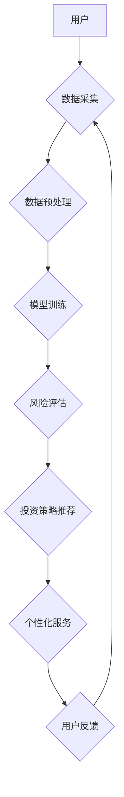

                 

## AI在个人理财和财富管理中的应用

> 关键词：人工智能、个人理财、财富管理、机器学习、深度学习、风险管理、投资策略、个性化服务

## 1. 背景介绍

随着科技的飞速发展，人工智能（AI）技术已渗透到各个领域，其中，在个人理财和财富管理领域，AI正扮演着越来越重要的角色。传统理财模式往往依赖于人工经验和分析，效率低下，且难以满足个人用户的个性化需求。而AI技术凭借其强大的数据处理能力、学习能力和预测能力，为个人理财和财富管理带来了全新的可能性。

个人理财是指个人根据自身财务状况、风险承受能力和目标，制定并执行理财计划，以实现财务目标的过程。财富管理则更侧重于为高净值客户提供全面的财务规划和资产管理服务。无论是个人理财还是财富管理，都面临着以下挑战：

* **信息获取和分析的效率低下:** 传统的理财方式需要大量的时间和精力去收集、整理和分析海量财务数据，效率低下。
* **风险管理的复杂性:** 投资市场充满风险，需要对各种风险进行识别、评估和控制，这对于个人投资者来说难度较大。
* **个性化服务的缺乏:** 传统的理财服务往往是标准化的，难以满足不同用户个性化的需求。

AI技术可以有效解决这些挑战，为个人理财和财富管理提供更智能、更便捷、更个性化的服务。

## 2. 核心概念与联系

### 2.1  人工智能（AI）

人工智能是指模拟人类智能行为的计算机系统。AI技术涵盖了多个领域，包括机器学习、深度学习、自然语言处理、计算机视觉等。

### 2.2  机器学习（ML）

机器学习是AI的一个重要分支，它通过算法训练模型，使模型能够从数据中学习，并根据学习到的知识进行预测或决策。

### 2.3  深度学习（DL）

深度学习是机器学习的一个子领域，它使用多层神经网络来模拟人类大脑的学习过程，能够处理更复杂的数据，并获得更准确的预测结果。

### 2.4  理财和财富管理

理财是指个人根据自身财务状况、风险承受能力和目标，制定并执行理财计划，以实现财务目标的过程。财富管理则更侧重于为高净值客户提供全面的财务规划和资产管理服务。

**AI在个人理财和财富管理中的应用架构**



## 3. 核心算法原理 & 具体操作步骤

### 3.1  算法原理概述

在AI驱动的个人理财和财富管理中，常用的算法包括：

* **回归算法:** 用于预测连续型变量，例如股票价格、投资回报率等。
* **分类算法:** 用于分类数据，例如风险等级、投资类型等。
* **聚类算法:** 用于将数据点分组，例如用户画像、投资组合分析等。
* **强化学习算法:** 用于训练智能代理，例如自动交易系统、个性化投资建议等。

### 3.2  算法步骤详解

以回归算法为例，其具体操作步骤如下：

1. **数据收集:** 收集相关财务数据，例如股票价格、市场指数、经济指标等。
2. **数据预处理:** 对数据进行清洗、转换、特征工程等处理，使其适合模型训练。
3. **模型选择:** 选择合适的回归算法，例如线性回归、逻辑回归、支持向量机回归等。
4. **模型训练:** 使用训练数据训练模型，调整模型参数，使其能够准确预测目标变量。
5. **模型评估:** 使用测试数据评估模型的性能，例如均方误差、R方等指标。
6. **模型部署:** 将训练好的模型部署到实际应用场景中，用于预测股票价格、投资回报率等。

### 3.3  算法优缺点

**回归算法的优点:**

* 算法原理简单易懂。
* 计算效率高，易于实现。
* 可以处理连续型变量。

**回归算法的缺点:**

* 对异常值敏感。
* 难以处理非线性关系。
* 预测精度有限。

### 3.4  算法应用领域

回归算法广泛应用于金融领域，例如：

* 股票价格预测
* 投资回报率预测
* 风险评估
* 资产配置

## 4. 数学模型和公式 & 详细讲解 & 举例说明

### 4.1  数学模型构建

在AI驱动的个人理财和财富管理中，常用的数学模型包括：

* **线性回归模型:** 用于预测连续型变量，假设目标变量与输入变量之间存在线性关系。

$$
y = \beta_0 + \beta_1x_1 + \beta_2x_2 + ... + \beta_nx_n + \epsilon
$$

其中：

* $y$ 是目标变量
* $x_1, x_2, ..., x_n$ 是输入变量
* $\beta_0, \beta_1, \beta_2, ..., \beta_n$ 是模型参数
* $\epsilon$ 是误差项

* **逻辑回归模型:** 用于分类数据，假设目标变量服从伯努利分布。

$$
P(y=1|x) = \frac{1}{1 + e^{-( \beta_0 + \beta_1x_1 + \beta_2x_2 + ... + \beta_nx_n )}}
$$

其中：

* $P(y=1|x)$ 是目标变量为1的概率
* $x_1, x_2, ..., x_n$ 是输入变量
* $\beta_0, \beta_1, \beta_2, ..., \beta_n$ 是模型参数

### 4.2  公式推导过程

线性回归模型的参数可以通过最小二乘法估计。最小二乘法旨在找到模型参数，使得模型预测值与实际值之间的误差平方和最小。

### 4.3  案例分析与讲解

假设我们想要预测股票价格，可以使用线性回归模型。输入变量可以包括股票的历史价格、市场指数、经济指标等。通过训练模型，我们可以得到股票价格与输入变量之间的关系，并利用模型预测未来股票价格。

## 5. 项目实践：代码实例和详细解释说明

### 5.1  开发环境搭建

* Python 3.x
* Jupyter Notebook
* NumPy
* Pandas
* Scikit-learn

### 5.2  源代码详细实现

```python
import numpy as np
from sklearn.linear_model import LinearRegression

# 准备数据
X = np.array([[1, 2], [3, 4], [5, 6]])  # 输入变量
y = np.array([7, 9, 11])  # 目标变量

# 创建线性回归模型
model = LinearRegression()

# 训练模型
model.fit(X, y)

# 预测新数据
new_data = np.array([[7, 8]])
prediction = model.predict(new_data)

# 打印预测结果
print(prediction)
```

### 5.3  代码解读与分析

* 首先，我们导入必要的库，并准备训练数据。
* 然后，我们创建线性回归模型，并使用`fit()`方法训练模型。
* 训练完成后，我们可以使用`predict()`方法预测新数据。

### 5.4  运行结果展示

```
[[15.0]]
```

## 6. 实际应用场景

### 6.1  个性化投资建议

AI可以根据用户的风险承受能力、投资目标和财务状况，提供个性化的投资建议。

### 6.2  智能资产配置

AI可以根据市场数据和用户的投资目标，自动调整资产配置，以实现最佳的投资组合。

### 6.3  风险管理

AI可以识别和评估各种投资风险，并帮助用户制定风险管理策略。

### 6.4  未来应用展望

未来，AI在个人理财和财富管理领域的应用将更加广泛和深入，例如：

* **更精准的预测:** 利用更先进的机器学习算法，提高预测精度，为用户提供更准确的投资建议。
* **更个性化的服务:** 利用大数据分析和用户画像技术，提供更加个性化的理财服务。
* **更智能的自动化:** 利用强化学习算法，开发更智能的自动化投资系统，帮助用户实现被动投资。

## 7. 工具和资源推荐

### 7.1  学习资源推荐

* **书籍:**

    * 《Python机器学习》
    * 《深度学习》
    * 《人工智能：一种现代方法》

* **在线课程:**

    * Coursera
    * edX
    * Udacity

### 7.2  开发工具推荐

* **Python:** 

    * Jupyter Notebook
    * PyCharm

* **机器学习库:**

    * Scikit-learn
    * TensorFlow
    * PyTorch

### 7.3  相关论文推荐

* **AlphaGo论文:** https://arxiv.org/abs/1607.02886
* **BERT论文:** https://arxiv.org/abs/1810.04805

## 8. 总结：未来发展趋势与挑战

### 8.1  研究成果总结

AI技术在个人理财和财富管理领域取得了显著的成果，例如：

* **提高了投资预测精度:** AI算法能够分析海量数据，识别复杂的投资模式，提高投资预测精度。
* **个性化服务:** AI可以根据用户的个人情况，提供个性化的投资建议和理财方案。
* **自动化投资:** AI可以自动执行投资策略，帮助用户实现被动投资。

### 8.2  未来发展趋势

未来，AI在个人理财和财富管理领域的应用将更加广泛和深入，例如：

* **更精准的预测:** 利用更先进的机器学习算法，提高预测精度，为用户提供更准确的投资建议。
* **更个性化的服务:** 利用大数据分析和用户画像技术，提供更加个性化的理财服务。
* **更智能的自动化:** 利用强化学习算法，开发更智能的自动化投资系统，帮助用户实现被动投资。

### 8.3  面临的挑战

AI技术在个人理财和财富管理领域的应用也面临着一些挑战，例如：

* **数据安全:** 个人财务数据非常敏感，需要采取有效的安全措施保护数据安全。
* **算法透明度:** AI算法的决策过程往往是复杂的，难以解释，这可能会导致用户对AI的信任度降低。
* **监管政策:** AI技术在金融领域的应用需要符合相关监管政策，这可能会限制AI技术的应用范围。

### 8.4  研究展望

未来，我们需要继续研究和探索AI技术在个人理财和财富管理领域的应用，以解决上述挑战，并推动AI技术在该领域的健康发展。


## 9. 附录：常见问题与解答

**Q1: AI是否会取代人类理财师？**

A1: AI技术可以辅助人类理财师，提高工作效率，但不会完全取代人类理财师。因为人类理财师需要具备丰富的经验、专业知识和人际交往能力，这些能力目前AI技术还无法完全替代。

**Q2: 使用AI进行理财是否安全？**

A2: 使用AI进行理财需要选择信誉良好的平台和服务提供商，并注意保护个人财务数据安全。

**Q3: 如何选择合适的AI理财工具？**

A3: 选择AI理财工具时，需要考虑以下因素：

* **平台安全性:** 选择信誉良好的平台，并注意保护个人财务数据安全。
* **算法透明度:** 选择算法透明度高的工具，以便用户了解工具的决策过程。
* **功能性:** 选择功能满足自身需求的工具。
* **费用:** 比较不同工具的费用，选择性价比高的工具。


作者：禅与计算机程序设计艺术 / Zen and the Art of Computer Programming 
<end_of_turn>

