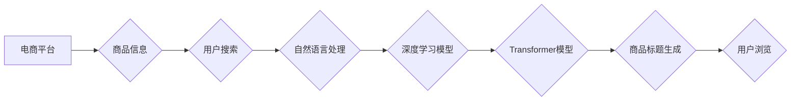

                 

## AI在电商平台商品标题生成中的应用

> 关键词：电商平台、商品标题生成、自然语言处理、深度学习、Transformer模型、BERT、生成式预训练模型、信息检索、用户体验

## 1. 背景介绍

在当今数字经济时代，电商平台已成为商品交易的主要渠道。商品标题作为用户搜索和浏览商品的第一接触点，直接影响着用户点击率、转化率和最终的销售额。传统的商品标题生成方式往往依赖人工撰写，效率低下，且难以满足海量商品的标题需求。

随着人工智能技术的快速发展，特别是自然语言处理（NLP）领域的突破，AI在电商平台商品标题生成中展现出巨大的潜力。利用AI技术，可以自动生成高质量、吸引用户的商品标题，提升用户体验，提高电商平台的运营效率。

## 2. 核心概念与联系

### 2.1  电商平台商品标题生成

电商平台商品标题生成是指利用计算机算法自动生成商品的标题，该标题需要包含商品的关键信息，并符合平台的规范和用户搜索习惯。

### 2.2  自然语言处理（NLP）

自然语言处理（NLP）是人工智能的一个分支，致力于使计算机能够理解、处理和生成人类语言。在商品标题生成中，NLP技术用于分析商品信息、理解用户搜索意图，并生成符合语义和语法规则的标题。

### 2.3  深度学习

深度学习是机器学习的一种，它利用多层神经网络来模拟人类大脑的学习过程。深度学习模型能够从海量数据中学习复杂的模式，在商品标题生成中，深度学习模型可以学习到商品特征、用户偏好等信息，并生成更精准、更符合用户需求的标题。

### 2.4  Transformer模型

Transformer模型是一种新型的深度学习架构，它能够有效处理序列数据，例如文本。Transformer模型在自然语言处理领域取得了突破性的进展，在商品标题生成中，Transformer模型可以更好地捕捉商品信息之间的语义关系，生成更流畅、更自然的标题。

**核心概念与架构流程图**



## 3. 核心算法原理 & 具体操作步骤

### 3.1  算法原理概述

商品标题生成算法通常基于生成式预训练模型，例如BERT、GPT等。这些模型通过预训练的方式学习到语言的语义和语法规则，并能够根据输入的商品信息生成符合规范的标题。

### 3.2  算法步骤详解

1. **数据预处理:** 收集商品信息和标题数据，进行清洗、格式化和编码。
2. **模型训练:** 利用预训练的生成式模型，对商品信息和标题数据进行训练，学习商品标题生成规律。
3. **模型评估:** 使用测试数据评估模型的性能，例如准确率、流畅度等指标。
4. **模型调优:** 根据评估结果，调整模型参数，提高模型性能。
5. **标题生成:** 将新的商品信息输入到训练好的模型中，生成相应的标题。

### 3.3  算法优缺点

**优点:**

* 自动化生成标题，提高效率。
* 学习用户搜索习惯，生成更精准的标题。
* 能够处理海量商品信息。

**缺点:**

* 需要大量的训练数据。
* 模型训练成本较高。
* 生成的标题可能缺乏创意和个性。

### 3.4  算法应用领域

* **电商平台:** 自动生成商品标题，提高用户体验和转化率。
* **内容创作:** 自动生成文章标题、视频标题等。
* **机器翻译:** 自动生成目标语言的标题。

## 4. 数学模型和公式 & 详细讲解 & 举例说明

### 4.1  数学模型构建

商品标题生成模型通常基于Transformer模型，其核心是注意力机制。注意力机制允许模型关注输入序列中与目标输出相关的部分，从而更好地理解语义关系。

### 4.2  公式推导过程

Transformer模型的注意力机制使用以下公式计算每个词对目标词的权重：

$$
\text{Attention}(Q, K, V) = \text{softmax}\left(\frac{QK^T}{\sqrt{d_k}}\right)V
$$

其中：

* $Q$：查询矩阵
* $K$：键矩阵
* $V$：值矩阵
* $d_k$：键向量的维度
* $\text{softmax}$：softmax函数

### 4.3  案例分析与讲解

假设我们想要生成商品标题“智能手机”，输入的商品信息为“高性能处理器、大容量内存、高清摄像头”。

Transformer模型会将这些信息编码成词向量，然后通过注意力机制计算每个词对目标词“智能手机”的权重。例如，“高性能处理器”可能与“智能手机”的权重较高，因为它们是密切相关的概念。

最终，模型会根据这些权重生成标题“智能手机”，并根据训练数据中的其他信息，例如商品价格、品牌等，进一步优化标题。

## 5. 项目实践：代码实例和详细解释说明

### 5.1  开发环境搭建

* Python 3.7+
* TensorFlow 2.0+
* PyTorch 1.0+
* NLTK
* Transformers

### 5.2  源代码详细实现

```python
from transformers import AutoTokenizer, AutoModelForSeq2SeqLM

# 加载预训练模型和词典
tokenizer = AutoTokenizer.from_pretrained("google/flan-t5-base")
model = AutoModelForSeq2SeqLM.from_pretrained("google/flan-t5-base")

# 定义商品信息
product_info = "高性能处理器、大容量内存、高清摄像头"

# 将商品信息转换为输入格式
input_ids = tokenizer.encode(product_info, return_tensors="pt")

# 生成标题
output = model.generate(input_ids, max_length=10, num_beams=5)

# 将输出转换为文本
generated_title = tokenizer.decode(output[0], skip_special_tokens=True)

# 打印生成的标题
print(generated_title)
```

### 5.3  代码解读与分析

* 代码首先加载预训练的Transformer模型和词典。
* 然后定义商品信息，并将其转换为模型可以理解的输入格式。
* 使用模型的`generate`方法生成标题，并设置最大长度和beam搜索参数。
* 最后将输出转换为文本，并打印生成的标题。

### 5.4  运行结果展示

运行上述代码，可能会生成以下标题：

* 智能手机
* 高性能手机
* 旗舰手机

## 6. 实际应用场景

### 6.1  电商平台商品标题优化

AI可以帮助电商平台自动生成商品标题，并根据用户搜索习惯和商品特征进行优化，提高商品的曝光率和点击率。

### 6.2  内容创作辅助工具

AI可以帮助内容创作者自动生成文章标题、视频标题等，节省时间和精力，提高创作效率。

### 6.3  信息检索系统

AI可以帮助信息检索系统生成更精准的标题，提高用户搜索结果的准确率和相关性。

### 6.4  未来应用展望

随着人工智能技术的不断发展，AI在商品标题生成领域的应用将更加广泛和深入。未来，AI可能能够生成更具创意和个性化的标题，并更好地理解用户的需求和意图。

## 7. 工具和资源推荐

### 7.1  学习资源推荐

* **书籍:**
    * 《深度学习》
    * 《自然语言处理》
* **在线课程:**
    * Coursera: 自然语言处理
    * Udacity: 深度学习
* **博客和网站:**
    * TensorFlow Blog
    * PyTorch Blog
    * Hugging Face

### 7.2  开发工具推荐

* **Python:** 
    * TensorFlow
    * PyTorch
    * NLTK
* **Transformers库:** 提供预训练的Transformer模型和工具

### 7.3  相关论文推荐

* Attention Is All You Need
* BERT: Pre-training of Deep Bidirectional Transformers for Language Understanding
* T5: Text-to-Text Transfer Transformer

## 8. 总结：未来发展趋势与挑战

### 8.1  研究成果总结

AI在电商平台商品标题生成领域取得了显著的成果，能够自动生成高质量、吸引用户的标题，提高用户体验和电商平台的运营效率。

### 8.2  未来发展趋势

* **更强大的模型:** 未来将出现更强大的Transformer模型，能够更好地理解语义关系，生成更精准、更符合用户需求的标题。
* **个性化标题生成:** AI将能够根据用户的个人喜好和搜索历史，生成个性化的标题，提高用户体验。
* **跨语言标题生成:** AI将能够跨语言生成标题，满足全球用户的需求。

### 8.3  面临的挑战

* **数据质量:** AI模型的性能取决于训练数据的质量，需要不断收集和清洗高质量的商品信息和标题数据。
* **模型解释性:** 当前的AI模型缺乏解释性，难以理解模型是如何生成标题的，这限制了模型的应用和推广。
* **伦理问题:** AI生成的标题可能存在偏见或误导性，需要关注AI伦理问题，确保AI技术应用的安全性、公平性和可控性。

### 8.4  研究展望

未来，AI在商品标题生成领域的应用将更加广泛和深入，需要继续加强模型研究、数据积累和伦理规范的制定，推动AI技术在电商平台和社会其他领域的健康发展。

## 9. 附录：常见问题与解答

* **Q: AI生成的标题是否会缺乏创意？**

A: AI生成的标题可能会缺乏创意，但随着模型的不断发展和训练数据量的增加，AI能够生成更具创意和个性化的标题。

* **Q: AI生成的标题是否会存在误导性？**

A: AI生成的标题可能会存在误导性，需要对模型进行严格的测试和评估，并制定相应的规范和机制，确保AI技术应用的安全性、公平性和可控性。

* **Q: 如何评估AI生成的标题的质量？**

A: 可以使用多种指标来评估AI生成的标题的质量，例如准确率、流畅度、相关性、吸引力等。

作者：禅与计算机程序设计艺术 / Zen and the Art of Computer Programming


<end_of_turn>

