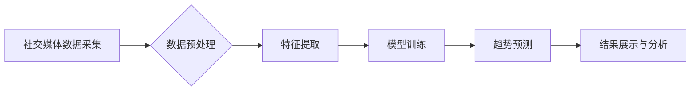

                 

## AI在社交媒体分析中的应用：趋势预测

> 关键词：社交媒体分析、趋势预测、机器学习、深度学习、自然语言处理、情感分析、时间序列分析

## 1. 背景介绍

社交媒体已经成为人们获取信息、表达观点和进行社交互动的主要平台。其海量数据蕴藏着丰富的社会、文化和经济信息，为企业、政府和研究机构提供了宝贵的洞察力。其中，趋势预测作为一种重要的分析方法，能够帮助我们理解用户行为、预测未来事件和趋势，从而做出更明智的决策。

传统的趋势预测方法主要依赖于统计分析和专家经验，但随着社交媒体数据的爆炸式增长，这些方法面临着挑战。传统的统计方法难以处理复杂、非线性的数据关系，而专家经验难以量化和推广。

近年来，人工智能（AI）技术的发展为社交媒体分析带来了新的机遇。AI算法能够从海量数据中自动学习模式和规律，并进行更精准的趋势预测。

## 2. 核心概念与联系

**2.1 核心概念**

* **社交媒体分析 (Social Media Analytics)**：是指利用数据挖掘、机器学习等技术，从社交媒体平台上收集、分析和解读用户生成内容，以获取对社会、文化、市场等方面的洞察。
* **趋势预测 (Trend Prediction)**：是指利用历史数据和分析模型，预测未来事件或趋势的发生可能性和发展方向。

**2.2 联系**

社交媒体分析和趋势预测相互关联，前者为后者提供数据基础，后者则利用社交媒体分析的结果进行预测。

**2.3 架构图**



## 3. 核心算法原理 & 具体操作步骤

**3.1 算法原理概述**

趋势预测算法通常基于机器学习和深度学习技术，利用历史数据训练模型，并根据模型预测未来趋势。常见的趋势预测算法包括：

* **线性回归 (Linear Regression)**：一种简单的回归算法，假设趋势呈线性关系。
* **时间序列分析 (Time Series Analysis)**：专门用于分析时间序列数据的算法，例如ARIMA、SARIMA等。
* **支持向量机 (Support Vector Machine)**：一种强大的分类算法，可以用于预测分类型趋势。
* **深度学习 (Deep Learning)**：利用多层神经网络进行复杂数据分析，例如RNN、LSTM等。

**3.2 算法步骤详解**

1. **数据采集**: 从社交媒体平台收集相关数据，例如用户帖子、评论、点赞等。
2. **数据预处理**: 对收集到的数据进行清洗、转换和格式化，例如去除噪声、标注实体、转换数据类型等。
3. **特征提取**: 从预处理后的数据中提取有价值的特征，例如用户属性、话题标签、情感倾向等。
4. **模型训练**: 选择合适的趋势预测算法，并利用训练数据训练模型。
5. **模型评估**: 使用测试数据评估模型的预测精度，并进行模型调优。
6. **趋势预测**: 利用训练好的模型对未来趋势进行预测。
7. **结果展示与分析**: 将预测结果可视化展示，并进行深入分析。

**3.3 算法优缺点**

| 算法 | 优点 | 缺点 |
|---|---|---|
| 线性回归 | 简单易懂，计算效率高 | 只能处理线性关系，对复杂数据拟合能力差 |
| 时间序列分析 | 专门用于时间序列数据，能够捕捉时间依赖性 | 对数据类型要求高，需要进行复杂的模型选择 |
| 支持向量机 | 能够处理高维数据，泛化能力强 | 计算复杂度高，训练时间长 |
| 深度学习 | 能够处理复杂非线性关系，预测精度高 | 数据需求量大，训练时间长，解释性差 |

**3.4 算法应用领域**

* **市场营销**: 预测产品趋势、用户购买行为、广告效果等。
* **舆情监测**: 预测社会事件、热点话题、舆情走向等。
* **金融投资**: 预测股票价格、市场波动、风险评估等。
* **政治选举**: 预测投票结果、选民情绪、竞选策略等。

## 4. 数学模型和公式 & 详细讲解 & 举例说明

**4.1 数学模型构建**

趋势预测模型通常基于回归模型，例如线性回归模型。线性回归模型假设趋势呈线性关系，可以用以下公式表示：

$$y = mx + c$$

其中：

* $y$ 是预测值
* $x$ 是自变量，例如时间
* $m$ 是斜率，表示趋势的强度
* $c$ 是截距，表示趋势的起点

**4.2 公式推导过程**

线性回归模型的参数 $m$ 和 $c$ 可以通过最小二乘法求解。最小二乘法是指寻找一条直线，使所有数据点到直线的距离之和最小。

**4.3 案例分析与讲解**

假设我们想要预测某产品的销量趋势，并收集了过去 12 个月的销量数据。我们可以将时间作为自变量，销量作为因变量，构建一个线性回归模型。

通过最小二乘法求解模型参数，得到以下线性回归方程：

$$销量 = 100 * 时间 + 500$$

这个方程表示，该产品的销量每增加一个月，就会增加 100 个单位，初始销量为 500 个单位。

## 5. 项目实践：代码实例和详细解释说明

**5.1 开发环境搭建**

* Python 3.x
* Jupyter Notebook
* pandas
* scikit-learn

**5.2 源代码详细实现**

```python
import pandas as pd
from sklearn.linear_model import LinearRegression

# 导入数据
data = pd.read_csv('sales_data.csv')

# 将时间作为自变量，销量作为因变量
X = data['时间'].values.reshape(-1, 1)
y = data['销量'].values

# 创建线性回归模型
model = LinearRegression()

# 训练模型
model.fit(X, y)

# 预测未来销量
future_time = pd.DataFrame({'时间': [13, 14, 15]})
future_sales = model.predict(future_time)

# 打印预测结果
print(future_sales)
```

**5.3 代码解读与分析**

1. 导入必要的库函数。
2. 导入销量数据，并将时间和销量分别作为自变量和因变量。
3. 创建线性回归模型对象。
4. 使用训练数据训练模型。
5. 使用训练好的模型预测未来销量。
6. 打印预测结果。

**5.4 运行结果展示**

运行代码后，会输出未来三个月的销量预测值。

## 6. 实际应用场景

**6.1 市场营销**

* 预测产品趋势：分析用户对不同产品的评论和点赞，预测未来哪些产品将受欢迎。
* 预测用户购买行为：根据用户的浏览历史、购买记录和社交行为，预测用户未来可能购买的产品。
* 预测广告效果：分析广告投放后的用户互动数据，预测广告的点击率、转化率等指标。

**6.2 舆情监测**

* 预测社会事件：分析用户对特定事件的讨论和情绪，预测事件的传播范围和潜在影响。
* 预测热点话题：分析用户关注的话题和讨论趋势，预测未来哪些话题将成为热点。
* 预测舆情走向：分析用户对特定事件或人物的评价和态度，预测舆情的正面、负面或中立倾向。

**6.3 其他应用场景**

* 金融投资：预测股票价格、市场波动、风险评估等。
* 政治选举：预测投票结果、选民情绪、竞选策略等。
* 健康医疗：预测疾病流行趋势、患者需求等。

**6.4 未来应用展望**

随着人工智能技术的不断发展，社交媒体分析和趋势预测将应用更加广泛，例如：

* 更精准的个性化推荐：根据用户的兴趣和行为，提供更精准的商品、服务和内容推荐。
* 更有效的营销策略：根据用户行为和趋势预测，制定更有效的营销策略，提高营销效果。
* 更深入的社会洞察：通过分析社交媒体数据，更深入地了解社会趋势、文化变化和用户需求。

## 7. 工具和资源推荐

**7.1 学习资源推荐**

* **书籍**:
    * 《Python数据科学手册》
    * 《机器学习实战》
    * 《深度学习》
* **在线课程**:
    * Coursera: Machine Learning
    * edX: Artificial Intelligence
    * Udacity: Deep Learning Nanodegree

**7.2 开发工具推荐**

* **Python**: 强大的编程语言，广泛应用于数据科学和机器学习。
* **Jupyter Notebook**: 交互式编程环境，方便进行数据分析和模型开发。
* **pandas**: 用于数据分析和处理的Python库。
* **scikit-learn**: 用于机器学习的Python库。
* **TensorFlow**: 用于深度学习的开源框架。

**7.3 相关论文推荐**

* **Social Media Analytics: A Survey**
* **Trend Prediction in Social Media: A Review**
* **Deep Learning for Social Media Trend Prediction**

## 8. 总结：未来发展趋势与挑战

**8.1 研究成果总结**

近年来，AI在社交媒体分析中的应用取得了显著进展，例如：

* 趋势预测的精度不断提高。
* 新的算法和模型不断涌现。
* 应用场景不断拓展。

**8.2 未来发展趋势**

* **更精准的预测**: 利用更先进的算法和模型，提高趋势预测的精度和可靠性。
* **更个性化的分析**: 根据用户的兴趣和行为，提供更个性化的趋势分析和洞察。
* **更跨领域的应用**: 将社交媒体分析和趋势预测应用到更多领域，例如医疗、教育、金融等。

**8.3 面临的挑战**

* **数据质量**: 社交媒体数据往往存在噪声、不完整和偏差等问题，需要进行有效的清洗和处理。
* **模型解释性**: 许多深度学习模型的内部机制难以理解，需要开发更可解释的模型。
* **伦理问题**: 社交媒体分析和趋势预测可能会涉及隐私、公平性和偏见等伦理问题，需要谨慎处理。

**8.4 研究展望**

未来，AI在社交媒体分析中的应用将继续发展，需要进一步研究以下问题：

* 如何开发更精准、更可解释的趋势预测模型。
* 如何解决社交媒体数据质量问题。
* 如何应对社交媒体分析和趋势预测带来的伦理挑战。


## 9. 附录：常见问题与解答

**9.1 如何选择合适的趋势预测算法？**

选择合适的趋势预测算法需要根据具体应用场景和数据特点进行判断。

* 如果数据呈线性关系，可以使用线性回归模型。
* 如果数据呈非线性关系，可以使用支持向量机或深度学习模型。
* 如果数据是时间序列数据，可以使用时间序列分析模型。

**9.2 如何处理社交媒体数据中的噪声和偏差？**

可以采用以下方法处理社交媒体数据中的噪声和偏差：

* **数据清洗**: 去除重复数据、无效数据和错误数据。
* **数据转换**: 将数据转换为标准格式，例如文本分类、情感分析等。
* **数据过滤**: 根据特定规则过滤掉噪声数据，例如去除广告、垃圾信息等。

**9.3 如何评估趋势预测模型的性能？**

常用的评估指标包括：

* **均方误差 (MSE)**: 衡量预测值与真实值的平均平方差。
* **平均绝对误差 (MAE)**: 衡量预测值与真实值的平均绝对差。
* **R-squared**: 衡量模型拟合优度。

作者：禅与计算机程序设计艺术 / Zen and the Art of Computer Programming 


<end_of_turn>

