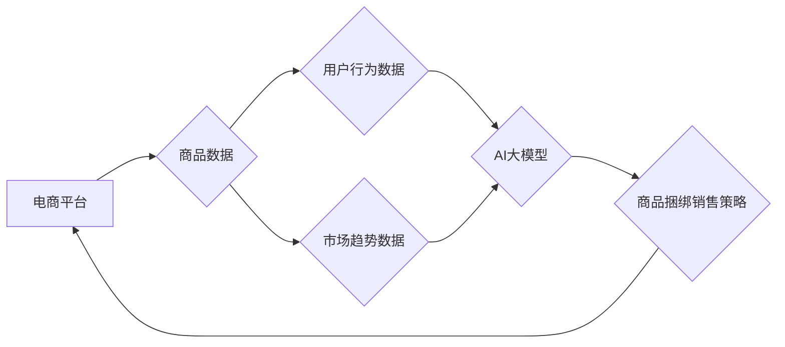

                 

## AI大模型在电商平台商品捆绑销售策略优化中的应用

> 关键词：AI大模型、商品捆绑销售、电商平台、策略优化、推荐系统、深度学习、强化学习

## 1. 背景介绍

在当今竞争激烈的电商市场，提高销售额和利润率是平台和商家共同的目标。商品捆绑销售作为一种常见的营销策略，通过将多个商品组合在一起以优惠的价格出售，能够有效提升销售转化率，增加客单价，并促进商品之间的交叉销售。然而，传统的商品捆绑销售策略往往依赖于人工经验和规则，缺乏数据驱动和智能化。

随着人工智能技术的快速发展，特别是深度学习和强化学习的突破，AI大模型在电商平台商品捆绑销售策略优化中展现出巨大的潜力。AI大模型能够通过学习海量用户行为数据、商品属性数据和市场趋势数据，挖掘潜在的商品关联关系，并自动生成个性化、高效的捆绑销售策略，从而提升销售效果和用户体验。

## 2. 核心概念与联系

### 2.1  商品捆绑销售

商品捆绑销售是指将多个商品组合在一起，以优惠的价格出售的一种营销策略。捆绑销售可以分为以下几种类型：

* **强制捆绑销售:** 用户必须购买所有捆绑商品才能获得优惠。
* **可选捆绑销售:** 用户可以选择购买部分或全部捆绑商品。
* **主题捆绑销售:** 根据特定主题或场景，将相关商品组合在一起出售。

### 2.2  AI大模型

AI大模型是指在海量数据上训练的深度学习模型，具有强大的学习和推理能力。常见的AI大模型类型包括：

* **Transformer模型:** 擅长处理序列数据，例如文本和时间序列数据。
* **生成对抗网络(GAN):** 能够生成逼真的合成数据，例如图像和文本。
* **强化学习模型:** 通过与环境交互学习，并不断优化策略以获得最大奖励。

### 2.3  电商平台

电商平台是指提供商品展示、交易、支付等服务的在线商业平台。常见的电商平台类型包括：

* **B2C平台:** 商家向消费者直接销售商品。
* **C2C平台:** 个人之间进行商品交易。
* **O2O平台:** 线上平台与线下实体店相结合，提供线上线下融合的购物体验。

### 2.4  策略优化

策略优化是指通过算法和模型，根据数据和目标函数，不断调整策略参数，以达到最佳效果。

**核心概念与联系流程图:**



## 3. 核心算法原理 & 具体操作步骤

### 3.1  算法原理概述

在电商平台商品捆绑销售策略优化中，常用的算法包括协同过滤、深度学习和强化学习。

* **协同过滤:** 基于用户或商品之间的相似性，推荐用户可能感兴趣的商品。
* **深度学习:** 利用多层神经网络，从海量数据中学习商品关联关系和用户偏好。
* **强化学习:** 通过与环境交互，不断优化策略以获得最大奖励，例如提高销售额或用户满意度。

### 3.2  算法步骤详解

**以深度学习为例，商品捆绑销售策略优化的具体操作步骤如下:**

1. **数据收集和预处理:** 收集用户行为数据、商品属性数据和市场趋势数据，并进行清洗、转换和特征工程。
2. **模型构建:** 选择合适的深度学习模型，例如循环神经网络(RNN)或图神经网络(GNN)，并根据数据特点进行模型设计和参数设置。
3. **模型训练:** 利用训练数据训练深度学习模型，并通过评估指标，例如准确率、召回率和F1-score，评估模型性能。
4. **策略优化:** 根据模型预测结果，生成不同商品捆绑组合，并通过A/B测试等方式，评估不同策略的效果。
5. **策略部署和监控:** 将优化的策略部署到电商平台，并持续监控策略效果，进行调整和优化。

### 3.3  算法优缺点

**深度学习算法在商品捆绑销售策略优化中的优缺点:**

* **优点:**

    * 能够学习复杂的数据关系，挖掘潜在的商品关联性。
    * 具有强大的泛化能力，能够适应不断变化的市场环境。
    * 可以实现个性化推荐，提升用户体验。

* **缺点:**

    * 需要海量数据进行训练，否则模型性能会下降。
    * 模型训练过程复杂，需要专业的技术人员进行操作。
    * 模型解释性较差，难以理解模型的决策过程。

### 3.4  算法应用领域

深度学习算法在电商平台商品捆绑销售策略优化之外，还广泛应用于以下领域:

* **推荐系统:** 根据用户兴趣和行为，推荐相关商品或服务。
* **个性化营销:** 根据用户特征，定制个性化的营销方案。
* **价格优化:** 根据市场需求和竞争情况，动态调整商品价格。
* **库存管理:** 预估商品需求，优化库存水平。

## 4. 数学模型和公式 & 详细讲解 & 举例说明

### 4.1  数学模型构建

在商品捆绑销售策略优化中，常用的数学模型包括：

* **目标函数:** 用于衡量策略效果，例如最大化销售额或利润。
* **约束条件:** 用于限制策略的执行范围，例如商品库存限制或价格限制。

**目标函数示例:**

假设我们希望最大化商品捆绑销售的利润，则目标函数可以定义为：

$$
Profit = \sum_{i=1}^{n} \text{Sales}_{i} \times \text{Margin}_{i}
$$

其中：

* $n$ 是商品捆绑组合的数量。
* $\text{Sales}_{i}$ 是第 $i$ 个商品捆绑组合的销售量。
* $\text{Margin}_{i}$ 是第 $i$ 个商品捆绑组合的利润率。

**约束条件示例:**

* 商品库存限制: 每个商品的销售量不能超过其库存量。
* 价格限制: 商品捆绑组合的价格不能低于某个阈值。

### 4.2  公式推导过程

在实际应用中，目标函数和约束条件通常更加复杂，需要进行数学推导和优化。例如，可以使用线性规划、非线性规划或动态规划等算法，求解最优的商品捆绑组合和销售策略。

### 4.3  案例分析与讲解

假设我们有一个电商平台，销售以下三种商品：

* 商品 A: 价格为 10 元，库存为 100 件。
* 商品 B: 价格为 20 元，库存为 50 件。
* 商品 C: 价格为 30 元，库存为 30 件。

我们希望通过商品捆绑销售，提高销售额和利润。

**方案一:** 将商品 A、B 和 C 捆绑在一起，价格为 50 元。

**方案二:** 将商品 A 和 B 捆绑在一起，价格为 25 元。

**方案三:** 将商品 B 和 C 捆绑在一起，价格为 45 元。

我们可以使用目标函数和约束条件，对以上方案进行评估，并选择最优方案。

## 5. 项目实践：代码实例和详细解释说明

### 5.1  开发环境搭建

为了实现商品捆绑销售策略优化，我们需要搭建一个开发环境，包括以下软件和工具:

* Python 编程语言
* TensorFlow 或 PyTorch 深度学习框架
* Jupyter Notebook 或 VS Code 代码编辑器
* Git 版本控制系统

### 5.2  源代码详细实现

以下是一个使用 TensorFlow 实现商品捆绑销售策略优化的简单代码示例:

```python
import tensorflow as tf

# 定义模型
model = tf.keras.Sequential([
    tf.keras.layers.Dense(64, activation='relu'),
    tf.keras.layers.Dense(32, activation='relu'),
    tf.keras.layers.Dense(1, activation='sigmoid')
])

# 编译模型
model.compile(optimizer='adam', loss='binary_crossentropy', metrics=['accuracy'])

# 训练模型
model.fit(x_train, y_train, epochs=10)

# 预测商品捆绑组合
predictions = model.predict(x_test)
```

### 5.3  代码解读与分析

* **模型定义:** 我们定义了一个简单的多层感知机模型，用于预测商品捆绑组合的销售可能性。
* **模型编译:** 我们使用 Adam 优化器、二元交叉熵损失函数和准确率作为评估指标，编译模型。
* **模型训练:** 我们使用训练数据训练模型，并设置训练轮数为 10。
* **模型预测:** 我们使用测试数据预测商品捆绑组合的销售可能性。

### 5.4  运行结果展示

训练完成后，我们可以评估模型的性能，例如准确率、召回率和F1-score。

## 6. 实际应用场景

### 6.1  电商平台商品推荐

AI大模型可以根据用户的购买历史、浏览记录和兴趣偏好，推荐相关的商品捆绑组合，提高用户购买意愿。

### 6.2  促销活动策划

电商平台可以利用 AI大模型分析用户行为数据，预测哪些商品捆绑组合在促销活动中更受欢迎，并制定相应的促销策略。

### 6.3  个性化营销

AI大模型可以根据用户的个人特征和购买习惯，定制个性化的商品捆绑销售方案，提升用户体验和营销效果。

### 6.4  未来应用展望

随着 AI 技术的不断发展，AI大模型在电商平台商品捆绑销售策略优化中的应用场景将更加广泛，例如：

* **跨平台商品捆绑销售:** 将不同电商平台的商品进行捆绑销售，扩大销售范围。
* **虚拟商品捆绑销售:** 将虚拟商品，例如游戏道具和数字内容，与实物商品捆绑销售，创造新的商业模式。
* **个性化价格优化:** 根据用户的购买历史和行为，动态调整商品捆绑组合的价格，实现个性化定价。

## 7. 工具和资源推荐

### 7.1  学习资源推荐

* **书籍:**
    * 深度学习
    * 强化学习
    * 自然语言处理
* **在线课程:**
    * Coursera
    * edX
    * Udacity

### 7.2  开发工具推荐

* **Python:** 
    * TensorFlow
    * PyTorch
    * Keras
* **数据处理工具:**
    * Pandas
    * NumPy
* **可视化工具:**
    * Matplotlib
    * Seaborn

### 7.3  相关论文推荐

* **深度学习在推荐系统中的应用:**
    * Deep Learning for Recommender Systems
* **强化学习在电商平台中的应用:**
    * Reinforcement Learning for E-commerce

## 8. 总结：未来发展趋势与挑战

### 8.1  研究成果总结

AI大模型在电商平台商品捆绑销售策略优化中取得了显著的成果，能够有效提升销售额、利润和用户体验。

### 8.2  未来发展趋势

未来，AI大模型在电商平台商品捆绑销售策略优化方面的研究将朝着以下方向发展:

* **模型更加复杂和智能:** 利用更先进的深度学习算法和模型架构，例如 Transformer 和图神经网络，挖掘更深层次的商品关联关系和用户偏好。
* **数据更加丰富和多样:** 收集更多类型的用户行为数据、商品属性数据和市场趋势数据，例如社交媒体数据、传感器数据和地理位置数据，为模型训练提供更丰富的输入。
* **个性化更加精准:** 利用用户画像和行为分析，实现更加精准的商品捆绑推荐和个性化定价。

### 8.3  面临的挑战

AI大模型在电商平台商品捆绑销售策略优化方面也面临一些挑战:

* **数据隐私和安全:** 收集和使用用户数据需要考虑隐私和安全问题，确保数据的合法性和安全性。
* **模型解释性和可信度:** 深度学习模型的决策过程往往难以解释，需要提高模型的透明度和可信度，赢得用户的信任。
* **算法公平性和可控性:** 避免算法产生偏见和歧视，确保算法的公平性和可控性。

### 8.4  研究展望

未来，我们需要继续加强对 AI大模型在电商平台商品捆绑销售策略优化方面的研究，探索更先进的算法、模型和应用场景，推动 AI 技术在电商领域的创新发展。

## 9. 附录：常见问题与解答

### 9.1  Q1: AI大模型是否会取代人工？

**A1:** AI大模型可以辅助人工完成商品捆绑销售策略优化的部分工作，但不会完全取代人工。人工仍然需要进行策略设计、模型评估和结果分析等工作，并根据实际情况进行调整和优化。

### 9.2  Q2: 如何评估 AI大模型的性能？

**A2:** AI大模型的性能可以通过多种指标进行评估，例如准确率、召回率、F1-score、AUC 等。

### 9.3  Q3: 如何解决 AI大模型的数据隐私和安全问题？

**A3:** 

* **数据匿名化:** 对用户数据进行匿名处理，去除个人识别信息。
* **数据加密:** 使用加密技术保护用户数据的安全。
* **数据访问控制:** 严格控制对用户数据的访问权限。

作者：禅与计算机程序设计艺术 / Zen and the Art of Computer Programming


<end_of_turn>

