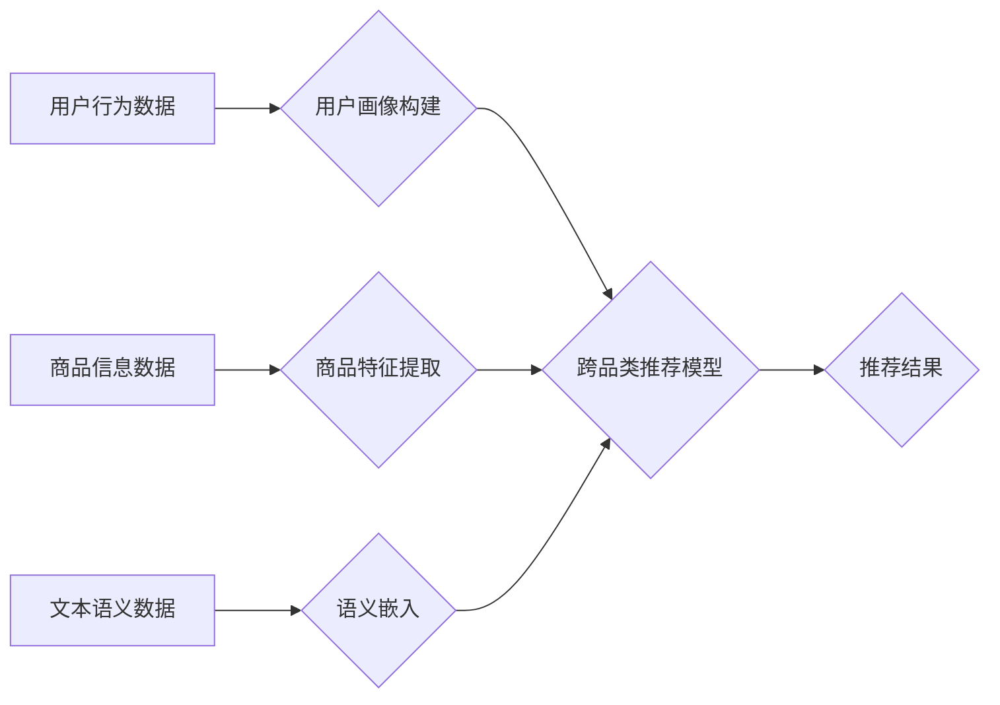

                 

## AI大模型在跨品类推荐中的表现

> 关键词：AI大模型、跨品类推荐、协同过滤、深度学习、Transformer、用户画像、商品特征、推荐系统

## 1. 背景介绍

推荐系统作为电商、社交媒体等平台的核心功能之一，旨在为用户提供个性化、精准的产品或内容推荐，从而提升用户体验和商业价值。传统的推荐系统主要依赖于协同过滤和基于内容的过滤算法，但这些方法在跨品类推荐方面表现有限。

随着深度学习技术的快速发展，基于AI大模型的推荐系统逐渐成为研究热点。AI大模型，例如BERT、GPT、T5等，凭借其强大的语义理解和文本生成能力，在跨品类推荐中展现出巨大的潜力。

跨品类推荐是指推荐不同类别商品或内容，例如推荐服装的同时也推荐相关的鞋子、包包等。传统的推荐系统难以捕捉跨品类之间的关联性，而AI大模型能够通过学习用户行为、商品特征和文本语义等多方面信息，构建更丰富的跨品类推荐模型。

## 2. 核心概念与联系

**2.1 核心概念**

* **AI大模型:** 指训练规模庞大、参数数量众多的深度学习模型，能够学习复杂的语义关系和模式。
* **跨品类推荐:** 指推荐不同类别商品或内容，例如推荐服装的同时也推荐相关的鞋子、包包等。
* **用户画像:** 通过分析用户行为、偏好、兴趣等信息，构建用户个性化的描述模型。
* **商品特征:** 描述商品属性、类别、价格、评论等信息的向量表示。
* **语义嵌入:** 将文本信息映射到低维向量空间，以便模型进行语义理解和比较。

**2.2 架构图**



## 3. 核心算法原理 & 具体操作步骤

**3.1 算法原理概述**

基于AI大模型的跨品类推荐算法通常采用以下核心原理：

* **多模态融合:** 将用户行为、商品特征、文本语义等多模态数据融合，构建更全面的用户和商品表示。
* **深度学习:** 利用深度神经网络，例如Transformer，学习复杂的数据关系和模式。
* **注意力机制:**  通过注意力机制，模型可以重点关注与推荐相关的关键信息，提高推荐的准确性。

**3.2 算法步骤详解**

1. **数据预处理:** 收集用户行为数据、商品信息数据和文本语义数据，并进行清洗、转换和特征工程。
2. **用户画像构建:** 利用机器学习算法，例如K-Means聚类或深度学习模型，构建用户画像，将用户分为不同的兴趣群体。
3. **商品特征提取:** 利用自然语言处理技术，例如词嵌入或BERT，提取商品的文本特征，并与商品属性、类别等信息融合，构建商品特征向量。
4. **语义嵌入:** 利用预训练的语义模型，例如Word2Vec或BERT，将文本信息映射到低维向量空间，构建语义嵌入。
5. **跨品类推荐模型训练:** 利用深度学习框架，例如TensorFlow或PyTorch，训练跨品类推荐模型，例如Transformer-based推荐模型。
6. **推荐结果生成:** 将训练好的模型应用于新的用户和商品数据，生成推荐结果。

**3.3 算法优缺点**

* **优点:**
    * 能够捕捉跨品类之间的关联性，提高推荐的准确性和多样性。
    * 能够学习用户复杂的兴趣偏好，提供更个性化的推荐。
    * 能够利用海量文本数据，提升推荐的语义理解能力。
* **缺点:**
    * 需要大量的训练数据和计算资源。
    * 模型训练复杂，需要专业的技术人员进行操作。
    * 容易受到数据偏差的影响，需要进行数据清洗和预处理。

**3.4 算法应用领域**

* 电商平台：跨品类商品推荐，例如服装搭配推荐、电子产品配件推荐。
* 内容平台：跨品类内容推荐，例如新闻推荐、视频推荐、音乐推荐。
* 社交媒体：跨品类兴趣推荐，例如用户兴趣标签推荐、好友推荐。

## 4. 数学模型和公式 & 详细讲解 & 举例说明

**4.1 数学模型构建**

假设我们有一个用户集合U，商品集合I，用户-商品交互矩阵R∈R<sup>|U|×|I|</sup>，其中R<sub>ui</sub>表示用户u对商品i的交互行为（例如点击、购买）。

**4.2 公式推导过程**

基于协同过滤的跨品类推荐模型可以利用矩阵分解技术，将用户-商品交互矩阵分解成两个低维矩阵：用户特征矩阵U∈R<sup>|U|×k</sup>和商品特征矩阵V∈R<sup>|I|×k</sup>，其中k是隐特征维度。

目标函数为：

$$
L(U,V) = \frac{1}{2} \sum_{u \in U, i \in I} (R_{ui} - \hat{R}_{ui})^2 + \lambda ||U||^2 + \lambda ||V||^2
$$

其中：

* $\hat{R}_{ui}$是模型预测的用户u对商品i的交互行为。
* $\lambda$是正则化参数，用于防止模型过拟合。

**4.3 案例分析与讲解**

假设我们有一个电商平台，用户集合U包含1000个用户，商品集合I包含10000个商品。用户-商品交互矩阵R是一个稀疏矩阵，其中只有部分用户对部分商品进行了交互。

我们可以利用矩阵分解技术，将用户-商品交互矩阵分解成两个低维矩阵U和V。例如，我们可以设置隐特征维度k=10。

通过训练模型，我们可以得到用户特征矩阵U和商品特征矩阵V。

然后，我们可以利用这些特征矩阵，预测用户u对商品i的交互行为。例如，我们可以计算用户u和商品i的相似度：

$$
Sim(u,i) = U_u^T V_i
$$

其中：

* $U_u$是用户u的特征向量。
* $V_i$是商品i的特征向量。

相似度越高，表示用户u对商品i的兴趣越大，模型就越有可能推荐商品i给用户u。

## 5. 项目实践：代码实例和详细解释说明

**5.1 开发环境搭建**

* Python 3.6+
* TensorFlow 2.0+
* PyTorch 1.0+
* Jupyter Notebook

**5.2 源代码详细实现**

```python
import tensorflow as tf

# 定义用户-商品交互矩阵
R = tf.random.normal((1000, 10000))

# 定义用户特征矩阵和商品特征矩阵
U = tf.Variable(tf.random.normal((1000, 10)))
V = tf.Variable(tf.random.normal((10000, 10)))

# 定义损失函数
def loss_function(R, U, V):
    predictions = tf.matmul(U, V, transpose_b=True)
    return tf.reduce_mean(tf.square(R - predictions))

# 定义优化器
optimizer = tf.keras.optimizers.Adam(learning_rate=0.01)

# 训练模型
for epoch in range(100):
    with tf.GradientTape() as tape:
        loss = loss_function(R, U, V)
    gradients = tape.gradient(loss, [U, V])
    optimizer.apply_gradients(zip(gradients, [U, V]))

# 生成推荐结果
predictions = tf.matmul(U, V, transpose_b=True)
```

**5.3 代码解读与分析**

* 代码首先定义了用户-商品交互矩阵R，以及用户特征矩阵U和商品特征矩阵V。
* 然后定义了损失函数，用于衡量模型预测结果与真实交互行为之间的差异。
* 使用Adam优化器对模型参数进行更新。
* 最后，利用训练好的模型生成推荐结果。

**5.4 运行结果展示**

运行代码后，可以得到模型训练的损失函数曲线，以及模型预测的推荐结果。

## 6. 实际应用场景

**6.1 电商平台**

* **跨品类商品推荐:** 例如，推荐服装的同时也推荐相关的鞋子、包包等。
* **个性化商品推荐:** 根据用户的购买历史、浏览记录、评价等信息，推荐个性化的商品。
* **新品推荐:** 推广新上市的商品，提高用户对新品的关注度。

**6.2 内容平台**

* **跨品类内容推荐:** 例如，推荐新闻的同时也推荐相关的视频、音频等。
* **个性化内容推荐:** 根据用户的阅读习惯、观看记录、点赞等信息，推荐个性化的内容。
* **内容发现:** 帮助用户发现新的兴趣点和内容。

**6.3 社交媒体**

* **跨品类兴趣推荐:** 例如，推荐用户可能感兴趣的商品、活动、话题等。
* **好友推荐:** 根据用户的兴趣爱好和社交关系，推荐潜在的好友。
* **社区运营:** 帮助平台运营者发现用户兴趣热点，进行社区运营和内容策划。

**6.4 未来应用展望**

随着AI技术的不断发展，跨品类推荐系统将更加智能化、个性化和精准化。未来，跨品类推荐系统可能具备以下特点：

* **更深入的跨品类关联挖掘:** 利用更先进的深度学习模型和语义理解技术，挖掘更深层次的跨品类关联，提供更精准的推荐。
* **更个性化的用户画像:** 利用多模态数据，构建更全面的用户画像，更加精准地理解用户的兴趣偏好和需求。
* **更丰富的交互方式:** 支持语音、图像、视频等多种交互方式，提供更便捷的用户体验。
* **更智能的推荐策略:** 基于用户的实时行为和上下文信息，动态调整推荐策略，提供更个性化和及时化的推荐。

## 7. 工具和资源推荐

**7.1 学习资源推荐**

* **书籍:**
    * 《深度学习》
    * 《推荐系统实践》
    * 《自然语言处理入门》
* **在线课程:**
    * Coursera: 深度学习
    * Udacity: 自然语言处理
    * fast.ai: 深度学习

**7.2 开发工具推荐**

* **深度学习框架:** TensorFlow, PyTorch, Keras
* **数据处理工具:** Pandas, NumPy
* **机器学习库:** scikit-learn

**7.3 相关论文推荐**

* **BERT:** Devlin et al. (2018). BERT: Pre-training of Deep Bidirectional Transformers for Language Understanding.
* **Transformer:** Vaswani et al. (2017). Attention Is All You Need.
* **推荐系统论文:** 
    * Rendle et al. (2010). Factorization Machines.
    * Koren et al. (2009). Collaborative Filtering with Implicit Feedback.

## 8. 总结：未来发展趋势与挑战

**8.1 研究成果总结**

基于AI大模型的跨品类推荐系统取得了显著的进展，能够有效地捕捉跨品类之间的关联性，提供更精准和个性化的推荐。

**8.2 未来发展趋势**

* **更强大的模型:** 研究更强大的深度学习模型，例如Transformer-XL、GPT-3等，提升跨品类推荐的准确性和效果。
* **更丰富的特征:** 利用更丰富的用户和商品特征，例如用户画像、商品属性、文本语义等，构建更全面的推荐模型。
* **更智能的交互:** 支持更智能的交互方式，例如语音、图像、视频等，提供更便捷的用户体验。

**8.3 面临的挑战**

* **数据稀疏性:** 用户-商品交互数据往往是稀疏的，需要采用有效的处理方法，例如矩阵分解、协同过滤等。
* **数据偏差:** 数据偏差会影响模型的训练效果，需要进行数据清洗和预处理。
* **模型解释性:** 深度学习模型的内部机制难以解释，需要研究更可解释的推荐模型。

**8.4 研究展望**

未来，跨品类推荐系统将朝着更智能化、个性化和精准化的方向发展，为用户提供更丰富的体验和价值。


## 9. 附录：常见问题与解答

**9.1 如何处理数据稀疏性问题？**

数据稀疏性是跨品类推荐系统面临的一个常见问题。可以采用以下方法处理数据稀疏性：

* **矩阵分解:** 将用户-商品交互矩阵分解成两个低维矩阵，例如协同过滤中的矩阵分解。
* **协同过滤:** 利用用户的相似用户或相似商品进行推荐。
* **知识图谱:** 利用知识图谱中的语义关系，补全缺失的数据。

**9.2 如何解决数据偏差问题？**

数据偏差会影响模型的训练效果，需要进行数据清洗和预处理。例如：

* **数据清洗:** 去除噪声数据、重复数据等。
* **数据平衡:** 对不同类别的数据进行平衡，避免模型偏向某个类别。
* **数据增强:** 利用数据增强技术，生成新的数据样本，丰富数据多样性。


作者：禅与计算机程序设计艺术 / Zen and the Art of Computer Programming 
<end_of_turn>

