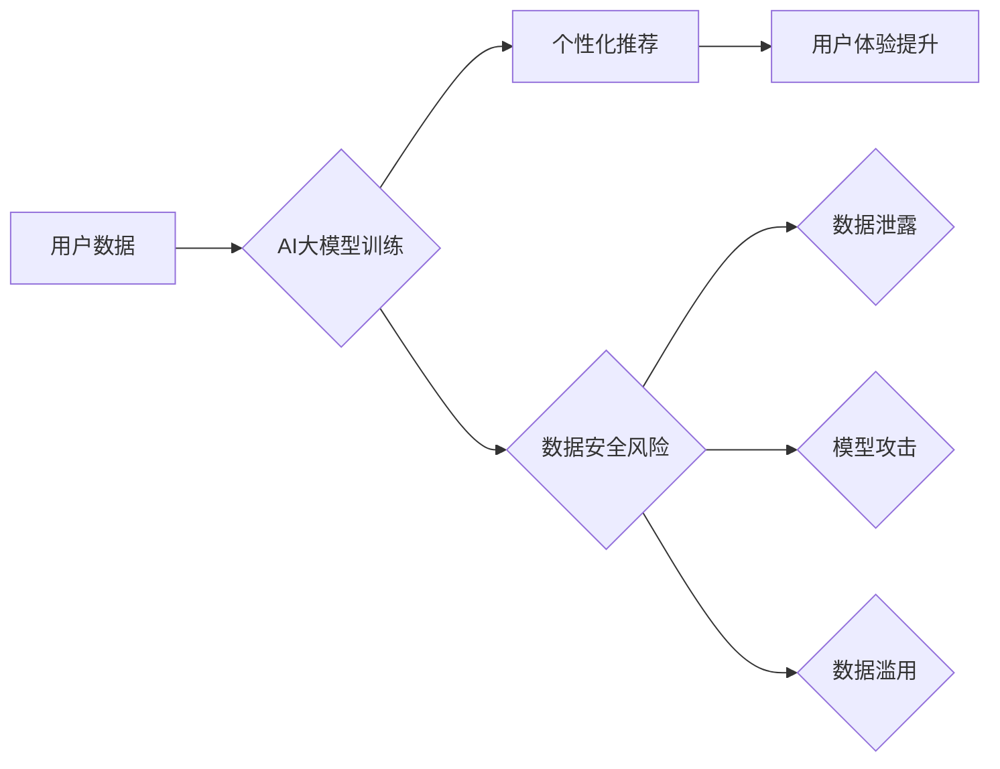

                 

## AI大模型重构电商搜索推荐的数据安全审计工具选型与应用最佳实践

> 关键词：AI大模型、电商搜索推荐、数据安全审计、工具选型、最佳实践、隐私保护、安全评估、风险控制

## 1. 背景介绍

随着电商行业的蓬勃发展，搜索推荐系统已成为电商平台的核心竞争力，其精准度和用户体验直接影响着用户转化率和平台收入。近年来，大规模的AI模型，例如Transformer模型，在自然语言处理领域取得了突破性进展，为电商搜索推荐带来了新的机遇。这些模型能够学习用户行为、商品特征等海量数据，提供更个性化、精准的推荐结果。然而，AI大模型的应用也带来了新的数据安全挑战。

电商搜索推荐系统处理大量用户敏感数据，包括用户身份信息、浏览历史、购买记录等。如果这些数据泄露或被恶意利用，将可能导致用户隐私泄露、身份盗窃、商业秘密泄露等严重后果。因此，对电商搜索推荐系统的数据安全进行审计和保障至关重要。

## 2. 核心概念与联系

### 2.1 数据安全审计

数据安全审计是指对数据系统、数据处理流程、数据安全控制措施等进行系统性的检查和评估，以确保数据安全和合规性。其目标是识别潜在的安全风险，评估风险等级，并提出相应的改进建议。

### 2.2 AI大模型与电商搜索推荐

AI大模型在电商搜索推荐系统中的应用主要体现在以下几个方面：

* **用户画像构建:** AI大模型可以分析用户行为数据，构建用户画像，包括用户兴趣、偏好、购买习惯等，为个性化推荐提供依据。
* **商品推荐:** AI大模型可以分析商品特征数据，预测用户对商品的兴趣，并推荐相关商品。
* **搜索结果排序:** AI大模型可以根据用户搜索词和历史行为，对搜索结果进行排序，提高搜索结果的精准度。

### 2.3 数据安全风险

AI大模型在电商搜索推荐系统中的应用，也带来了新的数据安全风险：

* **数据泄露风险:** AI大模型训练过程中需要处理大量用户敏感数据，如果数据安全措施不到位，可能会导致数据泄露。
* **模型攻击风险:** 攻击者可以利用模型的脆弱性，进行数据 poisoning、模型 backdoor 等攻击，导致模型输出错误结果，甚至泄露用户隐私。
* **数据滥用风险:** AI大模型可以分析用户行为数据，预测用户需求，如果数据被滥用，可能会导致用户隐私被侵犯，甚至被进行精准营销或欺诈。

**Mermaid 流程图**



## 3. 核心算法原理 & 具体操作步骤

### 3.1 算法原理概述

数据安全审计工具通常采用多种算法和技术，例如：

* **数据脱敏技术:** 将用户敏感数据进行加密、匿名化等处理，降低数据泄露风险。
* **模型安全评估技术:** 对AI模型进行安全评估，识别模型的潜在漏洞和攻击面。
* **数据访问控制技术:** 对用户数据进行访问控制，限制数据访问权限，防止数据被未授权人员访问。

### 3.2 算法步骤详解

**数据脱敏技术**

1. **数据识别:** 识别用户敏感数据，例如姓名、身份证号码、地址等。
2. **脱敏方法选择:** 根据数据类型和脱敏需求，选择合适的脱敏方法，例如加密、匿名化、模糊化等。
3. **数据脱敏:** 对用户敏感数据进行脱敏处理，生成安全的匿名数据。

**模型安全评估技术**

1. **模型输入分析:** 分析AI模型的输入数据，识别潜在的攻击向量。
2. **模型结构分析:** 分析AI模型的结构，识别模型的潜在漏洞。
3. **模型输出分析:** 分析AI模型的输出结果，识别模型的潜在攻击面。

**数据访问控制技术**

1. **角色权限管理:** 对用户进行角色划分，并分配相应的权限，控制用户对数据的访问权限。
2. **访问日志记录:** 记录用户对数据的访问行为，以便进行审计和追踪。
3. **数据加密:** 对用户数据进行加密，防止未授权人员访问。

### 3.3 算法优缺点

**数据脱敏技术**

* **优点:** 可以有效降低数据泄露风险。
* **缺点:** 脱敏后的数据可能无法满足某些业务需求。

**模型安全评估技术**

* **优点:** 可以识别模型的潜在漏洞和攻击面，提高模型的安全性和可靠性。
* **缺点:** 模型安全评估技术还处于发展阶段，存在一定的局限性。

**数据访问控制技术**

* **优点:** 可以有效控制用户对数据的访问权限，防止数据被未授权人员访问。
* **缺点:** 需要进行复杂的系统配置和管理。

### 3.4 算法应用领域

* **电商搜索推荐系统:** 对用户数据进行脱敏处理，保护用户隐私，同时确保推荐系统的准确性和有效性。
* **金融服务系统:** 对用户金融数据进行安全评估和访问控制，防止数据泄露和欺诈。
* **医疗健康系统:** 对患者医疗数据进行脱敏处理，保护患者隐私，同时满足医疗研究和服务需求。

## 4. 数学模型和公式 & 详细讲解 & 举例说明

### 4.1 数学模型构建

在数据安全审计工具中，常用的数学模型包括：

* **概率模型:** 用于评估数据泄露风险，例如贝叶斯网络、马尔可夫链等。
* **风险评估模型:** 用于评估数据安全风险等级，例如风险矩阵、层次分析法等。
* **数据脱敏模型:** 用于实现数据脱敏，例如k-匿名、l-多样性等。

### 4.2 公式推导过程

**贝叶斯网络**

贝叶斯网络是一种概率图模型，用于表示随机变量之间的依赖关系。其核心公式是贝叶斯定理：

$$P(A|B) = \frac{P(B|A)P(A)}{P(B)}$$

其中：

* $P(A|B)$ 是在已知事件 B 发生的情况下，事件 A 发生的概率。
* $P(B|A)$ 是在已知事件 A 发生的情况下，事件 B 发生的概率。
* $P(A)$ 是事件 A 发生的概率。
* $P(B)$ 是事件 B 发生的概率。

**风险矩阵**

风险矩阵是一种用于评估数据安全风险等级的工具，其核心公式是：

$$Risk Level = Impact Level * Threat Level$$

其中：

* $Risk Level$ 是风险等级。
* $Impact Level$ 是事件发生对组织的影响程度。
* $Threat Level$ 是事件发生的可能性。

### 4.3 案例分析与讲解

**案例:** 假设电商平台要评估用户隐私泄露风险，可以使用贝叶斯网络模型。

* **随机变量:** 用户隐私泄露、数据安全措施、攻击者行为等。
* **概率关系:** 数据安全措施可以降低用户隐私泄露风险，攻击者行为可以增加用户隐私泄露风险。

通过构建贝叶斯网络模型，可以计算出不同情况下用户隐私泄露的概率，并根据风险等级采取相应的安全措施。

## 5. 项目实践：代码实例和详细解释说明

### 5.1 开发环境搭建

* 操作系统: Ubuntu 20.04
* Python 版本: 3.8
* 虚拟环境: venv
* 依赖库: pandas, numpy, scikit-learn, TensorFlow

### 5.2 源代码详细实现

```python
# 数据脱敏示例代码
import pandas as pd

# 读取用户数据
data = pd.read_csv("user_data.csv")

# 脱敏姓名
data["name"] = data["name"].apply(lambda x: "匿名用户")

# 脱敏身份证号码
data["id_card"] = data["id_card"].apply(lambda x: "xxxxxxxxxxxx")

# 保存脱敏数据
data.to_csv("de_sensitized_data.csv", index=False)
```

### 5.3 代码解读与分析

* 该代码示例使用pandas库读取用户数据，并对姓名和身份证号码进行脱敏处理。
* 姓名脱敏采用直接替换为“匿名用户”的方法，身份证号码采用掩码化处理，保留部分字符。
* 实际应用中，可以根据数据类型和脱敏需求选择不同的脱敏方法。

### 5.4 运行结果展示

运行上述代码后，将生成一个名为“de_sensitized_data.csv”的文件，其中用户姓名和身份证号码已进行脱敏处理。

## 6. 实际应用场景

### 6.1 数据安全审计工具应用场景

* **电商平台:** 对用户数据进行安全审计，保障用户隐私，防止数据泄露。
* **金融机构:** 对用户金融数据进行安全审计，防止欺诈和数据泄露。
* **医疗机构:** 对患者医疗数据进行安全审计，保护患者隐私，确保数据安全。

### 6.2 实际应用案例

* **某电商平台:** 使用数据安全审计工具对用户数据进行安全评估，发现存在数据泄露风险，并采取相应的安全措施，有效降低了数据泄露风险。
* **某金融机构:** 使用数据安全审计工具对用户金融数据进行安全审计，发现存在欺诈行为，并及时采取措施，防止了用户资金损失。

### 6.4 未来应用展望

随着AI技术的不断发展，数据安全审计工具将更加智能化、自动化，能够更好地应对数据安全挑战。

## 7. 工具和资源推荐

### 7.1 学习资源推荐

* **书籍:**

    * 《数据安全审计》
    * 《AI安全》

* **在线课程:**

    * Coursera: 数据安全与隐私
    * edX: AI安全与伦理

### 7.2 开发工具推荐

* **开源工具:**

    * OWASP ZAP
    * Nmap

* **商业工具:**

    * QualysGuard
    * Tenable.io

### 7.3 相关论文推荐

* **论文:**

    * "Federated Learning: Collaborative Machine Learning without Centralized Training Data"
    * "Differential Privacy"

## 8. 总结：未来发展趋势与挑战

### 8.1 研究成果总结

数据安全审计工具在电商搜索推荐系统中的应用取得了显著成果，能够有效降低数据泄露风险，保障用户隐私。

### 8.2 未来发展趋势

* **智能化:** 数据安全审计工具将更加智能化，能够自动识别和评估数据安全风险。
* **自动化:** 数据安全审计工具将更加自动化，能够自动执行安全审计任务。
* **可解释性:** 数据安全审计工具将更加可解释，能够提供更清晰的风险分析报告。

### 8.3 面临的挑战

* **技术挑战:** 如何更好地应对AI模型的复杂性和动态性，提高数据安全审计的准确性和有效性。
* **标准化挑战:** 数据安全审计标准和规范尚不完善，需要进一步的规范和标准化。
* **法律法规挑战:** 数据安全法律法规不断更新，需要及时跟进和调整数据安全审计工具。

### 8.4 研究展望

未来，数据安全审计工具将朝着更加智能化、自动化、可解释化的方向发展，更好地服务于电商搜索推荐系统的安全发展。

## 9. 附录：常见问题与解答

**常见问题:**

* **数据脱敏技术有哪些？**

**解答:** 数据脱敏技术包括加密、匿名化、模糊化等。

* **如何评估数据安全风险？**

**解答:** 可以使用风险矩阵、贝叶斯网络等模型进行风险评估。

* **数据安全审计工具有哪些？**

**解答:** 有开源工具和商业工具，例如OWASP ZAP、QualysGuard等。

**作者：禅与计算机程序设计艺术 / Zen and the Art of Computer Programming**<end_of_turn>

