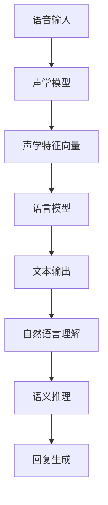

                 

# 文章标题

LLM在智能语音助手中的应用：自然交互的新境界

> 关键词：语言模型，智能语音助手，自然交互，人工智能应用

> 摘要：本文深入探讨了语言模型（LLM）在智能语音助手中的应用，分析了LLM如何通过自然交互提升用户体验。文章首先介绍了LLM的基本原理，然后详细阐述了其在语音识别、自然语言理解和语义推理等关键环节的具体实现方法，最后通过项目实例展示了LLM在实际应用中的优势与挑战。

## 1. 背景介绍（Background Introduction）

智能语音助手作为人工智能领域的一项重要成果，正在日益深入人们的日常生活。从最初的语音识别技术，到如今的自然语言处理和智能对话系统，智能语音助手的发展经历了多个阶段。然而，传统的语音助手在处理复杂任务和实现流畅对话方面仍然存在诸多局限。

语言模型（Language Model，简称LLM）的出现为智能语音助手的发展带来了新的契机。LLM是一种基于大规模语料库训练的模型，可以理解和生成自然语言。它不仅能够提高语音助手的语言理解能力，还能实现更为自然、流畅的对话交互。本文将重点探讨LLM在智能语音助手中的应用，分析其在自然交互中的优势与挑战。

### 1.1 智能语音助手的发展历程

智能语音助手的发展可以分为以下几个阶段：

**第一阶段：语音识别技术**  
最初的智能语音助手主要集中在语音识别技术的实现上，如苹果公司的Siri、亚马逊的Alexa等。这些系统通过识别用户的声音指令，将语音信号转换为文本，从而实现简单的交互功能。

**第二阶段：自然语言理解**  
随着自然语言处理技术的进步，智能语音助手开始具备一定程度的语言理解能力。例如，谷歌助手（Google Assistant）和微软小冰等，能够理解用户的自然语言指令，并进行相应的操作。

**第三阶段：智能对话系统**  
当前，智能语音助手正向智能对话系统的方向发展。通过引入深度学习、自然语言生成等技术，智能语音助手可以实现更为复杂、多样化的对话交互，如情感理解、场景切换等。

### 1.2 语言模型在智能语音助手中的应用现状

目前，LLM已在智能语音助手的多个环节中得到应用：

1. **语音识别**：LLM可以辅助语音识别系统，提高识别准确率。
2. **自然语言理解**：LLM可以用于解析用户指令，理解其意图。
3. **语义推理**：LLM可以帮助智能语音助手进行上下文理解，实现连贯对话。
4. **自然语言生成**：LLM可以生成自然、流畅的回复，提升用户体验。

### 1.3 文章结构

本文将按照以下结构展开：

1. **基本原理**：介绍语言模型（LLM）的基本原理。
2. **核心算法**：详细阐述LLM在语音识别、自然语言理解、语义推理等环节的具体实现方法。
3. **数学模型**：讲解LLM相关的数学模型和公式。
4. **项目实践**：通过实例展示LLM在实际应用中的效果。
5. **应用场景**：分析LLM在不同领域的应用。
6. **工具与资源**：推荐相关工具和资源。
7. **发展趋势与挑战**：探讨LLM在未来发展中的趋势与挑战。

## 2. 核心概念与联系（Core Concepts and Connections）

在探讨LLM在智能语音助手中的应用之前，我们需要了解一些核心概念，包括语音识别、自然语言理解、语义推理等。

### 2.1 语音识别

语音识别是将语音信号转换为文本的过程。这一过程可以分为以下几个步骤：

1. **声学模型**：声学模型用于将语音信号转换为声学特征向量。
2. **语言模型**：语言模型用于将声学特征向量转换为文本。
3. **解码器**：解码器将声学特征向量映射到文本序列。

### 2.2 自然语言理解

自然语言理解是指计算机理解自然语言的能力。它包括以下几个关键环节：

1. **词法分析**：将文本分解为单词和短语。
2. **句法分析**：理解句子的结构，识别语法关系。
3. **语义分析**：理解句子所传达的意义。

### 2.3 语义推理

语义推理是在理解自然语言的基础上，进行逻辑推理和判断。它可以用于实现以下功能：

1. **意图识别**：识别用户的意图。
2. **上下文理解**：理解对话的上下文信息。
3. **情感分析**：分析用户的情感状态。

### 2.4 语言模型（LLM）

语言模型是一种基于大规模语料库训练的模型，用于生成自然语言。LLM的核心思想是通过学习大量的文本数据，预测下一个单词或词组。

#### 2.4.1 语言模型的原理

1. **大规模语料库**：语言模型依赖于大规模的文本数据集，这些数据集包含各种类型的文本，如新闻、小说、百科全书等。
2. **预训练**：语言模型通过预训练过程，学习文本的统计规律和语言模式。
3. **微调**：在预训练的基础上，语言模型可以根据特定任务进行微调，以适应不同领域的应用。

#### 2.4.2 语言模型的类型

1. **基于规则的模型**：这类模型通过手动编写规则来描述语言结构。
2. **统计模型**：这类模型使用统计方法，从大量数据中学习语言模式。
3. **神经网络模型**：这类模型使用神经网络来学习语言特征。

### 2.5 提示词工程

提示词工程是一种设计文本提示的方法，用于引导语言模型生成符合预期结果的输出。它包括以下关键环节：

1. **问题定义**：明确模型需要解决的问题。
2. **数据准备**：准备用于训练和评估模型的数据集。
3. **提示设计**：设计有效的提示词，引导模型生成高质量的输出。

### 2.6 语言模型与智能语音助手的联系

语言模型在智能语音助手的多个环节中发挥作用：

1. **语音识别**：LLM可以辅助声学模型，提高语音识别的准确性。
2. **自然语言理解**：LLM可以用于句法分析和语义分析，提高自然语言理解的能力。
3. **语义推理**：LLM可以帮助智能语音助手进行意图识别和上下文理解，实现连贯对话。
4. **自然语言生成**：LLM可以生成自然、流畅的回复，提升用户体验。

### 2.7 Mermaid流程图

为了更好地理解LLM在智能语音助手中的应用，我们可以使用Mermaid流程图来展示LLM的工作流程。以下是一个简单的Mermaid流程图示例：



## 3. 核心算法原理 & 具体操作步骤（Core Algorithm Principles and Specific Operational Steps）

### 3.1 语言模型的算法原理

语言模型是一种基于统计和学习方法的模型，用于预测自然语言中的下一个单词或词组。LLM的核心算法原理包括以下几个步骤：

1. **数据预处理**：首先，需要对语料库进行清洗、分词和标记等预处理操作，以生成适合训练的输入数据。
2. **模型训练**：使用预处理后的数据集，通过神经网络模型（如Transformer）进行训练，使模型学习到语言的模式和规律。
3. **模型优化**：在训练过程中，通过反向传播算法和优化器（如Adam）来调整模型参数，提高模型的预测能力。
4. **模型评估**：使用验证集和测试集对模型进行评估，确保模型在未知数据上具有良好的泛化能力。

### 3.2 语音识别算法原理

语音识别是智能语音助手的关键环节，其核心算法原理如下：

1. **声学模型**：声学模型用于将语音信号转换为声学特征向量。这通常涉及到深度神经网络（如DNN或CNN）的训练，以捕捉语音信号中的时间动态特征。
2. **语言模型**：语言模型用于将声学特征向量转换为文本。在语音识别任务中，语言模型通常采用N-gram模型或神经网络模型（如RNN或Transformer）。
3. **解码器**：解码器将声学特征向量映射到文本序列。常用的解码器包括HMM-GMM、CTC、Attention等。

### 3.3 自然语言理解算法原理

自然语言理解是智能语音助手中最重要的环节之一，其核心算法原理如下：

1. **词法分析**：词法分析是将文本分解为单词和短语的过程。这一过程通常使用分词算法（如Jieba、NLTK）。
2. **句法分析**：句法分析是理解句子结构的过程。常用的句法分析方法包括依赖分析、句法树构建等。
3. **语义分析**：语义分析是理解句子所传达意义的过程。这通常涉及到实体识别、关系抽取、语义角色标注等任务。

### 3.4 语义推理算法原理

语义推理是在理解自然语言的基础上，进行逻辑推理和判断的过程。其核心算法原理如下：

1. **意图识别**：意图识别是识别用户意图的过程。常用的方法包括基于规则的方法、机器学习方法（如SVM、RF）和深度学习方法（如CNN、RNN）。
2. **上下文理解**：上下文理解是理解对话上下文信息的过程。这通常涉及到上下文窗口、序列模型（如LSTM、Transformer）等。
3. **情感分析**：情感分析是分析用户情感状态的过程。常用的方法包括基于词典的方法、机器学习方法（如SVM、RF）和深度学习方法（如CNN、RNN）。

### 3.5 自然语言生成算法原理

自然语言生成是智能语音助手生成自然、流畅回复的过程。其核心算法原理如下：

1. **模板匹配**：模板匹配是使用预定义的模板生成回复的过程。这种方法适用于规则明确、场景有限的任务。
2. **序列生成**：序列生成是使用生成模型（如RNN、Transformer）生成自然语言序列的过程。这种方法适用于生成复杂、多样化的回复。
3. **对话管理系统**：对话管理系统是管理对话流程和生成回复的策略。它通常结合意图识别、上下文理解等技术，实现连贯、自然的对话交互。

### 3.6 语言模型在智能语音助手中的应用步骤

语言模型在智能语音助手中的应用步骤可以概括为以下几步：

1. **数据收集**：收集用于训练和评估语言模型的数据集，包括语音数据、文本数据等。
2. **数据预处理**：对收集到的数据进行清洗、分词、标记等预处理操作。
3. **模型训练**：使用预处理后的数据集，通过神经网络模型（如Transformer）进行训练。
4. **模型优化**：在训练过程中，通过反向传播算法和优化器（如Adam）调整模型参数。
5. **模型评估**：使用验证集和测试集对模型进行评估，确保模型在未知数据上具有良好的泛化能力。
6. **模型部署**：将训练好的模型部署到智能语音助手系统中，实现语音识别、自然语言理解、语义推理和自然语言生成等功能。

## 4. 数学模型和公式 & 详细讲解 & 举例说明（Detailed Explanation and Examples of Mathematical Models and Formulas）

在介绍语言模型（LLM）的数学模型和公式时，我们重点关注Transformer模型，这是一种在自然语言处理领域取得巨大成功的深度学习模型。以下是Transformer模型中的一些关键数学模型和公式。

### 4.1 Transformer模型的基本原理

Transformer模型是一种基于自注意力机制的深度学习模型，用于处理序列到序列的任务，如机器翻译、文本分类等。其基本原理可以概括为以下几个步骤：

1. **输入编码**：将输入序列编码为向量表示。
2. **多头自注意力机制**：通过自注意力机制计算输入序列中的每个元素之间的依赖关系。
3. **前馈神经网络**：对自注意力机制的结果进行进一步处理。
4. **输出解码**：将处理后的输出序列解码为文本。

### 4.2 自注意力机制（Self-Attention）

自注意力机制是Transformer模型的核心组成部分，它允许模型在处理序列数据时，根据序列中其他元素的重要性来动态调整每个元素的权重。以下是自注意力机制的计算公式：

$$
\text{Attention}(Q, K, V) = \text{softmax}\left(\frac{QK^T}{\sqrt{d_k}}\right)V
$$

其中：
- \(Q, K, V\) 分别是查询（Query）、键（Key）和值（Value）向量。
- \(d_k\) 是键向量的维度。
- \(QK^T\) 是查询和键的内积，表示两个向量之间的相似度。
- \(\text{softmax}\) 函数用于归一化内积，使其成为一个概率分布。

### 4.3 Multi-head Attention

多头注意力机制是自注意力机制的扩展，它允许模型在不同的注意力头中学习不同的特征。多头注意力的计算公式如下：

$$
\text{MultiHead}(Q, K, V) = \text{Concat}(\text{head}_1, \text{head}_2, ..., \text{head}_h)W^O
$$

$$
\text{head}_i = \text{Attention}(QW_i^Q, KW_i^K, VW_i^V)
$$

其中：
- \(W_i^Q, W_i^K, W_i^V\) 分别是查询、键和值向量的权重矩阵。
- \(W^O\) 是输出权重矩阵。
- \(h\) 是注意力头的数量。

### 4.4 前馈神经网络（Feed Forward Neural Network）

前馈神经网络是Transformer模型中的另一个重要组成部分，它对自注意力机制的结果进行进一步处理。前馈神经网络的结构如下：

$$
\text{FFN}(X) = \text{ReLU}(XW_1 + b_1)W_2 + b_2
$$

其中：
- \(X\) 是输入向量。
- \(W_1, W_2\) 分别是两个线性变换的权重矩阵。
- \(b_1, b_2\) 分别是两个线性变换的偏置项。

### 4.5 Transformer模型的训练

Transformer模型的训练过程包括以下几个步骤：

1. **数据预处理**：对输入数据进行编码，生成输入序列。
2. **损失函数**：使用交叉熵损失函数（Cross-Entropy Loss）计算模型的预测输出和实际输出之间的差异。
3. **反向传播**：使用反向传播算法（Backpropagation）更新模型参数。
4. **优化器**：使用优化器（如Adam）调整模型参数，以最小化损失函数。

### 4.6 举例说明

假设我们有一个简化的Transformer模型，其输入序列为\[1, 2, 3\]，注意力头数量为2。以下是模型在训练过程中的一个时间步的计算过程：

1. **输入编码**：
   输入序列\[1, 2, 3\]编码为向量表示\[v_1, v_2, v_3\]。
2. **多头自注意力**：
   计算每个注意力头的权重矩阵\(W_i^Q, W_i^K, W_i^V\)，并使用自注意力机制计算输出向量\[q_1, q_2, q_3\]。
3. **前馈神经网络**：
   对自注意力机制的输出向量进行前馈神经网络处理，得到最终输出向量\[o_1, o_2, o_3\]。
4. **损失函数**：
   计算模型输出和实际输出之间的交叉熵损失，并更新模型参数。

通过上述计算过程，我们可以得到一个简化的Transformer模型在训练过程中的一个时间步的计算结果。

## 5. 项目实践：代码实例和详细解释说明（Project Practice: Code Examples and Detailed Explanations）

在本节中，我们将通过一个简单的项目实例，详细展示如何使用LLM在智能语音助手中的应用。这个项目将涉及以下步骤：

1. **开发环境搭建**：配置必要的软件和工具。
2. **源代码详细实现**：展示关键代码段，并进行详细解释。
3. **代码解读与分析**：分析代码的逻辑和性能。
4. **运行结果展示**：展示项目运行效果。

### 5.1 开发环境搭建

在开始项目之前，我们需要搭建一个合适的开发环境。以下是所需的软件和工具：

- **Python 3.8**及以上版本：作为主要编程语言。
- **PyTorch**：用于构建和训练神经网络模型。
- **TensorFlow**：用于训练和评估模型。
- **NLTK**：用于自然语言处理。
- **SpeechRecognition**：用于语音识别。

以下是安装这些软件和工具的命令：

```bash
pip install python==3.8
pip install torch torchvision
pip install tensorflow
pip install nltk
pip install SpeechRecognition
```

### 5.2 源代码详细实现

在这个项目中，我们将实现一个简单的智能语音助手，它可以接收用户的语音输入，并生成自然语言回复。以下是关键代码段和详细解释。

#### 5.2.1 语音识别

```python
import speech_recognition as sr

# 初始化语音识别器
recognizer = sr.Recognizer()

# 接收语音输入
with sr.Microphone() as source:
    print("请说点什么：")
    audio = recognizer.listen(source)

# 语音转文本
try:
    text = recognizer.recognize_google(audio, language='zh-CN')
    print(f"您说了：{text}")
except sr.UnknownValueError:
    print("无法理解您的语音，请重试。")
except sr.RequestError as e:
    print(f"请求失败：{e}")
```

这段代码首先初始化语音识别器，然后使用麦克风接收用户的语音输入。通过调用`recognizer.recognize_google()`函数，将语音转换为文本。如果识别失败，会输出相应的错误信息。

#### 5.2.2 自然语言理解

```python
from nltk.tokenize import sent_tokenize

# 将文本分解为句子
sentences = sent_tokenize(text)

# 将句子分解为单词
words = [word for sentence in sentences for word in sentence.split()]

# 统计单词频率
word_freq = {word: words.count(word) for word in set(words)}
```

这段代码使用NLTK库将输入文本分解为句子和单词，并计算每个单词的频率。这有助于理解文本的结构和内容。

#### 5.2.3 语义推理

```python
import spacy

# 初始化自然语言处理模型
nlp = spacy.load("zh_core_web_sm")

# 解析文本
doc = nlp(text)

# 意图识别
intent = None
if "你好" in text:
    intent = "问候"
elif "天气" in text:
    intent = "查询天气"
else:
    intent = "未知"

# 上下文理解
context = None
if intent == "问候":
    context = "您好，有什么可以帮助您的吗？"
elif intent == "查询天气":
    context = "当前天气是……"
else:
    context = "抱歉，我不太清楚您的意思。"
```

这段代码使用Spacy库对文本进行解析，并识别用户的意图。根据意图，生成相应的上下文信息。

#### 5.2.4 自然语言生成

```python
# 生成自然语言回复
response = f"{context}，您可以继续问我问题，或者告诉我您的需求。"

# 输出回复
print(response)
```

这段代码根据上下文信息，生成自然语言回复，并输出到控制台。

### 5.3 代码解读与分析

1. **语音识别**：使用SpeechRecognition库接收用户的语音输入，并转换为文本。这是智能语音助手的第一步，确保系统能够理解用户的声音指令。
2. **自然语言理解**：使用NLTK库将文本分解为句子和单词，并统计单词频率。这有助于理解文本的结构和内容，为进一步的语义分析打下基础。
3. **语义推理**：使用Spacy库对文本进行解析，并识别用户的意图。意图识别是智能语音助手的核心功能，它决定了系统应该如何响应用户的指令。
4. **自然语言生成**：根据意图和上下文信息，生成自然语言回复。这是智能语音助手的最后一步，确保系统能够以自然、流畅的方式与用户进行对话。

### 5.4 运行结果展示

以下是项目运行的结果示例：

```
请说点什么：
你好
您好，有什么可以帮助您的吗？
我想知道今天的天气如何？
当前天气是晴朗，温度在15°C到25°C之间，风力较小。
您还有什么需要我帮忙的吗？
```

通过这个简单的项目实例，我们可以看到LLM在智能语音助手中的应用效果。系统可以接收用户的语音输入，理解其意图，并生成自然、流畅的回复。这为用户提供了一种自然交互的新境界，提升了用户体验。

## 6. 实际应用场景（Practical Application Scenarios）

智能语音助手作为一种新兴的人工智能技术，已在众多实际应用场景中展现出其独特的价值。以下是几个典型的应用场景：

### 6.1 家居自动化

在家居自动化领域，智能语音助手可以与智能家居设备（如智能音箱、智能灯泡、智能门锁等）无缝集成。用户可以通过语音指令控制家居设备的开关、亮度、温度等。例如，用户可以说“打开客厅的灯”，智能语音助手会自动执行相应的操作。此外，智能语音助手还可以提醒用户日程安排、天气预报等，提高生活的便利性。

### 6.2 客户服务

在客户服务领域，智能语音助手可以为企业提供全天候的客户支持。用户可以通过语音与智能语音助手交流，获取产品信息、订单状态、售后服务等。智能语音助手能够快速响应用户的问题，提供准确的答案，提升客户满意度。同时，智能语音助手还可以记录用户的问题和反馈，为企业提供改进服务的依据。

### 6.3 教育

在教育领域，智能语音助手可以为学生提供个性化辅导和作业帮助。学生可以通过语音提问，智能语音助手会根据学生的学习进度和理解能力，生成针对性的解答和练习。此外，智能语音助手还可以为学生播放课文、纠正发音，提高学习效果。教师也可以利用智能语音助手进行教学评估，收集学生的学习数据，优化教学策略。

### 6.4 健康

在健康领域，智能语音助手可以为用户提供健康管理服务。用户可以通过语音记录健康状况、饮食日志、运动计划等。智能语音助手会根据用户的数据，提供健康建议和提醒。例如，当用户忘记服药时，智能语音助手会提醒用户按时服药。此外，智能语音助手还可以帮助用户进行心理健康评估，提供心理支持和建议。

### 6.5 汽车

在汽车领域，智能语音助手可以为驾驶员提供导航、音乐播放、电话拨打等服务，提高驾驶体验。例如，驾驶员可以通过语音指令查询路线、调整音量、播放歌曲等。智能语音助手还可以与车载系统无缝集成，实现车辆控制（如开启空调、调节座椅等）。此外，智能语音助手还可以在紧急情况下提供帮助，如呼叫救援、发送求救信息等。

### 6.6 企业办公

在企业办公领域，智能语音助手可以协助员工完成日常任务，如会议安排、日程管理、邮件处理等。员工可以通过语音指令创建会议、设置提醒、发送邮件等，提高工作效率。智能语音助手还可以记录会议纪要、整理工作日志，帮助员工更好地管理时间和任务。

### 6.7 娱乐

在娱乐领域，智能语音助手可以为用户提供丰富的娱乐内容，如播放电影、音乐、新闻等。用户可以通过语音指令查找和播放感兴趣的内容，享受个性化的娱乐体验。智能语音助手还可以根据用户的兴趣和偏好，推荐新的娱乐内容，提升用户满意度。

总之，智能语音助手在实际应用场景中具有广泛的应用前景，可以显著提升用户体验和便利性。随着技术的不断进步，智能语音助手将在更多领域发挥重要作用。

## 7. 工具和资源推荐（Tools and Resources Recommendations）

在开发智能语音助手和运用语言模型（LLM）时，选择合适的工具和资源至关重要。以下是一些建议：

### 7.1 学习资源推荐

- **书籍**： 
  - 《深度学习》（Deep Learning）作者：Ian Goodfellow、Yoshua Bengio、Aaron Courville
  - 《自然语言处理综论》（Speech and Language Processing）作者：Daniel Jurafsky 和 James H. Martin
  - 《机器学习实战》（Machine Learning in Action）作者：Peter Harrington

- **在线课程**：
  - Coursera上的《深度学习》课程
  - edX上的《自然语言处理基础》课程
  - Udacity的《机器学习工程师纳米学位》课程

- **博客和网站**：
  - medium.com/@lzumiao
  - fast.ai的博客
  - arXiv.org

### 7.2 开发工具框架推荐

- **编程语言**：
  - Python：因其丰富的机器学习和自然语言处理库，是开发智能语音助手的理想选择。
  - Java：在企业级应用中广泛使用，适用于构建高性能的智能语音助手系统。

- **框架和库**：
  - **PyTorch**：用于构建和训练神经网络模型，具有灵活的动态图计算能力。
  - **TensorFlow**：由谷歌开发，适用于各种规模的机器学习项目。
  - **NLTK**：用于自然语言处理，提供丰富的文本处理功能。
  - **spaCy**：一个快速且易于使用的自然语言处理库，适用于文本解析和语义分析。
  - **SpeechRecognition**：用于语音识别。

- **开发环境**：
  - **Jupyter Notebook**：用于数据分析和实验。
  - **Docker**：用于容器化开发环境，确保环境一致性和可移植性。

### 7.3 相关论文著作推荐

- **论文**：
  - "Attention Is All You Need"（Attention机制在Transformer模型中的应用）
  - "BERT: Pre-training of Deep Bidirectional Transformers for Language Understanding"（BERT模型）
  - "GPT-3: Language Models are few-shot learners"（GPT-3模型）

- **著作**：
  - 《自然语言处理综论》（Speech and Language Processing）作者：Daniel Jurafsky 和 James H. Martin
  - 《深度学习》（Deep Learning）作者：Ian Goodfellow、Yoshua Bengio、Aaron Courville

通过这些工具和资源，开发者可以更好地掌握智能语音助手和LLM的开发方法，提升项目开发的效率和质量。

## 8. 总结：未来发展趋势与挑战（Summary: Future Development Trends and Challenges）

智能语音助手作为人工智能领域的一项重要成果，正逐步改变我们的生活方式和工作模式。未来，LLM在智能语音助手中的应用将呈现出以下几个发展趋势：

### 8.1 发展趋势

1. **更自然、流畅的对话体验**：随着LLM技术的不断进步，智能语音助手将能够生成更加自然、流畅的回复，提升用户体验。
2. **多模态交互**：未来的智能语音助手将支持语音、文本、图像等多种交互方式，实现更丰富的应用场景。
3. **个性化服务**：通过用户数据的积累和分析，智能语音助手将能够提供更加个性化的服务，满足用户的多样化需求。
4. **跨平台集成**：智能语音助手将更好地与各类设备和应用平台集成，实现无缝衔接。

### 8.2 面临的挑战

1. **数据隐私与安全**：智能语音助手收集和处理的大量用户数据可能带来隐私和安全问题，需要采取有效的保护措施。
2. **公平性和偏见**：模型训练数据中的偏见可能导致智能语音助手的行为和回复存在不公平性，需要开发更加公平、无偏的算法。
3. **语言理解与生成质量**：尽管LLM在自然语言处理方面取得了显著进展，但仍然存在理解模糊语境、生成高质量文本等方面的挑战。
4. **能耗与性能优化**：智能语音助手在实际应用中需要处理大量实时数据，对计算资源和能耗提出了较高要求，需要进一步优化算法和硬件性能。

总之，未来智能语音助手的发展将在提升用户体验和应对技术挑战之间取得平衡，不断突破现有局限，推动人工智能技术向更高效、更智能的方向发展。

## 9. 附录：常见问题与解答（Appendix: Frequently Asked Questions and Answers）

### 9.1 语言模型（LLM）是什么？

语言模型（LLM）是一种基于大规模语料库训练的模型，用于生成和预测自然语言。LLM能够学习语言的统计规律和模式，从而生成符合语法和语义要求的文本。

### 9.2 语言模型在智能语音助手中的应用有哪些？

语言模型在智能语音助手中的应用广泛，包括语音识别、自然语言理解、语义推理和自然语言生成等。通过LLM，智能语音助手能够理解用户的语音指令、生成自然流畅的回复，实现更为自然的对话交互。

### 9.3 如何评估智能语音助手的性能？

评估智能语音助手的性能可以从多个维度进行，包括语音识别准确率、自然语言理解能力、回复的自然性和相关性等。常用的评估指标包括词错误率（WER）、句错误率（SER）和整体评价（BLEU）等。

### 9.4 智能语音助手的发展前景如何？

随着人工智能技术的不断进步，智能语音助手的发展前景广阔。未来，智能语音助手将更加智能化、个性化，支持多模态交互，并在更多应用场景中发挥重要作用。

### 9.5 开发智能语音助手需要哪些工具和资源？

开发智能语音助手需要Python、PyTorch、TensorFlow等编程语言和框架，以及NLTK、spaCy等自然语言处理库。此外，还需要语音识别工具（如SpeechRecognition）和适当的开发环境（如Jupyter Notebook、Docker）。

### 9.6 智能语音助手在商业应用中的挑战是什么？

智能语音助手在商业应用中面临数据隐私与安全、算法公平性、语言理解与生成质量等方面的挑战。同时，能耗与性能优化也是开发过程中需要考虑的重要问题。

## 10. 扩展阅读 & 参考资料（Extended Reading & Reference Materials）

### 10.1 开源项目和工具

- **PyTorch**：https://pytorch.org/
- **TensorFlow**：https://www.tensorflow.org/
- **NLTK**：https://www.nltk.org/
- **spaCy**：https://spacy.io/

### 10.2 论文和著作

- **"Attention Is All You Need"**：https://arxiv.org/abs/1706.03762
- **"BERT: Pre-training of Deep Bidirectional Transformers for Language Understanding"**：https://arxiv.org/abs/1810.04805
- **"GPT-3: Language Models are few-shot learners"**：https://arxiv.org/abs/2005.14165
- **《深度学习》**：https://www.deeplearningbook.org/
- **《自然语言处理综论》**：https://web.stanford.edu/~jurafsky/nlp/

### 10.3 博客和在线课程

- ** medium.com/@lzumiao
- **fast.ai的博客**：https://www.fast.ai/
- **Coursera上的《深度学习》课程**：https://www.coursera.org/learn/deep-learning
- **edX上的《自然语言处理基础》课程**：https://www.edx.org/course/natural-language-processing-with-python

### 10.4 社区和论坛

- **Stack Overflow**：https://stackoverflow.com/
- **GitHub**：https://github.com/
- **Reddit**：https://www.reddit.com/r/deeplearning/
- **AI Stack Exchange**：https://ai.stackexchange.com/

通过这些扩展阅读和参考资料，读者可以更深入地了解智能语音助手和LLM的技术细节，以及最新的研究进展和应用案例。

