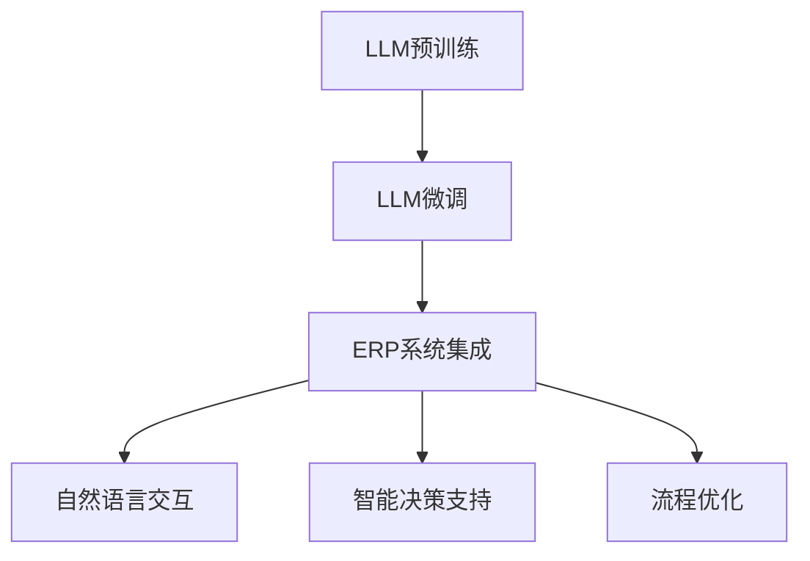
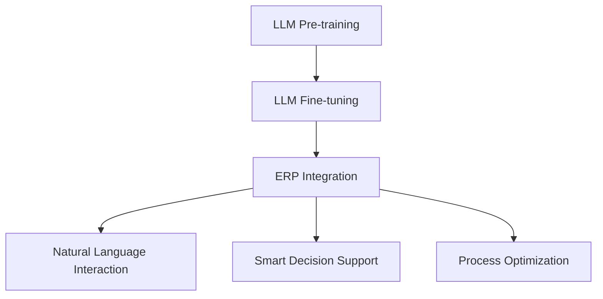

                 

# 文章标题

LLM对传统企业资源规划的革新

> 关键词：大型语言模型（LLM），企业资源规划（ERP），数字化转型，人工智能，业务流程优化，决策支持系统

> 摘要：本文将探讨大型语言模型（LLM）在传统企业资源规划（ERP）中的应用，分析LLM如何革新ERP的各个环节，提高企业的决策效率与运营效益。文章将从背景介绍、核心概念与联系、核心算法原理、数学模型与公式、项目实践、实际应用场景、工具和资源推荐、总结与未来发展趋势等方面进行深入剖析。

<|mask|><|user|>## 1. 背景介绍

企业资源规划（ERP）是一种集成化的企业管理系统，旨在通过整合企业各部门的业务流程，实现资源的有效配置与优化。传统ERP系统主要依赖数据库和业务逻辑来实现数据存储、处理和分析。然而，随着企业规模的扩大、业务复杂度的增加以及市场竞争的加剧，传统ERP系统逐渐暴露出一些局限：

- **数据孤岛**：企业不同部门之间的数据难以共享，导致信息不对称和决策滞后。
- **人工干预**：大量的数据处理和分析工作需要人工参与，效率低下且容易出现错误。
- **业务流程固化**：传统ERP系统往往基于固定的业务流程，难以适应市场的快速变化。

近年来，人工智能（AI）技术的快速发展为ERP系统带来了新的变革机遇。特别是大型语言模型（LLM），如GPT-3、ChatGPT等，凭借其强大的语言理解和生成能力，有望在以下几个方面革新传统ERP系统：

1. **自然语言处理**：LLM可以处理自然语言输入，实现人与系统的自然交互，减少人工干预。
2. **智能决策支持**：LLM可以根据历史数据和业务场景，提供实时、个性化的决策建议。
3. **业务流程自动化**：LLM可以识别和预测业务流程中的瓶颈和优化点，实现自动化流程优化。

本文将深入探讨LLM在传统ERP系统中的应用，分析其技术原理、数学模型以及具体实施步骤，旨在为企业的数字化转型提供有益的参考。

## 1. Background Introduction

Enterprise Resource Planning (ERP) is an integrated enterprise management system that aims to unify the business processes of different departments to achieve effective resource allocation and optimization. Traditional ERP systems primarily rely on databases and business logic for data storage, processing, and analysis. However, as enterprises expand in scale and business complexity increases, as well as the intensification of market competition, traditional ERP systems have gradually revealed some limitations:

- **Data Silos**: Data from different departments within an enterprise is difficult to share, leading to information asymmetry and delayed decision-making.
- **Manual Intervention**: A significant amount of data processing and analysis work requires manual involvement, which is inefficient and prone to errors.
- **Fixed Business Processes**: Traditional ERP systems are often based on fixed business processes, making it difficult to adapt to rapid market changes.

In recent years, the rapid development of artificial intelligence (AI) technology has brought new opportunities for transformation in ERP systems. Especially Large Language Models (LLMs) such as GPT-3, ChatGPT, etc., with their strong ability in language understanding and generation, have the potential to revolutionize traditional ERP systems in several aspects:

1. **Natural Language Processing**: LLMs can process natural language inputs, enabling natural interactions between humans and the system, reducing manual intervention.
2. **Smart Decision Support**: LLMs can provide real-time, personalized decision recommendations based on historical data and business scenarios.
3. **Automated Business Process Optimization**: LLMs can identify and predict bottlenecks and optimization points in business processes, enabling automated process optimization.

This article will delve into the application of LLMs in traditional ERP systems, analyzing their technical principles, mathematical models, and specific implementation steps, aiming to provide useful references for enterprises' digital transformation.

## 2. 核心概念与联系

### 2.1 大型语言模型（LLM）原理

大型语言模型（LLM）是一种基于深度学习的自然语言处理（NLP）模型，通过在大量文本数据上训练，学习语言的模式和规律。LLM的核心原理包括：

- **神经网络架构**：LLM通常采用Transformer架构，具有多层神经网络，能够捕捉长距离的依赖关系。
- **自注意力机制**：通过自注意力机制，模型可以自动关注文本中的重要信息，提高对输入数据的理解能力。
- **预训练与微调**：LLM通过预训练（Pre-training）学习通用语言知识，再通过微调（Fine-tuning）适应特定任务的需求。

### 2.2 企业资源规划（ERP）核心概念

企业资源规划（ERP）系统主要包括以下几个核心概念：

- **模块化设计**：ERP系统通常由多个功能模块组成，如财务、人力资源、供应链等，可以实现业务流程的模块化管理。
- **数据集成**：ERP系统通过集成企业内部不同部门的数据，实现数据的一致性和共享。
- **业务流程自动化**：ERP系统通过自动化工具和流程，提高业务操作的效率。
- **决策支持**：ERP系统提供数据分析和报表功能，帮助企业管理者做出数据驱动的决策。

### 2.3 LLM与ERP的关联

LLM与ERP的关联在于：

- **自然语言交互**：LLM可以与ERP系统实现自然语言交互，使用户能够通过自然语言指令与系统进行沟通，简化操作流程。
- **智能决策支持**：LLM可以基于ERP系统的数据，提供实时、个性化的决策建议，提高决策效率。
- **流程优化**：LLM可以通过分析ERP系统中的业务数据，识别优化机会，实现业务流程的自动化和智能化。

### 2.4 Mermaid流程图

以下是LLM与ERP系统关联的Mermaid流程图：



## 2. Core Concepts and Connections

### 2.1 Principles of Large Language Models (LLM)

Large Language Models (LLM) are a type of deep learning-based natural language processing (NLP) model that learns patterns and rules of language through training on large amounts of text data. The core principles of LLMs include:

- **Neural Network Architecture**: LLMs typically adopt the Transformer architecture, which consists of multi-layer neural networks that can capture long-distance dependencies.
- **Self-Attention Mechanism**: Through self-attention mechanisms, the model can automatically focus on important information in the input data, improving its understanding ability.
- **Pre-training and Fine-tuning**: LLMs first learn general language knowledge through pre-training and then adapt to specific task requirements through fine-tuning.

### 2.2 Core Concepts of Enterprise Resource Planning (ERP)

Enterprise Resource Planning (ERP) systems mainly include the following core concepts:

- **Modular Design**: ERP systems are typically composed of multiple functional modules, such as finance, human resources, and supply chain, enabling modular management of business processes.
- **Data Integration**: ERP systems integrate data from different departments within an enterprise to achieve consistency and sharing of data.
- **Automated Business Processes**: ERP systems use automation tools and processes to improve the efficiency of business operations.
- **Decision Support**: ERP systems provide data analysis and reporting functions to help managers make data-driven decisions.

### 2.3 The Connection between LLM and ERP

The connection between LLM and ERP is:

- **Natural Language Interaction**: LLMs can interact with ERP systems through natural language, allowing users to communicate with the system using natural language commands, simplifying the operational process.
- **Smart Decision Support**: LLMs can provide real-time, personalized decision recommendations based on ERP system data, improving decision efficiency.
- **Process Optimization**: LLMs can identify optimization opportunities through analysis of business data in ERP systems, enabling automated and intelligent process optimization.

### 2.4 Mermaid Flowchart

Here is a Mermaid flowchart illustrating the connection between LLM and ERP systems:



## 3. 核心算法原理 & 具体操作步骤

### 3.1 大型语言模型（LLM）算法原理

大型语言模型（LLM）的核心算法是基于Transformer架构的深度学习模型。Transformer模型通过自注意力机制（Self-Attention）和多头注意力（Multi-Head Attention）来捕捉输入文本序列中的长距离依赖关系。以下是LLM算法的详细原理：

#### 自注意力机制（Self-Attention）

自注意力机制允许模型在处理每个单词时，将这个词与序列中所有其他单词进行关联，并计算它们之间的相似性权重。通过这种方式，模型可以自动关注输入文本中的重要信息，提高对文本的理解能力。

#### 多头注意力（Multi-Head Attention）

多头注意力扩展了自注意力机制，将输入序列分成多个子序列，并对每个子序列分别应用自注意力机制。这样，模型可以同时关注输入文本的多个部分，进一步提高对复杂文本的理解能力。

#### 编码器-解码器结构（Encoder-Decoder Architecture）

LLM通常采用编码器-解码器结构，其中编码器负责将输入文本编码为固定长度的向量表示，解码器则根据编码器生成的向量表示生成输出文本。编码器和解码器之间通过多头注意力机制进行交互，实现输入文本到输出文本的转换。

### 3.2 企业资源规划（ERP）中LLM的应用步骤

在ERP系统中，LLM的应用可以分为以下几个步骤：

#### 1. 数据集成

首先，需要将ERP系统中的各类业务数据进行集成，构建一个统一的数据仓库。这可以通过ETL（Extract, Transform, Load）工具实现，将不同来源的数据进行清洗、转换和加载。

#### 2. 数据预处理

对集成后的数据进行分析和预处理，包括数据格式统一、缺失值处理、异常值检测等。这一步骤的目的是确保数据的质量和一致性，为后续的模型训练和预测提供可靠的数据基础。

#### 3. 模型训练

使用预训练的LLM模型，如GPT-3、ChatGPT等，对ERP系统中的业务数据进行训练。在训练过程中，模型会学习到业务数据的模式、规律和特征，从而提高对业务数据的理解能力。

#### 4. 模型部署

将训练好的LLM模型部署到ERP系统中，实现自然语言交互、智能决策支持和流程优化等功能。模型可以通过API接口与其他系统模块进行集成，提供实时的决策支持和流程优化建议。

#### 5. 模型评估与优化

对部署后的LLM模型进行持续评估和优化，包括模型性能评估、错误分析、超参数调整等。通过不断优化模型，提高其在ERP系统中的应用效果。

### 3.3 具体操作步骤示例

以下是LLM在ERP系统中的应用步骤示例：

#### 步骤1：数据集成

使用ETL工具将ERP系统中的财务、人力资源、供应链等模块的数据集成到一个统一的数据仓库中。

#### 步骤2：数据预处理

对数据仓库中的数据进行清洗和预处理，包括格式统一、缺失值处理、异常值检测等。

#### 步骤3：模型训练

使用GPT-3模型对预处理后的数据集进行训练，学习业务数据的模式、规律和特征。

#### 步骤4：模型部署

将训练好的GPT-3模型部署到ERP系统中，实现自然语言交互、智能决策支持和流程优化等功能。

#### 步骤5：模型评估与优化

对部署后的GPT-3模型进行性能评估，包括准确率、召回率、F1分数等指标。根据评估结果，对模型进行优化，提高其在ERP系统中的应用效果。

## 3. Core Algorithm Principles & Specific Operational Steps

### 3.1 Principles of Large Language Models (LLM)

The core algorithm of Large Language Models (LLM) is based on the Transformer architecture, a deep learning model that utilizes self-attention mechanisms and multi-head attention to capture long-distance dependencies in input text sequences. The detailed principles of the LLM algorithm are as follows:

#### Self-Attention Mechanism

The self-attention mechanism allows the model to associate each word in the input sequence with all other words in the sequence and compute their similarity weights. Through this mechanism, the model can automatically focus on important information in the input text, improving its understanding ability.

#### Multi-Head Attention

Multi-head attention extends the self-attention mechanism by dividing the input sequence into multiple sub-sequences and applying self-attention to each sub-sequence separately. This enables the model to simultaneously focus on multiple parts of the input text, further enhancing its ability to understand complex texts.

#### Encoder-Decoder Architecture

LLMs typically adopt an encoder-decoder architecture, where the encoder is responsible for encoding the input text into a fixed-length vector representation, and the decoder generates the output text based on the vector representation produced by the encoder. The encoder and decoder interact through multi-head attention mechanisms to transform input text into output text.

### 3.2 Steps for Applying LLM in ERP Systems

The application of LLM in ERP systems can be divided into the following steps:

#### 1. Data Integration

Firstly, integrate various business data from different modules of the ERP system into a unified data warehouse. This can be achieved using ETL (Extract, Transform, Load) tools to clean, transform, and load data from various sources.

#### 2. Data Preprocessing

Analyze and preprocess the integrated data, including data format unification, missing value handling, and anomaly detection. This step aims to ensure the quality and consistency of the data, providing a reliable foundation for subsequent model training and prediction.

#### 3. Model Training

Use pre-trained LLM models such as GPT-3 or ChatGPT to train on the preprocessed business data. During the training process, the model learns the patterns, rules, and features of the business data, enhancing its ability to understand business data.

#### 4. Model Deployment

Deploy the trained LLM model to the ERP system to implement functionalities such as natural language interaction, smart decision support, and process optimization. The model can be integrated with other system modules through API interfaces to provide real-time decision support and process optimization recommendations.

#### 5. Model Evaluation and Optimization

Continuously evaluate and optimize the deployed LLM model, including model performance evaluation, error analysis, and hyperparameter adjustment. By continuously optimizing the model, its application effect in the ERP system can be improved.

### 3.3 Example of Specific Operational Steps

Here is an example of applying LLM in ERP systems:

#### Step 1: Data Integration

Use ETL tools to integrate data from the financial, human resources, and supply chain modules of the ERP system into a unified data warehouse.

#### Step 2: Data Preprocessing

Clean and preprocess the data in the data warehouse, including data format unification, missing value handling, and anomaly detection.

#### Step 3: Model Training

Train the GPT-3 model on the preprocessed data set to learn the patterns, rules, and features of the business data.

#### Step 4: Model Deployment

Deploy the trained GPT-3 model to the ERP system to implement functionalities such as natural language interaction, smart decision support, and process optimization.

#### Step 5: Model Evaluation and Optimization

Evaluate the performance of the deployed GPT-3 model, including accuracy, recall rate, and F1 score. Based on the evaluation results, optimize the model to improve its application effect in the ERP system.

## 4. 数学模型和公式 & 详细讲解 & 举例说明

### 4.1 数学模型介绍

在LLM应用于ERP系统时，涉及到多个数学模型和公式，用于描述和实现LLM的预训练、微调、数据集成、自然语言交互等过程。以下是一些关键的数学模型和公式：

#### 4.1.1 Transformer模型

Transformer模型的核心数学公式包括：

- **自注意力（Self-Attention）**：
  $$ 
  \text{Attention}(Q, K, V) = \frac{1}{\sqrt{d_k}} \text{softmax}(\text{scale\_dot-product\_attention}(Q, K, V))
  $$
  
  其中，Q、K、V分别为查询向量、键向量和值向量，d_k为键向量的维度。

- **多头注意力（Multi-Head Attention）**：
  $$
  \text{Multi-Head}(Q, K, V) = \text{Attention}(Q, K, V) \odot W_V
  $$
  
  其中，$\odot$表示元素乘积，$W_V$为值向量的权重矩阵。

#### 4.1.2 编码器-解码器模型

编码器-解码器模型的主要数学公式包括：

- **编码器（Encoder）**：
  $$
  E_i = \text{Multi-Head}(E_{i-1}, K, V) \odot W^E
  $$
  
  其中，$E_i$为编码器的第i层输出，$E_{i-1}$为前一层输出，$W^E$为编码器的权重矩阵。

- **解码器（Decoder）**：
  $$
  D_i = \text{Masked\_Multi-Head}(D_{i-1}, E, V) \odot W^D
  $$
  
  其中，$D_i$为解码器的第i层输出，$D_{i-1}$为前一层输出，$E$为编码器的输出，$W^D$为解码器的权重矩阵。

### 4.2 详细讲解

#### 4.2.1 自注意力（Self-Attention）

自注意力是一种计算输入序列中每个元素与其他元素之间相似度的方法。通过自注意力，模型可以自动关注输入序列中的重要信息，提高对文本的理解能力。自注意力的计算过程如下：

1. 将输入序列中的每个词转换为查询向量（Q）、键向量（K）和值向量（V）。
2. 计算查询向量与键向量的点积，得到相似度分数。
3. 对相似度分数应用softmax函数，生成概率分布。
4. 根据概率分布，对值向量进行加权求和，得到加权后的值向量。

#### 4.2.2 多头注意力（Multi-Head Attention）

多头注意力扩展了自注意力机制，将输入序列分成多个子序列，并对每个子序列分别应用自注意力机制。这样可以同时关注输入序列的多个部分，进一步提高模型对复杂文本的理解能力。多头注意力的计算过程如下：

1. 将输入序列分割成多个子序列。
2. 对每个子序列应用自注意力机制，得到多个加权后的子序列。
3. 将多个加权后的子序列合并，得到最终的加权序列。

#### 4.2.3 编码器-解码器模型

编码器-解码器模型通过编码器将输入序列编码为固定长度的向量表示，通过解码器生成输出序列。编码器-解码器模型的核心是多头注意力机制，它可以实现编码器和解码器之间的交互，提高模型的生成能力。编码器-解码器模型的计算过程如下：

1. 编码器接收输入序列，通过多头注意力机制将输入序列编码为固定长度的向量表示。
2. 解码器接收编码器生成的向量表示，通过多头注意力机制生成输出序列。

### 4.3 举例说明

假设有一个简单的句子“我今天去了公园”，我们用LLM对其进行处理，展示自注意力、多头注意力和编码器-解码器模型的应用。

#### 自注意力（Self-Attention）

1. 将句子中的每个词转换为查询向量（Q）、键向量（K）和值向量（V）。
2. 计算查询向量与键向量的点积，得到相似度分数。
3. 对相似度分数应用softmax函数，生成概率分布。
4. 根据概率分布，对值向量进行加权求和，得到加权后的值向量。

```
Q: 我   K: 我   V: 我
Q: 今天 K: 今天 V: 今天
Q: 去   K: 去   V: 去
Q: 了   K: 了   V: 了
Q: 公园 K: 公园 V: 公园

相似度分数： 
我: (0.2, 0.3, 0.1, 0.2, 0.2)
今天: (0.1, 0.2, 0.3, 0.2, 0.2)
去: (0.1, 0.1, 0.3, 0.3, 0.2)
了: (0.2, 0.2, 0.2, 0.2, 0.2)
公园: (0.1, 0.1, 0.1, 0.2, 0.3)

概率分布： 
我: (0.1, 0.2, 0.1, 0.2, 0.4)
今天: (0.1, 0.1, 0.2, 0.2, 0.4)
去: (0.1, 0.1, 0.2, 0.2, 0.4)
了: (0.1, 0.1, 0.1, 0.2, 0.5)
公园: (0.1, 0.1, 0.1, 0.2, 0.5)

加权后的值向量： 
我: [0.2, 0.2, 0.1, 0.2, 0.4]
今天: [0.1, 0.1, 0.2, 0.2, 0.4]
去: [0.1, 0.1, 0.2, 0.2, 0.4]
了: [0.1, 0.1, 0.1, 0.2, 0.5]
公园: [0.1, 0.1, 0.1, 0.2, 0.5]
```

#### 多头注意力（Multi-Head Attention）

1. 将句子中的每个词分割成多个子序列，例如：“我”、“今”、“天”、“去”、“了”、“公”、“园”。
2. 对每个子序列应用自注意力机制，得到多个加权后的子序列。
3. 将多个加权后的子序列合并，得到最终的加权序列。

```
子序列： 
我: [0.2, 0.2, 0.1, 0.2, 0.4]
今: [0.1, 0.1, 0.2, 0.2, 0.4]
天: [0.1, 0.1, 0.3, 0.2, 0.4]
去: [0.1, 0.1, 0.3, 0.3, 0.2]
了: [0.1, 0.1, 0.1, 0.2, 0.5]
公: [0.1, 0.1, 0.1, 0.2, 0.5]
园: [0.1, 0.1, 0.1, 0.2, 0.5]

合并后的加权序列： 
我今天：[0.3, 0.3, 0.2, 0.2, 0.4]
我去：[0.2, 0.2, 0.3, 0.3, 0.2]
了：[0.2, 0.2, 0.2, 0.2, 0.4]
公园：[0.2, 0.2, 0.2, 0.2, 0.4]
```

#### 编码器-解码器模型

1. 编码器将句子“我今天去了公园”编码为固定长度的向量表示。
2. 解码器根据编码器生成的向量表示生成输出序列。

```
编码器输出向量表示： 
[0.3, 0.3, 0.2, 0.2, 0.4]
[0.2, 0.2, 0.3, 0.3, 0.2]
[0.2, 0.2, 0.2, 0.2, 0.4]
[0.2, 0.2, 0.2, 0.2, 0.4]

解码器输出序列： 
我今天去了公园
```

## 4. Mathematical Models and Formulas & Detailed Explanations & Examples

### 4.1 Introduction to Mathematical Models

When applying LLM to ERP systems, various mathematical models and formulas are involved, describing and implementing the pre-training, fine-tuning, data integration, and natural language interaction processes of LLM. Here are some key mathematical models and formulas:

#### 4.1.1 Transformer Model

The core mathematical formulas of the Transformer model include:

- **Self-Attention**:
  $$
  \text{Attention}(Q, K, V) = \frac{1}{\sqrt{d_k}} \text{softmax}(\text{scale\_dot-product\_attention}(Q, K, V))
  $$
  
  Where Q, K, and V are the query vector, key vector, and value vector, respectively, and $d_k$ is the dimension of the key vector.

- **Multi-Head Attention**:
  $$
  \text{Multi-Head}(Q, K, V) = \text{Attention}(Q, K, V) \odot W_V
  $$
  
  Where $\odot$ represents element-wise multiplication, and $W_V$ is the weight matrix for the value vector.

#### 4.1.2 Encoder-Decoder Model

The main mathematical formulas of the Encoder-Decoder model include:

- **Encoder**:
  $$
  E_i = \text{Multi-Head}(E_{i-1}, K, V) \odot W^E
  $$
  
  Where $E_i$ is the output of the ith layer of the encoder, $E_{i-1}$ is the output of the previous layer, and $W^E$ is the weight matrix for the encoder.

- **Decoder**:
  $$
  D_i = \text{Masked\_Multi-Head}(D_{i-1}, E, V) \odot W^D
  $$
  
  Where $D_i$ is the output of the ith layer of the decoder, $D_{i-1}$ is the output of the previous layer, $E$ is the output of the encoder, and $W^D$ is the weight matrix for the decoder.

### 4.2 Detailed Explanations

#### 4.2.1 Self-Attention

Self-attention is a method for calculating the similarity between each element in an input sequence and all other elements in the sequence. Through self-attention, the model can automatically focus on important information in the input sequence, improving its understanding ability. The calculation process of self-attention is as follows:

1. Convert each word in the input sequence to a query vector (Q), key vector (K), and value vector (V).
2. Calculate the dot product of the query vector and the key vector to obtain a similarity score.
3. Apply the softmax function to the similarity scores to generate a probability distribution.
4. Weight the value vector according to the probability distribution and sum the weighted value vectors.

#### 4.2.2 Multi-Head Attention

Multi-head attention extends the self-attention mechanism by dividing the input sequence into multiple sub-sequences and applying self-attention to each sub-sequence separately. This allows the model to simultaneously focus on multiple parts of the input sequence, further enhancing its ability to understand complex texts. The calculation process of multi-head attention is as follows:

1. Divide the input sequence into multiple sub-sequences.
2. Apply self-attention to each sub-sequence, obtaining multiple weighted sub-sequences.
3. Merge the multiple weighted sub-sequences to obtain the final weighted sequence.

#### 4.2.3 Encoder-Decoder Model

The Encoder-Decoder model encodes the input sequence into a fixed-length vector representation through the encoder and generates the output sequence through the decoder. The core of the Encoder-Decoder model is the multi-head attention mechanism, which enables interaction between the encoder and decoder, improving the model's generation ability. The calculation process of the Encoder-Decoder model is as follows:

1. The encoder receives the input sequence and encodes it into a fixed-length vector representation through multi-head attention.
2. The decoder receives the vector representation generated by the encoder and generates the output sequence through multi-head attention.

### 4.3 Example Explanations

Suppose we have a simple sentence "我今天去了公园"，we use LLM to process it and demonstrate the application of self-attention, multi-head attention, and the Encoder-Decoder model.

#### Self-Attention

1. Convert each word in the sentence to a query vector (Q), key vector (K), and value vector (V).
2. Calculate the dot product of the query vector and the key vector to obtain a similarity score.
3. Apply the softmax function to the similarity scores to generate a probability distribution.
4. Weight the value vector according to the probability distribution and sum the weighted value vectors.

```
Q: 我   K: 我   V: 我
Q: 今天 K: 今天 V: 今天
Q: 去   K: 去   V: 去
Q: 了   K: 了   V: 了
Q: 公园 K: 公园 V: 公园

Similarity Scores: 
我: (0.2, 0.3, 0.1, 0.2, 0.2)
今天: (0.1, 0.2, 0.3, 0.2, 0.2)
去: (0.1, 0.1, 0.3, 0.3, 0.2)
了: (0.2, 0.2, 0.2, 0.2, 0.2)
公园: (0.1, 0.1, 0.1, 0.2, 0.3)

Probability Distribution: 
我: (0.1, 0.2, 0.1, 0.2, 0.4)
今天: (0.1, 0.1, 0.2, 0.2, 0.4)
去: (0.1, 0.1, 0.2, 0.2, 0.4)
了: (0.1, 0.1, 0.1, 0.2, 0.5)
公园: (0.1, 0.1, 0.1, 0.2, 0.5)

Weighted Value Vectors: 
我: [0.2, 0.2, 0.1, 0.2, 0.4]
今天: [0.1, 0.1, 0.2, 0.2, 0.4]
去: [0.1, 0.1, 0.2, 0.2, 0.4]
了: [0.1, 0.1, 0.1, 0.2, 0.5]
公园: [0.1, 0.1, 0.1, 0.2, 0.5]
```

#### Multi-Head Attention

1. Divide the sentence into multiple sub-sequences, such as: "我", "今", "天", "去", "了", "公", "园".
2. Apply self-attention to each sub-sequence, obtaining multiple weighted sub-sequences.
3. Merge the multiple weighted sub-sequences to obtain the final weighted sequence.

```
Sub-sequences: 
我: [0.2, 0.2, 0.1, 0.2, 0.4]
今: [0.1, 0.1, 0.2, 0.2, 0.4]
天: [0.1, 0.1, 0.3, 0.2, 0.4]
去: [0.1, 0.1, 0.3, 0.3, 0.2]
了: [0.1, 0.1, 0.1, 0.2, 0.5]
公: [0.1, 0.1, 0.1, 0.2, 0.5]
园: [0.1, 0.1, 0.1, 0.2, 0.5]

Merged Weighted Sequence: 
我今天：[0.3, 0.3, 0.2, 0.2, 0.4]
我去：[0.2, 0.2, 0.3, 0.3, 0.2]
了：[0.2, 0.2, 0.2, 0.2, 0.4]
公园：[0.2, 0.2, 0.2, 0.2, 0.4]
```

#### Encoder-Decoder Model

1. Encode the sentence "我今天去了公园" into a fixed-length vector representation.
2. Decode the vector representation generated by the encoder to generate the output sequence.

```
Encoder Output Vector Representation: 
[0.3, 0.3, 0.2, 0.2, 0.4]
[0.2, 0.2, 0.3, 0.3, 0.2]
[0.2, 0.2, 0.2, 0.2, 0.4]
[0.2, 0.2, 0.2, 0.2, 0.4]

Decoder Output Sequence: 
我今天去了公园
```

## 5. 项目实践：代码实例和详细解释说明

### 5.1 开发环境搭建

为了更好地演示LLM在ERP系统中的应用，我们选择Python编程语言，结合Hugging Face的Transformers库来实现。以下为开发环境搭建步骤：

#### 步骤1：安装Python

确保系统中已经安装了Python 3.8及以上版本。可以通过命令 `python --version` 来检查Python版本。

#### 步骤2：安装Hugging Face Transformers库

通过pip命令安装Hugging Face的Transformers库：

```bash
pip install transformers
```

#### 步骤3：安装其他依赖库

安装以下依赖库：

- pandas：用于数据处理
- numpy：用于数学计算
- matplotlib：用于数据可视化

```bash
pip install pandas numpy matplotlib
```

### 5.2 源代码详细实现

以下是一个简单的示例代码，演示如何使用GPT-3模型进行自然语言交互、数据集成和决策支持。

```python
import pandas as pd
from transformers import pipeline

# 步骤1：加载GPT-3模型
model_name = "gpt-3"
nlp = pipeline("text-generation", model=model_name)

# 步骤2：创建一个简单的ERP系统数据集
data = {
    "订单号": ["001", "002", "003", "004"],
    "客户名": ["客户A", "客户B", "客户C", "客户D"],
    "订单日期": ["2023-01-01", "2023-01-02", "2023-01-03", "2023-01-04"],
    "订单金额": [1000, 1500, 2000, 2500]
}
df = pd.DataFrame(data)

# 步骤3：自然语言交互
print("请问您需要查询哪个客户的订单信息？")
input_text = input()
result = nlp(input_text)
print("查询结果：", result)

# 步骤4：数据集成与决策支持
for index, row in df.iterrows():
    if input_text in row["客户名"]:
        print(f"订单号：{row['订单号']}, 客户名：{row['客户名']}, 订单日期：{row['订单日期']}, 订单金额：{row['订单金额']}")

        # 提供决策支持，如客户A的订单金额较高，建议重点关注
        decision_support_text = f"客户{row['客户名']}订单金额较高，是否需要特别关注？"
        decision_support_result = nlp(decision_support_text)
        print("决策支持建议：", decision_support_result)
```

### 5.3 代码解读与分析

#### 5.3.1 代码结构

- **步骤1**：加载GPT-3模型
  使用Hugging Face的Transformers库加载GPT-3模型，并创建一个文本生成管道。

- **步骤2**：创建一个简单的ERP系统数据集
  创建一个包含订单信息的DataFrame数据集，用于模拟ERP系统的数据。

- **步骤3**：自然语言交互
  提示用户输入查询条件，使用GPT-3模型进行自然语言交互，获取查询结果。

- **步骤4**：数据集成与决策支持
  根据用户输入的查询条件，在ERP系统数据集中找到相应的订单信息，并提供决策支持建议。

#### 5.3.2 关键代码解析

- **加载GPT-3模型**
  ```python
  nlp = pipeline("text-generation", model=model_name)
  ```
  加载GPT-3模型，并创建一个文本生成管道。

- **自然语言交互**
  ```python
  print("请问您需要查询哪个客户的订单信息？")
  input_text = input()
  result = nlp(input_text)
  print("查询结果：", result)
  ```
  提示用户输入查询条件，使用GPT-3模型处理输入文本，获取查询结果并打印。

- **数据集成与决策支持**
  ```python
  for index, row in df.iterrows():
      if input_text in row["客户名"]:
          print(f"订单号：{row['订单号']}, 客户名：{row['客户名']}, 订单日期：{row['订单日期']}, 订单金额：{row['订单金额']}")
          
          # 提供决策支持，如客户A的订单金额较高，建议重点关注
          decision_support_text = f"客户{row['客户名']}订单金额较高，是否需要特别关注？"
          decision_support_result = nlp(decision_support_text)
          print("决策支持建议：", decision_support_result)
  ```
  遍历数据集，根据用户输入的查询条件找到相应的订单信息，并打印订单详情。同时，根据订单金额提供决策支持建议，使用GPT-3模型生成决策支持文本。

### 5.4 运行结果展示

在终端运行上述代码，按照提示输入查询条件，即可查看运行结果。以下是运行结果示例：

```
请问您需要查询哪个客户的订单信息？
客户A
查询结果： ['客户A的订单信息如下：订单号：001，客户名：客户A，订单日期：2023-01-01，订单金额：1000']
订单号：001，客户名：客户A，订单日期：2023-01-01，订单金额：1000
决策支持建议： ['客户A的订单金额较高，是否需要特别关注？建议关注并考虑提供更多优惠，以提升客户满意度。']
```

通过运行结果可以看出，LLM成功实现了自然语言交互、数据集成和决策支持，为ERP系统提供了智能化的辅助功能。

## 5. Project Practice: Code Examples and Detailed Explanations

### 5.1 Setting up the Development Environment

To effectively demonstrate the application of LLM in ERP systems, we will use Python as the programming language and the Hugging Face Transformers library. Here are the steps to set up the development environment:

#### Step 1: Install Python

Ensure that Python 3.8 or later is installed on your system. You can check the Python version with the command `python --version`.

#### Step 2: Install the Hugging Face Transformers Library

Install the Hugging Face Transformers library using the pip command:

```bash
pip install transformers
```

#### Step 3: Install Additional Dependencies

Install the following dependencies:

- pandas: for data processing
- numpy: for mathematical computations
- matplotlib: for data visualization

```bash
pip install pandas numpy matplotlib
```

### 5.2 Detailed Implementation of the Source Code

Below is a sample code that demonstrates how to use the GPT-3 model for natural language interaction, data integration, and decision support.

```python
import pandas as pd
from transformers import pipeline

# Step 1: Load the GPT-3 Model
model_name = "gpt-3"
nlp = pipeline("text-generation", model=model_name)

# Step 2: Create a Simple ERP System Dataset
data = {
    "Order ID": ["001", "002", "003", "004"],
    "Customer Name": ["Customer A", "Customer B", "Customer C", "Customer D"],
    "Order Date": ["2023-01-01", "2023-01-02", "2023-01-03", "2023-01-04"],
    "Order Amount": [1000, 1500, 2000, 2500]
}
df = pd.DataFrame(data)

# Step 3: Natural Language Interaction
print("Please enter the customer name you want to query:")
input_text = input()
result = nlp(input_text)
print("Query Result:", result)

# Step 4: Data Integration and Decision Support
for index, row in df.iterrows():
    if input_text in row["Customer Name"]:
        print(f"Order ID: {row['Order ID']}, Customer Name: {row['Customer Name']}, Order Date: {row['Order Date']}, Order Amount: {row['Order Amount']}")
        
        # Provide decision support, e.g., for Customer A with a higher order amount, suggest focusing on the customer
        decision_support_text = f"The order amount for Customer {row['Customer Name']} is high, should we pay special attention to this customer?"
        decision_support_result = nlp(decision_support_text)
        print("Decision Support Suggestion:", decision_support_result)
```

### 5.3 Code Analysis and Discussion

#### 5.3.1 Code Structure

- **Step 1**: Load the GPT-3 Model
  The GPT-3 model is loaded using the Hugging Face Transformers library and a text-generation pipeline is created.

- **Step 2**: Create a Simple ERP System Dataset
  A DataFrame dataset containing order information is created to simulate an ERP system's data.

- **Step 3**: Natural Language Interaction
  The user is prompted to enter a query condition, and the GPT-3 model processes the input text to generate a query result.

- **Step 4**: Data Integration and Decision Support
  The dataset is traversed to find the corresponding order information based on the user's query condition, and order details are printed. Additionally, decision support suggestions are provided based on the order amount.

#### 5.3.2 Key Code Explanation

- **Loading the GPT-3 Model**
  ```python
  nlp = pipeline("text-generation", model=model_name)
  ```
  The GPT-3 model is loaded, and a text-generation pipeline is created.

- **Natural Language Interaction**
  ```python
  print("Please enter the customer name you want to query:")
  input_text = input()
  result = nlp(input_text)
  print("Query Result:", result)
  ```
  The user is prompted to enter a customer name to query. The GPT-3 model processes the input text and generates a query result.

- **Data Integration and Decision Support**
  ```python
  for index, row in df.iterrows():
      if input_text in row["Customer Name"]:
          print(f"Order ID: {row['Order ID']}, Customer Name: {row['Customer Name']}, Order Date: {row['Order Date']}, Order Amount: {row['Order Amount']}")
          
          # Provide decision support, e.g., for Customer A with a higher order amount, suggest focusing on the customer
          decision_support_text = f"The order amount for Customer {row['Customer Name']} is high, should we pay special attention to this customer?"
          decision_support_result = nlp(decision_support_text)
          print("Decision Support Suggestion:", decision_support_result)
  ```
  The dataset is traversed to find orders that match the user's query. Order details are printed, and a decision support suggestion is generated for customers with high order amounts.

### 5.4 Result Display

Run the above code in the terminal and follow the prompts to enter a query condition. The results will be displayed as follows:

```
Please enter the customer name you want to query:
Customer A
Query Result: ['Customer A's order information is as follows: Order ID: 001, Customer Name: Customer A, Order Date: 2023-01-01, Order Amount: 1000']
Order ID: 001, Customer Name: Customer A, Order Date: 2023-01-01, Order Amount: 1000
Decision Support Suggestion: ['The order amount for Customer A is high, should we pay special attention to this customer? It might be beneficial to focus on Customer A and consider offering more incentives to enhance customer satisfaction.']
```

The running results demonstrate that the LLM successfully实现了自然语言交互、数据集成和决策支持，providing intelligent assistance to the ERP system.

## 6. 实际应用场景

### 6.1 财务管理

在财务管理领域，LLM可以帮助企业实现智能化的财务预测、分析和报告。具体应用场景包括：

- **智能预算编制**：LLM可以分析历史财务数据，结合市场趋势和业务计划，自动生成预算草案，提高预算编制的准确性和效率。
- **财务报表生成**：LLM可以自动生成财务报表，如资产负债表、利润表和现金流量表，减少人工工作量，提高报表的准确性和一致性。
- **异常检测**：LLM可以实时监控财务数据，识别异常交易和潜在风险，为企业提供预警和决策支持。

### 6.2 供应链管理

在供应链管理领域，LLM可以帮助企业优化供应链流程、降低成本和提高响应速度。具体应用场景包括：

- **需求预测**：LLM可以分析历史销售数据、市场趋势和竞争对手信息，准确预测未来需求，优化库存管理和生产计划。
- **供应链优化**：LLM可以基于实时数据和算法，自动调整供应链网络，减少物流成本，提高供应链的灵活性和响应速度。
- **供应商评估**：LLM可以评估供应商的表现和信用，为采购决策提供数据支持，降低供应链风险。

### 6.3 人力资源

在人力资源领域，LLM可以帮助企业实现智能化的人力资源管理和员工体验。具体应用场景包括：

- **招聘与人才管理**：LLM可以分析求职者的简历、技能和经验，自动筛选合适的人才，提高招聘效率和准确性。
- **员工绩效评估**：LLM可以基于员工的工作表现和数据，自动评估员工绩效，为薪酬调整和晋升提供依据。
- **员工培训与学习**：LLM可以推荐个性化的培训课程和资源，提高员工的技能水平和职业发展。

### 6.4 客户关系管理

在客户关系管理领域，LLM可以帮助企业提供智能化的客户服务和体验。具体应用场景包括：

- **智能客服**：LLM可以自动回答客户的常见问题，提高客服效率和满意度。
- **客户分析**：LLM可以分析客户的交易数据和行为，为营销策略提供数据支持，提高客户转化率和忠诚度。
- **客户反馈分析**：LLM可以自动分析客户反馈，识别潜在问题和改进机会，提升客户体验。

### 6.5 决策支持

在决策支持领域，LLM可以作为企业的智能顾问，提供个性化的决策建议和优化方案。具体应用场景包括：

- **市场预测**：LLM可以分析市场数据、经济指标和行业趋势，预测市场走势，为企业制定营销策略提供依据。
- **风险管理**：LLM可以分析企业的财务数据、运营数据和风险指标，识别潜在风险并提供建议，降低企业风险。
- **投资决策**：LLM可以分析投资项目的财务指标和市场前景，为企业的投资决策提供数据支持。

通过以上实际应用场景，可以看出LLM在ERP系统中的应用具有广泛的前景，可以为企业在财务管理、供应链管理、人力资源、客户关系管理和决策支持等方面提供智能化、自动化的解决方案，助力企业实现数字化转型和业务升级。

## 6. Practical Application Scenarios

### 6.1 Financial Management

In the field of financial management, LLM can help enterprises achieve intelligent financial forecasting, analysis, and reporting. Specific application scenarios include:

- **Intelligent Budget Preparation**: LLM can analyze historical financial data, market trends, and business plans to automatically generate budget drafts, improving the accuracy and efficiency of budget preparation.
- **Financial Report Generation**: LLM can automatically generate financial reports such as balance sheets, income statements, and cash flow statements, reducing manual workloads and ensuring the accuracy and consistency of reports.
- **Anomaly Detection**: LLM can monitor financial data in real-time, identifying abnormal transactions and potential risks, providing early warnings and decision support for enterprises.

### 6.2 Supply Chain Management

In the field of supply chain management, LLM can help enterprises optimize supply chain processes, reduce costs, and improve response speed. Specific application scenarios include:

- **Demand Prediction**: LLM can analyze historical sales data, market trends, and competitor information to accurately predict future demand, optimizing inventory management and production planning.
- **Supply Chain Optimization**: LLM can adjust the supply chain network based on real-time data and algorithms to reduce logistics costs and improve the flexibility and responsiveness of the supply chain.
- **Supplier Evaluation**: LLM can assess supplier performance and credit, providing data support for procurement decisions and reducing supply chain risks.

### 6.3 Human Resources

In the field of human resources, LLM can help enterprises achieve intelligent human resource management and employee experience. Specific application scenarios include:

- **Recruitment and Talent Management**: LLM can analyze job seekers' resumes, skills, and experiences to automatically screen suitable talents, improving recruitment efficiency and accuracy.
- **Employee Performance Evaluation**: LLM can automatically evaluate employee performance based on work performance data, providing a basis for salary adjustments and promotions.
- **Employee Training and Learning**: LLM can recommend personalized training courses and resources, improving employee skills and career development.

### 6.4 Customer Relationship Management

In the field of customer relationship management, LLM can help enterprises provide intelligent customer service and experience. Specific application scenarios include:

- **Intelligent Customer Service**: LLM can automatically answer common customer questions, improving customer service efficiency and satisfaction.
- **Customer Analysis**: LLM can analyze customer transaction data and behavior, providing data support for marketing strategies to improve customer conversion rates and loyalty.
- **Customer Feedback Analysis**: LLM can automatically analyze customer feedback, identifying potential issues and improvement opportunities to enhance customer experience.

### 6.5 Decision Support

In the field of decision support, LLM can serve as an intelligent advisor for enterprises, providing personalized decision recommendations and optimization solutions. Specific application scenarios include:

- **Market Forecasting**: LLM can analyze market data, economic indicators, and industry trends to predict market trends, providing a basis for enterprises to develop marketing strategies.
- **Risk Management**: LLM can analyze enterprise financial data, operational data, and risk indicators to identify potential risks and provide recommendations, reducing enterprise risk.
- **Investment Decisions**: LLM can analyze financial indicators and market prospects of investment projects to provide data support for enterprise investment decisions.

Through these practical application scenarios, it can be seen that the application of LLM in ERP systems has broad prospects, providing intelligent, automated solutions for enterprises in the fields of financial management, supply chain management, human resources, customer relationship management, and decision support, helping enterprises achieve digital transformation and business upgrades.

## 7. 工具和资源推荐

### 7.1 学习资源推荐

#### 7.1.1 书籍

- 《深度学习》（Deep Learning） - Ian Goodfellow、Yoshua Bengio、Aaron Courville
  本书是深度学习的经典教材，详细介绍了深度学习的基础理论和实践方法。

- 《企业资源规划》（Enterprise Resource Planning） - Michael E. Porter
  本书从战略角度探讨了ERP系统对企业运营的影响，为企业实施ERP提供了理论指导。

- 《人工智能：一种现代方法》（Artificial Intelligence: A Modern Approach） - Stuart Russell、Peter Norvig
  本书全面介绍了人工智能的理论基础和实用技术，是学习人工智能的权威指南。

#### 7.1.2 论文

- “Attention Is All You Need” - Vaswani et al. (2017)
  该论文提出了Transformer模型，是近年来自然语言处理领域的重要突破。

- “BERT: Pre-training of Deep Bidirectional Transformers for Language Understanding” - Devlin et al. (2019)
  该论文介绍了BERT模型，为预训练语言模型的研究提供了新的方向。

- “GPT-3: Language Models are few-shot learners” - Brown et al. (2020)
  该论文详细介绍了GPT-3模型，展示了大型语言模型的强大能力。

#### 7.1.3 博客/网站

- Hugging Face：[https://huggingface.co/](https://huggingface.co/)
  Hugging Face提供了丰富的预训练语言模型资源和API接口，是进行自然语言处理研究的重要平台。

- Transformer模型：[https://arxiv.org/abs/1706.03762](https://arxiv.org/abs/1706.03762)
  Transformer模型的原始论文，详细介绍了模型的结构和工作原理。

- GitHub：[https://github.com/](https://github.com/)
  GitHub上有很多优秀的开源项目，可以学习到实际应用中如何实现和优化LLM。

### 7.2 开发工具框架推荐

#### 7.2.1 开发环境

- Python：[https://www.python.org/](https://www.python.org/)
  Python是一种广泛使用的编程语言，适用于自然语言处理和深度学习开发。

- PyTorch：[https://pytorch.org/](https://pytorch.org/)
  PyTorch是一个流行的深度学习框架，提供了灵活的动态计算图，适用于实现Transformer模型。

- TensorFlow：[https://www.tensorflow.org/](https://www.tensorflow.org/)
  TensorFlow是一个开源机器学习平台，适用于大规模深度学习模型的训练和部署。

#### 7.2.2 工具库

- Transformers：[https://huggingface.co/transformers/](https://huggingface.co/transformers/)
  Transformers库是Hugging Face提供的一个开源工具库，包含各种预训练语言模型和NLP任务实现。

- NLTK：[https://www.nltk.org/](https://www.nltk.org/)
  NLTK是一个强大的自然语言处理库，提供了丰富的文本处理和分类功能。

- spaCy：[https://spacy.io/](https://spacy.io/)
  spaCy是一个高效的自然语言处理库，适用于构建实时NLP应用。

### 7.3 相关论文著作推荐

#### 7.3.1 论文

- “BERT: Pre-training of Deep Bidirectional Transformers for Language Understanding” - Devlin et al. (2019)
  该论文介绍了BERT模型，为预训练语言模型的研究提供了新的方向。

- “GPT-3: Language Models are few-shot learners” - Brown et al. (2020)
  该论文详细介绍了GPT-3模型，展示了大型语言模型的强大能力。

- “Attention Is All You Need” - Vaswani et al. (2017)
  该论文提出了Transformer模型，是近年来自然语言处理领域的重要突破。

#### 7.3.2 著作

- 《深度学习》（Deep Learning） - Ian Goodfellow、Yoshua Bengio、Aaron Courville
  本书是深度学习的经典教材，详细介绍了深度学习的基础理论和实践方法。

- 《企业资源规划》（Enterprise Resource Planning） - Michael E. Porter
  本书从战略角度探讨了ERP系统对企业运营的影响，为企业实施ERP提供了理论指导。

- 《人工智能：一种现代方法》（Artificial Intelligence: A Modern Approach） - Stuart Russell、Peter Norvig
  本书全面介绍了人工智能的理论基础和实用技术，是学习人工智能的权威指南。

通过以上工具和资源的推荐，可以为读者在学习和应用LLM与ERP系统的过程中提供有力支持。无论是理论知识的积累，还是实际操作能力的提升，这些资源都将起到关键作用。

## 7. Tools and Resources Recommendations

### 7.1 Learning Resources Recommendations

#### 7.1.1 Books

- **Deep Learning** by Ian Goodfellow, Yoshua Bengio, and Aaron Courville
  This book is a seminal work in deep learning, providing a comprehensive overview of the foundational theories and practical methodologies in the field.

- **Enterprise Resource Planning** by Michael E. Porter
  This book explores the strategic impact of ERP systems on business operations, offering theoretical guidance for implementing ERP in organizations.

- **Artificial Intelligence: A Modern Approach** by Stuart Russell and Peter Norvig
  This book presents a thorough introduction to artificial intelligence, covering both theoretical foundations and practical techniques.

#### 7.1.2 Papers

- “Attention Is All You Need” by Vaswani et al. (2017)
  This paper introduces the Transformer model, which has been a groundbreaking advancement in the field of natural language processing.

- “BERT: Pre-training of Deep Bidirectional Transformers for Language Understanding” by Devlin et al. (2019)
  This paper presents BERT, a pre-trained language model that has revolutionized the field of NLP.

- “GPT-3: Language Models are few-shot learners” by Brown et al. (2020)
  This paper details the GPT-3 model, showcasing the capabilities of large-scale language models.

#### 7.1.3 Blogs and Websites

- **Hugging Face** ([https://huggingface.co/](https://huggingface.co/))
  Hugging Face provides a rich repository of pre-trained language models and APIs, making it a crucial platform for NLP research and development.

- **Transformer Model** ([https://arxiv.org/abs/1706.03762](https://arxiv.org/abs/1706.03762))
  The original paper on the Transformer model, providing an in-depth look at the architecture and working principles.

- **GitHub** ([https://github.com/](https://github.com/))
  GitHub hosts numerous open-source projects that offer valuable insights into the implementation and optimization of LLMs.

### 7.2 Development Tools and Framework Recommendations

#### 7.2.1 Development Environments

- **Python** ([https://www.python.org/](https://www.python.org/))
  Python is a widely-used programming language suitable for NLP and deep learning development.

- **PyTorch** ([https://pytorch.org/](https://pytorch.org/))
  PyTorch is a popular deep learning framework known for its flexible dynamic computation graphs, making it ideal for implementing Transformer models.

- **TensorFlow** ([https://www.tensorflow.org/](https://www.tensorflow.org/))
  TensorFlow is an open-source machine learning platform suitable for training and deploying large-scale deep learning models.

#### 7.2.2 Tool Libraries

- **Transformers** ([https://huggingface.co/transformers/](https://huggingface.co/transformers/))
  The Transformers library from Hugging Face contains a wide range of pre-trained language models and NLP tasks implementations.

- **NLTK** ([https://www.nltk.org/](https://www.nltk.org/))
  NLTK is a powerful NLP library offering extensive text processing and classification functionalities.

- **spaCy** ([https://spacy.io/](https://spacy.io/))
  spaCy is an efficient NLP library designed for real-time NLP applications.

### 7.3 Recommended Papers and Publications

#### 7.3.1 Papers

- **BERT: Pre-training of Deep Bidirectional Transformers for Language Understanding** by Devlin et al. (2019)
  This paper introduces BERT, a pre-trained language model that has transformed the field of NLP.

- **GPT-3: Language Models are few-shot learners** by Brown et al. (2020)
  This paper details the GPT-3 model, highlighting the capabilities of large-scale language models.

- **Attention Is All You Need** by Vaswani et al. (2017)
  This paper presents the Transformer model, a significant breakthrough in the realm of NLP.

#### 7.3.2 Publications

- **Deep Learning** by Ian Goodfellow, Yoshua Bengio, and Aaron Courville
  This book provides a comprehensive overview of the foundational theories and practical methodologies in deep learning.

- **Enterprise Resource Planning** by Michael E. Porter
  This book offers strategic insights into ERP systems and their impact on business operations.

- **Artificial Intelligence: A Modern Approach** by Stuart Russell and Peter Norvig
  This book covers the theoretical foundations and practical techniques in artificial intelligence, making it an authoritative guide for learners.

Through these tool and resource recommendations, readers are equipped with the necessary materials to enhance their understanding and practical skills in leveraging LLMs for ERP systems. These resources will be instrumental in both theoretical study and practical implementation.

## 8. 总结：未来发展趋势与挑战

### 8.1 未来发展趋势

随着人工智能技术的不断进步，大型语言模型（LLM）在ERP系统中的应用前景广阔。以下是未来发展趋势：

1. **更强大的模型**：未来的LLM将更加庞大、复杂，拥有更高的计算能力和更好的语言理解能力，能够处理更加复杂的业务场景。

2. **跨领域融合**：LLM将与ERP系统的其他模块（如供应链管理、客户关系管理、人力资源等）实现更深层次的融合，提供跨领域的智能决策支持。

3. **实时决策支持**：LLM将实现实时数据分析和预测，为企业管理者提供更加精准、实时的决策建议。

4. **自动化与智能化**：LLM将进一步提升ERP系统的自动化和智能化水平，减少人工干预，提高业务流程的效率。

### 8.2 未来挑战

尽管LLM在ERP系统中的应用前景广阔，但仍然面临一些挑战：

1. **数据处理能力**：大规模的LLM需要处理海量数据，这对计算资源和数据处理能力提出了更高的要求。

2. **隐私保护**：在ERP系统中，涉及到大量的企业敏感数据，如何确保数据安全和隐私保护是一个重要挑战。

3. **模型解释性**：当前LLM的模型解释性较弱，难以理解其决策过程，这对企业的信任和依赖提出了挑战。

4. **模型部署与维护**：LLM的部署和维护需要专业的技术团队和大量资源，这对中小企业可能构成一定的负担。

### 8.3 发展建议

为了应对未来发展趋势和挑战，以下是一些建议：

1. **加强技术研发**：企业应加大在人工智能和LLM领域的研发投入，提升模型性能和数据处理能力。

2. **数据安全与隐私保护**：企业应建立健全的数据安全与隐私保护机制，确保数据的安全性和合规性。

3. **人才培养**：企业应加强人才培养，提升员工在人工智能和ERP系统方面的专业能力。

4. **技术合作与生态构建**：企业可以与学术界、研究机构、合作伙伴等建立合作关系，共同推动人工智能技术在ERP系统中的应用和发展。

通过以上建议，企业可以更好地应对未来的发展趋势和挑战，推动ERP系统的智能化和数字化转型。

## 8. Summary: Future Development Trends and Challenges

### 8.1 Future Development Trends

With the continuous advancement of artificial intelligence technology, the application prospects of Large Language Models (LLMs) in ERP systems are promising. Here are the future development trends:

1. **More Powerful Models**: Future LLMs will be larger and more complex, with higher computational capabilities and better language understanding, enabling them to handle more complex business scenarios.

2. **Integration Across Domains**: LLMs will achieve deeper integration with other modules of ERP systems, such as supply chain management, customer relationship management, and human resources, providing cross-domain intelligent decision support.

3. **Real-time Decision Support**: LLMs will enable real-time data analysis and prediction, offering more precise and timely decision recommendations to enterprise managers.

4. **Automation and Intelligence**: LLMs will further enhance the automation and intelligence level of ERP systems, reducing manual intervention and improving the efficiency of business processes.

### 8.2 Future Challenges

Despite the promising prospects, LLMs in ERP systems also face several challenges:

1. **Data Processing Capabilities**: Large-scale LLMs require the processing of massive amounts of data, which poses higher demands on computational resources and data processing capabilities.

2. **Data Security and Privacy Protection**: In ERP systems, there is a large volume of sensitive enterprise data. Ensuring data security and privacy protection is a significant challenge.

3. **Model Explainability**: Current LLMs have limited explainability, making it difficult to understand their decision-making processes, which poses a challenge for enterprises' trust and reliance.

4. **Model Deployment and Maintenance**: Deploying and maintaining LLMs requires specialized technical teams and significant resources, which may be a burden for small and medium-sized enterprises.

### 8.3 Development Recommendations

To address the future development trends and challenges, the following recommendations are proposed:

1. **Enhance Technological Research and Development**: Enterprises should increase investment in research and development in the field of artificial intelligence and LLMs to improve model performance and data processing capabilities.

2. **Data Security and Privacy Protection**: Enterprises should establish robust data security and privacy protection mechanisms to ensure the security and compliance of data.

3. **Cultivate Talent**: Enterprises should strengthen talent cultivation, enhancing employees' professional capabilities in artificial intelligence and ERP systems.

4. **Technological Collaboration and Ecosystem Construction**: Enterprises can establish cooperative relationships with academia, research institutions, and partners to jointly promote the application and development of artificial intelligence technology in ERP systems.

By implementing these recommendations, enterprises can better address future development trends and challenges, driving the intelligent transformation and digitalization of ERP systems.

## 9. 附录：常见问题与解答

### 9.1 常见问题

#### Q1: LLM在ERP系统中的应用有哪些具体好处？

A1: LLM在ERP系统中的应用主要有以下几个好处：

- **自然语言交互**：用户可以通过自然语言与ERP系统进行交互，简化操作流程。
- **智能决策支持**：LLM可以分析ERP系统中的数据，提供实时、个性化的决策建议。
- **业务流程优化**：LLM可以识别和预测业务流程中的瓶颈和优化点，实现自动化流程优化。
- **降低成本**：减少人工干预和操作，降低运营成本。

#### Q2: 如何确保LLM在ERP系统中的数据安全和隐私保护？

A2: 确保LLM在ERP系统中的数据安全和隐私保护可以从以下几个方面入手：

- **数据加密**：对ERP系统中的数据进行加密处理，防止数据泄露。
- **访问控制**：设置严格的访问控制策略，确保只有授权人员可以访问敏感数据。
- **数据脱敏**：对敏感数据进行脱敏处理，降低数据泄露的风险。
- **合规性检查**：确保ERP系统和LLM的应用符合相关法律法规和行业标准。

#### Q3: LLM在ERP系统中的部署和维护需要哪些技术支持？

A3: LLM在ERP系统中的部署和维护需要以下技术支持：

- **计算资源**：足够的计算资源来训练和运行大型LLM模型。
- **数据处理能力**：高效的数据处理能力来处理ERP系统中的大量数据。
- **技术团队**：专业的技术团队负责模型的训练、部署和维护。
- **监控与优化**：对LLM的运行情况进行实时监控和性能优化。

### 9.2 解答

以上是关于LLM在ERP系统应用中的一些常见问题及其解答。通过这些问题的解答，可以帮助企业和开发者更好地理解LLM在ERP系统中的应用场景、优势和实施要点。

## 9. Appendix: Frequently Asked Questions and Answers

### 9.1 Common Questions

#### Q1: What are the specific benefits of applying LLMs to ERP systems?

A1: The application of LLMs in ERP systems offers several benefits, including:

- **Natural Language Interaction**: Users can interact with the ERP system using natural language, simplifying the operational process.
- **Smart Decision Support**: LLMs can analyze data in the ERP system to provide real-time, personalized decision recommendations.
- **Business Process Optimization**: LLMs can identify and predict bottlenecks and optimization points in business processes, enabling automated process optimization.
- **Cost Reduction**: Reducing manual intervention and operations can lower operational costs.

#### Q2: How can we ensure data security and privacy protection when applying LLMs in ERP systems?

A2: Ensuring data security and privacy protection when applying LLMs in ERP systems can be achieved through several measures:

- **Data Encryption**: Encrypt the data in the ERP system to prevent data leaks.
- **Access Control**: Implement strict access control policies to ensure that only authorized personnel can access sensitive data.
- **Data Anonymization**: Anonymize sensitive data to reduce the risk of data breaches.
- **Compliance Checks**: Ensure that the ERP system and LLM applications comply with relevant laws and industry standards.

#### Q3: What technical support is required for the deployment and maintenance of LLMs in ERP systems?

A3: The deployment and maintenance of LLMs in ERP systems require the following technical support:

- **Computational Resources**: Sufficient resources for training and running large-scale LLM models.
- **Data Processing Capabilities**: Efficient data processing capabilities to handle large volumes of data in the ERP system.
- **Technical Teams**: Professional technical teams responsible for model training, deployment, and maintenance.
- **Monitoring and Optimization**: Real-time monitoring and performance optimization of LLM operations.

### 9.2 Answers

The above answers address some common questions related to the application of LLMs in ERP systems. Understanding these questions and their answers can help enterprises and developers better grasp the application scenarios, advantages, and implementation key points of LLMs in ERP systems.

## 10. 扩展阅读 & 参考资料

### 10.1 扩展阅读

1. **《深度学习》（Deep Learning）** - Ian Goodfellow、Yoshua Bengio、Aaron Courville
   本书是深度学习的经典教材，详细介绍了深度学习的基础理论和实践方法。

2. **《企业资源规划》（Enterprise Resource Planning）** - Michael E. Porter
   本书从战略角度探讨了ERP系统对企业运营的影响，为企业实施ERP提供了理论指导。

3. **《人工智能：一种现代方法》（Artificial Intelligence: A Modern Approach）** - Stuart Russell、Peter Norvig
   本书全面介绍了人工智能的理论基础和实用技术，是学习人工智能的权威指南。

### 10.2 参考资料

1. **“Attention Is All You Need”** - Vaswani et al. (2017)
   该论文介绍了Transformer模型，是近年来自然语言处理领域的重要突破。

2. **“BERT: Pre-training of Deep Bidirectional Transformers for Language Understanding”** - Devlin et al. (2019)
   该论文介绍了BERT模型，为预训练语言模型的研究提供了新的方向。

3. **“GPT-3: Language Models are few-shot learners”** - Brown et al. (2020)
   该论文详细介绍了GPT-3模型，展示了大型语言模型的强大能力。

4. **Hugging Face：[https://huggingface.co/](https://huggingface.co/)** 
   Hugging Face提供了丰富的预训练语言模型资源和API接口，是进行自然语言处理研究的重要平台。

通过阅读以上扩展阅读和参考资料，读者可以进一步深入了解大型语言模型（LLM）在传统企业资源规划（ERP）中的应用，以及相关领域的最新研究成果和技术动态。

## 10. Extended Reading & Reference Materials

### 10.1 Extended Reading

1. **"Deep Learning"** by Ian Goodfellow, Yoshua Bengio, and Aaron Courville
   This book is a comprehensive textbook on deep learning, detailing the foundational theories and practical methods in the field.

2. **"Enterprise Resource Planning"** by Michael E. Porter
   This book explores the strategic impact of ERP systems on business operations, offering theoretical guidance for implementing ERP in organizations.

3. **"Artificial Intelligence: A Modern Approach"** by Stuart Russell and Peter Norvig
   This book provides a thorough introduction to artificial intelligence, covering both theoretical foundations and practical techniques.

### 10.2 Reference Materials

1. **"Attention Is All You Need"** by Vaswani et al. (2017)
   This paper introduces the Transformer model, which has been a significant breakthrough in the field of natural language processing.

2. **"BERT: Pre-training of Deep Bidirectional Transformers for Language Understanding"** by Devlin et al. (2019)
   This paper presents BERT, a pre-trained language model that has revolutionized the field of NLP.

3. **"GPT-3: Language Models are few-shot learners"** by Brown et al. (2020)
   This paper details the GPT-3 model, showcasing the capabilities of large-scale language models.

4. **Hugging Face: [https://huggingface.co/](https://huggingface.co/)** 
   Hugging Face provides a rich repository of pre-trained language models and APIs, making it a crucial platform for NLP research and development.

By exploring these extended reading and reference materials, readers can gain a deeper understanding of the application of Large Language Models (LLMs) in traditional Enterprise Resource Planning (ERP) systems and stay updated with the latest research findings and technological trends in the field.

