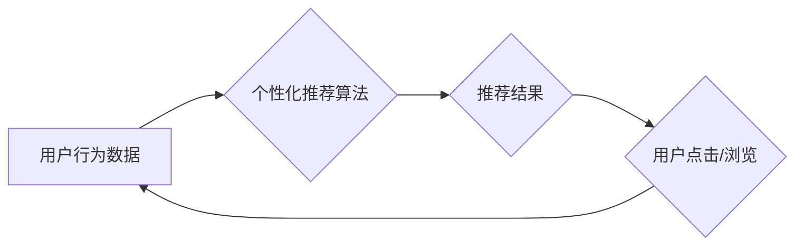

                 

## AI搜索引擎如何应对信息茧房问题

> 关键词：信息茧房、AI搜索引擎、个性化推荐、算法偏差、对抗性学习、联邦学习、可解释性、用户隐私

## 1. 背景介绍

信息茧房是指用户在互联网上只接触到与自身观点相符的信息，而忽略或屏蔽其他不同观点的信息现象。这种现象的产生主要源于搜索引擎的个性化推荐算法，这些算法根据用户的历史搜索记录、浏览行为、社交关系等数据，预测用户可能感兴趣的内容，并将其优先展示。虽然个性化推荐可以提升用户体验，但同时也可能导致信息茧房的形成，限制用户获取多元信息的机会，影响其形成客观判断和独立思考的能力。

信息茧房问题已成为当今社会面临的重大挑战，它不仅影响着个人的认知和判断，也可能加剧社会分化和极化。因此，如何让AI搜索引擎更好地应对信息茧房问题，成为一个亟待解决的关键问题。

## 2. 核心概念与联系

### 2.1 信息茧房形成机制

信息茧房的形成是一个复杂的过程，涉及多个因素的相互作用。主要机制包括：

* **过滤气泡:** 搜索引擎和社交媒体平台会根据用户的历史行为和偏好，过滤掉与用户观点不符的信息，只展示与用户观点相符的信息。
* **同质化推荐:** 推荐算法倾向于推荐与用户过去行为相似的内容，导致用户只接触到同质化的信息，缺乏多样性。
* **网络分化:** 用户倾向于与持有相似观点的人交流，形成封闭的网络社区，加剧信息茧房的形成。

### 2.2 AI搜索引擎与信息茧房

AI搜索引擎在个性化推荐方面发挥着重要作用，但也成为信息茧房形成的助推器。

* **个性化推荐算法:** AI搜索引擎利用机器学习算法分析用户的行为数据，预测用户可能感兴趣的内容，并将其优先展示。
* **数据偏差:** 训练AI搜索引擎的算法和数据本身可能存在偏差，导致推荐结果偏向特定观点或群体。
* **缺乏透明度:** AI搜索引擎的推荐机制往往缺乏透明度，用户难以了解推荐结果背后的逻辑，难以识别信息茧房的形成。

**Mermaid 流程图**



## 3. 核心算法原理 & 具体操作步骤

### 3.1 算法原理概述

为了应对信息茧房问题，AI搜索引擎需要设计新的算法，既能提供个性化推荐，又能确保信息的多样性和客观性。一些常用的算法包括：

* **对抗性学习:** 通过训练两个模型，一个模型负责生成符合用户偏好的内容，另一个模型负责识别并对抗信息茧房，从而平衡个性化推荐和信息的多样性。
* **联邦学习:** 将用户数据分散存储在各个设备上，通过联邦学习的方式训练模型，避免集中式数据存储带来的隐私风险，同时也能更好地应对数据偏差问题。
* **可解释性算法:** 设计能够解释推荐结果背后的逻辑的算法，帮助用户理解推荐机制，识别信息茧房的形成。

### 3.2 算法步骤详解

以对抗性学习为例，其具体操作步骤如下：

1. **训练生成模型:** 利用用户历史数据训练一个生成模型，该模型能够生成符合用户偏好的内容。
2. **训练对抗模型:** 利用生成模型生成的文本数据训练一个对抗模型，该模型能够识别并对抗信息茧房，例如识别重复性内容、极端观点等。
3. **对抗训练:** 将生成模型和对抗模型进行对抗训练，生成模型试图生成符合用户偏好的内容，而对抗模型试图识别并对抗信息茧房。
4. **模型评估:** 通过测试集评估生成模型和对抗模型的性能，不断调整模型参数，提高模型效果。

### 3.3 算法优缺点

**对抗性学习**

* **优点:** 可以有效地平衡个性化推荐和信息的多样性，降低信息茧房的风险。
* **缺点:** 训练复杂度高，需要大量的训练数据和计算资源。

**联邦学习**

* **优点:** 可以保护用户隐私，避免集中式数据存储带来的风险。
* **缺点:** 训练效率较低，需要协调多个设备的参与。

**可解释性算法**

* **优点:** 可以帮助用户理解推荐结果背后的逻辑，提高用户信任度。
* **缺点:** 可解释性算法的性能可能不如传统算法。

### 3.4 算法应用领域

* **搜索引擎:** 提升搜索结果的多样性和客观性，避免信息茧房的形成。
* **社交媒体平台:** 减少算法推荐带来的信息偏差，促进用户之间的多元交流。
* **新闻推荐:** 提供更客观和全面的新闻信息，避免用户只接触到特定观点的新闻。

## 4. 数学模型和公式 & 详细讲解 & 举例说明

### 4.1 数学模型构建

对抗性学习可以构建成一个博弈模型，其中生成模型和对抗模型扮演着不同的角色。

* **生成模型:** 试图最大化用户对推荐内容的满意度。
* **对抗模型:** 试图最小化信息茧房的程度。

可以使用以下公式来描述对抗性学习的过程：

* **生成模型目标函数:**  $L_g = \sum_{i=1}^{N} log(P(y_i|x_i))$

其中，$P(y_i|x_i)$ 表示生成模型预测用户对第 $i$ 个内容的满意度，$N$ 表示内容的数量。

* **对抗模型目标函数:** $L_d = \sum_{i=1}^{N} log(1-P(y_i|x_i))$

其中，$P(y_i|x_i)$ 表示生成模型预测用户对第 $i$ 个内容的满意度，$N$ 表示内容的数量。

### 4.2 公式推导过程

对抗性学习的目标是训练生成模型和对抗模型，使它们之间的博弈达到平衡。

* **生成模型训练:** 固定对抗模型，优化生成模型的目标函数 $L_g$。
* **对抗模型训练:** 固定生成模型，优化对抗模型的目标函数 $L_d$。

通过反复迭代上述过程，生成模型和对抗模型的性能都会不断提升。

### 4.3 案例分析与讲解

假设有一个生成模型，它可以生成新闻文章。对抗模型可以识别生成模型生成的新闻文章是否具有偏见或极端观点。

通过对抗性学习，生成模型会逐渐学习到生成更客观和中立的新闻文章，而对抗模型也会逐渐学习到识别偏见和极端观点的技巧。最终，生成模型和对抗模型会达到一个平衡状态，生成模型能够生成更客观和中立的新闻文章，而对抗模型能够有效地识别和过滤偏见和极端观点的新闻文章。

## 5. 项目实践：代码实例和详细解释说明

### 5.1 开发环境搭建

* **操作系统:** Ubuntu 20.04
* **编程语言:** Python 3.8
* **深度学习框架:** TensorFlow 2.0
* **其他依赖:** numpy, pandas, matplotlib

### 5.2 源代码详细实现

```python
# 生成模型
class Generator(tf.keras.Model):
    def __init__(self):
        super(Generator, self).__init__()
        # 定义生成模型的网络结构
        # ...

    def call(self, x):
        # 生成文本内容
        # ...

# 对抗模型
class Discriminator(tf.keras.Model):
    def __init__(self):
        super(Discriminator, self).__init__()
        # 定义对抗模型的网络结构
        # ...

    def call(self, x):
        # 判断文本内容是否具有偏见或极端观点
        # ...

# 训练过程
def train_model(generator, discriminator, epochs):
    # 定义损失函数和优化器
    # ...

    for epoch in range(epochs):
        # 训练生成模型和对抗模型
        # ...

        # 打印训练进度
        # ...

# 评估模型
def evaluate_model(generator):
    # 使用测试集评估生成模型的性能
    # ...

# 主函数
if __name__ == "__main__":
    # 初始化生成模型和对抗模型
    generator = Generator()
    discriminator = Discriminator()

    # 训练模型
    train_model(generator, discriminator, epochs=10)

    # 评估模型
    evaluate_model(generator)
```

### 5.3 代码解读与分析

* **生成模型:** 负责生成符合用户偏好的文本内容。
* **对抗模型:** 负责识别生成模型生成的文本内容是否具有偏见或极端观点。
* **训练过程:** 通过对抗性学习的方式，训练生成模型和对抗模型，使它们之间的博弈达到平衡。
* **评估模型:** 使用测试集评估生成模型的性能，例如生成文本内容的质量、客观性等。

### 5.4 运行结果展示

运行上述代码后，可以生成一些文本内容，并使用对抗模型对其进行评估。评估结果可以反映生成模型的性能，例如生成文本内容的质量、客观性等。

## 6. 实际应用场景

### 6.1 搜索引擎个性化推荐

AI搜索引擎可以利用对抗性学习等算法，在个性化推荐的同时，避免过度推荐用户偏好的内容，从而降低信息茧房的风险。

### 6.2 社交媒体平台内容推荐

社交媒体平台可以利用联邦学习等算法，在推荐内容的同时，保护用户隐私，避免算法推荐带来的信息偏差。

### 6.3 新闻推荐系统

新闻推荐系统可以利用可解释性算法，帮助用户理解推荐结果背后的逻辑，提高用户信任度，避免用户只接触到特定观点的新闻。

### 6.4 未来应用展望

随着人工智能技术的不断发展，AI搜索引擎将能够更好地应对信息茧房问题，为用户提供更客观、更全面、更个性化的信息服务。

## 7. 工具和资源推荐

### 7.1 学习资源推荐

* **书籍:**
    * 《深度学习》
    * 《机器学习》
    * 《自然语言处理》
* **在线课程:**
    * Coursera
    * edX
    * Udacity

### 7.2 开发工具推荐

* **深度学习框架:** TensorFlow, PyTorch
* **编程语言:** Python
* **数据处理工具:** Pandas, NumPy

### 7.3 相关论文推荐

* **对抗性学习:**
    * Goodfellow, I., Pouget-Abadie, J., Mirza, M., Xu, B., Warde-Farley, D., Ozair, S., ... & Bengio, Y. (2014). Generative adversarial nets. In Advances in neural information processing systems (pp. 2672-2680).
* **联邦学习:**
    * McMahan, H. B., Moore, E., Ramage, D., Hampson, S., & y Arcas, B. A. (2017). Communication-efficient learning of deep networks from decentralized data. In Proceedings of the 2017 ACM International Conference on Learning Representations (ICLR).
* **可解释性算法:**
    * Ribeiro, M. T., Singh, S., & Guestrin, C. (2016). "Why should I trust you?": Explaining the predictions of any classifier. In Proceedings of the 22nd ACM SIGKDD International Conference on Knowledge Discovery and Data Mining (pp. 1135-1144).

## 8. 总结：未来发展趋势与挑战

### 8.1 研究成果总结

近年来，在应对信息茧房问题方面取得了一些重要进展，例如对抗性学习、联邦学习、可解释性算法等。这些算法能够有效地平衡个性化推荐和信息的多样性，降低信息茧房的风险。

### 8.2 未来发展趋势

* **更有效的算法:** 研究更有效的算法，能够更好地应对信息茧房问题，例如基于图神经网络的算法、强化学习算法等。
* **更强大的计算能力:** 随着计算能力的提升，能够训练更复杂的模型，提高算法的性能。
* **更丰富的用户反馈:** 收集更丰富的用户反馈，例如用户对推荐结果的满意度、偏好程度等，用于训练和评估算法。

### 8.3 面临的挑战

* **数据偏差:** 训练算法的数据可能存在偏差，导致算法推荐结果偏向特定观点或群体。
* **隐私保护:** 收集和使用用户数据需要考虑隐私保护问题，避免用户隐私泄露。
* **算法透明度:** 算法的推荐机制往往缺乏透明度，用户难以理解推荐结果背后的逻辑，难以识别信息茧房的形成。

### 8.4 研究展望

未来，需要继续加强对信息茧房问题的研究，开发更有效的算法和技术，保障用户获取客观、全面、多样化的信息，促进社会文明进步。

## 9. 附录：常见问题与解答

**Q1: 信息茧房对社会有什么危害？**

A1: 信息茧房会加剧社会分化和极化，限制用户获取多元信息的机会，影响其形成客观判断和独立思考的能力，甚至可能导致极端主义思想的传播。

**Q2: 如何避免陷入信息茧房？**

A2: 可以尝试以下方法避免陷入信息茧房：

* **主动寻求不同观点的信息:** 关注不同媒体、不同平台的信息，阅读不同作者的观点。
* **批判性思考:** 对接收到的信息进行批判性思考，不要盲目相信任何信息。
* **与不同观点的人交流:** 与持有不同观点的人交流，听取他们的想法，尝试理解他们的立场。

**作者：禅与计算机程序设计艺术 / Zen and the Art of Computer Programming**<end_of_turn>

