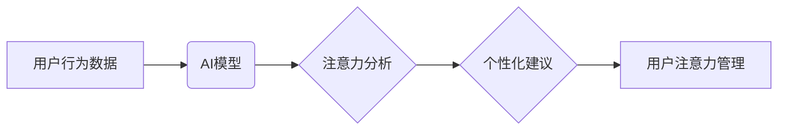

                 

## AI时代的注意力管理：保持专注和生产力

> 关键词：人工智能、注意力管理、深度学习、神经网络、认知科学、生产力、专注力、时间管理

### 1. 背景介绍

在当今信息爆炸的时代，我们每天都被来自各种渠道的海量信息所包围。电子邮件、社交媒体、新闻推送、即时通讯软件，无处不在地争夺着我们的注意力。这种信息过载不仅让我们感到焦虑和疲惫，也严重影响了我们的工作效率和生活质量。

人工智能（AI）技术的快速发展为我们提供了新的工具和方法来应对注意力挑战。AI算法能够分析我们的行为模式，识别干扰因素，并提供个性化的建议，帮助我们更好地管理注意力，提高专注力和生产力。

### 2. 核心概念与联系

**2.1 注意力机制**

注意力机制是深度学习领域的重要组成部分，它模拟了人类大脑在处理信息时选择性关注特定内容的能力。注意力机制的核心思想是，在处理信息时，我们并不总是关注所有信息，而是会根据任务需求和上下文选择性地关注一部分信息，并忽略其他信息。

**2.2 AI与注意力管理的结合**

AI技术可以帮助我们更好地理解和管理注意力。通过分析用户的行为数据，AI算法可以识别出哪些因素会分散用户的注意力，并提供个性化的建议，帮助用户避免这些干扰。例如，AI助手可以提醒用户关闭不必要的通知，或者帮助用户规划时间，安排专注工作的时间段。

**2.3 架构图**



### 3. 核心算法原理 & 具体操作步骤

**3.1 算法原理概述**

注意力机制的核心算法通常是基于神经网络的，它通过学习用户行为数据，建立一个注意力模型，能够预测用户在不同时间点对不同信息的关注程度。常见的注意力机制算法包括：

* **Soft Attention:** 使用一个权重矩阵来分配不同信息的关注权重，权重值越大，表示对该信息的关注程度越高。
* **Hard Attention:** 在每个时间步长中，选择一个最相关的输入信息进行处理，忽略其他信息。

**3.2 算法步骤详解**

1. **数据收集:** 收集用户的行为数据，例如浏览记录、点击记录、阅读时间等。
2. **数据预处理:** 对收集到的数据进行清洗、转换和特征提取。
3. **模型训练:** 使用深度学习算法训练注意力模型，学习用户行为数据中的注意力模式。
4. **注意力预测:** 将新的用户行为数据输入到训练好的注意力模型中，预测用户对不同信息的关注程度。
5. **个性化建议:** 根据注意力预测结果，为用户提供个性化的建议，例如提醒用户关闭不必要的通知，或者帮助用户规划时间，安排专注工作的时间段。

**3.3 算法优缺点**

**优点:**

* 可以有效地识别和过滤干扰信息，提高用户注意力集中度。
* 可以根据用户的个性化需求提供定制化的建议，提高用户体验。

**缺点:**

* 需要大量的用户行为数据进行训练，数据质量和数量直接影响模型的性能。
* 算法的复杂性较高，需要专业的技术人员进行开发和维护。

**3.4 算法应用领域**

* **教育:** 帮助学生集中注意力，提高学习效率。
* **工作:** 帮助员工提高工作效率，减少分心。
* **健康:** 帮助用户管理压力，改善睡眠质量。
* **娱乐:** 提供更个性化的娱乐体验。

### 4. 数学模型和公式 & 详细讲解 & 举例说明

**4.1 数学模型构建**

注意力机制的数学模型通常基于一个权重矩阵，该矩阵用于分配不同信息的关注权重。假设我们有一个输入序列 $x = (x_1, x_2, ..., x_n)$，其中每个 $x_i$ 代表一个信息单元。注意力机制的目标是学习一个权重向量 $a = (a_1, a_2, ..., a_n)$，用于表示每个信息单元的关注权重。

**4.2 公式推导过程**

常用的注意力机制算法中，权重向量 $a$ 通常通过以下公式计算：

$$a_i = \frac{exp(e_i)}{\sum_{j=1}^{n} exp(e_j)}$$

其中， $e_i$ 是每个信息单元 $x_i$ 与查询向量 $q$ 的相似度，通常使用点积或余弦相似度计算。

**4.3 案例分析与讲解**

例如，假设我们有一个句子 "我爱学习人工智能"，我们想要计算每个单词对句子的整体语义的贡献。我们可以将每个单词作为信息单元，将句子作为输入序列，并使用注意力机制计算每个单词的关注权重。

通过注意力机制，我们可以发现 "人工智能" 这个单词的关注权重最高，因为它与句子的整体语义最为相关。

### 5. 项目实践：代码实例和详细解释说明

**5.1 开发环境搭建**

* Python 3.6+
* TensorFlow 或 PyTorch 深度学习框架
* Jupyter Notebook 或 VS Code 开发环境

**5.2 源代码详细实现**

```python
import tensorflow as tf

# 定义注意力机制模型
class Attention(tf.keras.layers.Layer):
    def __init__(self, units):
        super(Attention, self).__init__()
        self.W1 = tf.keras.layers.Dense(units)
        self.W2 = tf.keras.layers.Dense(units)
        self.V = tf.keras.layers.Dense(1)

    def call(self, inputs):
        # inputs: (batch_size, sequence_length, embedding_dim)
        query = self.W1(inputs)
        key = self.W2(inputs)
        value = inputs
        scores = tf.matmul(query, key, transpose_b=True)
        scores = scores / tf.math.sqrt(tf.cast(units, tf.float32))
        attention_weights = tf.nn.softmax(scores, axis=-1)
        context_vector = tf.matmul(attention_weights, value)
        return context_vector

# 使用注意力机制
model = tf.keras.Sequential([
    tf.keras.layers.Embedding(input_dim=vocab_size, output_dim=embedding_dim),
    Attention(units=embedding_dim),
    tf.keras.layers.Dense(units=output_dim, activation='softmax')
])

# 训练模型
model.compile(optimizer='adam', loss='categorical_crossentropy', metrics=['accuracy'])
model.fit(x_train, y_train, epochs=10)
```

**5.3 代码解读与分析**

* 该代码实现了一个简单的注意力机制模型，用于文本分类任务。
* 模型首先使用 Embedding 层将单词转换为向量表示。
* 然后使用 Attention 层计算每个单词的关注权重。
* 最后使用 Dense 层进行分类。

**5.4 运行结果展示**

* 训练完成后，可以将模型应用于新的文本数据，并预测其类别。
* 可以使用准确率等指标评估模型的性能。

### 6. 实际应用场景

**6.1 教育领域**

* **个性化学习:** 根据学生的学习进度和兴趣，提供个性化的学习内容和建议。
* **注意力训练:** 通过游戏化和互动的方式，帮助学生提高注意力集中度。

**6.2 工作领域**

* **提高工作效率:** 帮助员工识别和过滤干扰信息，提高工作效率。
* **协作办公:** 通过注意力机制，帮助团队成员更好地理解和关注彼此的贡献。

**6.3 健康领域**

* **压力管理:** 通过监测用户的生理信号和行为数据，识别压力源，并提供放松和减压建议。
* **睡眠质量改善:** 通过分析用户的睡眠数据，识别睡眠障碍，并提供个性化的睡眠改善建议。

**6.4 未来应用展望**

* **更精准的个性化推荐:** 基于用户的注意力模式，提供更精准的个性化推荐，例如推荐更符合用户兴趣的书籍、电影和音乐。
* **增强现实和虚拟现实:** 利用注意力机制，增强现实和虚拟现实体验，使用户能够更沉浸地体验虚拟世界。
* **人机交互:** 基于注意力机制，开发更自然、更智能的人机交互系统，例如语音助手和聊天机器人。

### 7. 工具和资源推荐

**7.1 学习资源推荐**

* **书籍:**
    * "深度学习" by Ian Goodfellow, Yoshua Bengio, and Aaron Courville
    * "Attention Is All You Need" by Vaswani et al.
* **在线课程:**
    * Coursera: Deep Learning Specialization
    * Udacity: Deep Learning Nanodegree

**7.2 开发工具推荐**

* **TensorFlow:** https://www.tensorflow.org/
* **PyTorch:** https://pytorch.org/
* **Jupyter Notebook:** https://jupyter.org/

**7.3 相关论文推荐**

* "Attention Is All You Need" (https://arxiv.org/abs/1706.03762)
* "BERT: Pre-training of Deep Bidirectional Transformers for Language Understanding" (https://arxiv.org/abs/1810.04805)

### 8. 总结：未来发展趋势与挑战

**8.1 研究成果总结**

近年来，注意力机制在人工智能领域取得了显著的进展，在自然语言处理、计算机视觉、机器翻译等领域取得了优异的性能。

**8.2 未来发展趋势**

* **更强大的注意力模型:** 研究更强大的注意力模型，例如自注意力机制和多头注意力机制，提高模型的表达能力和泛化能力。
* **注意力机制的应用扩展:** 将注意力机制应用于更多领域，例如机器人控制、药物发现和金融预测。
* **注意力机制的可解释性:** 研究注意力机制的可解释性，帮助我们更好地理解模型的决策过程。

**8.3 面临的挑战**

* **数据效率:** 注意力机制通常需要大量的训练数据，如何提高模型的数据效率是一个重要的挑战。
* **计算复杂度:** 一些注意力机制算法的计算复杂度较高，如何降低模型的计算复杂度是一个重要的研究方向。
* **伦理问题:** 注意力机制的应用可能会带来一些伦理问题，例如隐私泄露和信息操控，需要谨慎考虑和规避。

**8.4 研究展望**

未来，注意力机制将继续是人工智能领域的重要研究方向，我们期待看到更多创新和突破，推动人工智能技术的发展和应用。

### 9. 附录：常见问题与解答

* **Q: 注意力机制和深度学习有什么关系？**

* **A:** 注意力机制是深度学习领域的重要组成部分，它可以帮助深度学习模型更好地理解和处理信息。

* **Q: 注意力机制有哪些应用场景？**

* **A:** 注意力机制在自然语言处理、计算机视觉、机器翻译等领域都有广泛的应用。

* **Q: 如何评估注意力机制的性能？**

* **A:** 可以使用准确率、召回率、F1-score等指标评估注意力机制的性能。


作者：禅与计算机程序设计艺术 / Zen and the Art of Computer Programming 
<end_of_turn>

