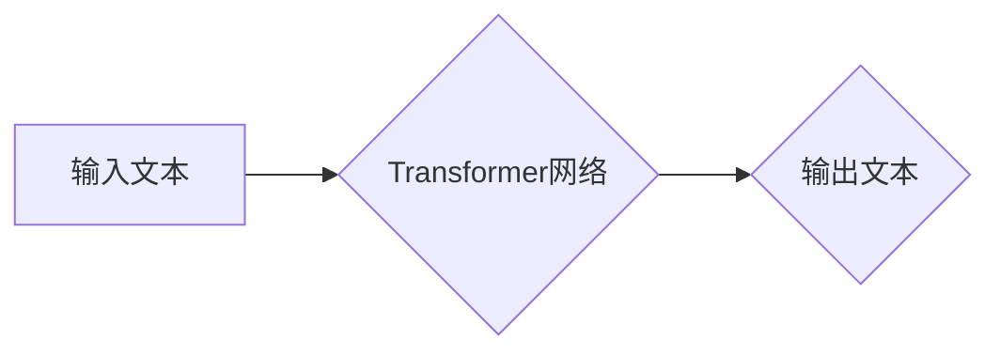

                 

## AI的不确定性：LLM发展中的挑战与机遇

> 关键词：大型语言模型 (LLM)、不确定性、生成式AI、安全与伦理、可解释性、未来趋势

## 1. 背景介绍

近年来，大型语言模型 (LLM) 作为人工智能领域最具突破性的进展之一，展现出令人惊叹的文本生成、翻译、摘要和对话能力。这些模型通过训练海量文本数据，学习语言的复杂模式和结构，从而能够生成逼真、流畅的文本。然而，LLM 的强大能力也伴随着不可忽视的不确定性，这在安全、伦理、可解释性等方面都提出了严峻挑战。

### 1.1 LLM 的崛起与影响

LLM 的出现标志着人工智能进入了一个新的时代。它们在自然语言处理 (NLP) 领域取得了前所未有的成就，例如：

* **文本生成:**  能够生成高质量的诗歌、小说、剧本等创意文本。
* **机器翻译:**  实现更准确、更自然的跨语言文本翻译。
* **文本摘要:**  能够高效地提取文本的关键信息，生成简洁的摘要。
* **对话系统:**  构建更智能、更自然的对话机器人，例如聊天机器人、虚拟助手等。

LLM 的应用前景广阔，它将深刻地改变我们的生活方式，例如：

* **教育:**  个性化学习、智能辅导、自动批改作业等。
* **医疗:**  辅助诊断、生成医疗报告、提供患者咨询等。
* **商业:**  客户服务自动化、市场营销文案创作、数据分析等。

### 1.2 不确定性带来的挑战

尽管 LLM 拥有强大的能力，但其不确定性也带来了许多挑战：

* **安全风险:**  LLM 可以被恶意利用生成虚假信息、煽动仇恨、进行网络攻击等。
* **伦理问题:**  LLM 的文本生成可能存在偏见、歧视、侵犯隐私等伦理问题。
* **可解释性问题:**  LLM 的决策过程复杂难以理解，难以解释其生成文本的原因和逻辑。

## 2. 核心概念与联系

LLM 的核心概念是**深度学习**和**Transformer**架构。

**深度学习**是一种机器学习方法，它利用多层神经网络来学习数据中的复杂模式。**Transformer**是一种特殊的深度学习架构，它能够有效地处理序列数据，例如文本。

LLM 的工作原理是通过训练大量的文本数据，让 Transformer 网络学习语言的语法、语义和上下文关系。

**Mermaid 流程图:**



## 3. 核心算法原理 & 具体操作步骤

### 3.1 算法原理概述

LLM 的核心算法是**自回归语言模型**。自回归语言模型是一种预测下一个词的概率分布的模型。它通过学习文本序列中词之间的依赖关系，预测下一个词出现的可能性。

LLM 使用**Transformer**架构来实现自回归语言模型。Transformer 网络由多个**编码器**和**解码器**层组成。编码器层负责将输入文本编码成一个向量表示，解码器层则根据编码后的向量表示，预测下一个词。

### 3.2 算法步骤详解

1. **数据预处理:** 将文本数据进行清洗、分词、标记等预处理操作。
2. **模型训练:** 使用训练数据训练 Transformer 网络，学习语言的模式和关系。
3. **模型评估:** 使用测试数据评估模型的性能，例如困惑度、BLEU 等指标。
4. **文本生成:** 将输入文本作为种子，通过解码器层预测下一个词，并依次预测出完整的文本序列。

### 3.3 算法优缺点

**优点:**

* **强大的文本生成能力:**  能够生成高质量、流畅的文本。
* **可扩展性强:**  可以训练更大的模型，获得更好的性能。
* **适应性强:**  可以应用于多种自然语言处理任务。

**缺点:**

* **训练成本高:**  需要大量的计算资源和训练数据。
* **可解释性差:**  模型的决策过程复杂难以理解。
* **存在偏见和错误:**  模型的训练数据可能存在偏见，导致模型生成带有偏见或错误的文本。

### 3.4 算法应用领域

LLM 的应用领域非常广泛，包括：

* **文本生成:**  小说、诗歌、剧本、代码等。
* **机器翻译:**  跨语言文本翻译。
* **文本摘要:**  提取文本关键信息，生成摘要。
* **对话系统:**  聊天机器人、虚拟助手等。
* **问答系统:**  回答用户的问题。
* **代码生成:**  自动生成代码。

## 4. 数学模型和公式 & 详细讲解 & 举例说明

### 4.1 数学模型构建

LLM 的核心数学模型是**概率语言模型**。它试图学习文本序列中每个词出现的概率分布。

假设我们有一个文本序列 $x = (x_1, x_2, ..., x_T)$，其中 $x_i$ 表示序列中第 $i$ 个词。概率语言模型的目标是学习一个函数 $P(x)$，来估计整个序列 $x$ 的概率。

### 4.2 公式推导过程

为了简化模型，我们假设每个词的出现概率只依赖于其前 $n$ 个词，即 $x_{i-n}, x_{i-n+1}, ..., x_{i-1}$。在这种情况下，我们可以使用**条件概率**来表示每个词的出现概率：

$$P(x_i | x_{i-n}, x_{i-n+1}, ..., x_{i-1})$$

我们可以使用**神经网络**来学习这个条件概率分布。

### 4.3 案例分析与讲解

例如，假设我们有一个文本序列 "The cat sat on the mat"。

我们可以使用 LLM 来预测下一个词。

如果我们只考虑前两个词 "The cat"，那么 LLMs 会根据其训练数据，预测下一个词可能是 "sat"、"jumped"、"ran" 等。

## 5. 项目实践：代码实例和详细解释说明

### 5.1 开发环境搭建

为了使用 LLM，我们需要搭建一个开发环境。

常用的开发环境包括：

* **Python:**  LLM 的开发通常使用 Python 语言。
* **深度学习框架:**  例如 TensorFlow、PyTorch 等。
* **GPU:**  LLM 的训练需要大量的计算资源，GPU 可以加速训练过程。

### 5.2 源代码详细实现

以下是一个使用 PyTorch 实现简单的 LLM 的代码示例：

```python
import torch
import torch.nn as nn

class SimpleLLM(nn.Module):
    def __init__(self, vocab_size, embedding_dim, hidden_dim):
        super(SimpleLLM, self).__init__()
        self.embedding = nn.Embedding(vocab_size, embedding_dim)
        self.lstm = nn.LSTM(embedding_dim, hidden_dim)
        self.fc = nn.Linear(hidden_dim, vocab_size)

    def forward(self, x):
        embedded = self.embedding(x)
        output, (hidden, cell) = self.lstm(embedded)
        output = self.fc(output[:, -1, :])
        return output

# 实例化模型
model = SimpleLLM(vocab_size=10000, embedding_dim=128, hidden_dim=256)

# 定义损失函数和优化器
criterion = nn.CrossEntropyLoss()
optimizer = torch.optim.Adam(model.parameters())

# 训练模型
for epoch in range(num_epochs):
    # ... 训练代码 ...

```

### 5.3 代码解读与分析

* **Embedding 层:** 将每个词转换为一个向量表示。
* **LSTM 层:** 学习文本序列中词之间的依赖关系。
* **全连接层:** 将 LSTM 输出映射到每个词的概率分布。

### 5.4 运行结果展示

训练完成后，我们可以使用模型生成文本。

例如，我们可以输入 "The cat"，模型会预测下一个词可能是 "sat"。

## 6. 实际应用场景

### 6.1 文本生成

LLM 可以用于生成各种类型的文本，例如：

* **小说、诗歌、剧本:**  LLM 可以根据给定的主题或情节，生成创意的文本内容。
* **新闻报道、文章:**  LLM 可以根据给定的事件或信息，自动生成新闻报道或文章。
* **代码:**  LLM 可以根据给定的需求，自动生成代码。

### 6.2 机器翻译

LLM 可以用于实现跨语言文本翻译，例如：

* **英语-中文翻译:**  LLM 可以将英语文本翻译成中文，反之亦然。
* **多语言翻译:**  LLM 可以支持多种语言之间的翻译。

### 6.3 文本摘要

LLM 可以用于提取文本的关键信息，生成简洁的摘要，例如：

* **新闻摘要:**  LLM 可以提取新闻文章的关键信息，生成简短的摘要。
* **学术论文摘要:**  LLM 可以提取学术论文的关键内容，生成摘要。

### 6.4 未来应用展望

LLM 的应用前景广阔，未来可能会在以下领域得到更广泛的应用：

* **个性化教育:**  根据学生的学习进度和需求，提供个性化的学习内容和辅导。
* **医疗诊断:**  辅助医生进行诊断，提高诊断准确率。
* **法律服务:**  自动分析法律文件，提供法律建议。
* **艺术创作:**  辅助艺术家创作新的艺术作品。

## 7. 工具和资源推荐

### 7.1 学习资源推荐

* **书籍:**
    * 《深度学习》
    * 《自然语言处理》
* **在线课程:**
    * Coursera: 深度学习
    * edX: 自然语言处理
* **博客和论坛:**
    * TensorFlow Blog
    * PyTorch Blog
    * Stack Overflow

### 7.2 开发工具推荐

* **深度学习框架:**
    * TensorFlow
    * PyTorch
* **文本处理工具:**
    * NLTK
    * SpaCy
* **代码托管平台:**
    * GitHub

### 7.3 相关论文推荐

* **Attention Is All You Need:**  Transformer 架构的论文。
* **BERT: Pre-training of Deep Bidirectional Transformers for Language Understanding:**  BERT 模型的论文。
* **GPT-3: Language Models are Few-Shot Learners:**  GPT-3 模型的论文。

## 8. 总结：未来发展趋势与挑战

### 8.1 研究成果总结

LLM 的发展取得了令人瞩目的成果，展现出强大的文本生成能力和应用潜力。

Transformer 架构和自回归语言模型是 LLM 的核心技术，它们为 LLM 的发展提供了强大的理论基础和技术支撑。

### 8.2 未来发展趋势

LLM 的未来发展趋势包括：

* **模型规模的进一步扩大:**  更大的模型可以学习更复杂的语言模式，获得更好的性能。
* **多模态 LLMs:**  融合文本、图像、音频等多模态数据，实现更全面的理解和生成。
* **可解释性增强:**  研究更可解释的 LLM 模型，帮助人们理解模型的决策过程。
* **安全性和伦理性提升:**  开发更安全的 LLM 模型，避免其被恶意利用，并解决其潜在的伦理问题。

### 8.3 面临的挑战

LLM 的发展也面临着一些挑战：

* **训练成本高:**  训练大型 LLM 模型需要大量的计算资源和时间。
* **数据偏见:**  LLM 的训练数据可能存在偏见，导致模型生成带有偏见或错误的文本。
* **可解释性差:**  LLM 的决策过程复杂难以理解，难以解释其生成文本的原因和逻辑。
* **安全风险:**  LLM 可以被恶意利用生成虚假信息、煽动仇恨、进行网络攻击等。

### 8.4 研究展望

未来，LLM 研究将继续朝着更强大、更安全、更可解释的方向发展。

我们需要探索新的模型架构、训练方法和评估指标，以解决 LLM 面临的挑战，并充分发挥其潜力，为人类社会带来更多福祉。

## 9. 附录：常见问题与解答

### 9.1 如何训练一个 LLM 模型？

训练一个 LLM 模型需要大量的计算资源、训练数据和专业知识。

一般步骤包括：

1. **数据收集和预处理:**  收集大量的文本数据，并进行清洗、分词、标记等预处理操作。
2. **模型选择和架构设计:**  选择合适的深度学习框架和模型架构，例如 Transformer。
3. **模型训练:**  使用训练数据训练模型，并调整模型参数以获得最佳性能。
4. **模型评估:**  使用测试数据评估模型的性能，例如困惑度、BLEU 等指标。
5. **模型部署:**  将训练好的模型部署到实际应用场景中。

### 9.2 LLM 的安全性如何保障？

LLM 的安全性是一个重要的研究课题。

一些方法可以提高 LLM 的安全性，例如：

* **数据过滤:**  过滤训练数据中的有害信息，例如仇恨言论、虚假信息等。
* **对抗训练:**  训练模型抵抗对抗攻击，例如输入恶意文本以试图欺骗模型。
* **模型审核:**  对训练好的模型进行审核，评估其潜在的风险。
* **使用案例限制:**  限制 LLM 的应用场景，避免其被恶意利用。

### 9.3 如何解决 LLM 的可解释性问题？

LLM 的可解释性是一个重要的挑战。

一些方法可以提高 LLM 的可解释性，例如：

* **注意力机制:**  分析模型在处理文本时关注哪些词，从而理解模型的决策过程。
* **集成学习:**  使用多个模型进行预测，并分析不同模型的预测结果，从而提高可解释性。
* **可解释性模型:**  开发专门的可解释性模型，例如规则模型，以提高模型的可理解性。


作者：禅与计算机程序设计艺术 / Zen and the Art of Computer Programming 
<end_of_turn>

