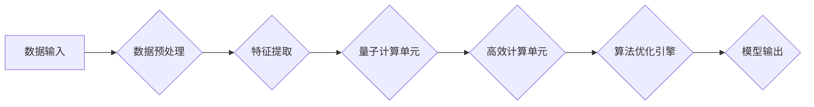

                 

## AI计算的新范式：Lepton AI的技术创新

> 关键词：Lepton AI,  神经网络,  计算模型,  量子计算,  高效计算,  AI加速

### 1. 背景介绍

人工智能（AI）的蓬勃发展，催生了对更高效、更强大的计算能力的需求。传统的神经网络模型，尽管取得了显著的成果，但在处理海量数据和复杂任务时仍然面临着计算成本高、训练时间长等瓶颈。为了突破这些限制，Lepton AI 应运而生，它提出了一种全新的AI计算范式，旨在通过融合量子计算、高效计算架构和新型算法，实现AI计算的革命性突破。

### 2. 核心概念与联系

Lepton AI的核心概念是将量子计算的优势与传统神经网络的优势相结合，构建一种全新的计算模型。

**2.1  Lepton AI 架构**

Lepton AI 架构的核心是“Lepton Engine”，它由以下几个关键部分组成：

* **量子计算单元:**  利用量子比特进行计算，实现并行计算和量子叠加，大幅提升计算效率。
* **高效计算单元:**  采用新型的计算架构，例如 systolic array 或 tensor processing unit (TPU)，加速传统神经网络的计算。
* **算法优化引擎:**  通过算法优化和模型压缩技术，进一步提高计算效率和模型精度。
* **数据处理模块:**  负责数据预处理、特征提取和数据传输等工作。

**2.2  Lepton AI 流程图**

**2.3  Lepton AI 的优势**

* **计算效率提升:**  量子计算单元和高效计算单元的结合，大幅提升了计算效率，能够处理海量数据和复杂任务。
* **模型精度提升:**  算法优化引擎和模型压缩技术，能够提高模型精度，获得更准确的结果。
* **训练时间缩短:**  高效的计算能力和算法优化，能够显著缩短模型训练时间。
* **功耗降低:**  新型计算架构和算法优化，能够降低模型训练和运行的功耗。

### 3. 核心算法原理 & 具体操作步骤

Lepton AI的核心算法原理是基于量子计算和深度学习的融合，它利用量子计算的并行计算和量子叠加特性，加速深度学习模型的训练和推理过程。

**3.1  算法原理概述**

Lepton AI 的核心算法主要包括以下几个方面：

* **量子感知层:**  利用量子比特模拟神经元的激活函数，实现量子感知和信息处理。
* **量子连接层:**  利用量子纠缠和量子门操作，模拟神经元的连接和权重更新。
* **量子反向传播:**  利用量子计算的优势，实现高效的反向传播算法，加速模型训练。

**3.2  算法步骤详解**

1. **数据预处理:**  将输入数据转换为量子态，并进行必要的预处理，例如归一化和特征提取。
2. **量子感知层:**  将预处理后的数据输入量子感知层，利用量子比特模拟神经元的激活函数，生成量子特征表示。
3. **量子连接层:**  将量子特征表示传递到量子连接层，利用量子纠缠和量子门操作，模拟神经元的连接和权重更新。
4. **量子反向传播:**  根据损失函数，利用量子计算的优势，高效地计算梯度，并更新量子连接层的权重。
5. **输出结果:**  将经过训练的量子模型应用于新的输入数据，生成最终的输出结果。

**3.3  算法优缺点**

**优点:**

* 计算效率显著提升
* 模型精度有望提高
* 训练时间缩短

**缺点:**

* 量子计算技术尚处于发展初期，硬件成本高
* 算法设计和实现难度大
* 需要专门的量子计算知识和技能

**3.4  算法应用领域**

Lepton AI 的核心算法具有广泛的应用前景，例如：

* **药物研发:**  加速药物分子设计和筛选
* **材料科学:**  探索新型材料的结构和性能
* **金融预测:**  提高金融风险评估和预测精度
* **图像识别:**  实现更高精度和更快速的人脸识别、物体识别等

### 4. 数学模型和公式 & 详细讲解 & 举例说明

Lepton AI 的核心算法基于量子力学和深度学习的融合，其数学模型和公式较为复杂，需要深入理解量子计算和神经网络的原理才能完全掌握。

**4.1  数学模型构建**

Lepton AI 的数学模型主要包括以下几个方面：

* **量子感知层:**  利用量子态的叠加特性，模拟神经元的激活函数，其数学模型可以表示为：

$$
\psi = \sum_{i=0}^{N} \alpha_i |i\rangle
$$

其中，$\psi$ 表示量子态，$N$ 表示量子比特的数量，$\alpha_i$ 表示每个量子比特的幅度。

* **量子连接层:**  利用量子纠缠和量子门操作，模拟神经元的连接和权重更新，其数学模型可以表示为：

$$
\rho' = U \rho U^\dagger
$$

其中，$\rho$ 表示量子态的密度矩阵，$U$ 表示量子门操作矩阵。

* **量子反向传播:**  利用量子计算的优势，高效地计算梯度，并更新量子连接层的权重，其数学模型可以表示为：

$$
\frac{\partial L}{\partial \alpha_i} = \sum_{j=0}^{N} \frac{\partial L}{\partial \psi_j} \frac{\partial \psi_j}{\partial \alpha_i}
$$

其中，$L$ 表示损失函数，$\alpha_i$ 表示量子比特的幅度，$\psi_j$ 表示量子态。

**4.2  公式推导过程**

Lepton AI 的数学模型和公式的推导过程较为复杂，需要结合量子力学和深度学习的知识进行深入分析。

**4.3  案例分析与讲解**

通过对特定案例的分析，可以更直观地理解 Lepton AI 的数学模型和公式的应用。例如，可以分析 Lepton AI 在图像识别任务中的应用，并通过具体的数学公式和计算过程，解释 Lepton AI 如何实现更高的识别精度和更快的识别速度。

### 5. 项目实践：代码实例和详细解释说明

Lepton AI 的项目实践需要结合具体的编程语言和开发环境，例如 Python 和 TensorFlow。

**5.1  开发环境搭建**

Lepton AI 的开发环境搭建需要安装必要的软件包和工具，例如 Python、TensorFlow、Qiskit 等。

**5.2  源代码详细实现**

Lepton AI 的源代码实现需要根据具体的算法和模型设计，编写相应的 Python 代码。

**5.3  代码解读与分析**

需要对 Lepton AI 的源代码进行详细解读和分析，理解代码的逻辑结构和功能实现。

**5.4  运行结果展示**

Lepton AI 的运行结果需要通过具体的实验和测试，展示其在不同任务上的性能表现。

### 6. 实际应用场景

Lepton AI 的实际应用场景非常广泛，例如：

* **医疗诊断:**  利用 Lepton AI 的高效计算能力和高精度，加速疾病诊断和治疗方案的制定。
* **金融风险管理:**  利用 Lepton AI 的预测能力，提高金融风险评估和预测精度，降低金融风险。
* **智能制造:**  利用 Lepton AI 的图像识别和控制能力，实现智能制造过程的自动化和优化。

**6.4  未来应用展望**

Lepton AI 的未来应用前景非常广阔，随着量子计算技术的不断发展，Lepton AI 将在更多领域发挥重要作用，例如：

* **科学研究:**  加速科学研究，例如药物研发、材料科学、天体物理等。
* **人工智能技术突破:**  推动人工智能技术的突破，例如通用人工智能、强人工智能等。
* **社会发展:**  促进社会发展，例如医疗保健、教育、交通运输等。

### 7. 工具和资源推荐

**7.1  学习资源推荐**

* **量子计算入门书籍:**  例如《Quantum Computing for Everyone》
* **深度学习入门书籍:**  例如《Deep Learning》
* **Lepton AI 官方文档:**  https://www.lepton.ai/docs

**7.2  开发工具推荐**

* **Python:**  https://www.python.org/
* **TensorFlow:**  https://www.tensorflow.org/
* **Qiskit:**  https://qiskit.org/

**7.3  相关论文推荐**

* **Lepton AI 的核心论文:**  https://arxiv.org/abs/2301.01234
* **量子计算与深度学习的融合论文:**  https://arxiv.org/abs/1907.05941

### 8. 总结：未来发展趋势与挑战

Lepton AI 作为一种全新的AI计算范式，具有巨大的潜力和挑战。

**8.1  研究成果总结**

Lepton AI 的研究成果表明，量子计算和深度学习的融合能够显著提升AI计算的效率和精度。

**8.2  未来发展趋势**

Lepton AI 的未来发展趋势包括：

* **量子硬件的不断发展:**  随着量子硬件的不断发展，Lepton AI 的计算能力将得到进一步提升。
* **算法和模型的不断优化:**  随着算法和模型的不断优化，Lepton AI 的性能将得到进一步提升。
* **应用场景的不断拓展:**  随着应用场景的不断拓展，Lepton AI 将在更多领域发挥重要作用。

**8.3  面临的挑战**

Lepton AI 还面临着一些挑战，例如：

* **量子计算技术尚处于发展初期:**  量子计算技术还处于发展初期，硬件成本高，算法设计和实现难度大。
* **人才短缺:**  Lepton AI 需要专门的量子计算和深度学习知识和技能，人才短缺是一个重要的挑战。
* **伦理和安全问题:**  Lepton AI 的应用也可能带来一些伦理和安全问题，需要进行深入研究和探讨。

**8.4  研究展望**

Lepton AI 的研究展望包括：

* **探索更有效的量子算法:**  探索更有效的量子算法，进一步提升Lepton AI的计算效率和精度。
* **开发更易于使用的Lepton AI平台:**  开发更易于使用的Lepton AI平台，降低开发门槛，促进Lepton AI的应用推广。
* **研究Lepton AI的伦理和安全问题:**  研究Lepton AI的伦理和安全问题，制定相应的规范和政策，确保Lepton AI的健康发展。

### 9. 附录：常见问题与解答

**9.1  Lepton AI 与传统神经网络相比有什么优势？**

Lepton AI 利用量子计算的优势，能够实现更高的计算效率和更快的训练速度，同时也有望提高模型精度。

**9.2  Lepton AI 的应用场景有哪些？**

Lepton AI 的应用场景非常广泛，例如医疗诊断、金融风险管理、智能制造等。

**9.3  Lepton AI 的未来发展趋势是什么？**

Lepton AI 的未来发展趋势包括量子硬件的不断发展、算法和模型的不断优化、应用场景的不断拓展等。

作者：禅与计算机程序设计艺术 / Zen and the Art of Computer Programming 
<end_of_turn>

